= Software Installation for Mac
Iurii Rusakov, Liudmila Topal
:revnumber: 1.1
:revdate: 2024-08-16
:doctype: book
:toc: left
:sectnums:
:icons: font
:highlightjs-languages: java

== Prerequisites

When you're working with macOS, sometimes you may encounter the *'source ~/.bash_profile: command not found'* error in the Terminal app.

[NOTE]
*bash_profile* is a configuration file for the Bash shell, which is a hidden file in your Mac's user directory.

=== How to create .bash_profile in Mac

. Open *Launchpad* -> *Other* -> *Terminal*.
. Type in the following command to move the home directory and press *"Enter"*:
+
[source,xml]
----
cd ~/
----

. Input the below touch command to create the bash_profile on Mac:
+
[source,xml]
----
touch .bash_profile
----

TIP: Mote info about bash_profile you can find https://iboysoft.com/wiki/bash-profile-mac.html[here].

== SDK

. https://adoptium.net/[*Download*] and Java SE Development Kit:
+
TIP: Review and agree to the terms of the license agreement before downloading the file.
. Double-click the .dmg file to launch it -> A dialog box with Java 22.0.1.pkg reference will appear:
+
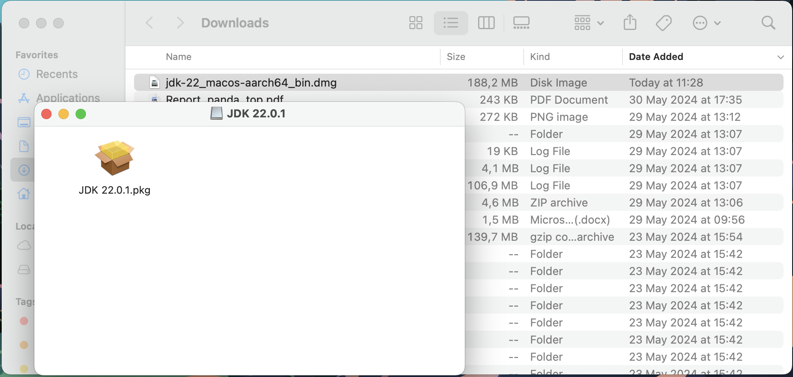
. Double-click the JDK 22.0.1.pkg file: -> the installation window will appear:
+
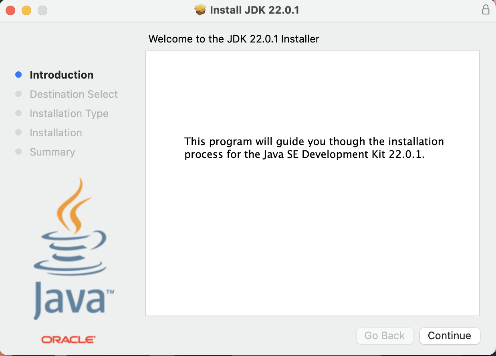
+
* Click on _"Continue"_.
+
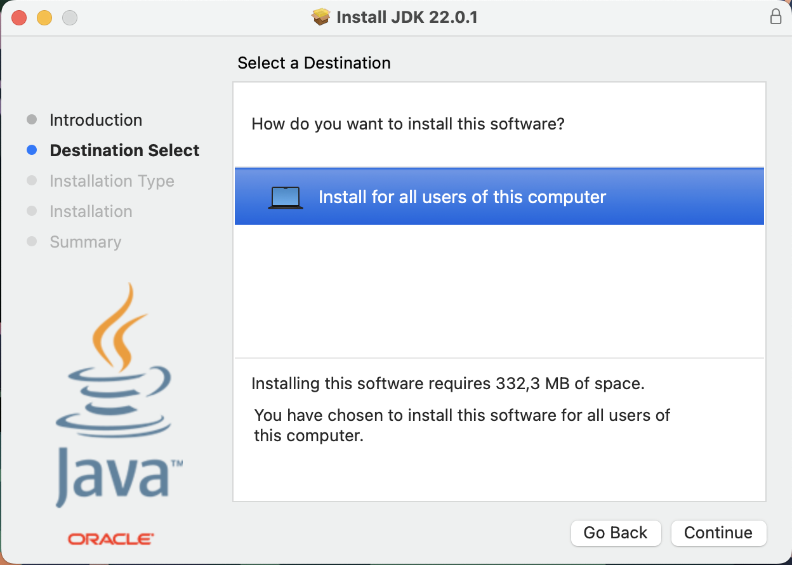
+
* Click on _"Continue"_.
+
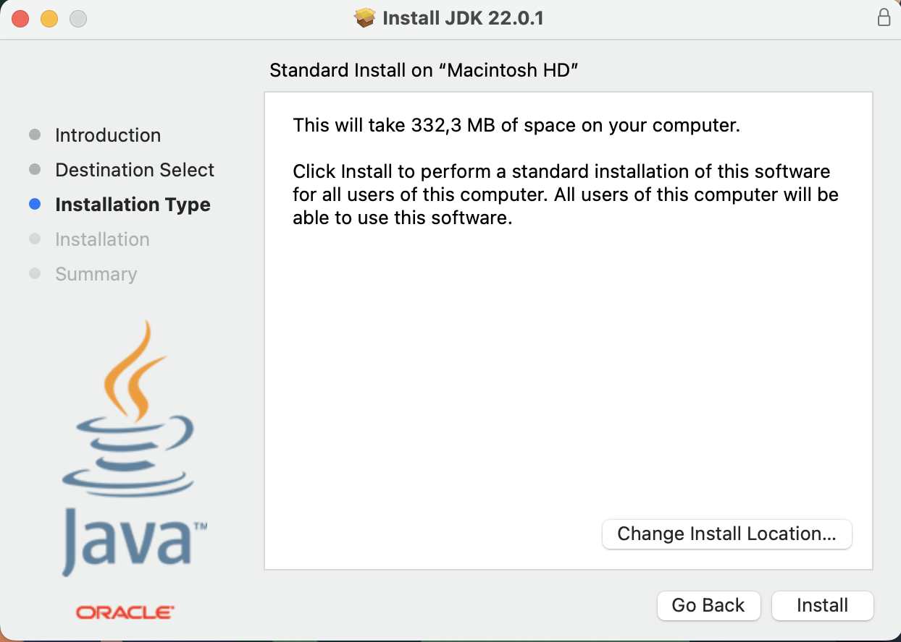
+
* If you want to change the installation location, select the option _"Change Install Location..."_
* For default installation select _"Install"_
+
TIP: This step will initiate install process.
+
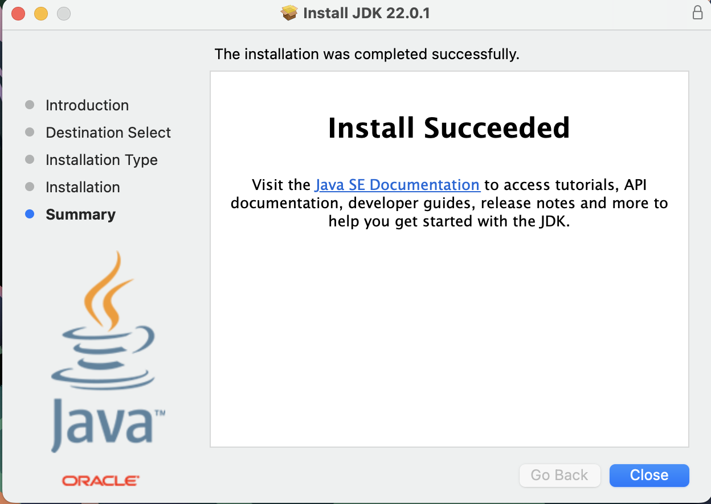
* Once it is completed, a confirmation screen appears.
Click "Close" to finish the installation process.
+
. Setting Environment Variables - JAVA_HOME and Path:
+
* Open _.bash_profile_ and add the following entries at the end of it.
+
[source,xml]
----
JAVA_HOME="/Library/Java/JavaVirtualMachines/jdk-13.0.1.jdk/Contents/Home"
PATH="${JAVA_HOME}/bin:${PATH}"
export PATH
----
. Verifying the JDK installation:
+
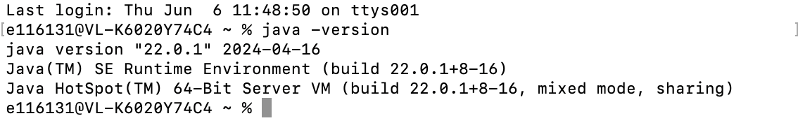

== Maven

. https://maven.apache.org/download.cgi[*Download*] Maven for Mac OS:
+
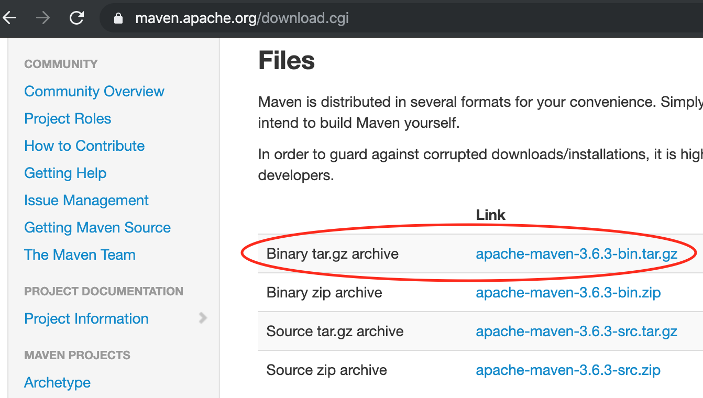
+
. After downloading, extract it using the below command:
+
[source,xml]
----
tar -xvf apache-maven-3.6.3-bin.tar.gz
----
+
TIP: The binaries will be extracted in the “apache-maven-3.6.3” directory.
You can keep them anywhere, I have kept it in the Downloads directory for the sake of easy access.
+
. Setting Maven Environment Variables - M2_HOME and Path:
+
We have to add the Maven bin directory to the Path variable.
+
* Open _.bash_profile_ in your favorite text editor and add below lines to the end of it.
+
[source,xml]
----
export M2_HOME="/Users/pankaj/Downloads/apache-maven-3.6.3"
PATH="${M2_HOME}/bin:${PATH}"
export PATH
----
. Verifying the Maven Installation:
+
[source,xml]
----
$ mvn -version
OpenJDK 64-Bit Server VM warning: Ignoring option MaxPermSize; support was removed in 8.0
Apache Maven 3.6.3 (cecedd343002696d0abb50b32b541b8a6ba2883f)
Maven home: /Users/pankaj/Downloads/apache-maven-3.6.3
Java version: 13.0.1, vendor: Oracle Corporation, runtime: /Library/Java/JavaVirtualMachines/jdk-13.0.1.jdk/Contents/Home
Default locale: en_IN, platform encoding: UTF-8
OS name: "mac os x", version: "10.15.1", arch: "x86_64", family: "mac"
----

TIP: Guide with installation you can find https://www.digitalocean.com/community/tutorials/install-maven-mac-os[here].

== Git

There are several ways to install Git on a Mac:

* link:#Xcode[Install Git with Xcode]
* link:#Homebrew[Install Git with Homebrew]
* link:#MacPorts[Install Git with MacPorts]

=== [[Xcode]]Install Git with Xcode

. App Store -> Install _"Xcode Command Line"_ tool -> it will install _"Git"_
. Configure your Git username and email using the following commands, replacing default name with your own:
+
[source,xml]
----
git config --global user.name "your_github_username"
git config --global user.email "your_github_mail"
----
. Open a terminal and verify the installation was successful by typing command:
+
[source,xml]
----
git --version
----

=== [[Homebrew]]Install Git with Homebrew

If you have https://brew.sh/[installed Homebrew] to manage packages on OS X, you can follow these instructions to install Git:

. Open your terminal and install Git using Homebrew:
+
[source,xml]
----
brew install git
----
. Verify the installation was successful by typing which `git --version`:
+
[source,xml]
----
$ git --version
git version 2.9.2
----
. Configure your Git username and email using the following commands, replacing Emma's name with your own.
+
These details will be associated with any commits that you create:
+
[source,xml]
----
git config --global user.name "Emma Paris"
git config --global user.email "eparis@atlassian.com"
----
. _(Optional)_ To make Git remember your username and password when working with HTTPS repositories, install the https://www.atlassian.com/git/tutorials/install-git#install-the-git-credential-osx[`git-credential-osxkeychain` helper].

=== [[MacPorts]]Install Git with MacPorts

If you have https://www.macports.org/install.php[installed MacPorts] to manage packages on OS X, you can follow these instructions to install Git:

. Open your terminal and update MacPorts:
+
[source,xml]
----
sudo port selfupdate
----
. Search for the latest available Git ports and variants:
+
[source,xml]
----
port search git
port variants gi
----
. Install Git with bash completion, the OS X keychain helper, and the docs:
+
[source,xml]
----
sudo port install git +bash_completion +credential_osxkeychain +doc
----
. Configure your Git username and email using the following commands, replacing Emma's name with your own.
+
These details will be associated with any commits that you create:
+
[source,xml]
----
git config --global user.name "Emma Paris"
git config --global user.email "eparis@atlassian.com"
----
. _(Optional)_ To make Git remember your username and password when working with HTTPS repositories, install the https://www.atlassian.com/git/tutorials/install-git#install-the-git-credential-osx[`git-credential-osxkeychain` helper].

== IntelliJ IDEA

. https://www.jetbrains.com/idea/download/?section=mac[*Download*] and install IntelliJ IDEA:

+
image::resources/idea-01.png[]
. Drag the IntelliJ IDEA to your Applications folder:
+
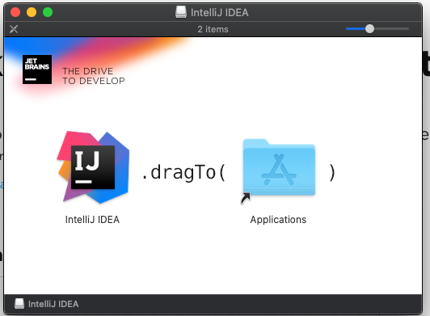
. Once the copying process is done, open IntelliJ by browsing for it in the _"Applications"_ folder in your finder and double-clicking on it:
+
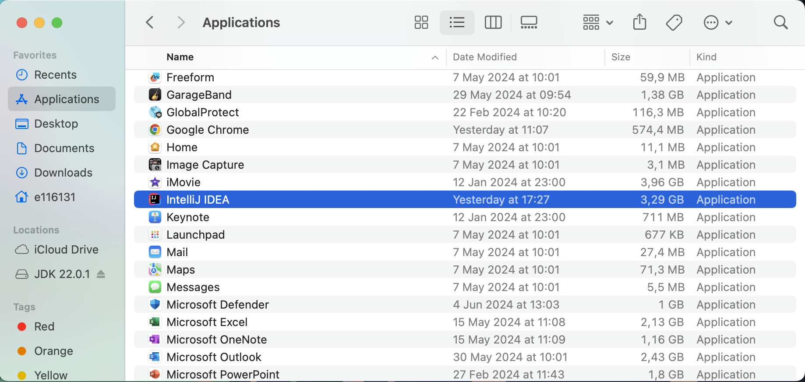
+
* Alternatively, you can use the spotlight search by pressing `Command(⌘) + Space`, then searching for _“IntelliJ”_ and pressing _"Enter"_.
. A welcome screen now pops up:
+
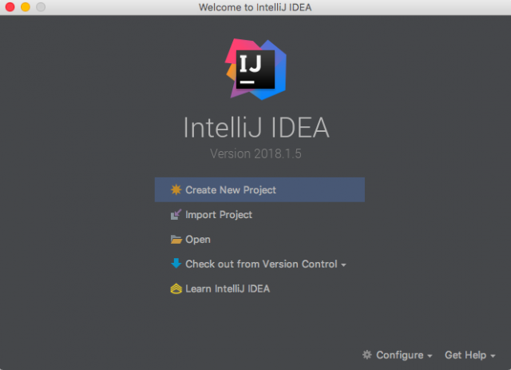
. Install plugins for IntelliJ IDEA:
* Gherkin
* Cucumber for Java
+
image::resources/idea-04.png[]
+
Set up the new project in IntelliJ IDEA or create a new one from existing sources
+
You should have a link to the project repository.
If you don't have it, ask your team lead for it.
+
*OR:*

* Set a project name.
* Choose where the project will be created.
* Choose Language: Java.
* Choose Build system: Maven.
* Choose SDK: 21 (or the version you have installed).
* Click Finish.
+
image::resources/idea-07.png[]

* Open the project structure and set the project SDK (Press _Ctrl+Alt+Shift+S_).
+
image::resources/idea-08.png[]
* Check also the language level in the Modules tab.
+
image::resources/idea-09.png[]

== Postman

Postman is available for macOS 14.5 (Sonoma) and other.

. https://www.postman.com/downloads/[Download] the latest Postman version:
+
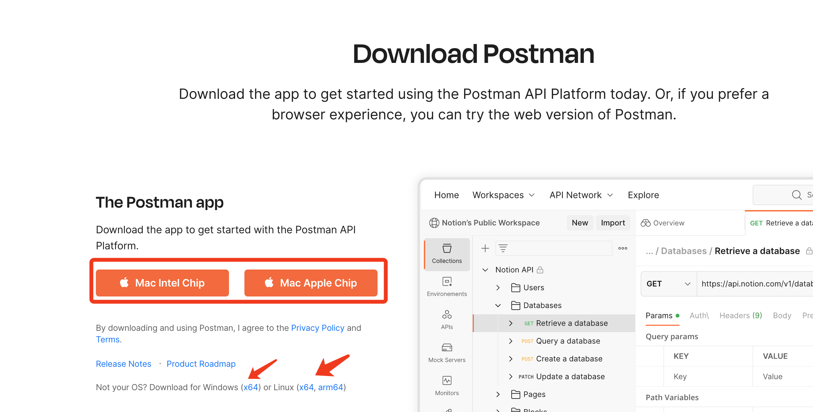
. If your browser downloads the file as a ZIP file, find the file in the *Downloads* folder and unzip it.
. In the Downloads folder, double-click the _Postman file_ to install it.
. When prompted, move the file to your _Applications folder_.
+
This will ensure that future updates can be installed.

== Oracle SQL Developer

. https://www.oracle.com/database/sqldeveloper/technologies/download/[*Download*] SQL Developer:
+
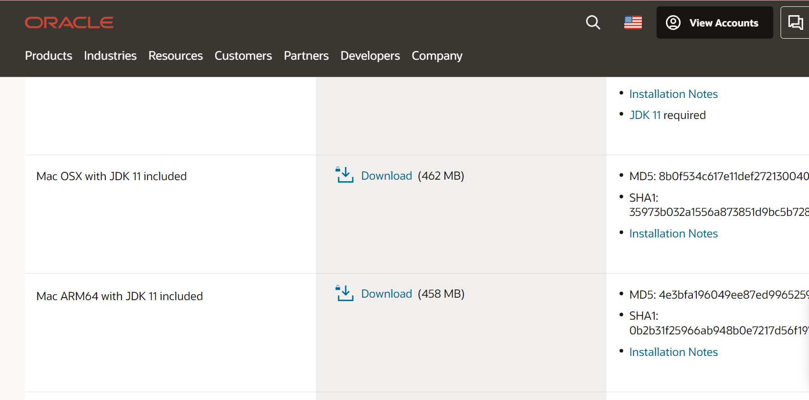
. Login in Oracle account or create a new account (_it is free_):
+
image::resources/oracle-03.png[]
. If your browser downloads the file as a ZIP file, find the file in the *Downloads* folder and unzip it.
. In the Downloads folder, double-click the _SQL Developer file_ to install it.
. When prompted, move the file to your _Applications folder_.
+
This will ensure that future updates can be installed.