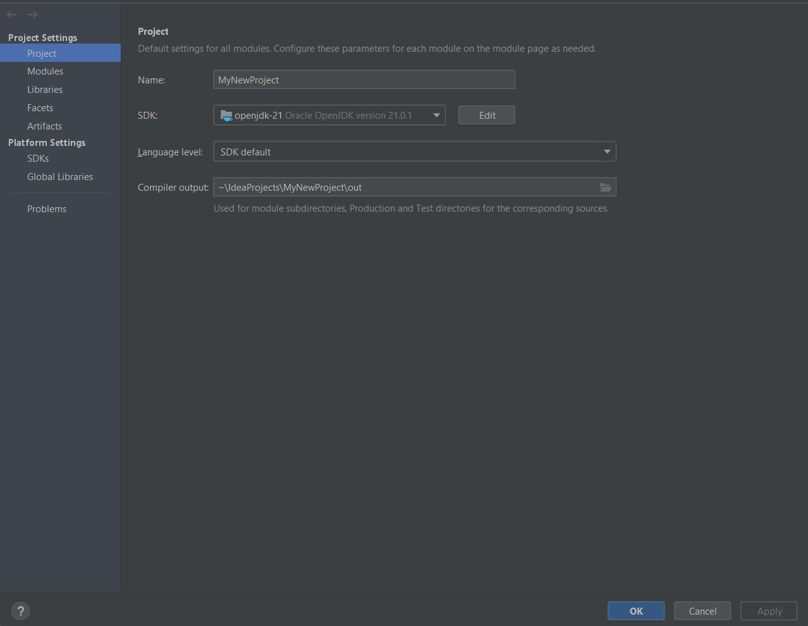

= Software Installation for Windows
:toc:
:icons: font
:url-quickref: https://docs.asciidoctor.org/asciidoc/latest/syntax-quick-reference/

=== SDK, Maven

Java SDK::
The Java Software Development Kit (*SDK*), also known as the Java Development Kit (*JDK*), is a comprehensive suite of tools for developing Java applications.
It _includes the Java Runtime Environment (*JRE*)_, a _compiler_, a _debugger_, and other utilities.

Maven::
*Apache Maven* is a build automation and dependency management tool primarily used for Java projects.
It _simplifies the build process_, _manages project dependencies_, and _ensures consistent_ builds across different environments.

. https://www.oracle.com/java/technologies/downloads/#java21[*Download*] and
https://docs.oracle.com/en/java/javase/21/install/installation-jdk-microsoft-windows-platforms.html#GUID-A7E27B90-A28D-4237-9383-A58B416071CA[*install*] Java SE Development Kit:
+
image::resources/SDK-01.png[]
+
*In our case, this is version 21* as LTS, and we choose this one.
+
After that, https://maven.apache.org/download.cgi[download] and https://phoenixnap.com/kb/install-maven-windows[install] Apache Maven or another type of building tool.
+
image::resources/maven-01.png[]

. Set up Java and Maven as Environment variables:
+
Press [_Win + Q_] and type '_envir_' for example:
+

+
Click on '*Edit environment variables for your account*', choose the tab [*Advanced*] and click on the '**Environment Variables** ...' button:
+
image::resources/SDK-03.png[]
+
Here you will create System variable (or Edit them in case they already exist).
+
* *JAVA_HOME*: add as value the path where *you have installed Java 21 earlier* (for example, _C:\Program Files\Java\jdk-21.0.2_)
* *M2_HOME*: add as value the path where *you have unzipped the archive earlier* (for example, _C:\Program Files\apache-maven-3.6.3-bin_)
+
image::resources/SDK-04.png[]
+
Now look for the System variable called Path and edit its content.
Add to this the following arguments if they do not already exist: _%M2_HOME%\bin; %JAVA_HOME%\bin_
+
image::resources/SDK-05.png[]

. Check to see that you have set up Java and Maven correctly:

* Open a command line interface (*CLI*): (Press [_Win + R_] and type '_cmd_' and press '_Enter_')
+
image::resources/SDK-06.png[]

* Check Java version by running the command: _java -version_
* Check Maven version by running the command: _mvn -version_
+
TIP: If it looks like below, then you are all set up correctly! Versions may differ in your case, but the main thing is that there are no errors.
+
image::resources/SDK-07.png[]

=== Git

Is a distributed version control system _used for tracking changes in source code_ during software development.
It facilitates collaboration among developers by allowing multiple versions of a project to be maintained simultaneously and efficiently merging changes.

. https://git-scm.com/download/win[*Download*] and install Git:
+
Before you start using Git, you have to make it available on your computer. Even if it's already installed, it's probably a good idea to update to the latest version.

. Set up Git:
+
_If you have Git on your system_, you'll want to do a few things to customize your Git environment.
You should have to do these things only once on any given computer; they'll stick around between upgrades.
+
TIP: _You can also change them at any time_ by running through the commands again.
+
Git comes with a tool called git config that lets you get and set configuration variables that control all aspects of how Git looks and operates.
+
_These variables can be stored in three different places:_

- *_[path]/etc/gitconfig_ file:*
+
Contains values applied to every user on the system and all their repositories.
If you pass the option _--system_ to git config, it reads and writes from this file specifically.
Because this is a system configuration file, you would need administrative or superuser privilege to make changes to it.

- *_~/.gitconfig_ or _~/.config/git/config_ file:*
+
Values specific personally to you, the user. You can make Git read and write to this file specifically by passing the _--global_ option, and this affects all of the repositories you work with on your system.

- *config file in the Git directory (that is, _.git/config_) of whatever repository you're currently using:*
+
Specific to that single repository. You can force Git to read from and write to this file with the _--local_ option, but that is in fact the default. Unsurprisingly, you need to be located somewhere in a Git repository for this option to work properly.
+
Each level overrides values in the previous level, so values in .git/config trump those in [path]/etc/gitconfig.
+
TIP: You can view all of your settings and where they are coming from using:
+
[source,bash]
----
$ git config --list --show-origin
----
+
**Your Identity**
+
_The first thing you should do when you install Git_ is to set your username and email address.
+
[NOTE]
=====
This is important because every Git commit uses this information, and it's immutably baked into the commits you start creating:
=====
+
[source,bash]
----
$ git config --global user.name "John Doe"
$ git config --global user.email john.doe@endava.com
----
+
Again, you need to do this only once if you pass the _--global option_, because then Git will always use that information for anything you do on that system.
If you want to override this with a different name or email address for specific projects, you can run the command without the _--global_ option when you're in that project.
+
**Your default branch name**
+
_By default_, Git will create a branch called master when you create a new repository with git init. From Git version 2.28 onwards, you can set a different name for the initial branch.
+
_To set main as the default branch name, do:_
+
[source,bash]
----
$ git config --global init.defaultBranch main
----
+
[NOTE]
If you want to check your configuration settings, you can use the git config --list command to list all the settings Git can find at that point:
+
[source,bash]
----
$ git config --list
user.name=John Doe
user.email=john.doe@endava.com
color.status=auto
color.branch=auto
color.interactive=auto
color.diff=auto
...
----
You can also check what Git thinks a specific key's value is by typing git config <key>:
+
[source,bash]
----
$ git config user.name
John Doe
----

=== [[intellij-idea]]IntelliJ IDEA

. https://www.jetbrains.com/idea/download/[*Download*] and install IntelliJ IDEA:

+
image::resources/idea-01.png[]

. Set up IntelliJ IDEA:
+
* Open IntelliJ IDEA.
Upon the first launch, you'll have to accept the JetBrains Community Edition Terms and Privacy Policy.
Click on "_Accept_" to proceed:
+

+
Then you can see the first screen of IntelliJ IDEA. Here you can:
+

+
. Install plugins for IntelliJ IDEA:
+
* Gherkin
* Cucumber for Java
+
image::resources/idea-04.png[]
+
Set up the new project in IntelliJ IDEA or create a new one from existing sources
+
You should have a link to the project repository. If you don't have it, ask your team lead for it.
+
*OR:*

* Set a project name.
* Choose where the project will be created.
* Choose Language: Java.
* Choose Build system: Maven.
* Choose SDK: 21 (or the version you have installed).
* Click Finish.
+
image::resources/idea-07.png[]

* Open the project structure and set the project SDK (Press _Ctrl+Alt+Shift+S_).
+

* Check also the language level in the Modules tab.
+
image::resources/idea-09.png[]

=== [[postman]]Postman

*Postman* is an app for interacting with HTTP APIs.
It presents you with a friendly GUI _for constructing requests and reading responses_.

But Postman recently changed their software to remove the Scratch Pad mode, which means that all configuration data,
including _Collections and Environments_, is uploaded to Postman's cloud servers.

This poses a **potential security risk** for many projects. To avoid storing collections in a Postman account,
users are advised to uninstall their current version of Postman and install an older version using the following https://go.pstmn.io/dl-win64-v9-latest[link].

. https://go.pstmn.io/dl-win64-v9-latest[*Download*] and installPostman for Windows (64-bit):
+
image::resources/postman-02.png[]
+
[WARNING]
====
Do not sign up or log in and don't Update software for security reasons.
====
+
Requests are the foundation of Postman, as they are used to test APIs. Over time, the number of requests will increase, and it can become challenging to navigate through them. Therefore, it's essential to organize requests into collections. Collections can be thought of as folders for storing requests. Organizing collections is a significant topic, and it's something that might be discussed in an interview. In short, collections should have a logical structure and be organized based on a certain criterion, such as the version of the API being tested or a specific block of functionality.
+
Both requests and collections can be created using the "New" button in the upper left corner of the interface.
+
Postman collection with endpoints and environments set up will be provided by your project team lead.

=== [[winscp]]WinSCP

WinSCP (Windows Secure Copy) is a free and open-source file transfer client for Windows.

It supports protocols like SFTP, SCP, FTPS, and FTP, and is commonly used for secure file transfer between a local computer and a remote server. It also offers a graphical user interface for easy navigation and file management.

. https://winscp.net/eng/download.php[*Download*] WinSCP:
+
Click on the "*Download*" button for the latest version of WinSCP. This will download the installation package to your computer.

. Run the Installer:
+
* Locate the downloaded installation package (_usually in your "Downloads" folder_).
+
* Double-click on the installer file (e.g., `WinSCP-<version>-Setup.exe`) to start the installation process.
+

. Installation Wizard:

* **Welcome Screen**: Click "_Next_" to continue.

* **License Agreement**: Read the license agreement, select "_I accept the agreement_" and click "_Next_"
+

.. **Setup Type**: Choose the type of setup you prefer (Typical, Custom, or Compact).
+
For most users, "_Typical_" is sufficient.
+
Click "_Next._"

* **Select Components**: Choose the components you want to install.
+
The default selection is usually fine.
+
Click "_Next._"

* **Select Start Menu Folder**: Choose the folder in the Start Menu where you want to create the WinSCP shortcut.
+
Click "_Next._"

* **Additional Tasks**: Select additional tasks like creating a desktop icon or associating WinSCP with certain file types.
+
Click "_Next._"

* **Ready to Install**: Review your choices and click "_Install_" to start the installation.

. Completing the Installation:
+
[NOTE]
The installer will now install WinSCP on your computer.
+
This may take a few moments.
Once the installation is complete, you may be prompted to launch WinSCP.
You can choose to start WinSCP right away or uncheck the option and click "_Finish_" to exit the installer.
+

==== Using WinSCP

[INFO]
====
If you chose to launch WinSCP, the program should start automatically after installation.
====

You can now use WinSCP to connect to remote servers using protocols like FTP, SFTP, or SCP.
You'll need to provide the server details, such as _hostname_, _username_, and _password_, to establish a connection.

=== [[oracle-sql]]Oracle SQL

Oracle SQL Developer is a free graphical tool that enhances productivity and simplifies database development tasks.

[NOTE]
====
With SQL Developer, you can browse database objects, run SQL statements and SQL scripts, edit and debug PL/SQL statements, manipulate and export data, and view and create reports. You can connect to Oracle databases, and you can connect to selected third-party (non-Oracle) databases, view metadata and data, and migrate these databases to Oracle.
====

. Browse to this https://www.oracle.com/database/sqldeveloper/technologies/download/[link] and click on *Download*:
+

. Login in Oracle account or create a new account (_it is free_):
+

. Extract the downloaded zip file:
+
image::resources/oracle-04.png[]

. Open your computer _'C' drive_ & _program files_.
+
_'Cut'_ & _'Paste'_ the extracted file there:
+

. Open the folder -> _'sqldeveloper'_ folder:
+
image::resources/oracle-06.png[]

. Find the sqldeveloper exe file there -> create a _'shortcut'_ on desktop:
+
image::resources/oracle-07.png[]

. Open the shortcut. It will give you welcome page:
+
image::resources/oracle-08.png[]

=== [[putty]]PuTTY

PuTTY is a free, open-source terminal emulator, serial console, and network file transfer application.

[NOTE]
It supports various network protocols, including SSH, Telnet, and SCP, and is commonly used for remote access to servers and network devices.

. https://www.putty.org/[*Download*] the PuTTY:
+
[NOTE]
Click on the link that says _"You can download PuTTY here"_ to go to the download section.
+
* Under the _"Package files"_ section, download the `putty-<version>-installer.msi` file for Windows.
+
* The `<version>` part will be replaced by the current version number of PuTTY.
+

. Run the Installer:
+
* Locate the downloaded MSI file (usually in your _"Downloads"_ folder).
+
* Double-click on the `putty-<version>-installer.msi` file to start the installation process.

. Installation Wizard:
+
* *Welcome Screen*: Click "Next" to continue.
+
image::resources/putty-02.png[]
+
* *License Agreement*: Read the End-User License Agreement, select _"I accept the terms in the License Agreement"_, and click _"Next"_.
+
* *Destination Folder*: Choose the folder where you want to install PuTTY. The default location is usually fine. Click _"Next"_.
+
* *Product Features*: Choose the features you want to install. You can select the default set of features or customize them according to your needs. Click _"Next"_.
+
* *Ready to Install*: Review your choices and click _"Install"_ to start the installation.

. Completing the Installation:
+
The installer will now install PuTTY on your computer. This may take a few moments.
+
[NOTE]
Once the installation is complete, click _"Finish"_ to exit the installer.

==== Using PuTTY

[NOTE]
To start PuTTY, go to the Start Menu or the installation directory, and click on the PuTTY icon.

. In the PuTTY Configuration window, enter the hostname or IP address of the server you want to connect to in the "Host Name (or IP address)" field.
+

+
. Choose the connection type _(SSH, Telnet, Rlogin, or Serial)_ and click _"Open"_ to start the session.
+
[WARNING]
If you're connecting for the first time, you may see a security alert about the server's host key.
+
If you trust the server, click _"Yes"_ to continue.

Copyright © 2024 by Iurii Rusakov, Liudmila Topal