# Environment Setup for QA
## Table of Contents
1. [Introduction](#introduction)
2. [Preparation and Planning](#preparation-and-planning)
3. [Tools for Testing (General Description)](#tools-for-testing-general-description)
4. [Software Installaion](#oftware-installation)
- [SDK, Maven](#sdk-maven)
- [Git](#git)
- [IntelliJ IDEA](#intellij-idea)
- [WinSCP](#winscp)
- [Postman](#postman)
- [Oracle SQL](#oracle-sql)
- [PuTTY](#putty)
5. [Links for downloading](#links-for-downloading)

## Introduction
If you're reading this, you're likely setting up your environment and preparing your laptop for work on a project at Endava.

First and foremost, **it is necessary to inquire with the team lead** whether there is a document regulating the set of software for working on the project.

If such a document does not exist, it is necessary to find out **if there are recommendations** for using specific versions of the software.

This document, is not focused on specific versions of the software used and will assume that you are installing the **latest versions** of Long-Term Support (LTS) software.

Due to the impossibility of creating a universal document that covers all areas of testing and accordingly preparing the environment for any scenario, this document describes the installation of a typical set of programs that a tester works with.

The document is divided into two parts: a description of the software used for testing and a set of guides for installing the software.
## Preparation and Planning
Before starting work, it is important to understand what exactly we will be testing: UI, API, or both directions of software.

This determines the set of tools necessary for testing and which specific frameworks will be used in the work of the testing team.

You should also be provided with information on how we connect to remote equipment for testing and given the credentials for connection.
## Tools for Testing (General Description)
### Build Tools
- Maven/Gradle - Use Maven or Gradle if you need to build and manage your project. These tools automate the build process, manage dependencies, and provide a standardized project structure.
### Version Control
- Git - Use Git if you need to work with version control and collaborate on code. It's a distributed version control system that helps track changes in source code during software development.
### Programming Languages SDK
- Java SDK/Kotlin SDK - If you need to develop and test applications written in Java or Kotlin, use the Java SDK or Kotlin SDK, respectively. These Software Development Kits provide the necessary tools, libraries, and documentation for developing applications in these languages.
### Frontend Frameworks
- Node.js/React/Angular/Vue.js - If you need to work with frontend development for web applications, use Node.js, React, Angular, or Vue.js. These tools and frameworks help in building scalable and efficient web applications with JavaScript.
### API Testing Tools
- Postman/Insomnia/SoapUI/JMeter - If you need to test APIs, use Postman, Insomnia, SoapUI, or JMeter. These tools provide a user-friendly interface for sending requests, managing environments, and automating API tests.

## Software Installation
### SDK, Maven
Java SDK: The Java Software Development Kit (Java SDK), also known as the Java Development Kit (JDK), is a comprehensive suite of tools for developing Java applications. It includes the Java Runtime Environment (JRE), a compiler, a debugger, and other utilities.

Maven: Apache Maven is a build automation and dependency management tool primarily used for Java projects. It simplifies the build process, manages project dependencies, and ensures consistent builds across different environments.
1.	Download and install Java SE Development Kit and Maven

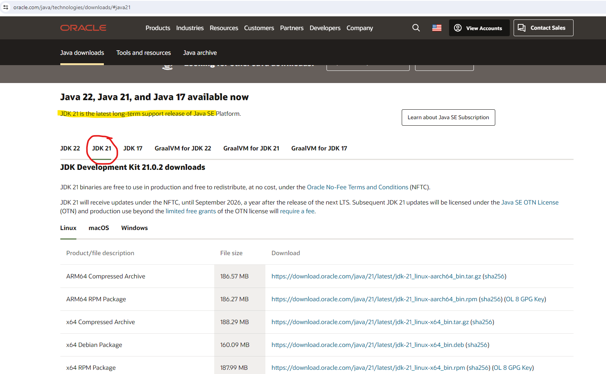

In our case, this 21 version as LTS and we choose this one.

After that download and install Apache Maven or another type of building tool.

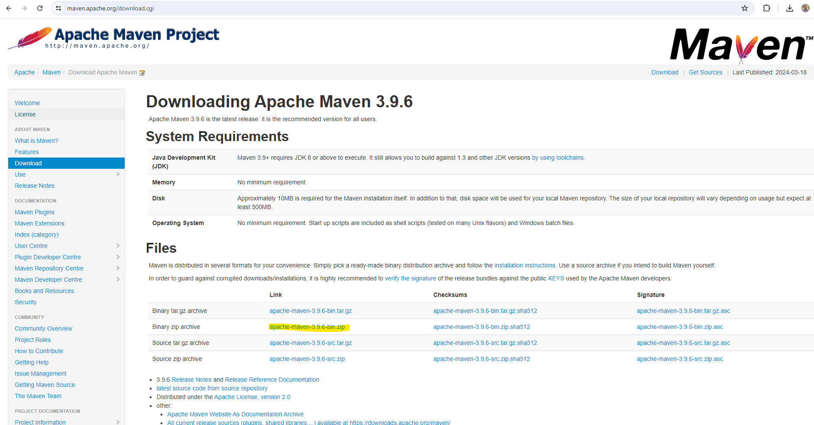

2. Setup Java and Maven as Environment variables:

Press [Win + Q] and type '_envir_' for example:


Click on 'Edit environment variables for your account', choose tab [Advanced] and click onthe '**Environment Variables** ...' button:

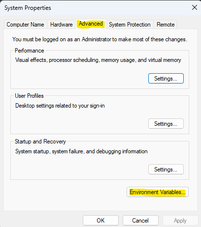

Here you will create System variable (or Edit them in case they already exist).
-	_JAVA_HOME_: add as value the path where you have installed Java 21 earlier (for example _C:\Program Files\Java\jdk-21.0.2_)
- _M2_HOME_: add as value the path where you have unzipped the archive earlier (for example _C:\Program Files\apache-maven-3.6.3-bin_)


Now look for the System variable called Path and edit its content. Add to this the following arguments if they do not already exist: _%M2_HOME%\bin; %JAVA_HOME%\bin_

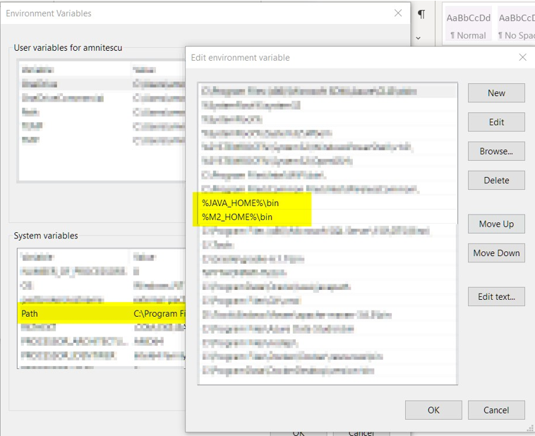

3.	Check to see that you have set up Java and Maven correctly.
-	Open a command line interface (CLI): (Press [Win + R] and type '_cmd_' and press 'Enter')
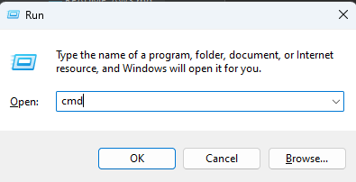
-	Check Java version by running the command: _java -version_
-	Check Maven version by running the command: _mvn -version_


If it looks like below than you are all set up correctly!  Versions may differ in your case, but the main thing is that there are no errors.

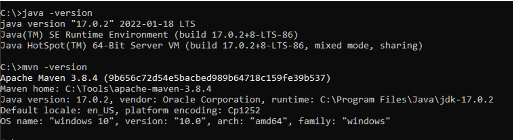

### Git
Git is a distributed version control system used for tracking changes in source code during software development. It facilitates collaboration among developers by allowing multiple versions of a project to be maintained simultaneously and efficiently merging changes.
1. Download and install Git

Before you start using Git, you have to make it available on your computer. Even if it’s already installed, it’s probably a good idea to update to the latest version.

Link for downloads: https://git-scm.com/download/win

2. Setup Git

If you have Git on your system, you’ll want to do a few things to customize your Git environment. You should have to do these things only once on any given computer; they’ll stick around between upgrades. You can also change them at any time by running through the commands again.

Git comes with a tool called git config that lets you get and set configuration variables that control all aspects of how Git looks and operates. These variables can be stored in three different places:

- 1. _[path]/etc/gitconfig_ file: Contains values applied to every user on the system and all their repositories. If you pass the option _--system_ to git config, it reads and writes from this file specifically. Because this is a system configuration file, you would need administrative or superuser privilege to make changes to it.

- 2. _~/.gitconfig_ or _~/.config/git/config_ file: Values specific personally to you, the user. You can make Git read and write to this file specifically by passing the _--global_ option, and this affects all of the repositories you work with on your system.

- 3. config file in the Git directory (that is, _.git/config_) of whatever repository you’re currently using: Specific to that single repository. You can force Git to read from and write to this file with the _--local_ option, but that is in fact the default. Unsurprisingly, you need to be located somewhere in a Git repository for this option to work properly.

Each level overrides values in the previous level, so values in .git/config trump those in [path]/etc/gitconfig.

You can view all of your settings and where they are coming from using:
```bash
$ git config --list --show-origin
```

**Your Identity**

The first thing you should do when you install Git is to set your user name and email address. This is important because every Git commit uses this information, and it’s immutably baked into the commits you start creating:

```bash
$ git config --global user.name "John Doe"
$ git config --global user.email john.doe@endava.com
```

Again, you need to do this only once if you pass the --global option, because then Git will always use that information for anything you do on that system. If you want to override this with a different name or email address for specific projects, you can run the command without the --global option when you’re in that project.

**Your default branch name**

By default Git will create a branch called master when you create a new repository with git init. From Git version 2.28 onwards, you can set a different name for the initial branch.

To set main as the default branch name do:
```bash
$ git config --global init.defaultBranch main
```

If you want to check your configuration settings, you can use the git config --list command to list all the settings Git can find at that point:

```bash
$ git config --list
user.name=John Doe
user.email=john.doe@endava.com
color.status=auto
color.branch=auto
color.interactive=auto
color.diff=auto
...
```
You can also check what Git thinks a specific key’s value is by typing git config <key>:
```bash
$ git config user.name
John Doe
```

### IntelliJ IDEA

1. Download and install IntelliJ IDEA
Link for downloads: https://www.jetbrains.com/idea/download/
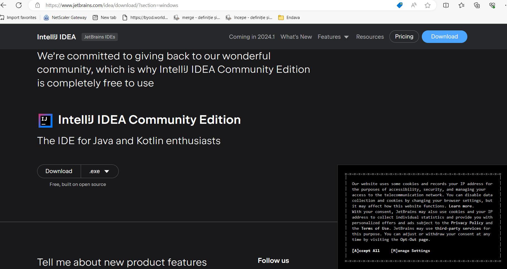
2. Setup IntelliJ IDEA
- Open IntelliJ IDEA
  Upon the first launch you’ll have to accept the Jetbrains Community EdiƟon Terms and Privacy Policy. Click on “Accept” to proceed.

Then you can see first screen of IntelliJ IDEA. Here you can:

3. Install plugins for IntelliJ IDEA
- Gherkin
- Cucumber for Java
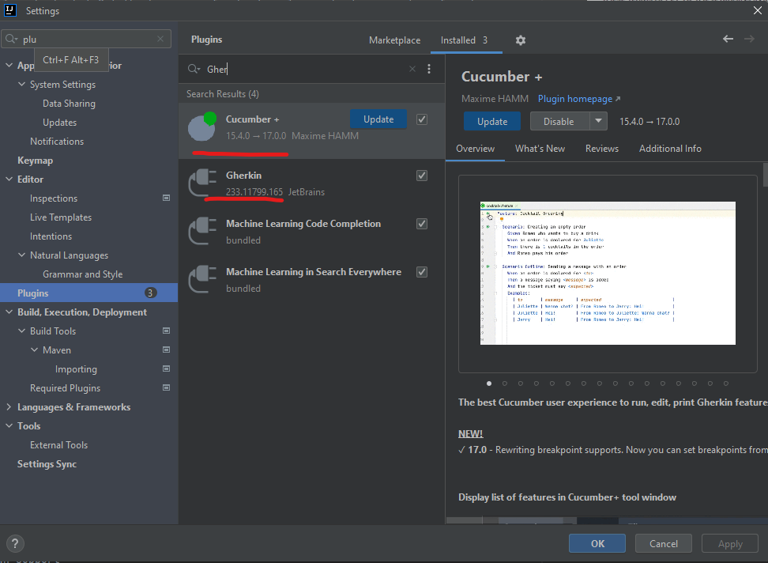

- Lombok

4. Setup the new project in IntelliJ IDEA or creeate new from existing sources

I. You should have a link to the project repository. If you don't have it, ask your team lead for it.

II. OR:
- Set a project name.
- Choose where the project will be created.
- Choose Language: Java
- Choose Build system: Maven
- Choose SDK: 21 (or the version you have installed)
- Click Finish
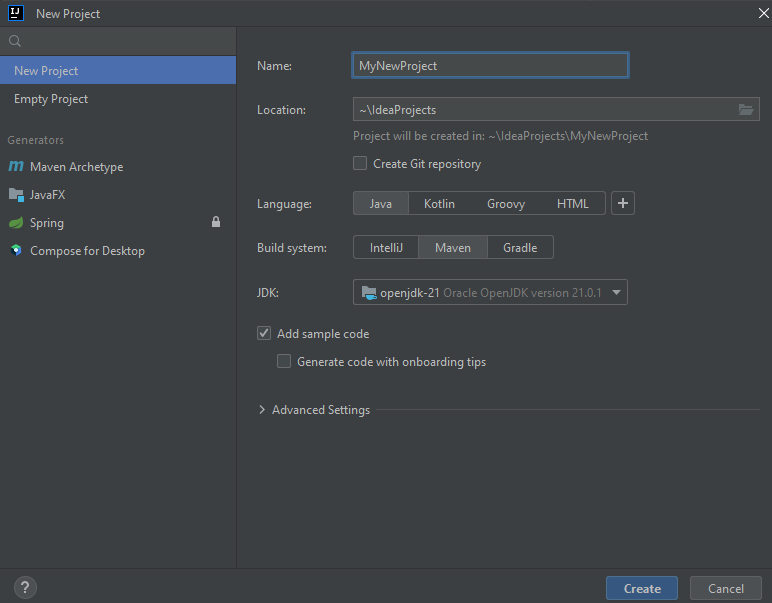
- Open the project structure and set the project SDK and language level (Press Ctrl+Alt+Shift+S).

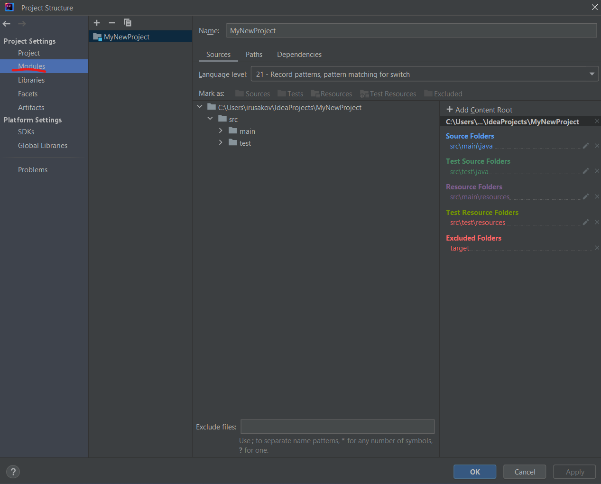


### Postman
Postman is an app for interacting with HTTP APIs. It presents you with a friendly GUI for constructing requests and reading responses.

But Postman recently changed their software to remove the Scratch Pad mode, which means that all configuration data, including Collections and Environments, is uploaded to Postman's cloud servers. This poses a **potential security risk** for many projects. To avoid storing collections in a Postman account, users are advised to uninstall their current version of Postman and install an older version using the following link:
[https://go.pstmn.io/dl-win64-v9-latest](https://go.pstmn.io/dl-win64-v9-latest)

1. Download Postman for Windows (64-bit), from the following link: https://go.pstmn.io/dl-win64-v9-latest.
2. Install Postman
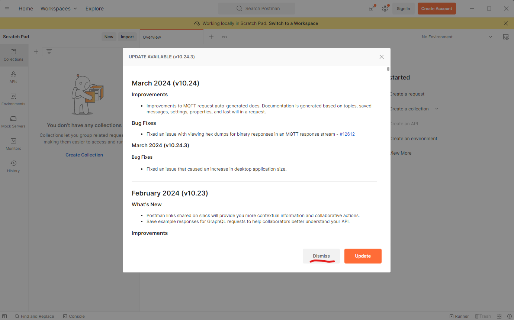

**Do not sign up or log in and don't Update software for security reasons.**

Requests are the foundation of Postman, as they are used to test APIs. Over time, the number of requests will increase, and it can become challenging to navigate through them. Therefore, it's essential to organize requests into collections. Collections can be thought of as folders for storing requests. Organizing collections is a significant topic, and it's something that might be discussed in an interview. In short, collections should have a logical structure and be organized based on a certain criterion, such as the version of the API being tested or a specific block of functionality.

Both requests and collections can be created using the "New" button in the upper left corner of the interface.

Postman collection with endpoints and environments set up will be provided by your project team lead.

### WinSCP
WinSCP (Windows Secure Copy) is a free and open-source file transfer client for Windows. It supports protocols like SFTP, SCP, FTPS, and FTP, and is commonly used for secure file transfer between a local computer and a remote server. It also offers a graphical user interface for easy navigation and file management.
1. Download WinSCP

Open your web browser and go to the WinSCP download page: [https://winscp.net/eng/download.php](https://winscp.net/eng/download.php)

Click on the "Download" button for the latest version of WinSCP. This will download the installation package to your computer.

2. Run the Installer
  Locate the downloaded installation package (usually in your "Downloads" folder).
  Double-click on the installer file (e.g., `WinSCP-<version>-Setup.exe`) to start the installation process.

3. Installation Wizard
  **Welcome Screen**: Click "Next" to continue.

**License Agreement**: Read the license agreement, select "I accept the agreement," and click "Next."

**Setup Type**: Choose the type of setup you prefer (Typical, Custom, or Compact). For most users, "Typical" is sufficient. Click "Next."

**Select Components**: Choose the components you want to install. The default selection is usually fine. Click "Next."

**Select Start Menu Folder**: Choose the folder in the Start Menu where you want to create the WinSCP shortcut. Click "Next."

**Additional Tasks**: Select additional tasks like creating a desktop icon or associating WinSCP with certain file types. Click "Next."

**Ready to Install**: Review your choices and click "Install" to start the installation.

4. Completing the Installation
  The installer will now install WinSCP on your computer. This may take a few moments.
  Once the installation is complete, you may be prompted to launch WinSCP. You can choose to start WinSCP right away or uncheck the option and click "Finish" to exit the installer.

5. Using WinSCP
  If you chose to launch WinSCP, the program should start automatically after installation.
  You can now use WinSCP to connect to remote servers using protocols like FTP, SFTP, or SCP. You'll need to provide the server details, such as hostname, username, and password, to establish a connection.

### Oracle SQL
Oracle SQL Developer is a free graphical tool that enhances productivity and simplifies database development tasks. With SQL Developer, you can browse database objects, run SQL statements and SQL scripts, edit and debug PL/SQL statements, manipulate and export data, and view and create reports. You can connect to Oracle databases, and you can connect to selected third-party (non-Oracle) databases, view metadata and data, and migrate these databases to Oracle.

Any project as a whole is closely related to DB’s and to properly test threads it is necessary to be able to check values in DB. Here is a guide to configuring connections with Oracle SQL Developer.

1. Browse to this link https://www.oracle.com/database/sqldeveloper/technologies/download/.


2. Click on download.

3. Login in Oracle account or create a new account. It is free

4. Extract the downloaded zip file.
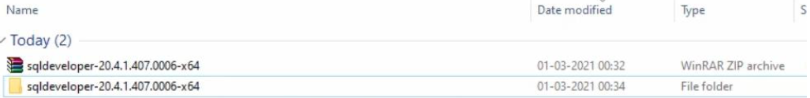
5. Open your computer C drive & program files. Cut & Paste the extracted file there.

6. Open the folder. Then open sqldeveloper folder.
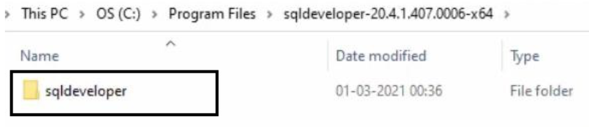
7. Find the sqldeveloper exe file there. Create a shortcut on desktop.
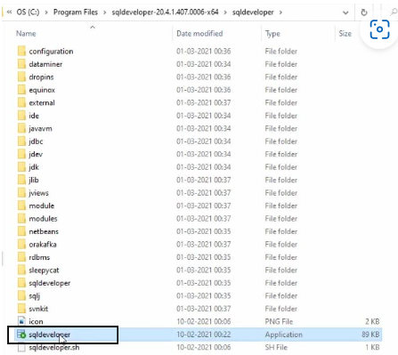
8. Open the shortcut. It will give you welcome page. After installation you should see this picture:
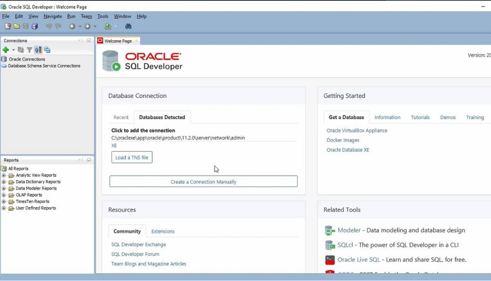
Hence, your installation is successful.
   Or as an alternative you can add it to Intellij IDE.

### PuTTY
PuTTY is a free, open-source terminal emulator, serial console, and network file transfer application. It supports various network protocols, including SSH, Telnet, and SCP, and is commonly used for remote access to servers and network devices.
1. Download PuTTY
Open your web browser and go to the PuTTY download page: [https://www.putty.org/](https://www.putty.org/)

Click on the link that says "You can download PuTTY here" to go to the download section.

Under the "Package files" section, download the `putty-<version>-installer.msi` file for Windows. The `<version>` part will be replaced by the current version number of PuTTY.

2. Run the Installer

Locate the downloaded MSI file (usually in your "Downloads" folder).

Double-click on the `putty-<version>-installer.msi` file to start the installation process.

3. Installation Wizard

**Welcome Screen**: Click "Next" to continue.
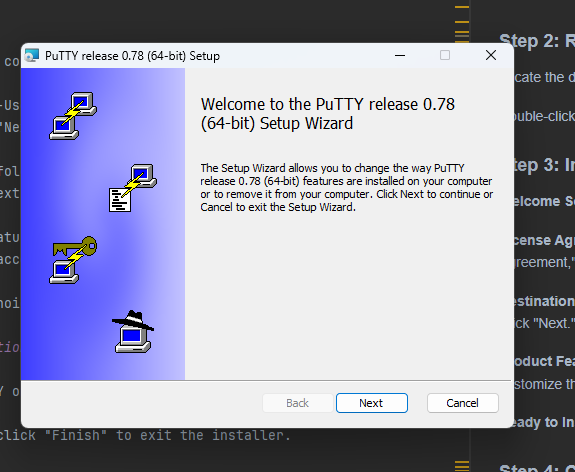
**License Agreement**: Read the End-User License Agreement, select "I accept the terms in the License Agreement," and click "Next."

**Destination Folder**: Choose the folder where you want to install PuTTY. The default location is usually fine. Click "Next."

**Product Features**: Choose the features you want to install. You can select the default set of features or customize them according to your needs. Click "Next."

**Ready to Install**: Review your choices and click "Install" to start the installation.

4. Completing the Installation

The installer will now install PuTTY on your computer. This may take a few moments.

Once the installation is complete, click "Finish" to exit the installer.

5. Using PuTTY

To start PuTTY, go to the Start Menu or the installation directory, and click on the PuTTY icon.

In the PuTTY Configuration window, enter the hostname or IP address of the server you want to connect to in the "Host Name (or IP address)" field.

Choose the connection type (SSH, Telnet, Rlogin, or Serial) and click "Open" to start the session.

If you're connecting for the first time, you may see a security alert about the server's host key. If you trust the server, click "Yes" to continue.

## Links for downloading

- Java SE Development Kit and Maven: [https://www.oracle.com/java/technologies/downloads/#java21](https://www.oracle.com/java/technologies/downloads/#java21), [https://maven.apache.org/download.cgi](https://maven.apache.org/download.cgi)
- Full sets of instructions for Java and Maven installation: [https://docs.oracle.com/en/java/javase/21/install/installation-jdk-microsoft-windows-platforms.html#GUID-A7E27B90-A28D-4237-9383-A58B416071CA](https://docs.oracle.com/en/java/javase/21/install/installation-jdk-microsoft-windows-platforms.html#GUID-A7E27B90-A28D-4237-9383-A58B416071CA), [https://maven.apache.org/install.html](https://maven.apache.org/install.html)

- Git: [https://git-scm.com/download/win](https://git-scm.com/download/win)

- IntelliJ IDEA: [https://www.jetbrains.com/idea/download/](https://www.jetbrains.com/idea/download/)

- Postman: [https://go.pstmn.io/dl-win64-v9-latest](https://go.pstmn.io/dl-win64-v9-latest)

- WinSCP: [https://winscp.net/eng/download.php](https://winscp.net/eng/download.php)

- Oracle SQL Developer: [https://www.oracle.com/database/sqldeveloper/technologies/download/](https://www.oracle.com/database/sqldeveloper/technologies/download/)

- PuTTY: [https://www.putty.org/](https://www.putty.org/)
- 
  Copyright © 2024 by Iurii Rusakov
