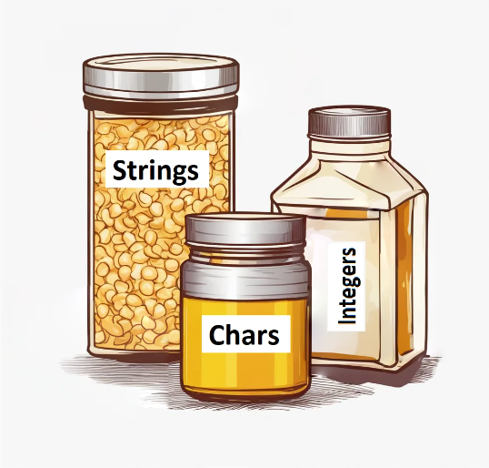

= Basic Literals
Liudmila Topal <liudmila.topal@endava.com>
3.0, July 29, 2022: AsciiDoc article template
:toc:
:icons: font

Regardless of its complexity, a program always performs operations on _numbers_, _strings_, and other values.

These values are called *literals*.

There are many different sorts of literals in Java, but in this topic we will focus only on a few of them: the ones that
surround us all the time in everyday life.

Consider _literals as groceries_.

To use them, usually you need to store them somewhere. Typically, they are stored in *variables*, which you can think of as containers designed to hold a specific *type of data*.
----
Variables can only store matching data.
----
You wouldn't want to accidentally put honey in a cardboard cereal box or pour cereal into a salt shaker.
To prevent such mistakes, learn to distinguish between the basic literals: _integer numbers, strings, and characters_.

=== Integer numbers
These *numbers* are used to count things in the real world. Also, we will often use them in Java.

TIP: Here are several examples of valid integer number literals separated by commas: _0, 1, 2, 10, 11, 100_.

[source, java]
----
int numApples = 1000;
----

If an integer value contains a lot of digits, we can add underscores to divide the digit into blocks for increased
readability: _1_000_000_. It's more readable than the same value written as _1000000_.

[source, java]
----
int numPackedApples = 1_000_000;
----

TIP: More info about Integer you can find xref:../../03_java_basics/data_types/Data_Types.adoc#_integer_data_type[here].

=== Characters
*A character* is a single symbol, denoted with single quotes.

You can use character literals to represent single letters like '_A_', '_x_', digits from '_0_' to '_9_', whitespaces (' '), and other characters or symbols like '_$_'.

Be mindful of quotes and avoid confusing characters representing digits with the digits themselves:

[source, java]
----
char charOne = '1';
int = numOne = 1;
----

TIP: Fun fact: characters sit between integers and strings: they resemble strings, yet you can do math with them.

TIP: More info about Char you can find xref:../../03_java_basics/data_types/Data_Types.adoc#_char_data_type[here].

=== Strings
*A string* is a sequence of characters, encapsulated by double quotes.

It represents text-based information, such as an advertising line, a webpage address, or a website login name.

Here are some valid examples: "_text_", "_I want to know Java_", "_123456_", "_e-mail@gmail.com_".
As you can see, a string can include letters, digits, whitespaces, and other characters altogether.

A string consisting of a single character like "_A_" is also a valid string, but do not confuse it with the '_A_' character.

TIP: *Note the difference in quotes!*

[source, java]
----
char singleQuoted = 'A';
String doubleQuoted = "A";
----

TIP: More info about Strings you can find xref:../../03_java_basics/data_types/Data_Types.adoc#_strings[here].

=== Conclusion
* *123* is an integer number, "*123*" is a string;
* '*A*' is a character, "*A*" is a string;
* '*1*' is a character, *1* is an integer number.