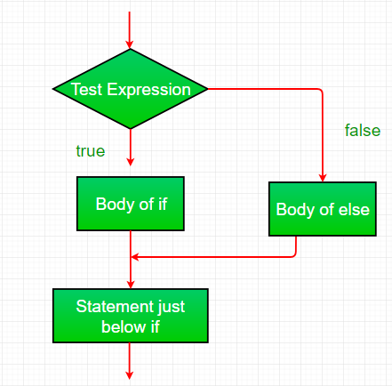
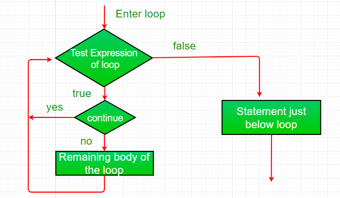

= Control Statements in Java
Liudmila Topal <liudmila.topal@endava.com>
:revnumber: 1.1
:revdate: 2024-08-16
:doctype: book
:toc: left
:sectnums:
:icons: font
:highlightjs-languages: java

*Control Statements* in programming is similar to decision-making process in real life.

In programming also face some situations where we want a certain block of code to be executed when some condition is fulfilled.

A programming language uses control statements to control the flow of execution of a program based on certain conditions.
These are used to cause the flow of execution to advance and branch based on changes to the state of a program.

== Selection statements

Java’s Selection statements:

* link:#if[if]
* link:#if_else[if-else]
* link:#nested_if[nested-if]
* link:#if_else_if[if-else-if]
* link:#switch[switch-case]
* link:#jump[jump – break, continue, return]

=== [[if]]if
if statement is the simplest decision-making statement.

It is used to decide whether a certain statement or block of statements will be executed or not i.e.
if a certain condition is _true_ then a block of statements is executed otherwise not.

*Syntax:*

[source, java]
----
if (condition) {
    // statements to execute if condition is true
}
----

Here, *the condition* after evaluation will be either _true_ or _false_.

TIP: if statement accepts *boolean* values – if the value is _true_ then it will execute the block of statements under it.

If we do not provide the curly braces ‘*{*‘ and ‘*}*’ after *if(condition)* then by default if statement will consider
the immediate one statement to be inside its block.

*Syntax:*

[source, java]
----
if (condition) { // assume condition is true
    statement1; // part of if block
}
    statement2; // separate from if block

// Here if the condition is true
// if block will consider statement1 as its part and executes in only true condition
// statement2 will be separate from the if block, so it will always execute whether the condition is true or false
----

*Flowchart:*

image::../resource/if_3.png[]

[NOTE]
====
link:statements.examples/If.java[Here] you can find an example.
====

=== [[if_else]]if-else
The _if_ statement alone tells us that _if a condition is true_ it will execute a block of statements and _if the condition is false_ it won’t.

But what if we want to do something else if the condition is false? Here comes the *else statement*.

TIP: We can use the *else statement* with the if statement to execute a block of code when the condition is _false_.

*Syntax:*
[source, java]
----
if (condition) {
    // executes this block if condition is true
} else {
    // executes this block if condition is false
}
----

*Flowchart:*

[NOTE]
====
link:statements.examples/IfElse.java[Here] you can find an example.
====

=== [[nested_if]]nested-if
A *nested if* is an if statement that is the target of another if or else.

TIP: Nested if statements mean an _if statement inside an if statement_.

Yes, java allows us to nest if statements within if statements. i.e, we can place an if statement inside another if statement.

*Syntax:*
[source, java]
----
if (condition1) {
    // executes when condition1 is true

    if (condition2) {
        // executes when condition2 is true
    }
}
----

*Flowchart:*

[NOTE]
====
link:statements.examples/NestedIf.java[Here] you can find an example.
====

=== [[if_else_if]]if-else-if ladder
Here, a user can decide among multiple options.

The if statements are executed from the top down.

As soon as one of the conditions controlling the if is _true_, the statement associated with that ‘_if_’ is executed,
and the rest of the ladder is bypassed.

_If none_ of the conditions is _true_, then the _final else statement will be executed_.

TIP: There can be as many as ‘*else if*’ blocks associated with one ‘*if*’ block but only one ‘*else*’ block is allowed with one ‘*if*’ block.

*Syntax:*
[source, java]
----
if (condition) {
    statement;
} else {
    statement;
}
...
 else {
     statement;
 }
----

*Flowchart:*

image::../resource/if-else-if_2.png[]

[NOTE]
====
link:statements.examples/IfElseIf.java[Here] you can find an example.
====

=== [[switch]]switch-case
The *switch* statement is a multiway branch statement.

TIP: It provides an easy way to dispatch execution to different parts of code based on the value of the expression.

*Syntax:*
[source, java]
----
switch (expression) {
    case value1:
        statement1;
        break;
    case value2:
        statement2;
        break;
    ...
    case valueN:
        statementN;
        break;
    default:
        statementDefault;
}
----

[NOTE]
====
link:statements.examples/Switch.java[Here] you can find an example.
====

* The expression can be of type byte, short, int char, or an enumeration. Beginning with JDK7, the expression can also be of type String.
* Duplicate case values are not allowed.
* The default statement is optional.
* The break statement is used inside the switch to terminate a statement sequence.
* The break statements are necessary without the break keyword, statements in switch blocks fall through.
* If the break keyword is omitted, execution will continue to the next case.

TIP: More info and examples about switch statement you can find https://dev.java/learn/language-basics/switch-statement/[here].

=== [[jump]]jump
Java supports three *jump* statements: _break_, _continue_ and _return_.

These three statements transfer control to another part of the program.

* *Break:*  In Java, a break is majorly used for:
** Terminate a sequence in a switch statement (discussed above).
** To exit a loop.
** Used as a “civilized” form of goto.
* *Continue:* Sometimes it is useful to force an early iteration of a loop.
That is, you might want to continue running the loop but stop processing the remainder of the code in its body for this particular iteration.

This is, in effect, a goto just past the body of the loop, to the loop’s end.
The continue statement performs such an action.

*Flowchart:*

[NOTE]
====
link:statements.examples/Continue.java[Here] you can find an example.
====

* *Return:* is used to explicitly return from a method.

That is, it causes program control to transfer back to the caller of the method.

[NOTE]
====
link:statements.examples/Return.java[Here] you can find an example.
====

TIP: More info and examples about _return_ statement you can find https://www.javatpoint.com/return-statement-in-java[here].

TIP: More info and examples about control statements you can find https://dev.java/learn/language-basics/controlling-flow/[here].