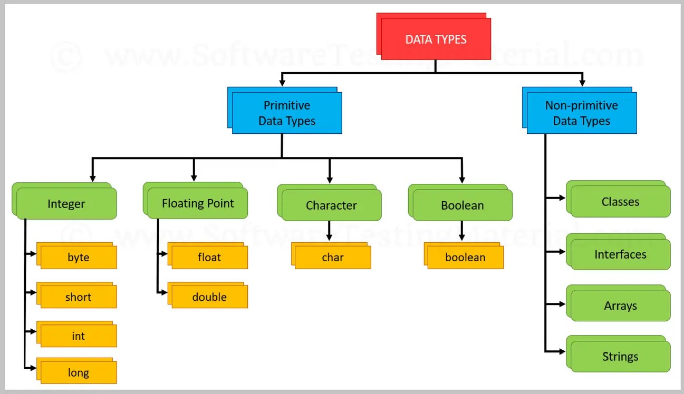

= Java Data Types
Liudmila Topal <liudmila.topal@endava.com>
:revnumber: 1.1
:revdate: 2024-08-16
:doctype: book
:toc: left
:sectnums:
:icons: font
:highlightjs-languages: java

*Java data types* are used to define the type of data for the different types of _variables_, _constants_,
_method parameters_, _returns type_, etc.

== Data Types

They are of _different sizes and values_ that can be stored in the variable that is made as per convenience and circumstances to cover up all test cases.

Java has two categories in which data types are segregated:

. *Primitive Data Type:* such as boolean, char, int, short, byte, long, float, and double.
. *Non-Primitive Data Type* or Object Data type: such as String, Array, etc.

== Primitive Data Types

*Primitive data* are only single values and have no special capabilities.
There are 8 primitive data types.

They are depicted below in tabular format below as follows:

|===
|Type |Description |Default |Size |Example Literals |Range of values

|link:#boolean[*boolean*]
|true or false
|false
|1 bit
|true, false
|true, false

|link:#byte[*byte*]
|twos-complement integer
|0
|8 bits
|(none)
|-128 to 127

|link:#char[*char*]
|unicode character
|\u0000
|16 bits
|‘a’, ‘\u0041’, ‘\101’, ‘\\’, ‘\’, ‘\n’, ‘β’
|characters representation of ASCII values

0 to 255

|link:#short[*short*]
|twos-complement integer
|0
|16 bits
|(none)
|-32,768 to 32,767

|link:#int[*int*]
|twos-complement integer
|0
|32 bits
|-2,-1,0,1,2
|-2,147,483,648
to
2,147,483,647

|link:#long[*long*]
|twos-complement integer
|0
|64 bits
|-2L,-1L,0L,1L,2L
|-9,223,372,036,854,775,808
to
9,223,372,036,854,775,807

|link:#float[*float*]
|IEEE 754 floating point
|0.0
|32 bits
|1.23e100f , -1.23e-100f , .3f ,3.14F
|upto 7 decimal digits

|link:#double[*double*]
|IEEE 754 floating point
|0.0
|64 bits
|1.23456e300d, -123456e-300d, 1e1d
|upto 16 decimal digits
|===

=== [[boolean]]Boolean Data Type

A boolean type is declared with the *boolean* keyword and can only take the values *true* or *false*:

*Syntax:*

[source,java]
----
boolean b1 = true;
boolean b2 = false;
----

[NOTE]
====
link:data_types_examples/primitive_data_types/BooleanExample.java[Here] you can find an example.
====

TIP: More info about boolean type you can find https://docs.oracle.com/javase/8/docs/api/java/lang/Boolean.html[here].

=== [[byte]]Byte Data Type

The byte data type is an 8-bit signed two’s complement integer.

The byte data type is useful for saving memory in large arrays.

*Syntax:*

[source,java]
----
byte num1 = (byte) 128;
byte num2 = (byte) -129;
----

[NOTE]
====
link:data_types_examples/primitive_data_types/ByteExample.java[Here] you can find an example.
====

TIP: More info about byte type you can find https://docs.oracle.com/javase/8/docs/api/java/lang/Byte.html[here].

=== [[short]]Short Data Type

The short data type is a 16-bit signed two’s complement integer.

Similar to byte, use a short to save memory in large arrays, in situations where the memory savings actually matters.

*Syntax:*

[source,java]
----
short num1 = 10;
short num2 = -10;
----

[NOTE]
====
link:data_types_examples/primitive_data_types/ShortExample.java[Here] you can find an example.
====

TIP: More info about short type you can find https://docs.oracle.com/javase/8/docs/api/java/lang/Short.html[here].

[#_integer_data_type]
=== [[int]]Integer Data Type

An integer number is a type of primitive data type that represents whole numbers, both positive and negative, as well as zero.

Syntax:

[source,java]
----
int num1 = 10;
int num2 = -10;
----

[NOTE]
====
link:data_types_examples/primitive_data_types/IntExample.java[Here] you can find an example.
====

TIP: More info about integer type you can find https://docs.oracle.com/javase/8/docs/api/java/lang/Integer.html[here].

=== [[long]]Long Data Type

In Java, long is a data type used to store large numerical values.

This data type is particularly useful when you need to work with numbers that exceed the capacity of other integer data types.

*Syntax:*

[source,java]
----
long num1 = 10L;
long num2 = -10L;

long min = -9223372036854775808L;
long max = 9223372036854775807L;
----

[NOTE]
====
link:data_types_examples/primitive_data_types/LongExample.java[Here] you can find an example.
====

TIP: More info about long type you can find https://docs.oracle.com/javase/8/docs/api/java/lang/Long.html[here].

=== [[float]]Float Data Type

A float data type in Java stores a decimal value with 6-7 total digits of precision.

TIP: It represents the fractional numbers.

*Syntax:*

[source,java]
----
float num1 = 5.5f;
float num2 = 5f;
float num3 = 581216732.323433f;
float num4 = 7.83684987683688f;
----

[NOTE]
====
link:data_types_examples/primitive_data_types/FloatExample.java[Here] you can find an example.
====

TIP: More info about float type you can find https://docs.oracle.com/javase/8/docs/api/java/lang/Float.html[here].

=== [[double]]Double Data Type

TIP: It generally represents the decimal numbers.

*Syntax:*

[source,java]
----
double num1 = 5.5;
double num2 = 10;
double num3 = 581216732.323433;
double num4 = 7.83684987683688;
----

[NOTE]
====
link:data_types_examples/primitive_data_types/DoubleExample.java[Here] you can find an example.
====

TIP: More info about double type you can find https://docs.oracle.com/javase/8/docs/api/java/lang/Double.html[here].

[#_char_data_type]
=== [[char]]Char Data Type

The char data type is used to store a *single* character.

TIP: The character must be surrounded by single quotes, like '_A_' or '_c_'.

*Syntax:*

[source,java]
----
char char1 = 'a';
char char2 = 'A';
----

[NOTE]
====
link:data_types_examples/primitive_data_types/CharExample.java[Here] you can find an example.
====

TIP: More info about char type you can find https://docs.oracle.com/javase/8/docs/api/java/lang/Character.html[here].

=== Var Data Type

The var type lets the compiler decide what is the real type of the variable you create.

TIP: More info about var type you can find https://dev.java/learn/language-basics/using-var/[here].

== Non-Primitive Data Type or Reference Data Types

The *Reference Data Types* will contain a memory address of variable values because the reference types won’t store the variable value directly in memory.

TIP: They are strings, objects, arrays, etc.

[#_strings]
=== Strings

In Java, a *string* is a sequence of characters.

For example, "_hello_" is a string containing a sequence of characters '_h_', '_e_', '_l_', '_l_', and '_o_'.

*Syntax:*

[source,java]
----
String string = "Hello World!";
----

[NOTE]
====
link:data_types_examples/non_primitive_data_type/StringsExample.java[Here] you can find an example.
====

TIP: More info about String type you can find https://www.geeksforgeeks.org/strings-in-java/[here] and some methods examples https://medium.com/edureka/java-string-68e5d0ca331f#:~:text=For%20Example%3A%20String%20s%3D%E2%80%9C,the%20object%20in%20the%20heap.[here].

=== Class

A *class* is a user-defined blueprint or prototype from which objects are created.

It represents the set of properties or methods that are common to all objects of one type.
In general, class declarations can include these components.

TIP: More info about Class you can find xref:../../09_oop_basics/1 classes/what_is_a_class.adoc#_class_in_java[here].

=== Object

An *Object* is a basic unit of Object-Oriented Programming and represents real-life entities.

A typical Java program creates many objects, which as you know, interact by invoking methods.

TIP: More info about Class you can find xref:../../09_oop_basics/4 objects/what_is_an_object.adoc#_object_in_java[here].

=== Interface

Like a class, an *interface* can have methods and variables, but the methods declared in an interface are by default abstract (only method signature, without body).

TIP: More info about Interface you can find link:https://docs.oracle.com/javase/tutorial/java/concepts/interface.html[here].

=== Array

*Arrays* are used to _store multiple values_ in a single variable, instead of declaring separate variables for each value.

To declare an array, define the variable type with square brackets:

*Syntax:*

[source,java]
----
String[] cars = {"Volvo", "BMW", "Mazda", "Ford"};
----

[NOTE]
====
link:data_types_examples/non_primitive_data_type/ArrayExample.java[Here] you can find an example.
====

TIP: More info about array you can find https://dev.java/learn/language-basics/arrays/[here].