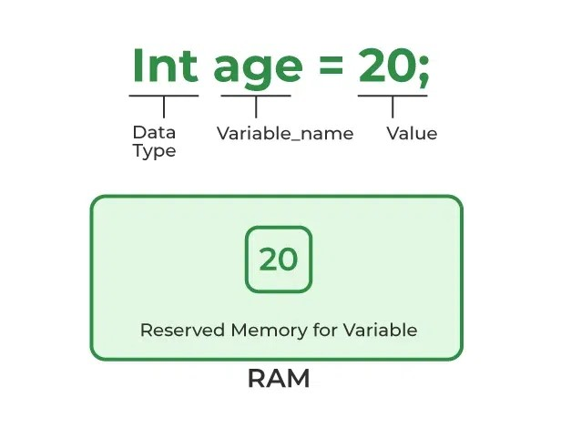
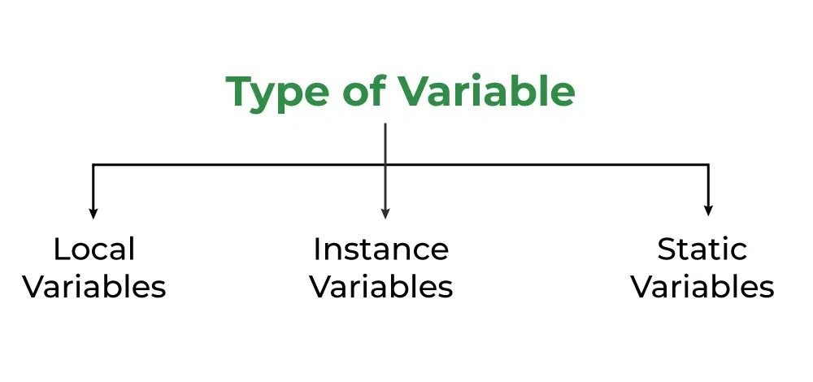

= Java Variables
Liudmila Topal <liudmila.topal@endava.com>
:revnumber: 1.1
:revdate: 2024-08-16
:doctype: book
:toc: left
:sectnums:
:icons: font
:highlightjs-languages: java

====
*Variables* are containers for storing data values.
====

* The value stored in a variable can be changed during program execution.
* Variables in Java are only a name given to a memory location.
All the operations done on the variable affect that memory location.
* In Java, all variables must be declared before use.

== How to Declare Variables?

From the image, it can be easily perceived that while declaring a variable, we need to take care of two things that are:

* *datatype:* Type of data that can be stored in this variable.
* *data_name:* Name was given to the variable.

TIP: In this way, a name can only be given to a memory location.

It can be assigned values in two ways:

* Variable Initialization
* Assigning value by taking input

== How to Initialize Variables?

It can be perceived with the help of 3 components that are as follows:

* *datatype:* Type of data that can be stored in this variable.
* *variable_name:* Name given to the variable.
* *value:* It is the initial value stored in the variable.

*Syntax:*

[source,java]
----
// Declaring float variable
float simpleInterest;

// Decalring and initializing integer variable
int time = 10;

// Decalring and initializing character variable
char var = 'h';
----

== Types of Variables

Now let us discuss different types of variables which are listed as follows:

* link:#local[Local Variables]
* link:#instance[Instance Variables]
* link:#static[Static Variables]

=== [[local]]Local Variables

====
A variable defined within a block or method or constructor is called a local variable.
====

* These variables are created when the block is entered, or the function is called and destroyed after exiting from the block or when the call returns from the function.
* The scope of these variables exists only within the block in which the variables are declared, i.e., we can access these variables only within that block.
* Initialization of the local variable is mandatory before using it in the defined scope.

[NOTE]
====
link:variable_examples/LocalVariable.java[Here] you can find an example.
====

=== [[instance]]Instance Variables

====
Instance variables are non-static variables and are declared in a class outside any method, constructor, or block.
====

* As instance variables are declared in a class, these variables are created when an object of the class is created and destroyed when the object is destroyed.
* Unlike local variables, we may use access specifiers for instance variables.
If we do not specify any access specifier, then the default access specifier will be used.
* Initialization of an instance variable is not mandatory.
Its default value is dependent on the data type of variable.
For _String_, it is _null_, for _float_ it is _0.0f_, for int it is 0, for Wrapper classes like *Integer* it is *null*, etc.
* Instance variables can be accessed only by creating objects.
* We initialize instance variables using constructors while creating an object.
We can also use instance blocks to initialize the instance variables.

[NOTE]
====
link:variable_examples/InstanceVariable.java[Here] you can find an example.
====

=== [[static]]Static Variables

====
Static variables are also known as class variables.
====

* These variables are declared similarly to instance variables.
The difference is that static variables are declared using the static keyword within a class outside of any method, constructor, or block.
* Unlike instance variables, we can only have one copy of a static variable per class, irrespective of how many objects we create.
* Static variables are created at the start of program execution and destroyed automatically when execution ends.
* Initialization of a static variable is not mandatory.
Its default value is dependent on the data type of variable.
For _String_, it is _null_, for _float_ it is _0.0f_, for _int_ it is _0_, for _Wrapper_ classes like _Integer_ it is _null_, etc.
* If we access a static variable like an instance variable (through an object), the compiler will show a warning message, which won’t halt the program.
The compiler will replace the object name with the class name automatically.
* If we access a static variable without the class name, the compiler will automatically append the class name.
But for accessing the static variable of a different class, we must mention the class name as 2 different classes might have a static variable with the same name.
* Static variables cannot be declared locally inside an instance method.
* https://www.geeksforgeeks.org/static-blocks-in-java/[Static blocks] can be used to initialize static variables.

[NOTE]
====
link:variable_examples/StaticVariable.java[Here] you can find an example.
====

=== Final Variables

====
Sometimes, you need to use a variable that should not be modified during the program.
Such variables are known as constants.

Java provides a special keyword called *final* to declare them.
====

The only difference between a regular variable and a final variable is that we *cannot modify the value of a final variable* once assigned.
Hence, final variables must be used only for the values that we want to remain constant throughout the execution of the program.

== Differences Between the Instance variables and the Static variables

The differences between the Instance variables and the Static variables:

* Each object will have its own copy of an instance variable, whereas we can only have one copy of a static variable per class, irrespective of how many objects we create.
Thus, *static variables* are good for *memory management*.
* Changes made in an instance variable using one object will not be reflected in other objects as each object has its own copy of the instance variable.
In the case of a static variable, changes will be reflected in other objects as static variables are common to all objects of a class.
* We can access instance variables through object references, and static variables can be accessed directly using the class name.
* Instance variables are created when an object is created with the use of the keyword ‘new’ and destroyed when the object is destroyed.
Static variables are created when the program starts and destroyed when the program stops.