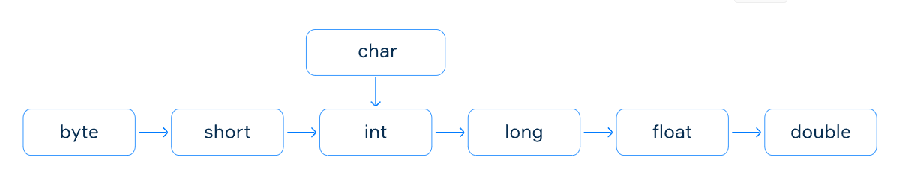

= Type casting
Liudmila Topal <liudmila.prepelita@endava.com>
3.0, July 29, 2022: AsciiDoc article template
:revnumber: 1.1
:revdate: 2024-08-16
:doctype: book
:toc: left
:sectnums:
:icons: font
:highlightjs-languages: java

Suppose, you need to assign a value of one type to a variable of another type.

----
To do that, your program needs to cast the source type to the target type.
----

Java provides _two kinds of casting_ for primitive types: *implicit* and *explicit*.

* _The first one_ is performed automatically by the java compiler when it is possible.
* _The second one_ – only by a programmer.

== Implicit casting

The compiler automatically performs *implicit casting* when the target type is wider than the source type.
The picture below illustrates the direction of this casting.

Any value of a given type can be assigned to the one on the right implicitly or below in the case of char.

----
Note that there is no boolean type on the picture above because it is impossible to cast this type to any other and vice versa.
----

In some cases, implicit type casting may result in some information loss.

When we convert an _int_ to _float_, or a _long_ to _float_ or to _double_, we may lose some less significant bits of the value, which will result in a loss of https://hyperskill.org/learn/step/13511[precision].

However, the result of this conversion will be a correctly rounded version of the integer value, which will be in the overall range of the target type.

[source,java]
----
long bigLong = 1_200_000_002L;
float bigFloat = bigLong;
----

When we convert a _char_ to an _int_ in Java, we actually get the *ASCII value* for a given character.
The ASCII value is an integer representation of English alphabet letters (both uppercase and lowercase), digits, and other symbols.

https://ascii.cl/[Here] you can find some of the standard symbols in ASCII.

[source,java]
----
char character = 'a';
char upperCase = 'A';

int ascii1 = character;
int ascii2 = upperCase;
----

[NOTE]
====
link:casting_examples/ImplicitCasting.java[Here] you can find some examples.
====

== Explicit casting

The considered implicit casting does not work when the target type is narrower than the source type.

TIP: But programmers can apply *explicit casting* to a source type to get another type they want.

It may lose information about the overall magnitude of a numeric value and may also lose precision.

To perform explicit casting, a programmer must write the target type in parentheses before the source.

[source,java]
----
(targetType) source
----

Any possible casting not presented in the picture above needs such an approach, for example _double_ to _int_, and _long_ to _char_.

TIP: However, the explicit casting may truncate the value because long and _double can store a much larger number than int_.

[source,java]
----
long bigNum = 100_000_000_000_000L;
int n = (int) bigNum;
----

----
Note, that despite the power of explicit casting, it is still impossible to cast something to and from the boolean type.
----

[NOTE]
====
link:casting_examples/ExplicitCasting.java[Here] you can find an example.
====