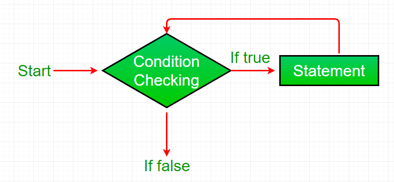

= Loops in Java
Liudmila Topal <liudmila.topal@endava.com>
:revnumber: 1.1
:revdate: 2024-08-16
:doctype: book
:toc: left
:sectnums:
:icons: font
:highlightjs-languages: java

*Looping* in programming languages is a feature which facilitates the execution of a _set of instructions/functions repeatedly_ while some condition evaluates to _true_.

== Types of loop

Java provides _three ways_ for executing the loops.

While all the ways provide similar basic functionality, they differ in their syntax and condition checking time.

Three types of Conditional statements this second type is loop statement:

* link:#while[while loop]
* link:#for[for loop]
* link:#do[do while]

=== [[while]]while loop

A *while loop* is a control flow statement that allows code to be executed repeatedly based on a given _Boolean_ condition.

TIP: The while loop can be thought of as a repeating if statement.

*Syntax:*

[source,java]
----
while (boolean condition) {
    loop statements...
}
----

*Flowchart:*

* While loop starts with the checking of _Boolean_ condition.
If it evaluated to _true_, then the loop body statements are executed otherwise first statement following the loop is executed.
For this reason it is also called *Entry control loop*.
* Once the condition is evaluated to _true_, the statements in the loop body are executed.
Normally the statements contain an update value for the variable being processed for the next iteration.
* When the condition becomes _false_, the loop terminates which marks the end of its life cycle.

[NOTE]
====
link:loops.examples/While.java[Here] you can find an example.
====

=== [[for]]for loop

*For loop* provides a concise way of writing the loop structure.

Unlike a while loop, a for statement consumes the _initialization_, _condition and increment/decrement_ in one line thereby providing a shorter, _easy_ to debug structure of looping.

*Syntax:*

[source,java]
----
for (initialization condition; testing condition; increment/ decrement){
    statement(s)...
}
----

*Flowchart:*

image::../resource/for_2.png[]

* *Initialization condition:* Here, we initialize the variable in use.
** It marks the start of a *for loop*.
** An already declared _variable can be used_ or _a variable can be declared_, local to loop only.
* *Testing Condition:* It is used for testing the exit condition for a loop.
** It must return a *boolean* value.
** It is also an _Entry Control Loop_ as the condition is checked prior to the execution of the loop statements.
* *Statement execution:* Once the condition is evaluated to _true_, the statements in the _loop body are executed_.
* *Increment/ Decrement:* It is used for _updating_ the variable for next iteration.
* *Loop termination:* When the condition becomes *false*, the loop terminates _marking the end of its life cycle_.

[NOTE]
====
link:loops.examples/For.java[Here] you can find an example.
====

=== [[do]]do while

**Do while **loop is similar to while loop with only difference that it checks for condition after executing the statements, and therefore is an example of Exit Control Loop.

*Syntax:*

[source,java]
----
do {
    statement(s)...
}
while (condition);
----

*Flowchart:*

image::../resource/do_while_2.png[]

* *do while* loop starts with the execution of the statement(s).
_There is no checking of any condition for the first time_.
* After the execution of the statements, and update of the variable value, the condition is checked for _true_ or _false_ value.
If it is evaluated to _true_, _next iteration of loop starts_.
* When the condition becomes _false_, the loop terminates which marks the end of its life cycle.
* It is important to note that the _do-while loop_ will execute its statements at least once before any condition is checked, and therefore is an example of exit control loop.

[NOTE]
====
link:loops.examples/DoWhile.java[Here] you can find an example.
====