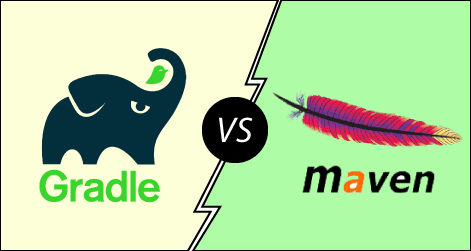
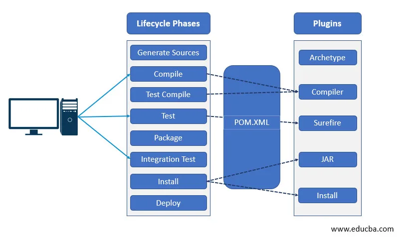
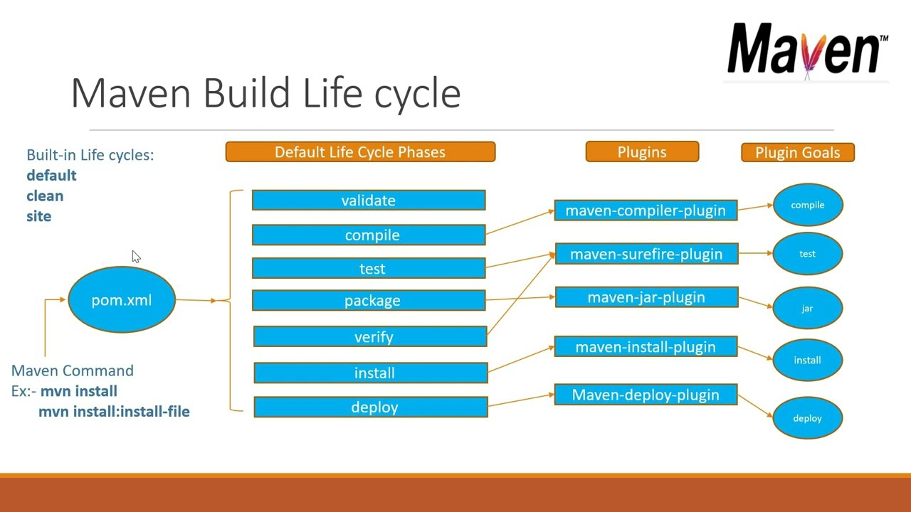
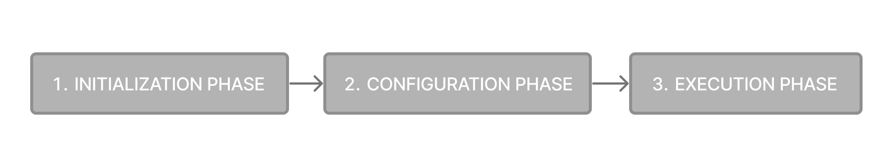
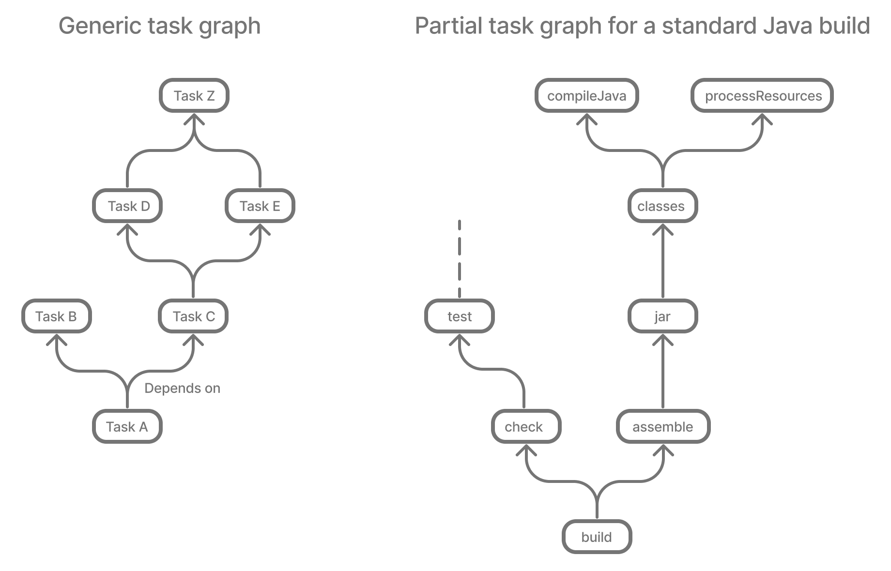

= Exploring Build Tools: Maven vs. Gradle

++++

++++

[.text-center]

'''

== Contents

1. link:#introduction-to-build-tools[Introduction to Build Tools]

2. link:#maven-the-convention-based-build-tools[Maven: The Convention-Based Build Tools]

3. link:#gradle-the-flexible-build-automation-tools[Gradle: The Flexible Build Automation Tool]

4. link:#feature-comparison-maven-vs-gradle[Feature Comparison: Maven vs. Gradle]

5. link:#local-and-remote-repository[Local and Remote Repository]

6. link:#maven-and-gradle-command-line-options[Maven and Gradle: Command-Line Options]

7. link:#advanced-build-configurations-with-maven-and-gradle[Advanced Build Configurations with Maven and Gradle]
8. link:#emerging-trends-in-build-automation-tools[Emerging trends in build automation tools]
8. link:#performance[Performance]
9. link:#resources[Resources]

'''

== [[introduction-to-build-tools]] 🔥 Introduction to Build Tools

=== 🌍 What are Build tools?

*Build tools* are an essential part of the software development lifecycle. They are specialized software that automates various tasks such as compiling source code into binary code, packaging binary code, running tests, and creating documentation among others.

A build tool streamlines the process of code compilation, ensuring that software builds are consistent and reproducible. It often supports dependency management, allowing developers to specify and integrate external libraries easily. Moreover, build tools can be integrated with continuous integration systems to enable automatic builds every time a change is made to the source code.

=== Key Advantages of Utilizing Build Tools

 🔑 **Automation:**

One of the most prominent benefits of build tools is their ability to automate repetitive tasks, thereby reducing manual errors and inefficiencies. This ensures consistent outcomes, even for complex projects.

 🔑 **Dependency Management:**

Modern applications often rely on a myriad of external libraries and frameworks. Build tools simplify the process of integrating these dependencies, ensuring the application remains functional and up-to-date.

 🔑 **Task Parallelism:**

Many advanced build tools can execute multiple tasks concurrently. This parallel processing significantly reduces build times, especially for larger projects.

 🔑 **Incremental Builds:**

Instead of compiling the entire application every time a change is made, build tools can detect modifications in the source code and only recompile the affected sections. This results in faster build times and quicker feedback loops.

 🔑 **CI/CD Integration:**

Continuous Integration and Continuous Deployment (CI/CD) have become staples in modern development practices. Build tools often come with native support for CI/CD pipelines, ensuring seamless integration, testing, and deployment of code changes.

'''

== [[maven-the-convention-based-build-tools]]❗ Maven: The Convention-Based Build Tools

*Maven* is a software project management build tool based on Project Object Model (POM). The tool is typically used for Java-based projects. Every Java project requires certain dependencies, which are automatically downloaded when running a Maven build. This simplifies everyday tasks for Java developers and helps them with their projects.

=== Five primary and most significant concepts of Maven:
[%collapsible]
.🧩Project Object Model (POM)
====

[cols="1", options="header"]
|===
|Description

| - Project Object Model (POM) refers to the XML files with all the information regarding project and configuration details
| - It contains the project description, as well as details regarding the versioning and configuration management of the project
| - The XML file is in the project home directory. Maven searches for the POM in the current directory when any given task needs to be executed
|===

====

[%collapsible]
.🧩Dependencies and repositories
====
[cols="1", options="header"]
|===
|Description

| - Dependencies refer to the Java libraries required for the project. Repositories refer to the directories of packaged JAR files.
| - If the dependencies are not present in your local repository, then Maven downloads them from a central repository and stores them in the local repository.
|===
====

[%collapsible]
.🧩Build life cycles, phases and goals
====
[cols="1", options="header"]
|===
|Description

| - This consists of a sequence of build phases, and each build phase consists of a series of goals.
| - When a process is executed, all purposes related to that phase and its plugins are also compiled.
|===

====

[%collapsible]
.🧩Build profiles
====
[cols="1", options="header"]
|===
|Description

| - This refers to the set of configuration values required to build a project using different configurations
| - Different build profiles are added to the POM files when enabling different builds
| - A build profile helps in customizing the build for different environments
|===

====

[%collapsible]
.🧩Build plugins
====
[cols="1", options="header"]
|===
|Description

| - A Maven plugin refers to the group of goals that may or may not be in the same phase
| - The plugins are used to perform a specific goal
| - Maven has its standard plugins that can be used. If desired, users can also implement their own in Java
|===
====

=== Maven Architecture

Maven follows a modular architecture designed to support various aspects of the software development lifecycle, including project management, dependency management, build automation, and reporting.

image::images/maven-arhitecure.png[width=30%]

Overall, Maven's architecture provides a flexible and extensible framework for managing software projects, automating builds, and streamlining the software development process. By leveraging its modular components and standardized conventions, developers can efficiently build, test, and deploy software projects of varying complexity.

=== Maven build lifecycle

The Maven Build Lifecycle consists of several predefined phases, organized into three main lifecycles: Clean, Default, and Site. Each phase represents a specific stage in the software development process, and Maven executes the phases sequentially.

*Clean Lifecycle:*

- The Clean Lifecycle is responsible for cleaning the project by removing any artifacts generated by previous builds.
- It consists of a single phase: clean.
- The clean phase deletes the target directory, which contains compiled classes, generated artifacts, and other build-related files.

*Default Lifecycle:*

- The Default Lifecycle is the primary build lifecycle and is used for compiling, testing, packaging, and deploying the project.
- It consists of several phases, including: validate, compile, test, package, verify, install, deploy

*Site Lifecycle:*

- The Site Lifecycle is used for generating project documentation and reports.
- It consists of several phases, including: pre-site, site, post-site, site-deploy.

Developers can execute lifecycle phases using Maven commands such as `mvn clean`, `mvn compile`, `mvn test`, `mvn package`, `mvn install`, and `mvn deploy`. Maven automatically executes all preceding phases when a specific phase is invoked, ensuring that tasks are executed in the correct order.

Additionally, developers can customize and extend the build process by defining custom lifecycle phases, binding goals to existing phases, or creating custom plugins to perform specialized tasks.

Overall, the Maven Build Lifecycle provides a standardized and predictable mechanism for automating the build process, enabling developers to efficiently manage and build software projects.

=== Phases of the build Lifecycle:

The *Maven Build Lifecycle* consists of several predefined phases, organized into three main lifecycles: Clean, Default, and Site. Each phase represents a specific stage in the software development process, and Maven executes the phases sequentially.

*For more information:*

'''

== [[gradle-the-flexible-build-automation-tools]]❗ Gradle: The Flexible Build Automation Tool

=== 🌍 What is Gradle?

*Gradle* is a build automation tool known for its flexibility to build software. A build automation tool is used to automate the creation of applications. The building process includes compiling, linking, and packaging the code. The process becomes more consistent with the help of build automation tools.

It is popular for its ability to build automation in languages like Java, Scala, Android, C/C++, and Groovy. The tool supports groovy-based Domain Specific Language over XML. Gradle provides building, testing, and deploying software on several platforms.

The tool is popular for building any software and large projects. Gradle includes the pros of Ant and Maven and curbs the cons of both.

=== Groovy-based DSL: Understanding Gradle's build scripts

Gradle uses a Groovy-based DSL (Domain Specific Language) for defining build scripts. This DSL allows developers to write build scripts in a concise and readable manner, leveraging Groovy's expressive syntax and language features.

=== Key aspects of Gradle's Groovy-based DSL include:

[%collapsible]
.🧩Declarative Syntax
====
[cols="1", options="header"]
|===
|Description

| Gradle build scripts are written in a declarative style, where developers declare what they want to achieve rather than specifying how to achieve it. This simplifies build script creation and maintenance.
|===
====

[%collapsible]
.🧩Convention over Configuration
====
[cols="1", options="header"]
|===
|Description

| Gradle follows the convention over configuration principle, providing sensible defaults and conventions for project organization and build configuration. Developers can adhere to these conventions or customize them as needed.
|===
====

[%collapsible]
.🧩DSL Extensions
====
[cols="1", options="header"]
|===
|Description

| Gradle's DSL provides extensions and methods for interacting with various aspects of the build process, such as defining tasks, configuring dependencies, and specifying build properties. These extensions make it easy to express complex build logic in a concise and readable manner.
|===
====

[%collapsible]
.🧩Programmatic Control
====
[cols="1", options="header"]
|===
|Description

| Gradle's DSL allows for programmatic control and manipulation of the build process. Developers can use Groovy's powerful language features, such as closures and method chaining, to dynamically configure build settings and tasks based on conditions or variables.
|===
====

=== Gradle's Build Lifecycle and Tasks

Gradle organizes the build process into a series of lifecycle phases, similar to Maven. Each phase represents a specific stage in the build process, and developers can define tasks to be executed during each phase.

💣 Phase 1. Initialization

Gradle initializes the project and evaluates the build script.

- Detects the settings.gradle(.kts) file.
- Creates a Settings instance.
- Evaluates the settings file to determine which projects (and included builds) make up the build.
- Creates a Project instance for every project.

💣 Phase 2. Configuration

Gradle configures the project by evaluating the build script and resolving dependencies. This phase determines the tasks and properties that will be executed during the build.

- Evaluates the build scripts, build.gradle(.kts), of every project participating in the build.
- Creates a task graph for requested tasks.

💣 Phase 3. Execution

Gradle executes the tasks defined in the build script according to their dependencies and execution order. Tasks can be executed in parallel to maximize performance.

- Schedules and executes the selected tasks.
- Dependencies between tasks determine execution order.
- Execution of tasks can occur in parallel.

*Gradle Task*

Tasks themselves consist of:

- *Actions:* pieces of work that do something, like copy files or compile source
- *Inputs:* values, files and directories that the actions use or operate on
- *Outputs:* files and directories that the actions modify or generate

Gradle builds the task graph before executing any task.

Across all projects in the build, tasks form a Directed Acyclic Graph (DAG).

This diagram shows two example task graphs, one abstract and the other concrete, with dependencies between tasks represented as arrows:

The capability of modelling any build process in graph of tasks makes gradle so flexible and extensible at the same time. Both plugins and build scripts contribute to the task graph via the task dependency mechanism and annotated inputs/outputs.

'''

== [[feature-comparison-maven-vs-gradle]] 💡Feature comparison: Maven vs. Gradle

Comparing Maven and Gradle involves examining their respective features, advantages, and limitations. Here's a feature comparison between Maven and Gradle:

[cols="1,1", options="header"]
|===
| *#Maven#* | *#Gradle#*

| - Maven uses XML for configuration, which can be verbose and less expressive.
| - Gradle uses a Groovy-based DSL (Domain Specific Language), which offers more flexibility and conciseness.

| - Maven follows a convention-over-configuration approach, which may limit flexibility in certain scenarios.
| - Provides more flexibility due to its powerful DSL and scripting capabilities, allowing for highly customizable build configurations.

| - Maven's performance can degrade in large projects due to its reliance on XML and lack of incremental build support.
| - Is known for its superior performance, especially in large-scale projects, thanks to features like incremental builds and parallel execution.

| - Has robust dependency management capabilities, with centralized dependency resolution and transitive dependency support.
| - Offers similar dependency management features as Maven but provides more flexibility in declaring dependencies and managing transitive dependencies.

| - Has a mature plugin ecosystem with a wide range of plugins available for various build tasks.
| - Has a rich plugin ecosystem, and its plugins are often more flexible and easier to customize due to Gradle's scripting capabilities.

| - Supports multi-module projects but can be less flexible when managing dependencies between modules.
| - Gradle excels at managing multi-project builds, offering better support for handling dependencies between modules and sharing configuration across projects.

| - Maven lacks built-in support for incremental builds, which can lead to longer build times, especially in large projects.
| - Supports incremental builds, where only modified parts of the project are recompiled, resulting in faster build times for subsequent builds.

| - Maven is less commonly used for Android development compared to Gradle.
| - Gradle is the preferred build system for Android development, offering specific tooling and optimizations for building Android apps.

| - Maven has been widely adopted in the Java community for many years and has a large user base.
| - Gradle's popularity has been steadily growing, especially in more recent years, and it has gained traction beyond the Java ecosystem.
|===

*In summary*, both Maven and Gradle are powerful build automation tools with their own set of strengths and weaknesses. Maven is more convention-driven and is well-established in the Java ecosystem, while Gradle offers more flexibility and performance enhancements, making it a preferred choice for many modern projects, especially those with complex requirements or large-scale builds. Ultimately, the choice between Maven and Gradle depends on factors such as project requirements, familiarity with the tools, and team preferences.

> Real-World Examples of Maven and Gradle Usage

*Maven:*

- Apache Software Foundation
- Spring Framework
- Netflix

*Gradle:*

- Google Android
- LinkedIn
- Uber

'''

== [[local-and-remote-repository]]💡 Local and Remote Repository

In the realm of software development, repositories play a pivotal role in managing dependencies, storing artifacts, and facilitating collaboration among developers. Understanding the concepts of local and remote repositories is crucial for ensuring efficient software development processes.

=== ✅ Local Repository

In Maven and Gradle, the creation of folders in the local repository is automatically handled by the respective tools and is based on the group ID of the artifacts.

Generally, the directory structure in the local repository is inverted to reflect the group name of the dependencies. Thus, dependencies are grouped based on their group name, making it easy to navigate and manage dependencies within the local repository.

Here's an illustration of how directories are created in the local repository, using Maven as an example:

.  If you have a dependency with the group name *org.example* and the artifact my-artifact, Maven will create directories as follows:

+
[source,bash]
----
~/.m2/repository/org/example/my-artifact/
----

+
All artifacts with the group name *org.example* will be placed inside a directory org, then inside a directory example, and finally inside a directory with the artifact name my-artifact.

.  Similarly, for a dependency with the group name *com.example* and the artifact another-artifact, the directories would be:

+
[source,bash]
----
~/.m2/repository/com/example/another-artifact/
----

All artifacts with the group name *com.example* will be placed inside a directory com, then inside a directory example, and finally inside a directory with the artifact name another-artifact.

=== ✅ Remote repository

- Links to remote repositories:

To access remote repositories, you need to add the appropriate links in your project's configuration files. For example, in Maven, this is typically done in the *pom.xml* file, and in Gradle, in the *build.gradle* file. In addition to Maven Central, there are other public or private remote repositories where you can access artifacts. To add a remote repository in Maven, you can use the following code in the *pom.xml* file:

[source,xml]
----
<repositories>
    <repository>
        <id>myRepo</id>
        <url>http://example.com/repository</url>
    </repository>
</repositories>
----

- For Gradle, you can add a remote repository in *build.gradle* like this:

[source,groovy]
----
repositories {
  maven {
    url 'http://example.com/repository'
  }
}
----

Replace http://example.com/repository with the actual URL of the remote repository you want to access.

=== ✅ Seamless Build Management with Gradle/Maven in IntelliJ IDEA

In IntelliJ IDEA, *Maven* is implicitly set as one of the build tools, which means the IDE has access to Maven and can automatically execute Maven commands for your project. This makes working with Maven projects easier, as the IDE can automatically handle dependencies, building, and other Maven-related aspects.

[.green]
*If you install a specific version of Maven on your system and want to use it in IntelliJ IDEA, you need to specify it in your project settings. Here are the steps to do so:*

- Open the project in IntelliJ IDEA.
- Navigate to File -> Project Structure.
- In the Project Structure window, select SDKs under Platform Settings from the left panel.
- Click the "+" button in the top right and select "Maven".
- Choose the directory where the specific version of Maven is installed and click "OK".

By specifying the Maven version in the project settings, IntelliJ IDEA will use that version to build and manage your Maven project. This ensures consistency between the Maven version used in IntelliJ IDEA and the one installed on your system.

[.green]
*IntelliJ IDEA provides seamless integration with Gradle, offering developers a powerful environment for building, managing, and running Gradle-based projects.*

🔑 IntelliJ IDEA comes with built-in support for Gradle, allowing developers to import, create, and work with Gradle projects effortlessly.
🔑 IntelliJ IDEA allows developers to configure and execute Gradle tasks directly from the IDE. Developers can create custom build configurations, specify Gradle tasks to run, and define task arguments or options.
🔑 If you install a specific version of Gradle on your system and want to use it in IntelliJ IDEA, you need to specify the Gradle version in your project settings.
🔑 Developers can view, run, and manage Gradle tasks using the Gradle tool window or the Run/Debug configurations.

'''

== [[maven-and-gradle-command-line-options]]💡Maven and Gradle: Command-Line Options

🚀 In *Maven*, command-line options provide a convenient way to customize the build process, adjust configurations, and control various aspects of the project's lifecycle. Understanding and utilizing these options effectively can streamline development workflows and improve efficiency. Let's explore some common Maven command-line options:

. -DskipTests

+
The *-DskipTests* option allows skipping the execution of tests during the build process. By specifying this option, Maven will compile and package the project without running any unit tests.

+
[source,bash]
----
mvn install -DskipTests
----

+
. -P'yourProfile'
+
The *-P'yourProfile'* option is used to activate a specific Maven profile during the build process. Profiles in Maven enable you to define custom configurations or settings for different environments or build scenarios.
+
[source,bash]
----
mvn clean install -Pproduction
----

+
.  -DpropertyName=propertyValue
+
The *-DpropertyName=propertyValue* option is used to set system properties during the build process. Custom properties can be defined and used in Maven configuration or plugins.
+
[source,bash]
----
mvn clean install -Dmaven.test.skip=true
----

.  mvn install -U
+
-U: This option is used to force Maven to update snapshots from remote repositories, even if they are up-to-date locally. It ensures that the latest snapshot versions are retrieved.
+
. mvn install -X
+
-X: This option is used to enable debug mode, which displays debugging information during the Maven build process. It provides more detailed output for troubleshooting build issues.

🚀 In *Gradle*, command-line options provide a flexible way to customize the build process, adjust configurations, and control various aspects of the project's lifecycle. Leveraging these options effectively can streamline development workflows and improve efficiency. Let's explore some common Gradle command-line options:

.  -x test
+
The *-x test* option allows skipping the execution of tests during the build process. By specifying this option, Gradle will compile and package the project without running any unit tests.
+
[source,bash]
----
./gradlew build -x test
----

.  -P'yourProperty'
+
The *-P'yourProperty'* option is used to pass project properties to the Gradle build script. These properties can be accessed and utilized within the build script for customization or configuration purposes.
+
[source,bash]
----
./gradlew build -Penvironment=production
----
+
. --rerun-tasks
+
The *--rerun-tasks* option is used to rerun tasks that have already been executed in previous builds. It forces Gradle to execute all tasks, regardless of whether they are up-to-date or not.
+
[source,bash]
----
./gradlew build --rerun-tasks
----
+
.  -D'systemProperty=value'
+
The *-D'systemProperty=value'* option is used to set system properties during the Gradle build process. Similar to Maven's -D option, this allows developers to pass parameters to the build script or configure the environment dynamically.
+
[source,bash]
----
./gradlew build -Denv=production
----
+
.  --stacktrace
+
The *--stacktrace* option is used to display the full stack trace of any exceptions that occur during the Gradle build process. It provides detailed information about the cause of the error, making it easier to diagnose and debug build failures.
+
[source,bash]
----
./gradlew build --stacktrace
----

'''

== [[advanced-build-configurations-with-maven-and-gradle]] Advanced build configurations with Maven and Gradle

Both Maven and Gradle offer advanced build configuration options to handle complex scenarios and customize the build process according to project requirements. Below, I'll outline some advanced build configurations that you can achieve with both Maven and Gradle:

=== 💻 Advanced Build Configurations with Maven:

[.green]
Resource Filtering:

Maven allows resource filtering to replace placeholders in resource files with project-specific values. This is useful for managing configuration files across different environments (e.g., development, testing, production).

*Example:*

You can use resource filtering to replace placeholders in resource files with project-specific values. For example, let's say you have a config.properties file with placeholders for environment-specific values:

[source,xml]
----
<build>
    <resources>
        <resource>
            <directory>src/main/resources</directory>
            <filtering>true</filtering>
            <includes>
                <include>**/*.properties</include>
            </includes>
        </resource>
    </resources>
</build>
----

Then, in your config.properties file:

[source,properties]
----
# Database configuration
db.url=@database.url@
db.username=@database.username@
db.password=@database.password@
----

[.green]
Profile Activation:

You can activate Maven profiles based on various conditions such as JDK version or environment variables. For example, let's say you have a profile that is activated when a specific environment variable is set:

[source,xml]
----
<profiles>
    <profile>
        <id>custom-env</id>
        <activation>
            <property>
                <name>env</name>
                <value>custom</value>
            </property>
        </activation>
        <!-- Profile-specific configuration -->
    </profile>
</profiles>
----

=== 💻 Advanced Build Configurations with Gradle:

[.green]
Custom Tasks:

You can define custom tasks to perform specific actions as part of the build process. For example, let's say you want to create a task to generate API documentation using Swagger:

[source,groovy]
----
task generateApiDocs(type: Exec) {
    commandLine 'swagger', 'generate', 'docs', '-i', 'src/main/resources/swagger.yaml', '-o', 'build/api-docs'
}
----

[.green]
Configuration Rules:

You can define configuration rules to control how project settings are applied. For example, let's say you want to enforce a specific code style for your project:

[source,groovy]
----
allprojects {
    apply plugin: 'java'

    tasks.withType(JavaCompile) {
        options.encoding = 'UTF-8'
        options.compilerArgs << '-Xlint:unchecked' // Enable compiler warnings
    }
}
----

'''

== [[emerging-trends-in-build-automation-tools]] 🚀Emerging trends in build automation tools

> *Containerization:* Increasing adoption of containerization technologies such as Docker and Kubernetes is influencing build automation practices. Build tools are evolving to better integrate with containerized environments and support building and packaging container images.

> *Cloud-Native Development:* Cloud-native development practices, including microservices architecture and infrastructure-as-code, are driving demand for more flexible and scalable build automation solutions. Build tools are evolving to support cloud-native development workflows and environments.

> *Machine Learning and AI:* The use of machine learning and artificial intelligence techniques in software development is influencing build automation tools. Tools are incorporating AI-driven features to optimize build processes, predict build failures, and suggest performance improvements.

=== ✅ Key features of Maven:

- Simple project setup that follows best practices - get a new project or module started in seconds
- Consistent usage across all projects - means no ramp up time for new developers coming onto a project
- Superior dependency management including automatic updating, dependency closures (also known as transitive dependencies)
- Model based builds: Maven is able to build any number of projects into predefined output types such as a JAR, WAR, or distribution based on metadata about the project, without the need to do any scripting in most cases.
- Instant access to new features with little or no extra configuration
- Extensible, with the ability to easily write plugins in Java or scripting languages
- Able to easily work with multiple projects at the same time

=== ✅ Key features of Gradle:

- Powerful language features, such as closures, dynamic typing, and metaprogramming, allow for flexible and readable build scripts.
- Supports incremental builds, where only modified parts of the project are recompiled or reprocessed.
- Build scripts follow a declarative approach, where developers specify what should be done rather than how to do it
- Offers robust dependency management capabilities, allowing developers to declare and manage project dependencies easily.
- Rich plugin ecosystem, with a wide range of plugins available for extending its functionality.
- Integrates seamlessly with popular IDEs (Integrated Development Environments) such as IntelliJ IDEA, Eclipse, and Android Studio.

'''

== [[performance]] 🚀Performance
Improving build time is one of the most direct ways to ship faster. Both Gradle and Maven employ some form of parallel project building and parallel dependency resolution. The biggest differences are Gradle's mechanisms for work avoidance and incrementality. The top 3 features that make Gradle much faster than Maven are:

- [.green]*Incrementality* — Gradle avoids work by tracking input and output of tasks and only running what is necessary, and only processing files that changed when possible.

- [.green]*Build Cache* — Reuses the build outputs of any other Gradle build with the same inputs, including between machines.

- [.green]*Gradle Daemon* — A long-lived process that keeps build information "hot" in memory.

[.text-center]
image::images/maven_gradle2.png[width=60%]

These and more performance features make Gradle at least twice as fast for nearly every scenario (100x faster for large builds using the build cache) in this Gradle vs Maven performance comparison.

*Note:* _Both Gradle and Maven users can take advantage of the Build Cache technology available in Develocity. Gradle users typically experience an additional build time reduction of ~50%, while Maven users often experience reductions of ~90%._

== [[resources]] Resources

=== Maven

1. https://www.simplilearn.com/tutorials/maven-tutorial/introduction-to-maven
2. https://www.searchmyexpert.com/resources/software-development/build-tools
3. https://www.jetbrains.com/guide/java/tutorials/working-with-maven/maven-tool-window/
4. https://maven.apache.org/maven-features.html
5. https://www.baeldung.com/maven-local-repository
6. https://docs.jivesoftware.com/jive_sbs/5.0/developer/MavenCommandLineCheatsheet.html

=== Gradle

1. https://www.simplilearn.com/tutorials/gradle-tutorial/what-is-gradle
2. https://docs.gradle.org/current/userguide/build_lifecycle.html
3. https://blog.devgenius.io/understanding-gradle-and-build-automation-tools-4d2fa7d09d20
4. https://docs.gradle.org/current/userguide/declaring_repositories.html
5. https://docs.gradle.org/current/userguide/command_line_interface_basics.html
6. https://gradle.org/maven-vs-gradle/

Copyright © 2024 by Liurca Andreea, Iurii Rusakov