<p style="font-size: 45px; text-align: center;">
<strong> Exploring Build Tool: Gradle </strong>
</p>

<div style="text-align: center;">
    
</div>

<h2 style="text-align: center;"> Creating a Gradle project </h2>

Let's create a new Gradle project. From the Welcome Screen select New Project, or if you already have an IntelliJ IDEA project open, select File -> New -> Project...

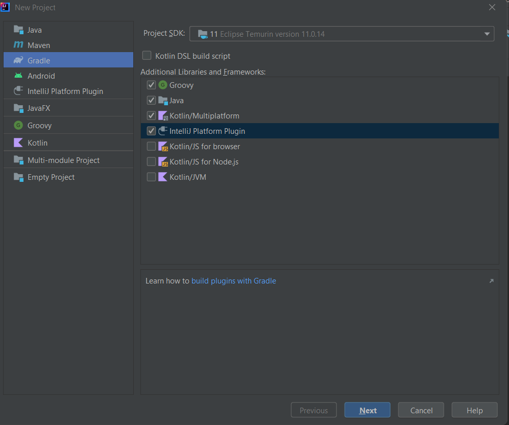

- You need to give the project a name, and you can optionally set the location. If you click on Artifact Coordinates you'll see more Gradle settings.

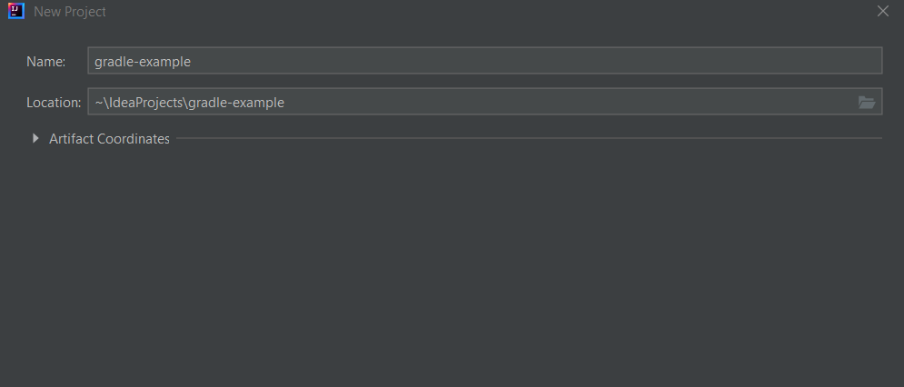

- Press Finish, and IntelliJ IDEA will generate the Gradle <strong> build.gradle <strong> for you.

<h2 style="text-align: center;"> Various configurations and manipulations  </h2>

<strong> Plugin Application: </strong> 

Apply various plugins to extend the functionality of your build script.

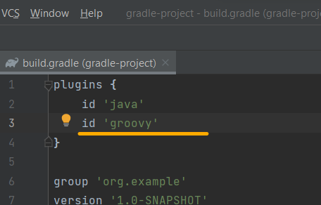

- 🧩This block applies three plugins to the project: java, groovy, and application.
- 🧩The java plugin adds support for compiling and running Java code.
- 🧩The groovy plugin adds support for compiling and running Groovy code.
- 🧩The application plugin adds tasks for running the application.

IntelliJ IDEA is aware of the plugin's source sets and their directories. Go to the project window and create a new directory in the "main" folder, using ⌘N (macOS) / Alt+Insert (Windows/Linux) and selecting "Directory".

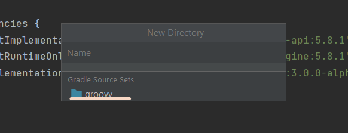

IntelliJ IDEA suggests a folder called "groovy" from the list of Gradle source sets. This is coloured blue as it's known to be a source set for production code.

```groovy
plugins {
    id 'java'
    id 'groovy'
}
```

<strong> Project Configuration: </strong> When we create the project, we can see the groupID and version number are set in the build.gradle file.

```groovy
group 'org.example'
version '1.0-SNAPSHOT'
```

<strong> Repositories: </strong>

```groovy
repositories {
    mavenCentral()
}
```

- 🧩Configures the project to use Maven Central as the repository for fetching dependencies.

<strong> Source Sets: </strong>

```groovy
sourceSets {
    main {
        // Configure main source directories
        java {
            srcDirs 'src/main/java'
        }
        resources {
            srcDirs 'src/main/resources'
        }
    }
    test {
        java {
            // Configure test source directories
            srcDirs 'src/test/java'
        }
        resources {
            srcDirs 'src/test/resources'
        }
    }
}
```

- 💻Defines source sets for the main and test source code directories.
- 💻Specifies where the main and test Java and resources files are located.


<strong> Package prefix: </strong>

```groovy
String basePackage = 'org.example.gradleproject'
```

- 💻Defines a variable basePackage with the package prefix for the project.


<strong> Applying Dependency Configurations: </strong>

```groovy
apply from: rootProject.file('buildsystem/dependencies.gradle')
```

- Applies configurations defined in dependencies.gradle script located in the buildsystem directory.
- The apply from: statement should reference the correct path to the dependency.gradle file relative to the root of your project.


<strong> Dependencies: </strong>

Declare dependencies required by your project. You can specify dependencies for compilation, testing, and runtime.

```groovy
dependencies {
    
    implementation 'org.apache.logging.log4j:log4j-core:3.0.0-alpha1'

    implementation 'org.springframework:spring-core:5.3.15' // Example dependency for compilation
    implementation 'com.google.guava:guava:31.1-jre' // Another example dependency

    implementation 'org.apache.commons:commons-lang3:3.12.0' // Example runtime dependency
    implementation 'mysql:mysql-connector-java:8.0.33' // Another example runtime dependency
}
```

- 🚀Declares dependencies for the project, including both implementation and test dependencies.
- 🚀testDependencies.testSlf4j references dependencies defined in dependencies.gradle.


Add dependencies:

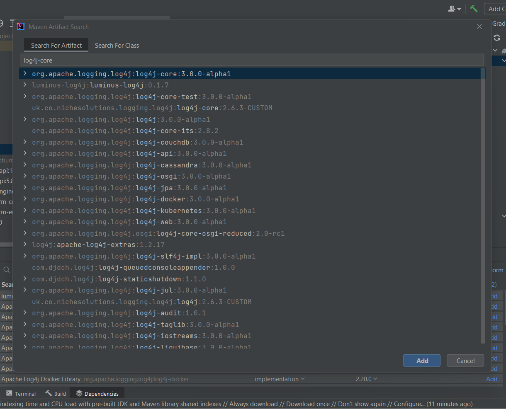

- verify that in gradle.build the dependencies was added

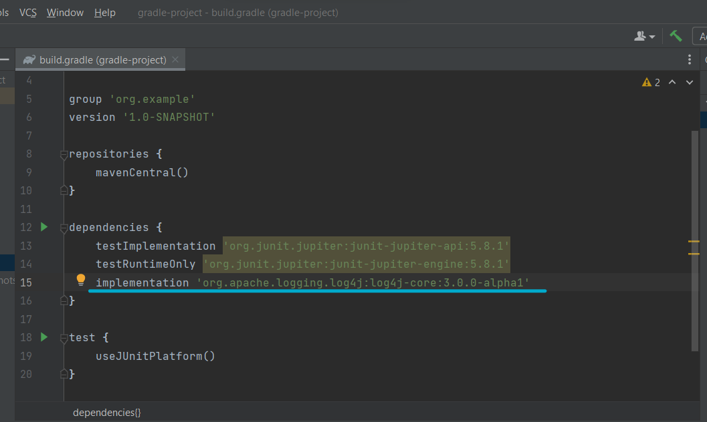

- We can add dependencies using Alt + Insert, or we can add it manually. IntelliJ IDEA will insert the new dependency, usually with the implementation configuration:

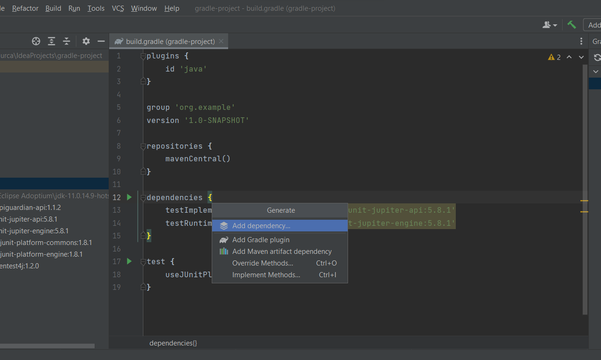

- We can view dependencies in the Gradle tab

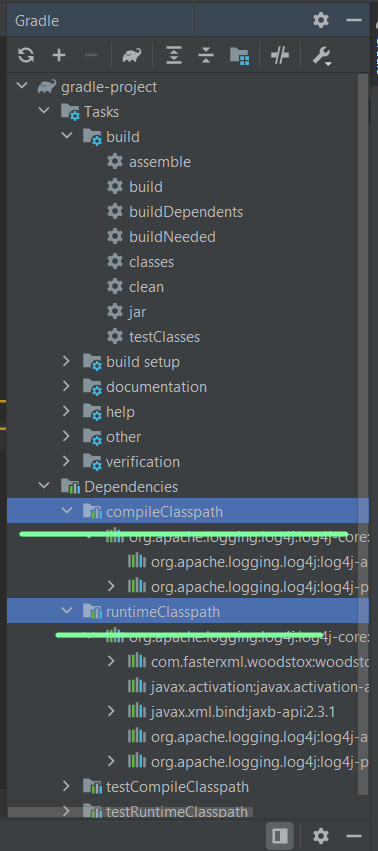

<br> 
<strong> Testing Configuration: </strong>


- 🚀In order for Gradle to run JUnit 5 tests, the test section of the build.gradle file needs to say useJUnitPlatform, so IntelliJ IDEA has generated this for us too.

```groovy
test {
    useJUnitPlatform()
}
```

<strong> Application Configuration: </strong>

```groovy
application {
    mainClassName = 'org.example.gradleproject/main'
}
```

- 🚀Specifies the main class for the application to be used when running with the application plugin.

<strong> Customizing Running Task: </strong>

```groovy
run {
def env = project.hasProperty('env') ? project.getProperty('env') : 'dev'

    if (env == 'dev') {
        args = ['--config=dev']
        systemProperty 'env', 'dev'
        // Other configurations for the 'dev' environment
    } else if (env == 'prod') {
        args = ['--config=prod']
        systemProperty 'env', 'prod'
        // Other configurations for the 'prod' environment
    } else {
        throw new IllegalArgumentException("Unsupported environment: $env")
    }

    // Specify test JVM arguments
    jvmArgs '-Xmx512m'
}
```

- 🚀Customizes the run task based on the environment specified via the -Penv option when running Gradle commands.
- 🚀Sets command-line arguments and system properties based on the environment.


<h2 style="text-align: center;"> Create modules and config them </h2>

- 🔑Creating three modules 

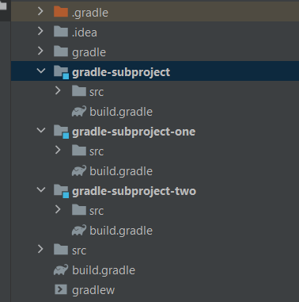

- 🔑In project build.gradle (gradle-subproject-one) we create dependency between <strong> gradle-subproject-one</strong> and <strong> gradle-subproject-two</strong>

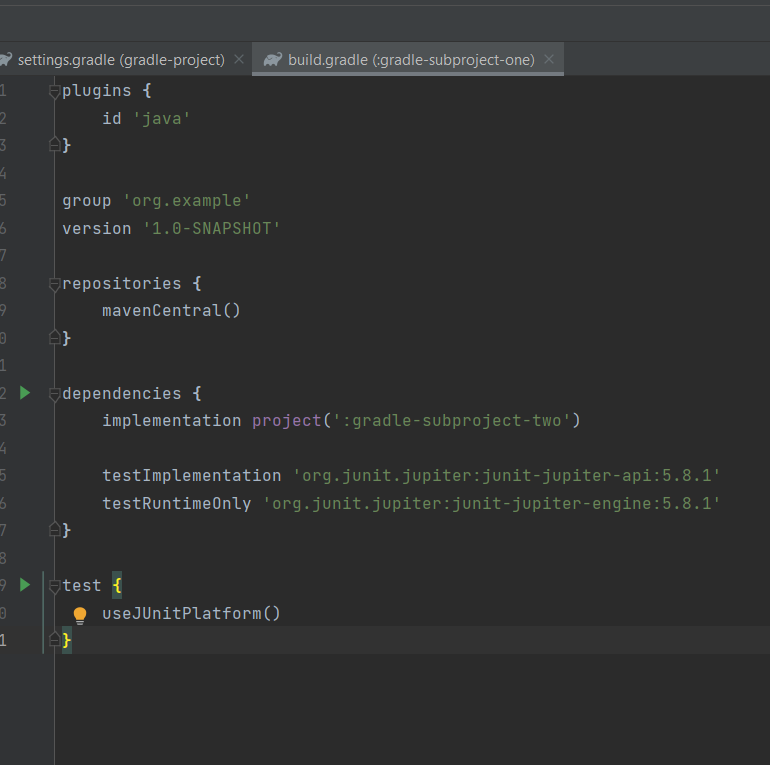

- 🔑We can view task and dependencies in the Gradle tab menu

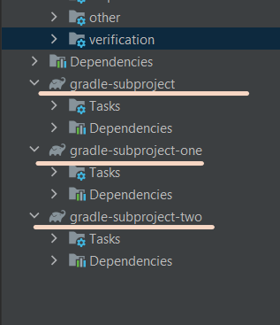

In the <strong> settings.gradle </strong> we need to mention the root project and the modules that are included in that root project 

```groovy
rootProject.name = 'gradle-project'
include 'gradle-subproject', 'gradle-subproject-one', 'gradle-subproject-two'
```

- Added a new gradle field <strong> "dependencies.gradle" </strong> in root project. In this gradle file, its created a list of dependencies. 

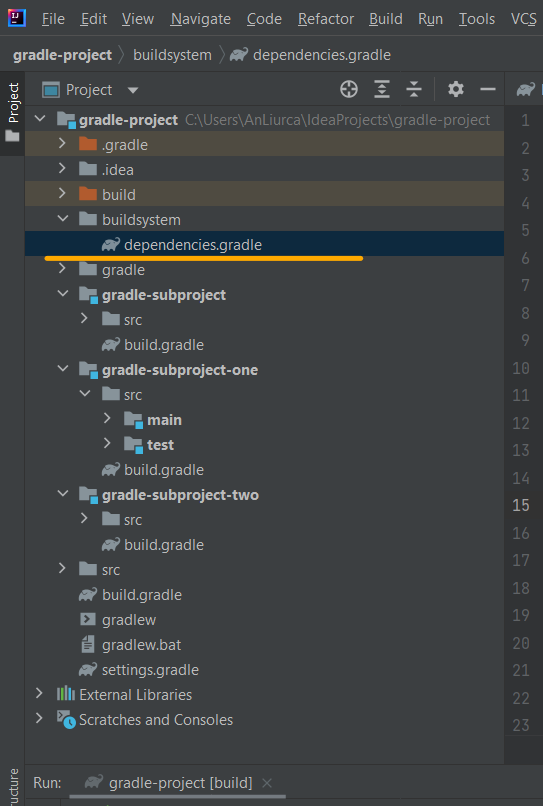

```groovy
allprojects {
    repositories {
        mavenCentral()
    }
}

ext {

    def slf4jVersion = "1.7.32"
    def springCore = "5.3.15"
    def googleGuava ="31.1-jre"
    def commonsLang="3.12.0"
    def mysqlConnector = "8.0.33"

    ext.testDependencies = [
            testSlf4j: "org.slf4j:slf4j-api:${slf4jVersion}",
            testSpringCore: "org.springframework:spring-core:${springCore}",
            testGoogleGuava:"com.google.guava:guava:${googleGuava}",
            testCommonsLang:"org.apache.commons:commons-lang3:${commonsLang}",
            testMysqlConnector:"mysql:mysql-connector-java:${mysqlConnector}"
    ]
}
```

Ensure that the dependency.gradle file is located in the correct directory and that its path is correctly referenced in the <strong> build.gradle </strong> file of your <strong> gradle-subproject-one </strong> module.

And dependencies will look now in this way: 


```groovy
dependencies {

    implementation testDependencies.testSlf4j
    implementation testDependencies.testSpringCore
    implementation testDependencies.testGoogleGuava
    implementation testDependencies.testCommonsLang
    implementation testDependencies.testMysqlConnector
}
```

