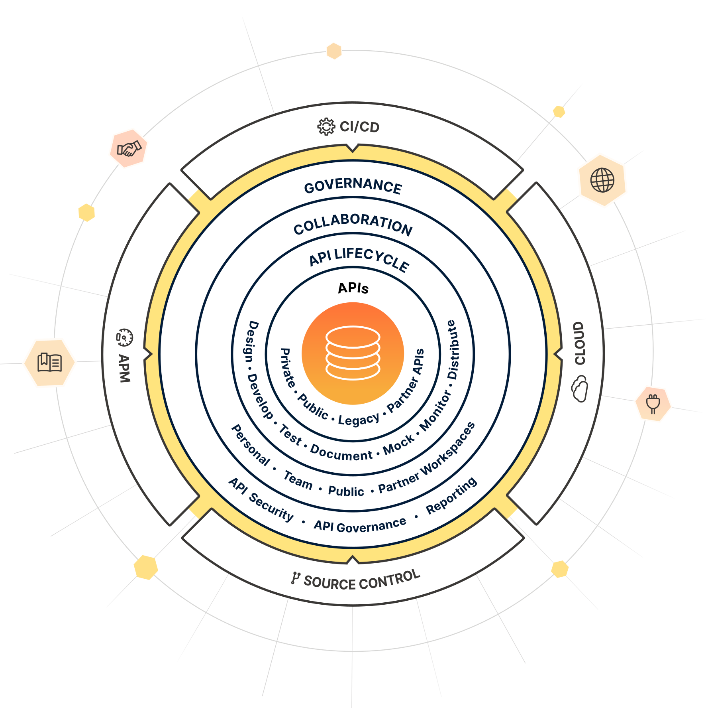

= Postman basic
Liudmila Topal <liudmila.topal@endava.com>
3.0, July 29, 2022: AsciiDoc article template
:toc:
:icons: font
:url-quickref: https://docs.asciidoctor.org/asciidoc/latest/syntax-quick-reference/

====
Postman is an https://www.postman.com/api-platform/[API platform] for building and using APIs.
====

Postman simplifies each step of the API lifecycle and streamlines collaboration, so you can create better APIs - faster.

=== Terminologies Related to Postman
API:: _Application Programming Interface_ is software that acts as an intermediary for two apps to communicate with each other.
+
We use APIs whenever we use an application like Twitter, Facebook, sending text messages, or checking the weather over the phone.

HTTP:: _Hypertext Transfer Protocol_ is the collection of rules for the transmission of data on the World Wide Web,
like graphic images, text, video, sound, and other multimedia data.
+
The Web users implicitly make use of HTTP as soon as they open their Web browser.

=== Why use Postman?
Postman is based on a wide range of extremely user-friendly power tools.

TIP: For more than 8 million users, Postman has become a tool of convenience.

*Following are the reasons why Postman is used:*

* *Accessibility:* one can use it anywhere after installing Postman into the device by simply logging in to the account.
* *Use Collections:* Postman allows users to build collections for their _API-calls_. Every set can create multiple requests and subfolders.
+
It will help to organize the test suites.
* *Test development:* to test checkpoints, verification of successful _HTTP response status_ shall be added to every _API - calls_.
* *Automation Testing:* tests can be performed in several repetitions or iterations by using _the Collection Runner_ or _Newman_,
which saves time for repeated tests.
* *Creating Environments:* the design of multiple environments results in less replication of tests as one can use the same collection but for a different setting.
* *Debugging:* to _effectively_ debug the tests, the postman console helps to track what data is being retrieved.
* *Collaboration:* you can import or export collections and environments to enhance the sharing of files.
+
You may also use a direct connection to share the collections.
* *Continuous integration:* it can support continuous integration.