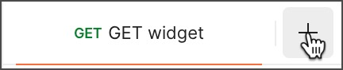

= Navigating Postman
Liudmila Topal <liudmila.topal@endava.com>
:toc:
:icons: font
:url-quickref: https://docs.asciidoctor.org/asciidoc/latest/syntax-quick-reference/

This guide is a high-level overview of Postman's primary interface areas:

* link:#header[Header]
* link:#slidebar[Sidebar]
* link:#workbench[Workbench]
** link:#tabs[Tabs]
** link:#rightSidebar[Right sidebar]
** link:#envSelector[Environment selector and environment quick look]
** link:#help[Quick Help]
* link:#footer[Footer]

=== [[header]]Header
The header enables you to create workspaces, access reports, explore the Postman API Network, search in Postman,
view sync status and notifications, and access your settings, account, and https://learning.postman.com/docs/billing/buying/[Postman plan].

* *← →* - _(Available on the Postman desktop app)_ Navigate backward and forward through pages you've visited within Postman.
+

* *Home* - Go to your personal home page, which includes your recently visited workspaces, and links to resources for https://learning.postman.com/docs/collaborating-in-postman/working-with-your-team/team-collaboration/[your team] if applicable.
* *Workspaces* - Search for workspaces, view your recently visited workspaces, or https://learning.postman.com/docs/getting-started/first-steps/creating-your-first-workspace/[create a new workspace].
* *API Network* - Explore the https://learning.postman.com/docs/getting-started/first-steps/exploring-public-api-network/[Postman API Network] and access your team's https://learning.postman.com/docs/collaborating-in-postman/private-api-network/adding-private-network/[Private API Network].
*  *Search Postman* - Search all workspaces, collections, requests, APIs, Flows, and teams in Postman.
+
TIP: For more details on searching in Postman, see link:#search[Search Postman].
+

* *Invite* - If you have an https://learning.postman.com/docs/collaborating-in-postman/roles-and-permissions/#workspace-roles[Admin role] on a workspace, you can invite other users to collaborate.
+

* image:resource/icon-settings-v9.jpg[25, 25] *Settings* - Access https://learning.postman.com/docs/getting-started/installation/settings/[Postman settings] and other Postman resources.
*  *Notifications* - View recent activity from your team, get notifications about Postman updates, and see pull requests, comment activity, and other important information.
* *Your avatar* - View your profile, access your https://learning.postman.com/docs/getting-started/installation/postman-account/[account and notification settings], see all active sessions for your account, or sign out of your account.
* *Team* _(paid plans)_ or *Upgrade* _(free plan)_ - View https://learning.postman.com/docs/billing/resource-usage/[resource usage] and access your https://learning.postman.com/docs/billing/billing/[billing dashboard] and other account management tools.

==== [[search]]Search Postman
To search in Postman ->  select _'Search Postman'_ in the header then enter your search terms.

TIP: You can also use the keyboard shortcut *⌘ + K* or *Ctrl + K*.

To change the scope of your search -> select the scope dropdown list to the left of the search bar.

===== You can:

* search all of Postman, your team, the Private API Network, and the Postman API Network.
* specify the element type you'd like to search for, such as Workspaces, Collections, or Teams.

===== Depending on the element type, the search results contain different information:
* For _workspaces_, the search result shows the workspace type, summary, who published it, and when was it published.
* For _collections_, the search result shows the workspace type, whether the collection is a fork or not, who published it, and when was it published.
* For _APIs_, the search result shows the name and summary of the API, the API's owner (either an individual user or a team), and the workspace type.
* For _teams_, the search result shows the name and summary of the team. Selecting the team name redirects you to the team profile.

=== [[slidebar]]Sidebar
The Postman sidebar provides access to the fundamental elements of Postman:

* link:6_Postman_collections.adoc[Collections]
* https://learning.postman.com/docs/designing-and-developing-your-api/creating-an-api/[APIs]
* xref:5_Send_requests.adoc[Environments]
* https://learning.postman.com/docs/designing-and-developing-your-api/mocking-data/setting-up-mock/[Mock servers]
* https://learning.postman.com/docs/monitoring-your-api/intro-monitors/[Monitors]
* https://learning.postman.com/docs/postman-flows/overview/[Flows]
* link:#history[History]

[NOTE]
====
To see the task options that are available for elements in the sidebar, hover over the element's name then select the
_'More actions icon'_ image:resource/icon-three-dots-v9.jpg[25, 25].

The task options will vary depending on the type of element.
====

==== Add elements to the sidebar
By default, the sidebar shows only _Collections, Environments, and History_.

TIP: You can add other elements to the sidebar including Flows, Environments, and Monitors.

To add an element to the sidebar, do the following:

. In your workspaces sidebar, select the Configure workspace sidebar icon 
. In *Workspace settings*, select the toggle  next to the element you want to add to the sidebar.
+

==== [[history]] History
To access the requests you've made -> select _'History'_ in the sidebar -> you're signed in to Postman, your history syncs across your devices.

Select a request to open it again in a new tab -> select more than one request, select and hold *⌘* or *Ctrl*, then select the requests.

[NOTE]
====
Your history also includes _collection runs_.
====
These remain as the summarized version of the run and aren't logged as single requests:

* Select the add icon *+* to save the request to a collection.
* Select the delete icon  to remove the request from your history.
* Select the more actions icon image:resource/icon-three-dots-v9.jpg[25, 25] to access other actions, including creating a monitor, documentation, or mock server for the request.

==== Clearing your history
_To remove all requests from your history_ -> select the more actions icon image:resource/icon-three-dots-v9.jpg[25, 25] next to the History search bar -> select Clear all.

==== Saving responses in history
To save request responses in your history -> select the more actions icon image:resource/icon-three-dots-v9.jpg[25, 25] next to the History search bar -> turn on Save Responses.

=== [[workbench]]Workbench
Whether you're working with a collection, an API, or another element type, the Postman workbench is where you do the majority of your work.

* link:#tabs[Tabs] enable you to organize your work, while the right sidebar gives you access to element-specific tools like documentation.
* link:#envSelector[The environment selector and environment quick look] enable you to manage variables.

==== [[tabs]]Tabs
====
Tabs allow you to organize and work between requests.
====

===== Opening a new tab
To open a new tab, select *+* in the workbench.

TIP: You can also select *⌘ + T* or *Ctrl + T* to open a new tab.

===== Saving or discarding changes
[NOTE]
====
If a tab has unsaved changes, Postman displays a dot next to the tab name.
====
* Select *Save* icon image:resource/icon-save.jpg[20, 20] Save to save the changes.
* To close the tab and discard changes, select the close icon  then select** Don't save**.

===== Renaming and linking elements
TIP: To rename an element, select the element's name and enter a new name.

_To copy a link to an element_ -> hover over the element's name in the workbench to display the link icon
.
Select the link icon to copy the element's URL to your clipboard.

==== Managing tabs
To manage your open tabs, right-click the open tab to activate a menu with action options:

* *Duplicate Tab* - _(Available on the Postman desktop app)_ Duplicates the current tab.
This doesn't create a copy of the request, so when you duplicate a tab any edits you make are reflected in the original request.
* *Close Tab* - Closes the current tab. If the tab has unsaved changes, Postman asks if you want to save before closing.
* *Force Close Tab* - Closes the current tab without saving any changes.
* *Close Other Tabs* - Closes all tabs except the one you're working in.
* *Close All Tabs* - Closes all tabs. If any tabs contain unsaved changes, Postman will ask if you want to save before closing.
* *Force Close All Tabs* - Closes all tabs without saving any changes.
+

TIP: If you have a lot of tabs open, they might overflow the area of the tab bar.

==== [[rightSidebar]]Right sidebar
The right sidebar gives you access to more tools, including documentation,
comments, code snippets, and request information, based on which kind of Postman element you select.

.Right sidebar tabs
[cols="1,1,2"]
|===
|Tool |Available for |Description

|Documentation 
|Requests
|View the https://learning.postman.com/docs/publishing-your-api/document-a-collection/[documentation] for a specific request.

|Comments 
|Collections, requests, APIs
|Leave https://learning.postman.com/docs/collaborating-in-postman/working-with-your-team/discussing-your-work/[comments] on a specific part of a request or an API.

|Code 
|Requests, APIs, history
|Generate https://learning.postman.com/docs/sending-requests/create-requests/generate-code-snippets/[code snippets] in a variety of languages and frameworks that you can use in other apps.

|Related requests 
|Requests, history
|View https://learning.postman.com/docs/sending-requests/create-requests/request-basics/#leverage-public-api-examples[public requests] from verified or popular collections on the Postman API Network that are related to your request.

|Info 
|Collections, requests, APIs, environments, mock servers, monitors, Flows
|See details about the element, including its ID, when it was created, who created it, and more.

|Changelog 
|Collections, APIs
|Use the https://learning.postman.com/docs/collaborating-in-postman/using-workspaces/changelog-and-restoring-collections/#viewing-collection-activity[changelog] to see changes that you and your collaborators have made.

|Pull requests 
|Collections, environments
|View any pull requests for a https://learning.postman.com/docs/collaborating-in-postman/using-version-control/creating-pull-requests/[Postman element].

|Forks 
|Collections, environments, Flows
|View any https://learning.postman.com/docs/collaborating-in-postman/using-version-control/forking-elements/[forks] of a Postman element.

|Activity feed 
|Monitors
|View the activity feed for a https://learning.postman.com/docs/monitoring-your-api/intro-monitors/[monitor].

|Flow Element Info 
|Flows
|View the input and output of the selected block.

|Released Versions 
|Flows
|View your released Flows.

|Execution issues 
|Flows
|View a Flow's execution issues, if any.
|===

==== [[envSelector]]Environment selector and environment quick look
[NOTE]
====
The environment selector enables you to choose which environment to use in your work.
====
Select an environment from the menu to set it as the active environment, which gives you access to the variables in that environment.

TIP: You can also pin environments to collections to show other Postman users which environments work with that collection.

TIP: To check a variable value at a glance, use the environment quick look icon image:resource/icon-environment-quick-look.jpg[20, 20]

==== [[help]]Quick Help
If you have a quick question about something in the Postman app, look for "learn more" help links or the information icon  in the Workbench.

TIP: You can open the displayed Quick Help in a new web browser window with the open in icon .

=== [[footer]]Footer
The footer on the bottom of Postman enables you to find and replace text, open the Console, capture requests and cookies, and access several other tools.

*  *Hide sidebar* - Close or reopen the link:#slidebar[sidebar].
*  *Sync status* - See if you are connected to Postman's servers and your data is https://learning.postman.com/docs/getting-started/basics/syncing/[syncing].
*  *Find and replace* - _(Available on the Postman desktop app)_ Search the current workspace.
+
TIP: You can also use the shortcuts *⌘ + Shift + F* or *Ctrl + Shift + F*.
*  *Console* - https://learning.postman.com/docs/sending-requests/response-data/troubleshooting-api-requests/#debugging-in-the-console[Inspect and debug] your Postman requests.

*  *Postbot* - Open the https://learning.postman.com/docs/getting-started/basics/about-postbot/[Postbot] AI assistant to ask questions and search for answers.
*  *Git branch icon* - For https://learning.postman.com/docs/designing-and-developing-your-api/versioning-an-api/managing-git-changes/[APIs using a Git repository], switch branches and open the *Source Control* pane.
*  *Runner* - Open the https://learning.postman.com/docs/collections/running-collections/intro-to-collection-runs/[Collection Runner].
* *Select Postman Agent* - _(Available on the Postman web app)_ Select which https://learning.postman.com/docs/getting-started/basics/about-postman-agent/[Postman Agent] is used: the Cloud Agent, Desktop Agent, Browser Agent, Interceptor Agent, or auto-select an agent.
*  *Start Proxy* - _(Available on the Postman desktop app)_ Start the https://learning.postman.com/docs/sending-requests/capturing-request-data/capture-overview/[Postman proxy].
*  *Cookies* - View, manage, and sync https://learning.postman.com/docs/sending-requests/response-data/cookies/[cookies].
*  *Vault* - Store vault secrets in your https://learning.postman.com/docs/sending-requests/postman-vault/postman-vault-secrets/[Postman Vault], and use them in your local instance of Postman.
*  *Trash* - Recover or permanently delete any deleted collections.
*  *Two-pane view* - Toggle between a single pane view and a two pane view.
*  *Help* - Access more resources, including release notes and Postman Support.