= Send API requests and get response data in Postman
Liudmila Topal <liudmila.topal@endava.com>
:revnumber: 1.1
:revdate: 2024-08-16
:doctype: book
:toc: left
:sectnums:
:icons: font
:highlightjs-languages: java
:url-quickref: https://docs.asciidoctor.org/asciidoc/latest/syntax-quick-reference/

Whether you're building or testing your own API, or integrating with a third-party API, you can send requests in Postman to connect to APIs you're working with.

Your requests can retrieve, add, or delete data, and can send parameters and authorization details.

[NOTE]
====
When you send a request, Postman displays the response received from the API server in a way that lets you examine, visualize, and troubleshoot it.
====

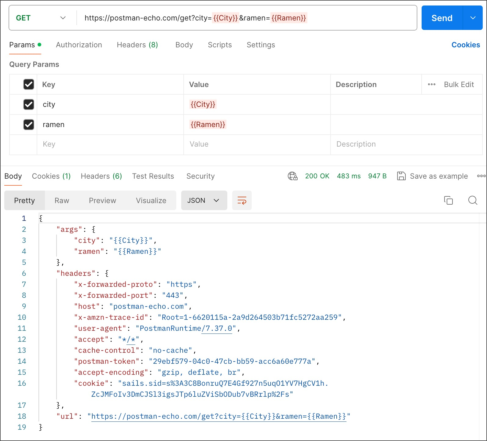

== Send a request with the Postman API client

The Postman API client enables you to send API requests using HTTP, GraphQL, gRPC, or other common protocols.

=== Create a new request

Your requests can include multiple details determining the data Postman will send to the API you are working with.
Enter a URL and choose a method, then optionally specify a variety of other details.

You can create a new request from a workspace, by using *New* -> *HTTP*, or by selecting *+* to open a new tab.
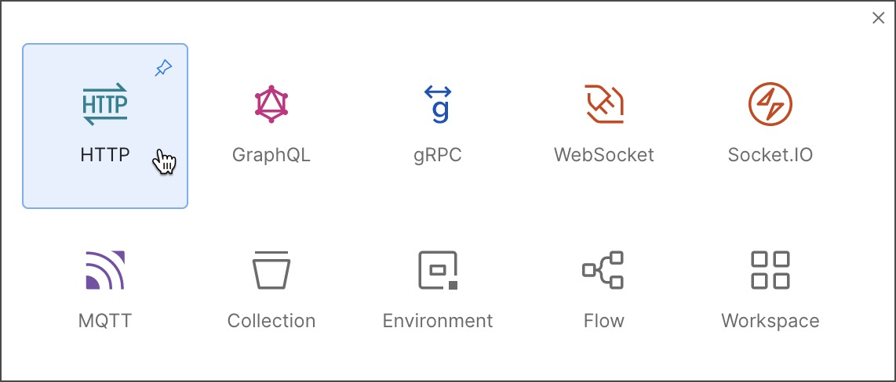
Select *Save* to save your request.

TIP: You can give your request a name and description, and choose or create a xref:6_Postman_collections.adoc[collection] to save it in.

To test sending a request in Postman, you can set the URL to the Postman Echo sample API endpoint https://postman-echo.com/get and the method to *GET* -> select *Send*.
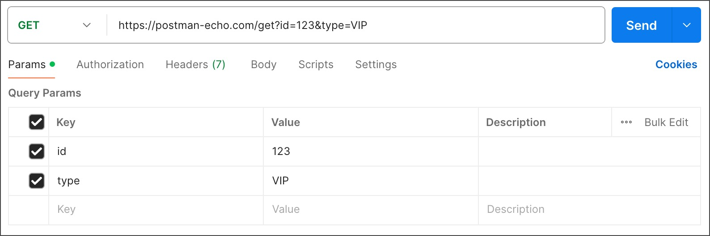

=== Select request protocols

[NOTE]
====
You can change the protocol for a new request.
====

. Select *New* in the sidebar and then select a request protocol, or select *+* to open a new tab.
. Select the protocol dropdown menu to the left of the request's name, and then select a different request protocol.

In addition to HTTP, Postman supports sending requests using https://learning.postman.com/docs/sending-requests/graphql/graphql-overview/[GraphQL],
https://learning.postman.com/docs/sending-requests/grpc/grpc-client-overview/[gRPC], https://learning.postman.com/docs/sending-requests/websocket/websocket-overview/[WebSocket],
https://learning.postman.com/docs/sending-requests/mqtt-client/mqtt-client-overview/[MQTT], and https://learning.postman.com/docs/sending-requests/soap/making-soap-requests/[SOAP] protocols.

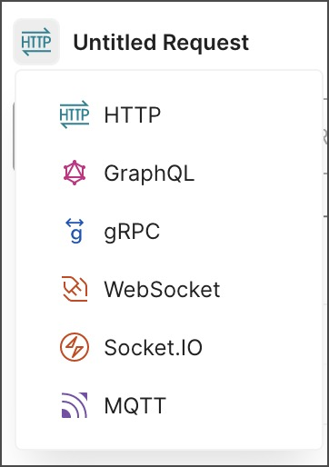

[NOTE]
====
You can't change the request protocol after you select *Save*.
====

=== Select request methods

By default, Postman will select the *GET* method for new request.

====
*GET* methods are typically for retrieving data from an API.
====

You can use a variety of other methods to send data to your APIs, including the following most common options:

* *POST* - add new data
* *PUT* - replace existing data
* *PATCH* - update some existing data fields
* *DELETE* - delete existing data

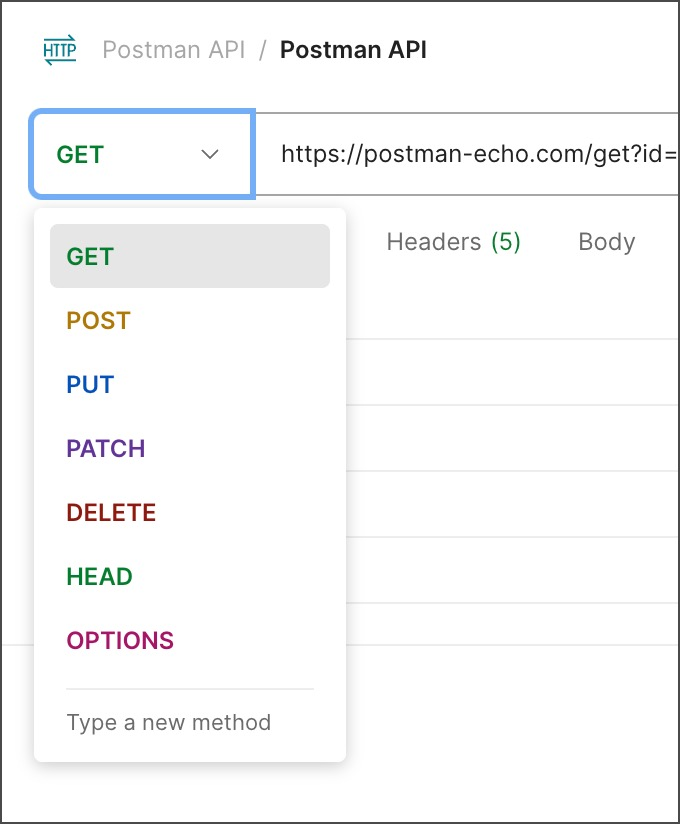

== Send a request

After you specify the _request protocol, method, and URL, add any other details_ required by the API you're sending the request to:

* Specify any https://learning.postman.com/docs/sending-requests/create-requests/parameters/[parameters and body data] or request https://learning.postman.com/docs/sending-requests/create-requests/headers/[headers] you need to send with the request.
* Set up any https://learning.postman.com/docs/sending-requests/authorization/authorization/[required authentication and authorization].
* You can also https://learning.postman.com/docs/sending-requests/response-data/cookies/[use cookies with your requests] by selecting Cookies (under Send).

After you enter all the request details, select *Send* to send the request to the API server.

== API response structure

The Postman response viewer helps you visualize and check the correctness of API responses.

=== Response body

The Postman *Body* tab gives you several tools to help you understand the response.

You can view the body in one of four views:

* link:#pretty[Pretty]
* link:#raw[Raw]
* link:#preview[Preview]
* link:#visualize[Visualize]

==== [[pretty]]Pretty

The *Pretty* view formats JSON or XML responses, so they're easier to view.

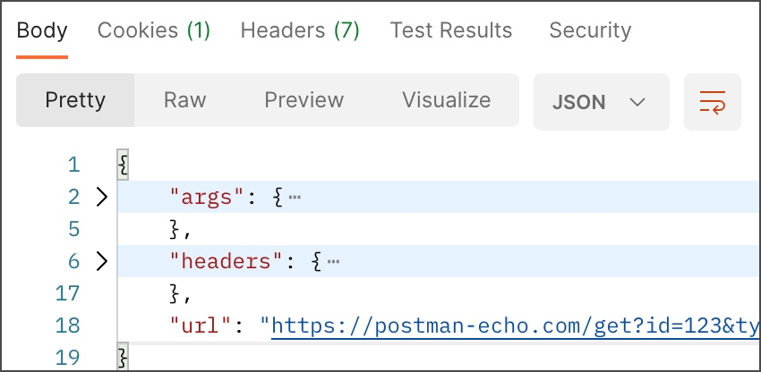

==== [[raw]]Raw

The *Raw* view is a large text area with the response body.
It can indicate whether your response is minified.

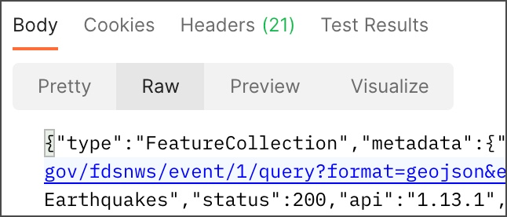

==== [[preview]]Preview

The *Preview* view renders the response in an iframe sandbox.

Some web frameworks by default return HTML errors, and *Preview* can be helpful for debugging in those cases.

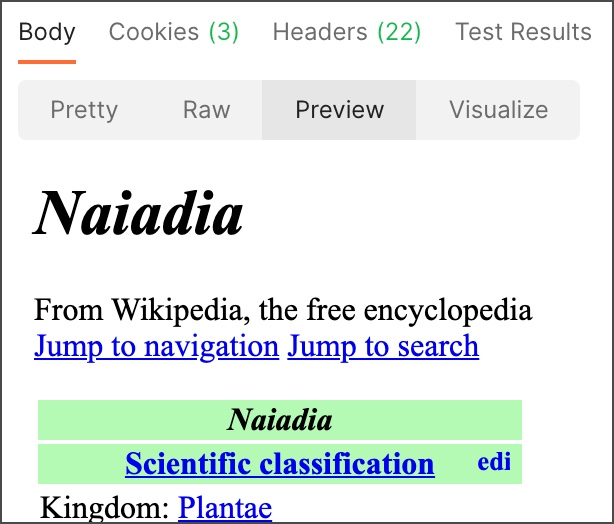

==== [[visualize]]Visualize

The *Visualize* view renders the data in the API response according to visualization code that you add to the *Scripts* -> *Post-response tab*.

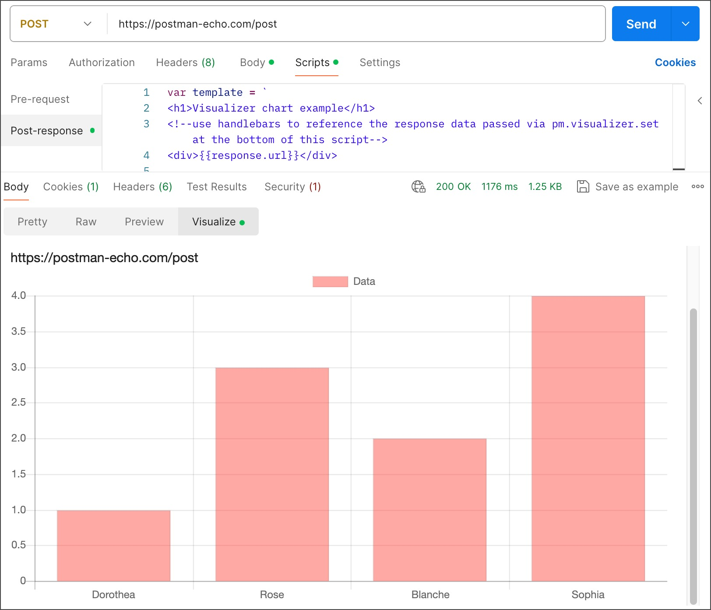

=== Response code

Postman displays the response code returned by the API.

Hover over the response code to get a short description of the code and what it means.

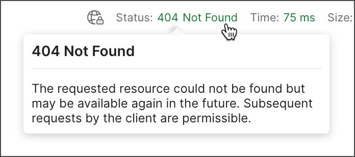

=== Saving responses

If a request has been saved in a collection, you can save responses for that request.
Once the response has been returned, you can:

* Select *Save as Example* to save the response as an https://learning.postman.com/docs/sending-requests/response-data/examples/[example] that you can access later.
* Select the more actions icon  then *Save response to file* to save the response as a JSON file.
* Select the more actions icon  then *Clear response* to remove any data in the response viewer.
+
Note that for event-based requests, this is available after the stream is closed.
+
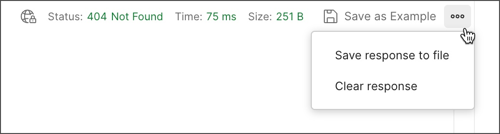

== Variables and environments

=== Variables quick start

====
A variable is a reusable value you can use in API requests and scripts.
====

To create and use a variable, do the following:

. Select the environment quick look icon  in the link:3_The_Postman_interface.adoc[workbench].
. Next to *Globals* -> select *Edit* _(or *Add* if no variables have been added yet)_.
. Add a variable named `my_variable` and give it an initial value of `Hello`.
. Select  Save, then close the Globals tab.
. Open a new request tab and enter `https://postman-echo.com/get?var={{my_variable}}` as the URL.
+
TIP: Hover over the variable name to inspect the variable's value and scope.
+
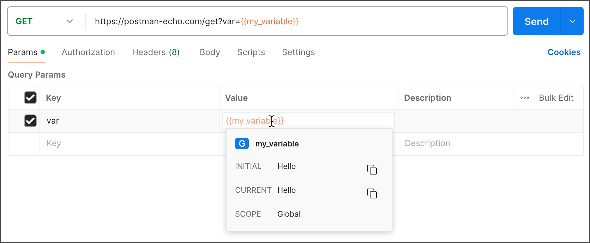
. Select *Send* and send the request.
+
Inspect the response, which confirms that Postman sent the variable value to the API.
. Change the value in the environment quick look and send the request again.

[NOTE]
====
To learn more about using variables in Postman, go to https://learning.postman.com/docs/sending-requests/variables/variables/[Store and reuse values using variables].
====

=== Create and switch environments

[NOTE]
====
With environments, you can create sets of variables for the various types of work you do in Postman.
====

* To get started, learn how to https://learning.postman.com/docs/sending-requests/variables/managing-environments/[create and switch between environments] In Postman.
* You can then https://learning.postman.com/docs/sending-requests/variables/environment-variables/[add and edit variables in each environment].
* You can also https://learning.postman.com/docs/sending-requests/variables/team-environments/[use environments to collaborate with your team] and share and manage sensitive data.