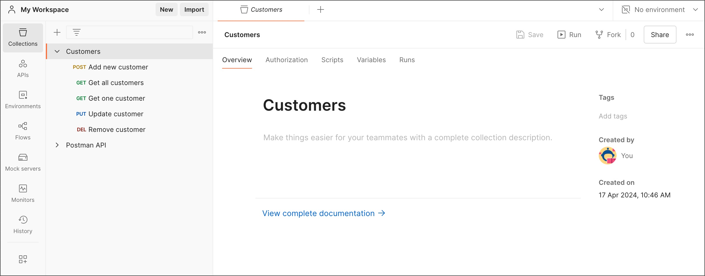

= Organize and automate API requests in Postman Collections
Liudmila Topal <liudmila.topal@endava.com>
:revnumber: 1.1
:revdate: 2024-08-16
:doctype: book
:toc: left
:sectnums:
:icons: font
:highlightjs-languages: java
:url-quickref: https://docs.asciidoctor.org/asciidoc/latest/syntax-quick-reference/

====
A _Postman Collection_ is a set of API endpoints or requests, along with each endpoint's authorization type, parameters, headers, request bodies, tests, and settings grouped under the same collection ID.
====

== [[collection]]Creating collections

=== There are several ways to create a new collection:

* Select *Collections* in the sidebar, then select *+*.

* Select *New* -> select *Collection*.
* With *Collections* open in the left sidebar -> select *+*.
* In an empty workspace, select *Create Collection*.
+
TIP: You can also create a https://learning.postman.com/docs/collections/using-collections/#using-collection-templates[collection from a template].

=== To customize and configure a new collection, do the following:

* Select the collection name to give your new collection a name.
* You can optionally enter a description for your collection in the *Overview* tab.
+
This https://learning.postman.com/docs/publishing-your-api/authoring-your-documentation/[description] will appear in its documentation and in the workspace when anyone opens it.
* Select *Authorization* to configure authorization details for the collection.
* Select *Scripts* -> *Pre-request* to define a https://learning.postman.com/docs/tests-and-scripts/write-scripts/pre-request-scripts/[pre-request script] for your collection, which will run before requests are sent to the server.
* Select *Scripts* -> *Post-response* to define a https://learning.postman.com/docs/tests-and-scripts/write-scripts/test-scripts/[post-response script] for your collection, which will run after a response is received.
* Select *Variables* to define values for https://learning.postman.com/docs/sending-requests/variables/variables/[collection variables] to share across all requests in the collection.
+

== Adding requests to a collection

There are several ways to add existing and new requests to a collection.

=== Moving an existing request to a different collection

To move an existing request to a different collection, do the following:

. Select the request you want to move.
. Drag the request into the desired collection.
+
TIP: Alternatively, open the request and select Save As, then choose the collection you want to copy it to.

To move more than one request to a different collection, do the following:

* Select and hold *⌘* or *Ctrl* -> select the requests you want to move.
* Drag the requests into the desired collection.

=== Adding a new request to a collection

* From a new request, select *Save*.
* Choose the collection you want to move it to, and then select *Save*.
* To create a new collection to save the request to, select *New Collection*.

=== Creating a new request inside a collection

* Select the more actions icon  next to the collection name.
* Select *Add Request* from the actions' menu.

=== Adding a request to an empty collection

Select the collection -> select *Add a request*.

=== Adding a request from your history to a collection

* Select *History* in the sidebar.
* Select the more actions icon  next to the request you want to save.
* Select *Save request*.
+

* Choose the collection to add the request to, then select *Save*.
+
TIP: Alternatively, select *+* next to the request.

== Managing collections

From the list of collections in your workspace, you can:

* [[folder]]https://learning.postman.com/docs/collections/using-collections/#adding-folders-to-a-collection[Adding folders to a collection]
* https://learning.postman.com/docs/collections/using-collections/#deleting-a-collection[Deleting a collection]
* https://learning.postman.com/docs/collections/using-collections/#recovering-a-deleted-collection[ Recovering a deleted collection]
* https://learning.postman.com/docs/collections/using-collections/#sharing-a-collection[Sharing a collection]
* https://learning.postman.com/docs/collections/using-collections/#tagging-a-collection[Tagging a collection]
* https://learning.postman.com/docs/collections/using-collections/#watching-a-collection[Watching a collection]
* https://learning.postman.com/docs/collections/using-collections/#forking-a-collection[Forking a collection]
* https://learning.postman.com/docs/collections/using-collections/#adding-comments-to-a-collection[Adding comments to a collection]
* https://learning.postman.com/docs/collections/using-collections/#reverting-collection-changes[Reverting collection changes]
* https://learning.postman.com/docs/collections/using-collections/#viewing-pull-requests-forks-and-collection-details[Viewing pull requests, forks, and collection details]

== Collection Runner

====
The _Collection Runner_ enables you to run the requests in a Postman Collection in a specified order to test the functionality of your API.
====

=== Configure a collection run

You can manually run the requests in a link:#collection[collection] or a link:#folder[folder].

* Select *Collections* in the sidebar and select the collection or folder you want to run.
* On the *Overview* tab, select image:resource/icon-runner-v9.jpg[20,20] *Run*.

* On the *Functional* tab, select *Run manually*.
* If you want your collection to run with an environment, select it using the environment selector at the top right of Postman.
+
You can also select *Environments* in the sidebar, then select the environment you want to use.
* When you've completed your configuration, select *Run* _(collection name)_.
