= How to Debug
Arnaut Olga
:revnumber: 1.1
:revdate: 2024-08-16
:doctype: book
:toc: left
:sectnums:
:icons: font
:highlightjs-languages: java

== Overview

'''

*Debugging* is the process of finding and resolving bugs (defects or problems that prevent correct operation) within computer programs, software, or systems.

*Debugger* makes application debugging much easier.
Using debugger, we can *pause* the execution of program at a certain point, *inspect variables*, *evaluate expression*, *modify data in run* and some other things.
IntelliJ provides inbuilt Java debugger.
The debugger is a powerful tool, which lets you find bugs a lot faster by providing an insight into the internal operations of a program.
This is possible by pausing the execution and analyzing the state of the program by thorough examination of variables and how they are changed line by line.

There are different kinds of errors, which you are going to deal with.
Some of them are easy to catch, like syntax errors, because they are taken care of by the compiler.
Another easy case is when the error can be quickly identified by looking at the stack trace, which helps you figure out where the error occurred.

However, there are errors that can be very tricky and take really long to find and fix.
This is where the debugger is useful.
While debugging, you are in full control of the things.
In this manual we are covering a basic debugging scenario to get you started.

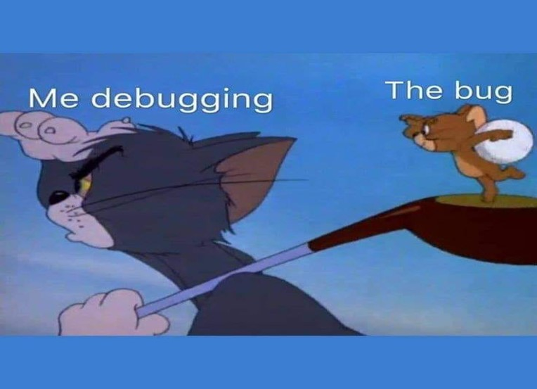

It’s highly recommended, while debugging, to follow some steps:

*Identify the error* – It saves time and avoids the errors at the user site.
Identifying errors at an earlier stage helps to minimize the number of errors and wastage of time.

*Identify the error location* – The exact location of the error should be found to fix the bug faster and execute the code.

*Analyze the error* – To understand the type of bug or error and reduce the number of errors we need to analyze the error.
Solving one bug may lead to another bug that stops the application process.

*Prove the analysis* – Once the error has been analyzed, we need to prove the analysis.
It uses a test automation process to write the test cases through the test framework.

*Cover the lateral damage* – The bugs can be resolved by making the appropriate changes and move onto the next stages of the code or programs to fix the other errors.

*Fix and Validate* – This is the final stage to check all the new errors, changes in the software or program and executes the application.

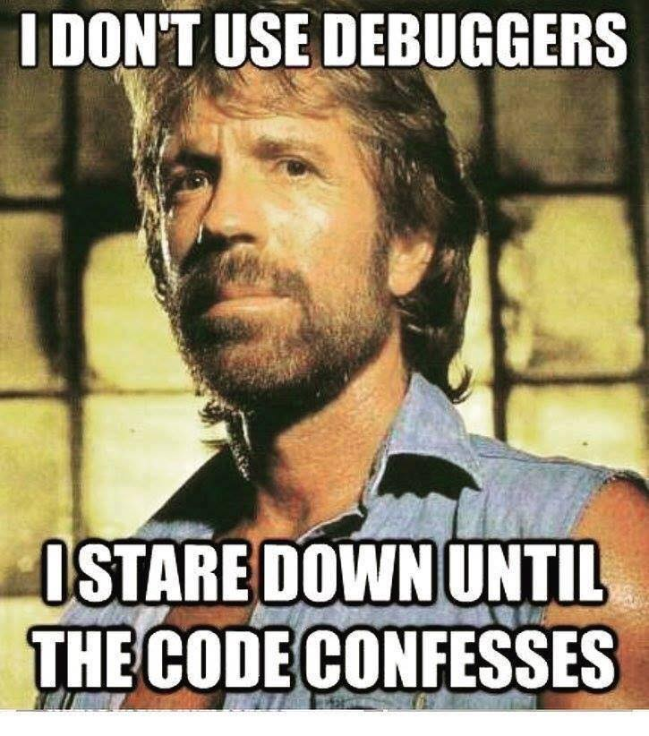

In case you are not Chuck Norris, follow the next example.

== Examine the code

'''

Let's try a simple debugging case.
Imagine we have the following application:

[source,java]
----
public class AverageFinder {
    public static void main(String[] args) {
        System.out.println("Average finder v0.1");
        double avg = findAverage(args);
        System.out.println("The average is " + avg);
    }

    private static double findAverage(String[] input) {
        double result = 0;
        for (String s : input) {
            result += Integer.parseInt(s);
        }
        return result;
    }
}

----

The program is supposed to calculate the average of all values passed as command-line arguments.

It compiles and runs without issues; however, the result is not what one would expect.
For instance, when we pass 1 2 3 as the input, the result is 6.0.

First of all, you need to think about where the suspected error might be coming from.
We can assume the problem is not in the print statements.
Most likely, unexpected results are coming from our findAverage method.
In order to find the cause, let's examine its behavior in the runtime.

== Set breakpoints

'''

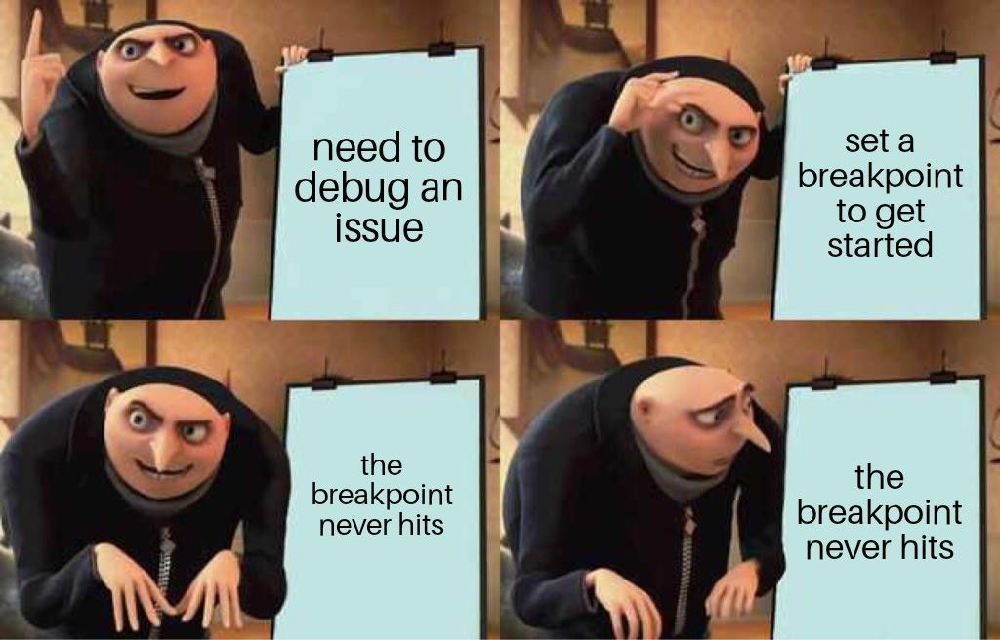

To examine how the program operates at runtime, we need to suspend its execution before the suspected piece of code.
This is done by setting breakpoints.
Breakpoints indicate the lines of code where the program will be suspended for you to examine its state.

Breakpoint allows stopping program execution at certain point.
Breakpoints can be set by hovering the mouse over the Editor’s gutter area and clicking on it.

Click the gutter at the line where the *findAverage* method is called.

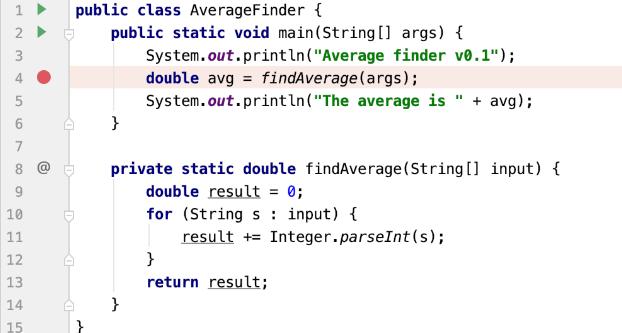

== Run the program in debug mode

[TIP]
====
*Don't do this:*

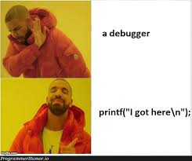
====

Now let's start the program in debug mode.
When the test is running in debug and has stopped at a breakpoint, I can:

* see all the current variables,
* expand them when they are an object instance of some sort,
* resume execution (stop at next breakpoint),
* step over the line to advance execution bit by bit,
* step into the code to advance execution, but into the method implementation,
* highlight code and “Evaluate Expression”.

Since we are going to pass arguments for running and debugging the program, make sure the link:..%2Frun_debug_configurations%2FRun_Debug_configurations.md[Run/Debug configurations] has these arguments in place.
To modify Run Debug Configurations, you need to follow these steps:

. Click the Run icon in the gutter, then select *Modify Run Configuration*.
+
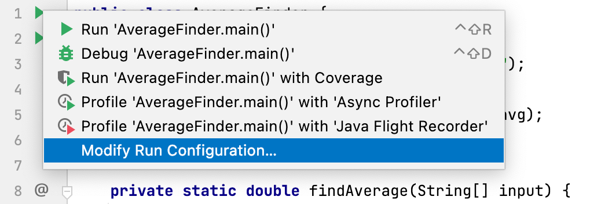

. Enter arguments in the Program arguments field.
+
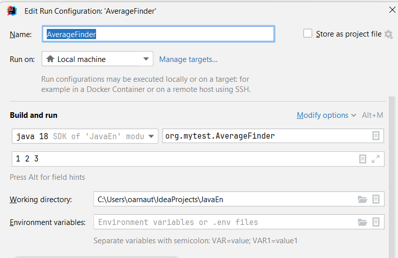

. Click the Run button near the main method.
From the menu, select *Debug*.
+
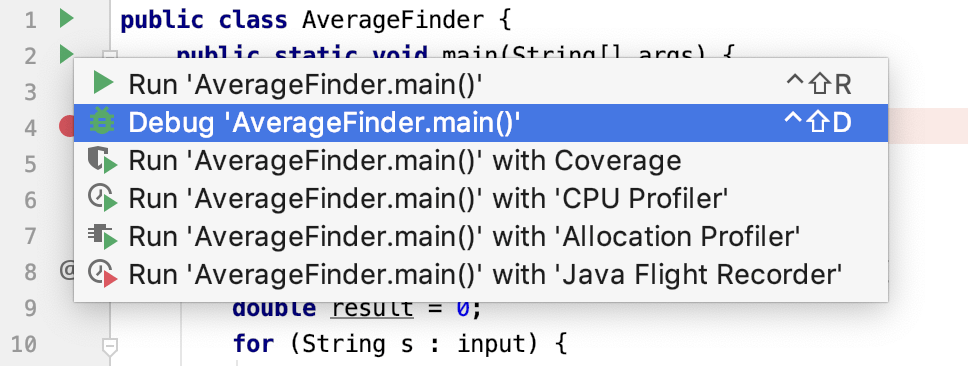

== Analyze the program state

'''

After the debugger session has started, the program runs normally until a breakpoint is hit.
When this happens, the line where the program paused gets highlighted and the Debug tool window appears.

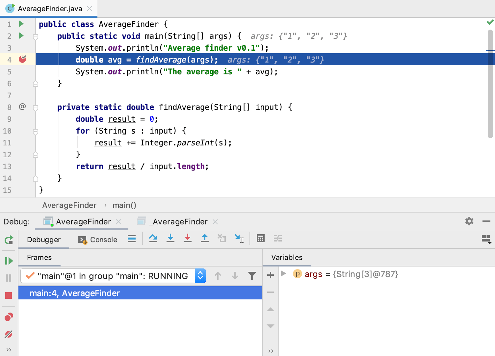

The highlighted line *has not been executed yet*.
The program now waits for further instructions from you.
The suspended state lets you examine variables, which hold the state of the program.

As the findAverage method has not been called yet, all its local variables like result are not yet in scope, however, we can examine the contents of the args array (args is in scope for the main method).
The contents of args are displayed inline where args is used:

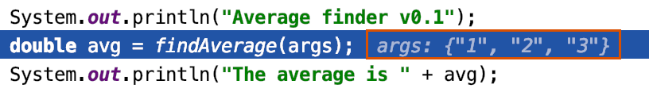

You can also get information about all variables that are currently in scope in the *Variables panel*.

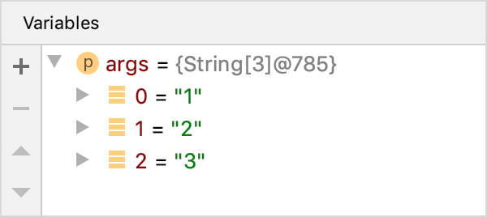

== Evaluate Expression

'''

*Alt + F8* is the shortcut key to evaluate expression/variable in the IntelliJ IDEA.
You can only evaluate a expression/variable if the code/program is running in the *Debug mode*:

. Run your program in the Debug mode and add a breakpoint from where you want to evaluate the expression/variable of the program.

. Select the variable that you want to evaluate and press *Alt + F8* together from the keyboard.
+
image::images/MicrosoftTeams-video.gif[]
+
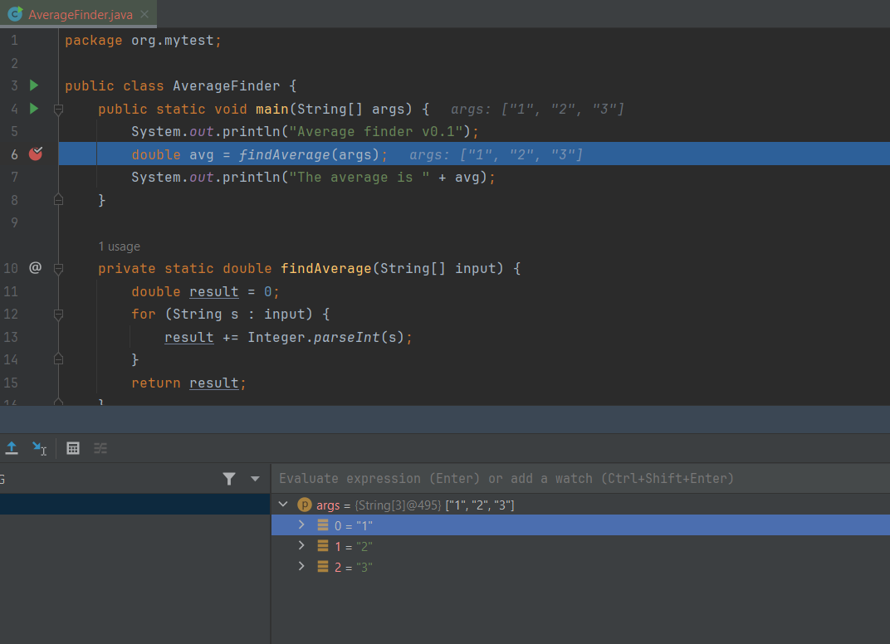
+
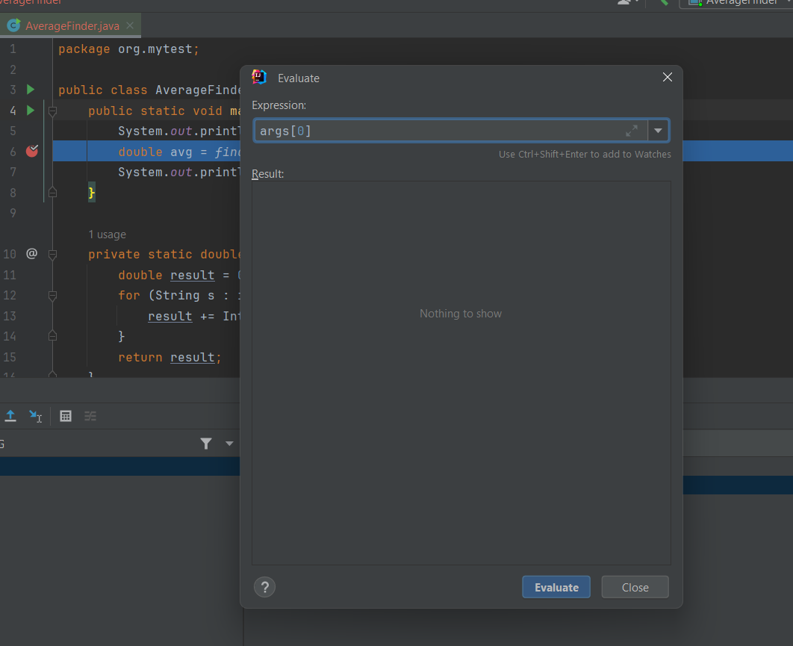

. Click on the *Evaluate* button to see what’s inside of your variable.
+
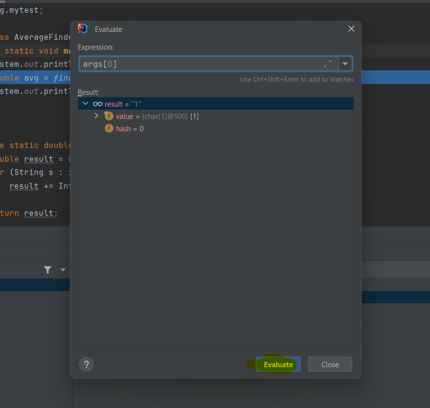

Alternatively, you can also evaluate the expression by Selecting the variable, make a Right Click on it and click on the *Evaluate Expression*:

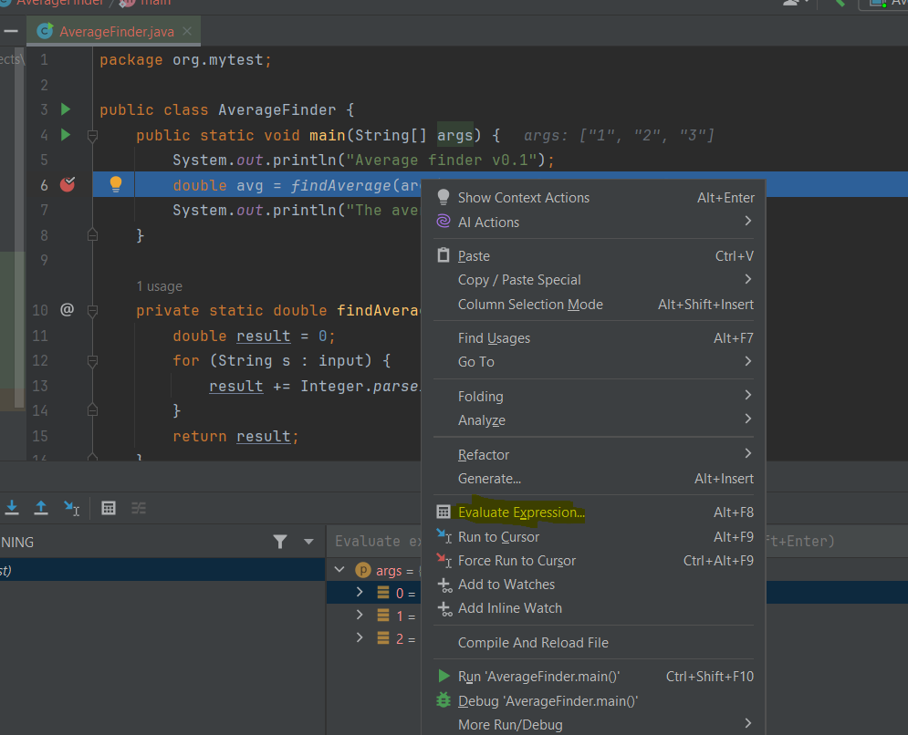

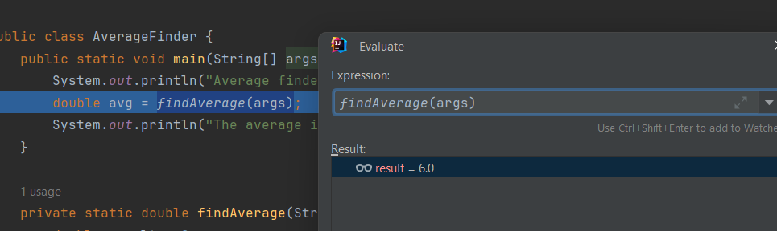

== Modify data while running the program in debug mode

'''
. *Access the Variables Panel*.
+
While debugging, you can access the Variables panel in IntelliJ IDEA to inspect the current values of variables.
You can typically find this panel in the Debug tool window, which opens automatically when you start debugging your program or use right click and select Evaluate Expression.
+
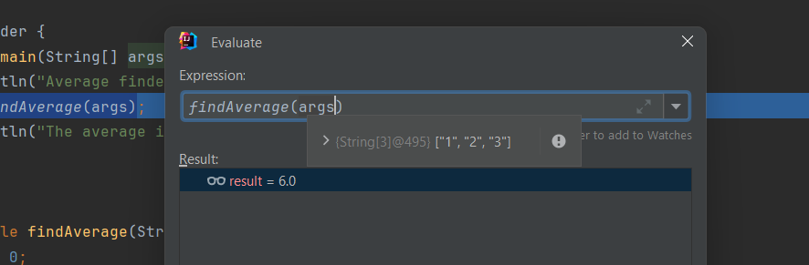

. *Locate the Variable to Modify*.
+
In the Variables panel, locate the variable that you want to modify.
You should see a list of variables currently in scope at the point where the debugger has paused execution, including local variables, instance variables, and static variables.
+
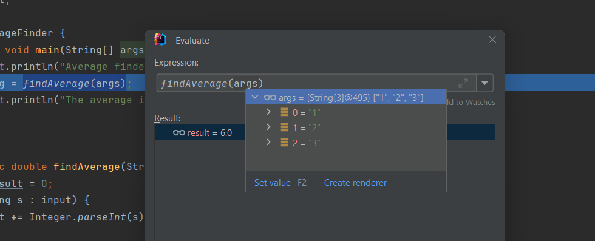

. *Double-click on the Variable's Value*.
+
To modify the value of a variable, double-click on its current value in the Variables panel.
This action should turn the value into an editable field, allowing you to enter a new value.
+
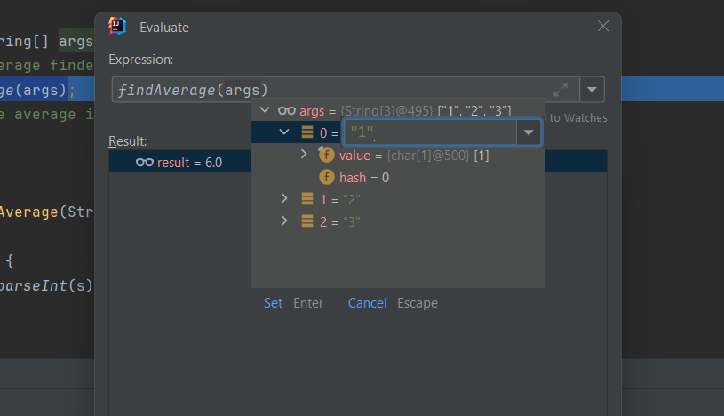

. *Enter the New Value*.
+
Once the value is editable, type in the new value that you want to assign to the variable and press Enter to confirm your changes or Set.
The variable's value should update immediately in the Variables panel.
+
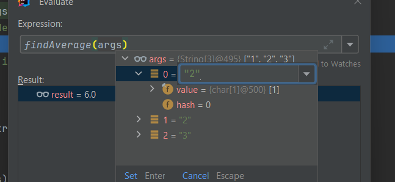

. *Observe the Effects*.
+
After modifying the variable, you can observe how the change affects the behavior of your program as you continue debugging.
Keep in mind that modifying variables during debugging can help you test different scenarios and troubleshoot issues more effectively.
+
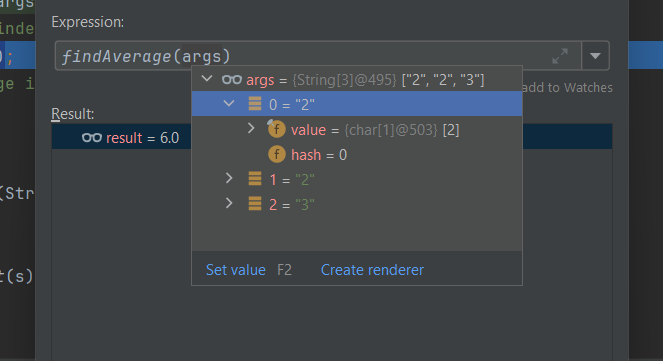

. *Evaluate with new value*.
+
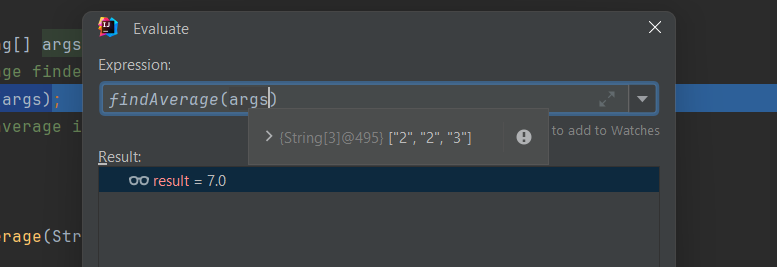

== Step through the program

'''

Now that we are comfortable with the Debug tool window, it's time to step into the *findAverage* method and find out what is happening inside it.

. To step into a method, click the Step Into button or press *F7*.
+
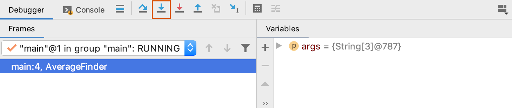
Another line gets highlighted in the editor because we advanced the execution point one step forward.

. Continue stepping with Step Over *F8*.
Notice how it is different from Step Into.
While it also advances the execution one step forward, it doesn't visit other methods like Integer.parseInt() along the way.
Let's keep stepping and see how the local variable result is declared and how it is changed with each iteration of the loop.
+
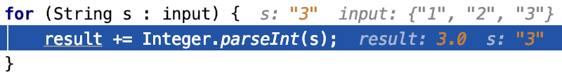
Right now the variable *s* contains the value "3".
It is going to be converted to int and be added to result, which currently has the value of 3.0. No errors so far.
The sum is calculated correctly.

. Two more steps take us to the return statement, and we see where the omission was.
We are returning result, which has the value of 6.0, without dividing it by the number of inputs.
This was the cause of incorrect program output.
+
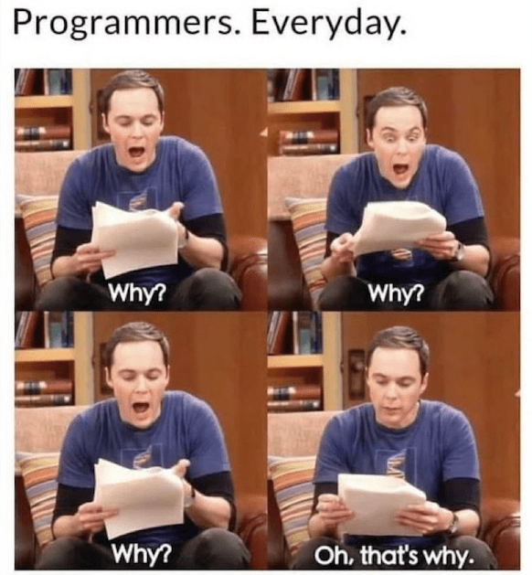
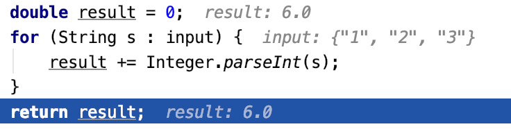

. Let's correct the error:
+
[source,java]
----
return result / input.length;
----
+
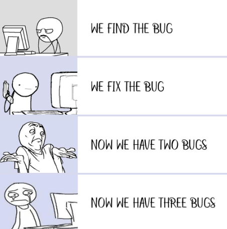

== Stop the debugger session and rerun the program

'''

You can resume program execution by clicking on Resume Program or by using the shortcut *F9*.
To restart the program in debug mode, select Rerun.
You can stop debugging your program at any time by using the Stop icon.

. In order to check that the program works fine, let's stop the debugger session and rerun the program.
+
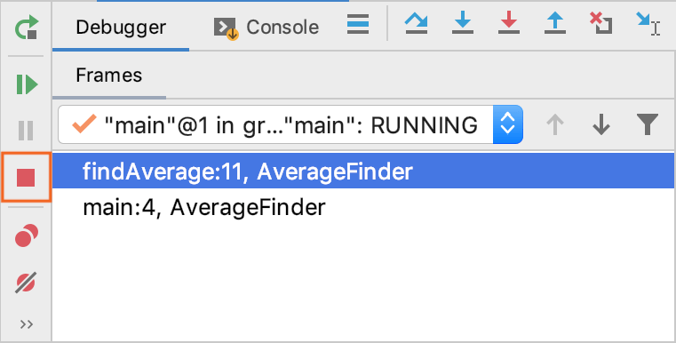

. Click the Run button near the main method.
From the menu, select Run.
+
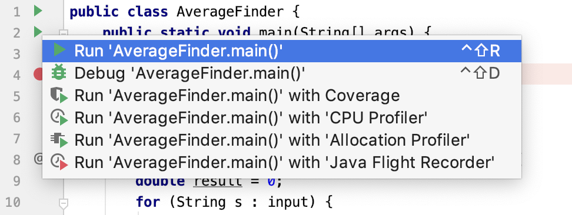

. Verify that the program works correctly now.
+
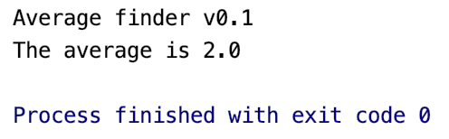
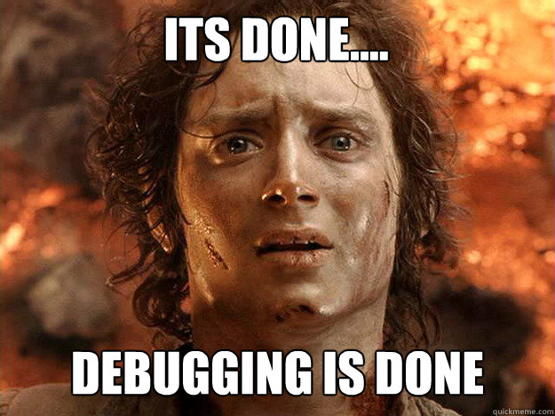

== Resources

'''
* https://www.jetbrains.com/help/idea/debugging-your-first-java-application.html[Tutorial: Debug your first Java application]
* https://www.tutorialspoint.com/intellij_idea/intellij_idea_debugging.htm[Intellij Idea - Debugging]
* https://blog.jetbrains.com/idea/2020/05/debugger-basics-in-intellij-idea/[Debugger Basics in IntelliJ IDEA]
* https://www.eviltester.com/2016/07/how-to-debug-java-with-intellij.html["How to debug Java with IntelliJ: breakpoints, evaluate expression, watches and variable view"]
* https://blog.jetbrains.com/idea/2023/04/debugger-upskill-variables-evaluate-expression-watches/["Debugger Upskill: Variables, Evaluate Expression, and Watches"]
* https://www.jetbrains.com/help/idea/tutorial-set-value.html[Tutorial: Set value]