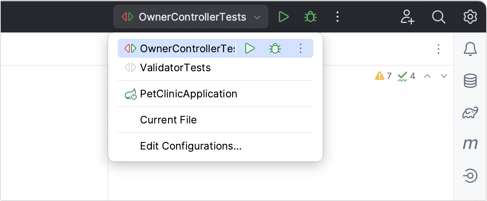
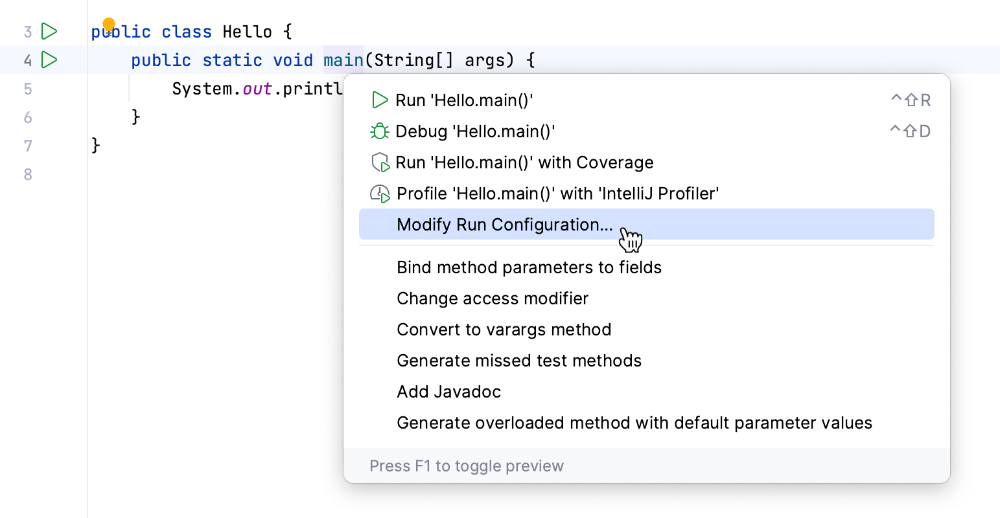
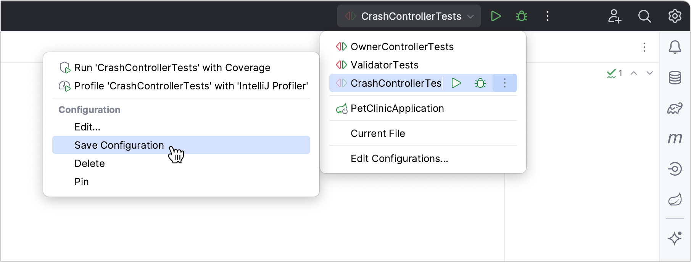
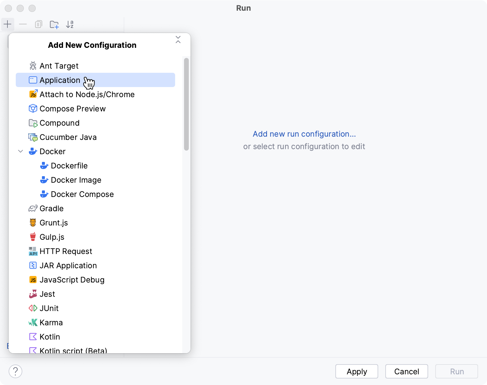
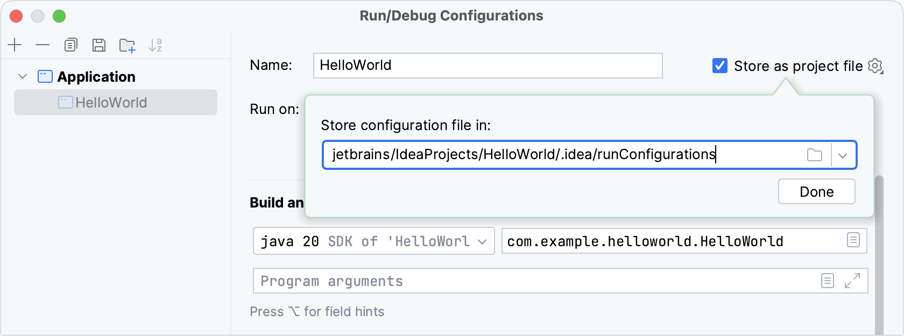
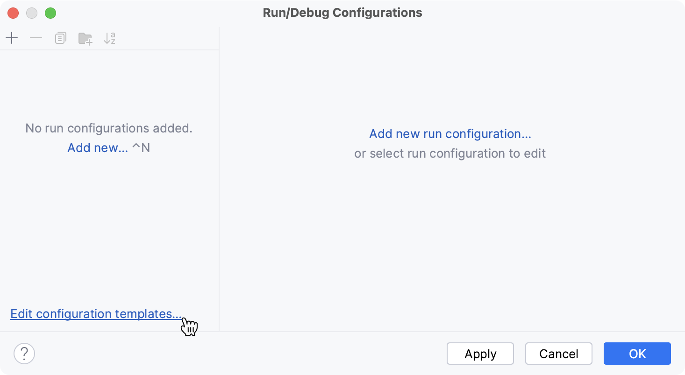
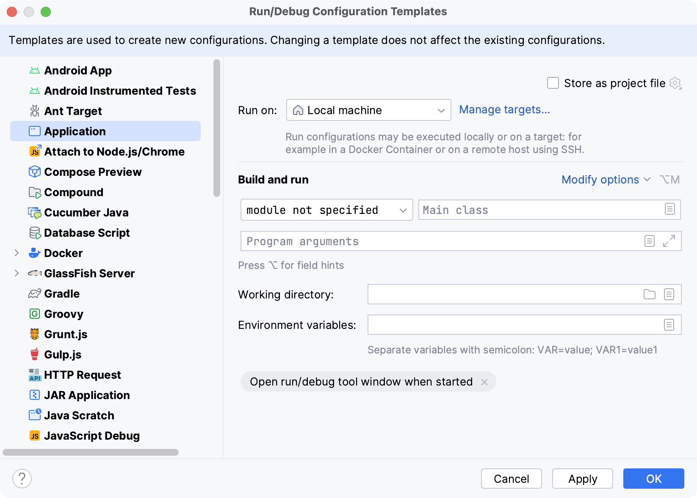
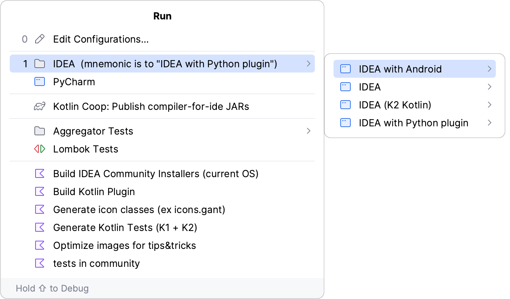
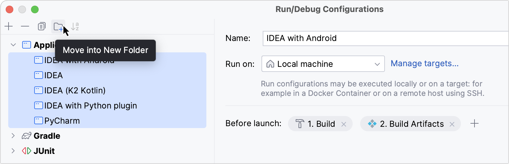

= Run/Debug Configurations
Arnaut Olga
:revnumber: 1.1
:revdate: 2024-08-16
:doctype: book
:toc: left
:sectnums:
:icons: font
:highlightjs-languages: java

== Overview

'''

When you run, debug, or test your code, is used a run/debug configuration to determine how to perform the operation.
Typically, the initially-created configuration is sufficient to run or debug an app.
However, you can modify and create new configurations, and modify the configuration templates to suit your development process.

IntelliJ IDEA uses run/debug configurations to run, debug, and test your code.
Each configuration is a named set of startup properties that define what to execute and what parameters and environment should be used.

There are two types of run/debug configurations:

*Temporary* — created every time you are running a class that does not have a permanent configuration.
It provides the bare minimum that allows a class with the main() method to run.

*Permanent* — created explicitly from a template or by saving a temporary configuration.
Permanent configurations remain as part of your project until you remove them.

So whenever you run/debug or test your code, IntelliJ IDEA either uses an existing permanent run/debug configuration or creates a new temporary one.

Permanent configurations have opaque icons while the icons of temporary configurations are semi-transparent.

The maximum number of temporary configurations is *5*.
The older ones are automatically deleted when new ones are added.
If necessary, you can increase this limit in Settings | Advanced Settings | Run/Debug | Temporary configurations limit.

== Create permanent run/debug configurations

IntelliJ IDEA provides the following ways to create a permanent run/debug configuration:

* When there is an executable class or method, you can create a permanent run/debug configuration right from the editor.

* Save a temporary run/debug configuration as permanent.

* Create from a template or copy an existing configuration.

=== Create a permanent run/debug configuration from an executable method or class

. Place the caret at the declaration of an executable method or class (for example, a class with the *main()* method or a test suite) and press *Alt+Enter*.
. From the menu that opens, select *Modify Run Configuration*.
+
IntelliJ IDEA creates a permanent run/debug configuration of the corresponding type and opens a dialog in which you can set configuration parameters.
+

+
. Set up the run/debug configuration parameters.

=== Save a temporary configuration as permanent

. Select a temporary configuration in the run/debug configuration switcher, click App client actions more / App client general chevron right, and select *Save Configuration*.
+

+
. Alternatively, select a temporary configuration in the Run/debug configurations dialog and click Save on the toolbar.

=== Create a run/debug configuration from a template

IntelliJ IDEA provides run/debug configuration templates for different languages, tools, and frameworks.
The list of available templates varies depending on the installed and enabled plugins.

*This procedure describes the steps to create a run/debug configuration using the Application template.
This is the most common template for Java, which corresponds to compiling your program with javac and then running it with java.
For other templates, refer to List of run/debug configurations.*

. Go to *Run | Edit Configurations*.
Alternatively, press *Alt + Shift + F10*, then *0*.
. In the Run/Debug Configuration dialog, click *App "+"* general add on the toolbar or press *Alt + Insert*.
The list shows the run/debug configuration templates.
Select a template, for example, Application.
This configuration is designed for compiling your program with javac and then running it with Java.
+

+
. Specify the run/debug configuration name in the *Name* field.
This name will be shown in the list of the available run/debug configurations.
. Specify configuration options as needed.
+
For more information, refer to Run/debug configuration: https://www.jetbrains.com/help/idea/run-debug-configuration-java-application.html[Application] (to run a simple Java application) or https://www.jetbrains.com/help/idea/list-of-run-debug-configurations.html[List of run/debug configuration templates] (for other run configurations).
+
. You can either run the configuration right away, or save the configuration to run it later.

* Click OK to save the run configuration for later and close the dialog.

* To run the configuration right away, click Run.

== Share run/debug configurations

'''

If you are working in a team, you might want to share your run/debug configurations so that your teammates could run the application using the same configuration or enable them to remotely attach to the process you are running.

For these purposes, IntelliJ IDEA provides a mechanism to store your run/debug configurations as project files and share them through VCS.
The same mechanism can also be used when you want to send your configuration as a file to someone else.
This saves a lot of time as run/debug configurations sometimes get sophisticated, and keeping them in sync manually would be tedious and error-prone.

. Go to *Run | Edit Configurations*.
. Select the run/debug configuration you want to share, enable the *Store as project file* option, and specify the location where the configuration file will be stored.
+

+
. (Optional) If the .idea directory is added to VCS ignored files, the .idea/runConfigurations subfolder will be ignored, too.
If you use Git for your project, you can share .idea/runConfigurations only and leave .idea ignored by modifying .gitignore as follows:

----
/.idea/*
!/.idea/runConfigurations
----

== Run/debug configuration templates

'''

All run/debug configurations are based on templates, which implement the startup logic, define the list of parameters and their default values.
The list of available templates is predefined in the installation and can only be extended via plugins.
However, you can edit default parameter values in each template to streamline the setup of new run/debug configurations.

=== Configure the default values for a template

. Go to *Run | Edit Configurations*.
. In the left-hand pane of the run/debug configuration dialog, click *Edit configuration templates…*.
+

+
. In the *Run/Debug Configuration Templates* dialog that opens, select a configuration type.
+

+
. Specify the desired default parameters and click *OK* to save the template.

== Run/debug configuration folders

'''

When there are many run/debug configurations of the same type, you can group them in folders, so they become easier to distinguish visually.

Once grouped, the run/debug configurations appear in the list under the corresponding folders.

=== Create a folder for run/debug configurations

. Go to *Run | Edit Configurations*.
. In the *Run/Debug Configurations* dialog, select a configuration type and click the *New Folder* icon on the toolbar.
A new empty folder for the selected type is created.
+

+
. Specify the folder name in the text field to the right or accept the default name.
. Select the desired run/debug configurations and move them under the target folder.
. Apply the changes.
If a folder is empty, it will not be saved.

*When you no longer need a folder, you can delete it.
The run/debug configurations grouped under this folder will be moved under the root of the corresponding run/debug configuration type.*

== Passing arguments in configuration

'''

To pass arguments to a program, you should type a list of them in the format you would use on the command line.
The whitespaces will be parsed as delimiters, separating one argument from another.
These arguments will be passed to the entry point of the program as an array.

It is important to remember that all the command-line arguments are passed as strings, so if they are supposed to be treated as, for example, integers, you should convert them explicitly inside the program.

=== Arguments rules

* Use spaces to separate individual arguments, for example, –data text.txt.

* If an argument includes spaces, enclose the spaces or the argument that contains spaces in double quotes, for example, some" "arg or "some arg".

* If an argument includes double quotes (as part of the argument), escape the double quotes using backslashes, for example, &quot;quoted_value&quot;.

== Resources

'''
* https://www.jetbrains.com/help/idea/run-debug-configuration.html#config-folders[Run/debug configurations]
* https://developer.android.com/studio/run/rundebugconfig[Create and edit run/debug configurations]
* https://subscription.packtpub.com/book/programming/9781784396930/7/ch07lvl1sec41/creating-a-run-debug-configuration-for-the-test[Creating a run/debug configuration for the test]
* https://w3schoolsua.github.io/hyperskill/intellij-idea-run-configurations_en.html#gsc.tab=0[Run/Debug configurations dialog]
* https://www.jetbrains.com/help/idea/tutorial-remote-debug.html[Tutorial: Remote debug]