## Logs

In a Java automation framework, logs play a crucial role in providing visibility into the execution of test cases, identifying issues, and debugging failures.
Here are some types of information commonly included in Java automation framework logs:

1. Test Execution Details:

Timestamps: Record the start and end times of test execution for each test case.

Test Case Name: Clearly identify which test case is being executed.

Test Result: Log whether the test case passed, failed, or was skipped.

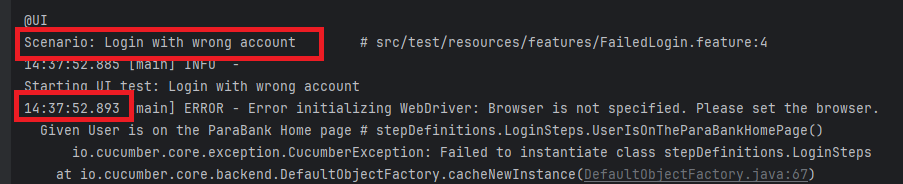

[start=2]
2. Logging Levels:

Debug: Detailed information useful for troubleshooting and debugging.

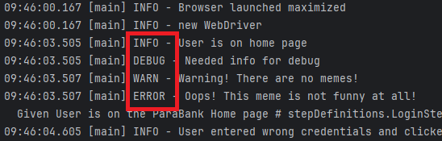

Info: General information about the progress of test execution.

Warn: Warnings or potential issues that may not be critical but should be noted.

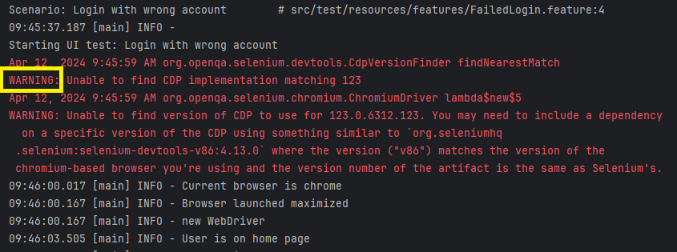

Error: Indicate errors or failures that require attention.

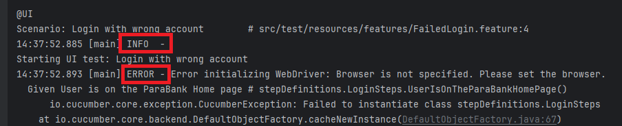

Trace: Extremely detailed information, often used for tracing the flow of execution.

[start=3]
3. Test Steps:

Log each step of the test case, including actions performed and expected outcomes.
Include details such as element identification, actions taken (e.g., click, type), and verification points.
Capture any exceptions or errors encountered during test execution.

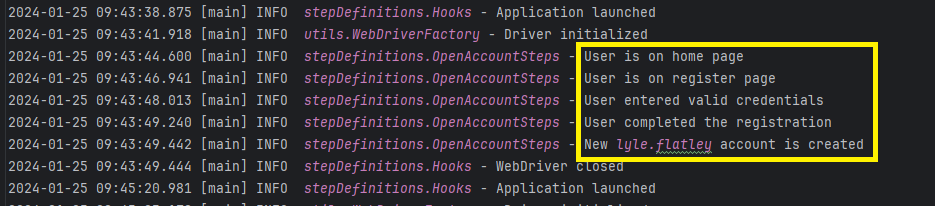

[start=4]
4. Environment Details:

Operating System: Log details about the operating system on which tests are executed.

Browser/Device Information: Specify the browser or device used for test execution.

Configuration Parameters: Log any configurable parameters or settings used during test execution.

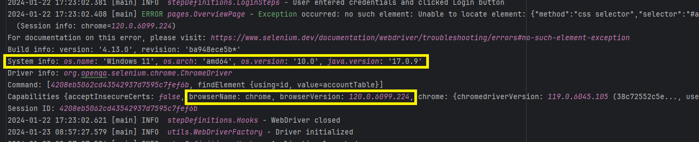

[start=5]
5. Dependencies and Setup:

Log the setup steps required before executing test cases (e.g., initializing WebDriver, setting up test data).
Include information about any external dependencies or services used during test execution.

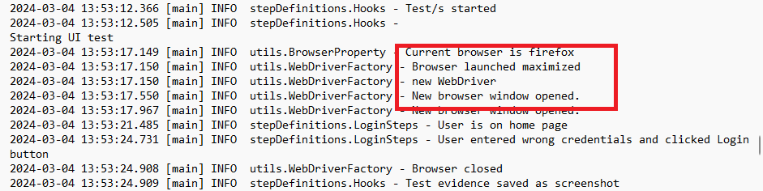

[start=6]
6. Test Data:

Log input data used for test cases.
Record any data transformations or manipulations performed during test execution.

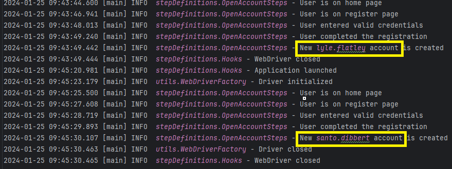

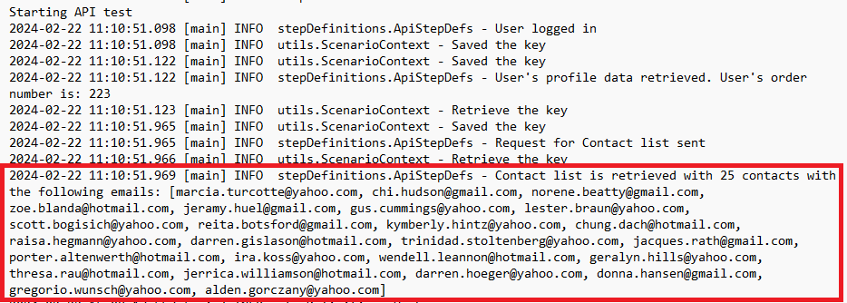

[start=7]
7. Screenshots or Video Links:

Capture screenshots or video recordings of the application state at critical points during test execution.
Include links to these artifacts in the log for reference when investigating failures.

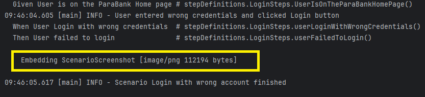

[start=8]
8. Assertions and Verifications:

Log the results of assertions or verifications performed during test execution.
Provide details about expected versus actual outcomes.

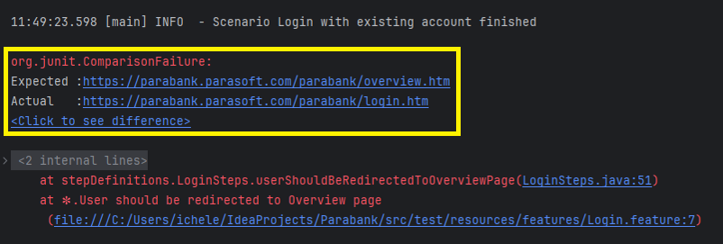

[start=9]
9. Performance Metrics:

Log performance-related metrics such as response times, page load times, or API response times.
Monitor resource usage (CPU, memory, network) during test execution.

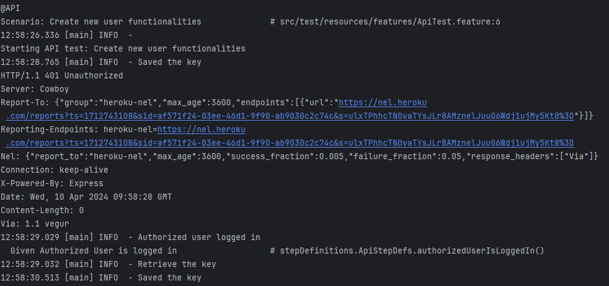

[start=10]
10. Custom Messages and Annotations:

Include custom messages or annotations at specific points during test execution to provide additional context or information.
By including these types of information in the logs generated by a Java automation framework, teams can effectively monitor test execution, diagnose issues, and improve the reliability of automated tests.

## Stack traces

Interpreting stack traces in Java is a fundamental skill for Java developers, especially when debugging code.

Here's a breakdown of how to interpret a typical stack trace:

1. Exception Type:

The first line of the stack trace usually indicates the type of exception that occurred.
It will say something like Exception in thread "main", followed by the type of exception, such as NullPointerException, ArrayIndexOutOfBoundsException, etc.
This gives you a clue about what went wrong.

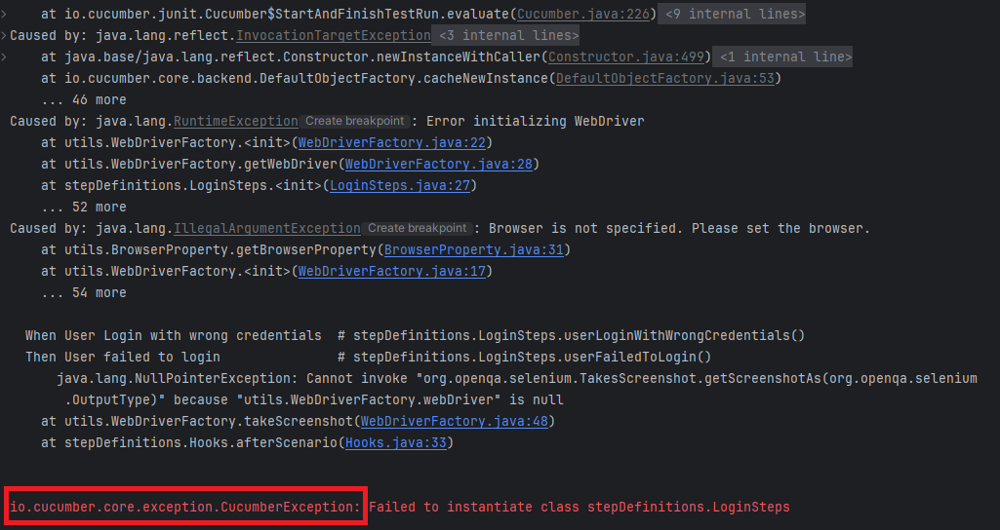

[start=2]
2. Stack Trace Elements:

Following the exception type, you'll see a list of stack trace elements.
Each element represents a method call in your code that was on the call stack when the exception occurred.
They are listed in reverse order, with the most recent method call at the top.
Class Name: The fully qualified class name of the class where the method is defined.
Method Name: The name of the method that was called.
File Name and Line Number: If available, the file name and line number where the method call occurred.

[start=3]
3. Caused By:

If the exception was caused by another exception, you may see a "Caused by" section in the stack trace.
This section provides information about the root cause of the exception.

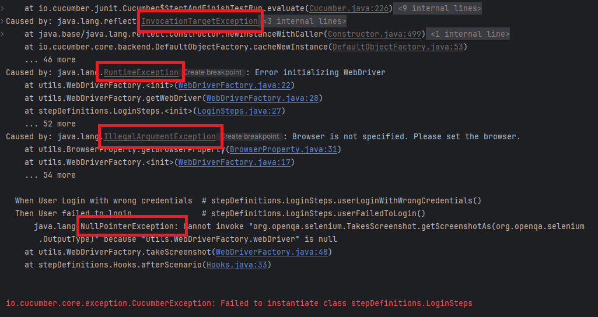

[start=4]
4. Trace Origin:

Look at the top-most elements of the stack trace to identify your code's entry point (main method, servlet request handler, etc.).
The lines below it show the sequence of method calls that led to the exception.

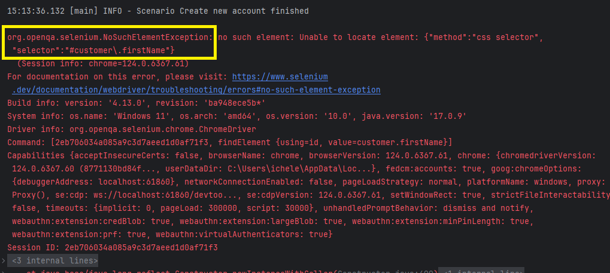

[start=5]
5. Read the Messages:

Sometimes, the stack trace includes additional messages or hints about the cause of the exception.
Read these messages carefully as they can provide useful information for debugging.

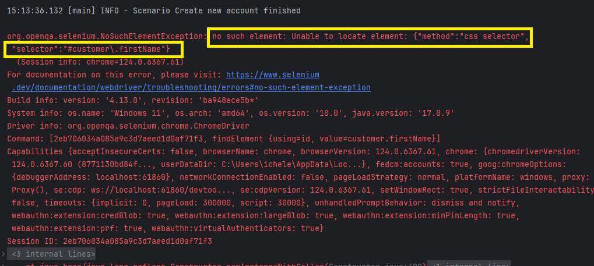

[start=6]
6. Analyze Code Flow:

By examining the stack trace, you can trace the path of execution through your code leading up to the exception.
Identify which methods were called and in what order.
This can help you understand the flow of your program and pinpoint where the issue occurred.

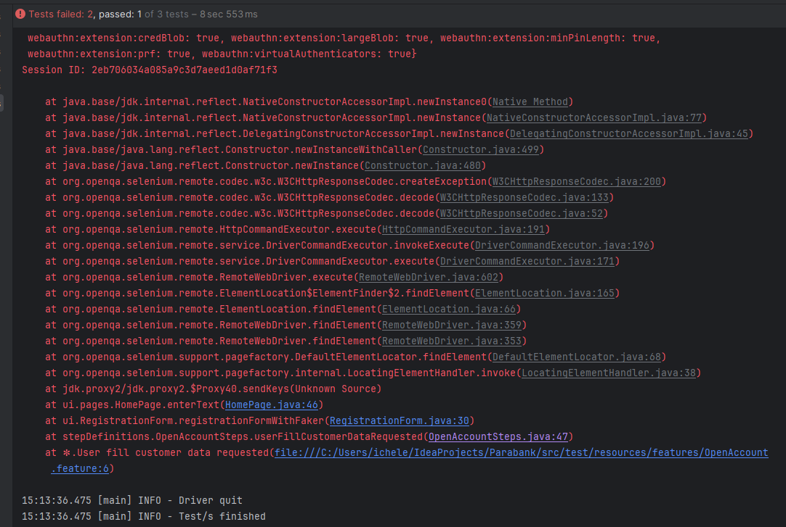

[start=7]
7. Look for Custom Exceptions:

If you have defined your own custom exceptions, they will appear in the stack trace just like built-in exceptions.
Pay attention to these to understand when and where your custom exceptions are being thrown.

[start=8]
8. Use IDE Features:

Most Integrated Development Environments (IDEs) provide features to navigate through stack traces more easily.
You can often click on stack trace elements to jump directly to the corresponding line of code, which can be very helpful for debugging.

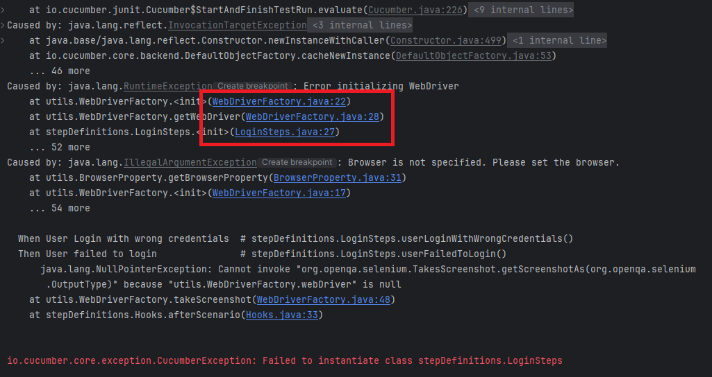

By carefully analyzing the stack trace, you can often identify the cause of an exception and take steps to fix the issue in your code.
