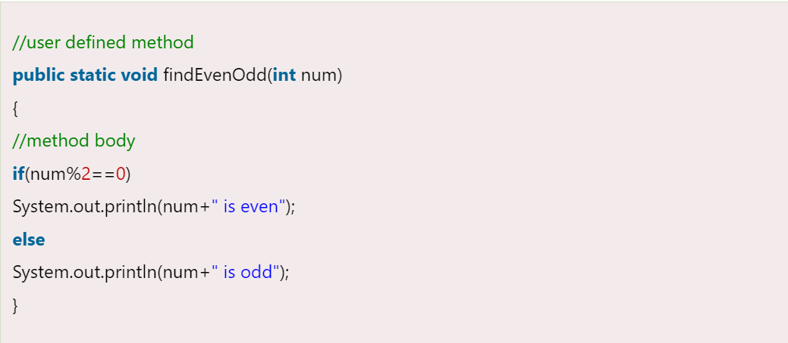
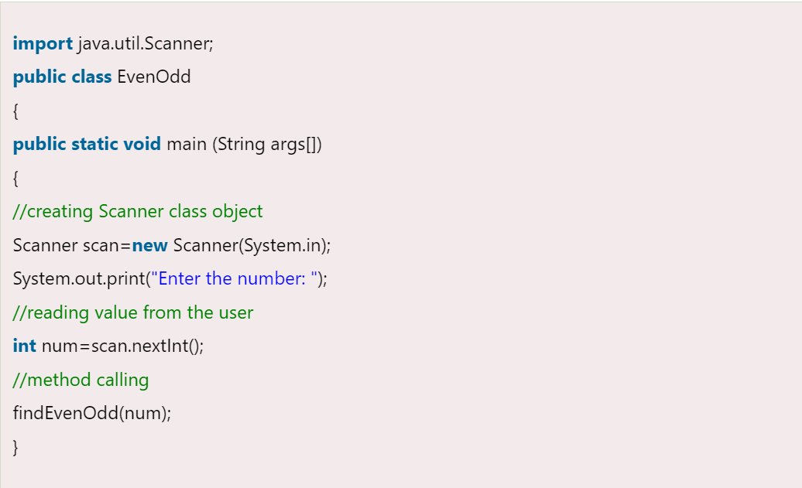

= User-defined method
:toc:
:icons: font
:url-quickref: https://docs.asciidoctor.org/asciidoc/latest/syntax-quick-reference/

The method written by the user or programmer is known as a *user-defined method*.

These methods are modified according to the requirement.

=== How to create a user-defined method

Let's create a user defined method that checks the number is even or odd.

_First, we will define the method._

* We have defined the above method named *findEvenOdd()*.
* It has a parameter *num* of type int.
* The method does not return any value that's why we have used void.
* The method body contains the steps to check the number is even or odd.
* If the number is even, it prints the number *is even*, else prints the number *is odd*.

=== How to call or invoke a user-defined method

Once we have defined a method, it should be called. The calling of a method in a program is simple.

TIP: When we call or invoke a user-defined method, the program control transfer to the called method.

In the above code snippet, as soon as the compiler reaches at line *findEvenOdd(num)*, the control transfer to the method and gives the output accordingly.