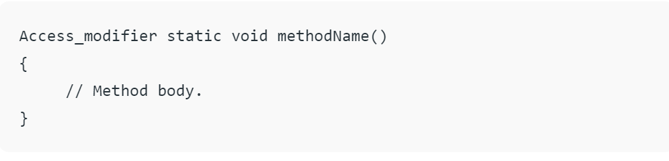

= Static method
:toc:
:icons: font
:url-quickref: https://docs.asciidoctor.org/asciidoc/latest/syntax-quick-reference/

The static keyword is used to construct methods that will exist regardless of whether any instances of the class are generated.
Any method that uses the static keyword is referred to as a *static method*.

=== Features of static method:

* A static method in Java is a method that is part of a class rather than an instance of that class.
* Every instance of a class has access to the method.
* Static methods have access to class variables (_static variables_) without using the class’s object (_instance_).
* Only static data may be accessed by a static method. It is unable to access data that is not static (_instance variables_).
* In both static and non-static methods, static methods can be accessed directly.

=== Syntax

TIP: The name of the class can be used to invoke or access static methods.

=== Why use static methods?

1. To access and change static variables and other non-object-based static methods.
2. Utility and assist classes frequently employ static methods.

=== Restrictions in static methods

1. Non-static data members or non-static methods cannot be used by static methods, and static methods cannot call non-static methods directly.
2. In a static environment, this and super aren’t allowed to be used.

=== Static method vs Instance method

.Difference Between the static method and instance method
|===
|Instance Methods |Static Methods

|It requires an object of the class
|It doesn’t require an object of the class

|It can access all attributes of a class
|It can access only the static attribute of a class

|The methods can be accessed only using object reference
|The method is only accessed by class name

|Syntax: _ObjRef.methodName()_
|Syntax: _className.methodName()_

|It’s an example of pass-by-value programming
|It is an example of pass-by-reference programming
|===