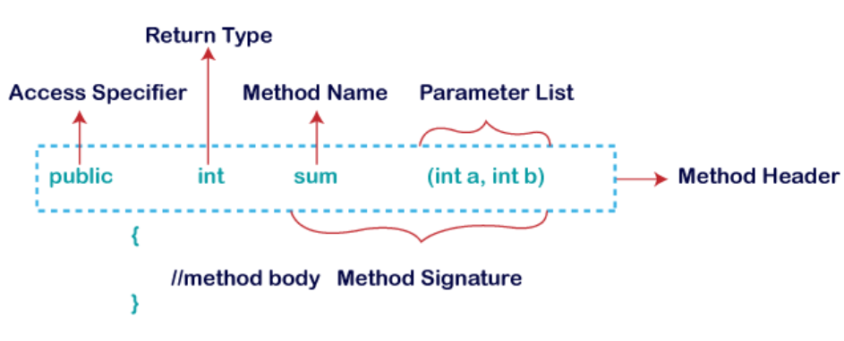
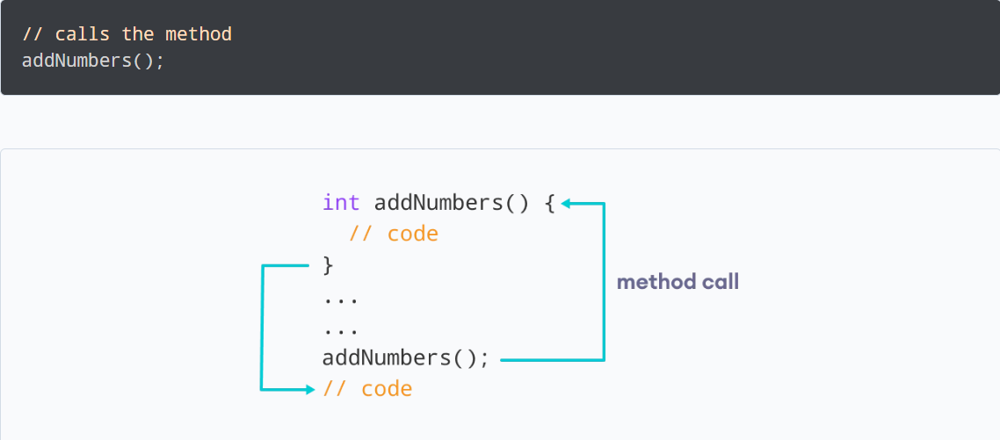

= Method in Java
:revnumber: 1.1
:revdate: 2024-08-16
:doctype: book
:toc: left
:sectnums:
:icons: font
:highlightjs-languages: java
:url-quickref: https://docs.asciidoctor.org/asciidoc/latest/syntax-quick-reference/

A *method* is a block of code which only runs when it is called.

You can pass data, known as parameters, into a method.

Methods are used to perform certain actions, and they are also known as *functions*.

TIP: *Why use methods?* To reuse code: define the code once, and use it many times.

== Syntax

Method Signature: :: every method has a method signature.
It is a part of the method declaration.
It includes the *method name* and *parameter list*.
Access Specifier: :: access specifier or modifier is the access type of the method.
It specifies the visibility of the method.
Java provides four types of access specifier: *public, private, protected, default*.
Return Type: :: return type is a data type that the method returns.
It may have a primitive data type, object, collection, void, etc.
If the method does not return anything, we use *void* keyword.
Method Name: :: it is a unique name that is used to define the name of a method.
It must be corresponding to the functionality of the method.
Suppose, if we are creating a method for subtraction of two numbers, the method name must be _subtraction()_.
A method is invoked by its name.
Parameter List: :: it is the list of parameters separated by a comma and enclosed in the pair of parentheses.
It contains the data type and variable name.
If the method has no parameter, left the parentheses blank.
Method Body: :: it is a part of the method declaration.
It contains all the actions to be performed.
It is enclosed within the pair of curly braces.

== Naming a method

While defining a method, remember that the method name must be a *verb* and start with a *lowercase* letter.

If the method name has more than two words, the first name must be a verb followed by adjective or noun.
In the multi-word method name, the first letter of each word must be in *uppercase* except the first word.

.Examples:
* *Single-word method name:* sum(), area()
* *Multi-word method name:* areaOfCircle(), stringComparison()

TIP: It is also possible that a method has the same name as another method name in the same class, it is known as *method overloading*.

== Calling a method

In the above example, we have declared a method named _addNumbers()_.
Now, to use the method, we need to call it.

== Types of methods

Methods in Java can be broadly classified into types:

* Predefined method
* User-defined method
* Static method
* Instance method
* Abstract method
* Factory method