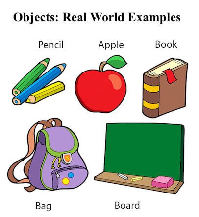

[#_object_in_java]
= Object in Java
:revnumber: 1.1
:revdate: 2024-08-16
:doctype: book
:toc: left
:sectnums:
:icons: font
:highlightjs-languages: java
:url-quickref: https://docs.asciidoctor.org/asciidoc/latest/syntax-quick-reference/

In the Java programming language, an *object* is an instance of a Java class, meaning it is a copy of a specific class.

== Primary characteristics

Java objects have three primary characteristics: *identity, state, and behavior*.

These characteristics are the building blocks of any class object and set the scene for how they are used.

Identity::: The identity of an object is a unique identifier, such as a memory address, ID, or even a name.
State::: Represents the data (value) of an object.
Behavior::: Object behavior is used to describe what an object can do, such as a fan turning on or off or changing speeds

== Real examples

----
Pen is an object.
-----------------
Its name is Reynolds;color is white, known as its state.
It is used to write, so writing is its behavior.
----

== Object Definitions:

* An object is _a real-world entity_.
* An object is _a runtime entity_.
* The object is _an entity which has state and behavior_.
* The object is _an instance of a class_.

== Ways to initialize an object

There are 3 ways to initialize object in Java.

* By reference variable
* By method
* By constructor

== Ways to create an object

* By *new* keyword
* By *newInstance()* method
* By *clone()* method
* By deserialization
* By factory method etc.