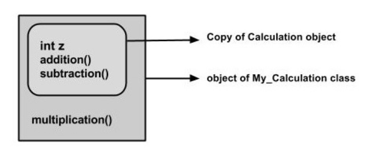
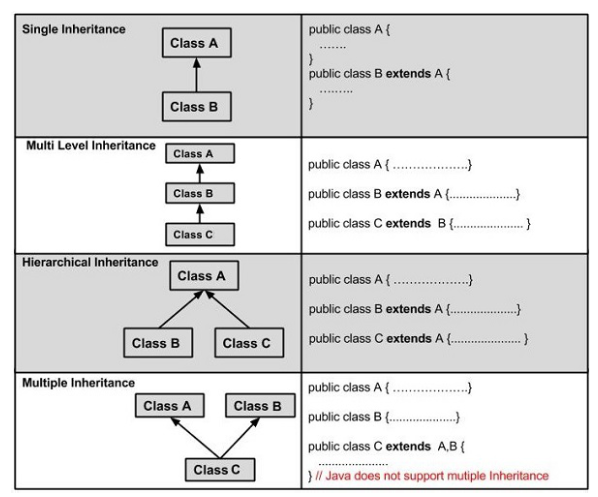

= Inheritance
:toc:
:sectnums:
:highlightjs-languages: asciidoc, java

== Basic idea
****
*_Inheritance_* can be defined as the process where one class acquires the properties (methods and fields) of another. With the use of inheritance the information is made manageable
in a hierarchical order.

The class which inherits the properties of other is known as subclass (derived class, child class) and the class whose properties are inherited is known as superclass (base class,
parent class).
****

== Extends keyword

****
To express the inheritance we use the *_extends_* keyword with the purpose to inherit the properties of a class. Following is the syntax of extends keyword.

[source%linenums,java]
----
class Super {

 }

 class Sub extends Super {

 }
----

*_Sample Code:_*

*link:My_Calculation.java[]* is an example demonstrating Java inheritance. In this example, you can observe two classes namely *_Calculation_* and *_My_Calculation_*.

By using *_extends_* keyword, *_My_Calculation_* class inherits *_addition()_* and *_subtraction()_* methods from *_Calculation_* class.

A subclass inherits all the members (_fields, methods, and nested classes_) from its superclass. _Constructors are not members, so they are not inherited by subclasses, but the constructor of the
superclass can be invoked from the subclass_.
****

== 'super' keyword

****
The *_super_* keyword is similar to *_this_* keyword. Following are the scenarios where the *_super_* keyword is used.

 - To *_differentiate the members_* of a superclass from the members of a subclass, in case they have identical names.
 - To *_invoke the superclass_* constructor from a subclass.
****

*_Differentiating the Members_*

****
If a class is inheriting properties of another class and if the members of the superclass have similar names as the sub class, to differentiate these members we use super keyword as shown
below.

[source%linenums,java]
----
 super.variable;

 super.method();
----

*_Sample Code:_*

*link:Sub_class.java[]* provides you a program that demonstrates the usage of *_super_* keyword.
****

*_Invoking Superclass Constructor_*

****
If a class is inheriting the properties of another class, the subclass automatically acquires the default constructor of the superclass. But if you want to call a parameterized constructor of the
superclass, you need to use the *_super_* keyword as shown below:

[source%linenums,java]
----
 super(values);
----
*_Sample Code_*

*link:Subclass.java[]* demonstrates how to use the *_super_* keyword to invoke the parametrized constructor of the superclass.
****

== IS-A relationship

****
*_IS-A_* is a way of saying: This object is a type of that class. Let us see how the *_extends_* keyword is used to achieve inheritance.

[source,java]
----
 public class Animal {
 }
 public class Mammal extends Animal {
 }
 public class Reptile extends Animal {
 }
 public class Dog extends Mammal {
 }
----

Based on the above example, in *_Object-Oriented terms_*, the following are true:

 - Animal is the superclass for Mammal class.
 - Animal is the superclass for Reptile class.
 - Mammal and Reptile are subclasses of Animal class.
 - Dog is a subclass of both Mammal and Animal classes.

If we consider the *_IS-A relationship_*, we can say:

 - Mammal IS-A Animal
 - Reptile IS-A Animal
 - Dog IS-A Mammal
 - Hence: Dog IS-A Animal as well

With the use of the *_extends_* keyword, subclasses will be able to inherit all the properties of a superclass except for the private ones.

*_Sample Code:_*

*link:Is_A_relationship.java[]* is a good example of IS-A Relationship
****

== implements keyword

****
Generally, the *_implements_* keyword is used with classes _to inherit the properties of an interface_. Interfaces can never be extended by a class.

[source%linenums,java]
----
public interface Animal {
 }
 public class Mammal implements Animal {
 }
 public class Dog extends Mammal {
 }
----

*_Sample Code:_*

*link:Implements_Example.java[]* is a good example of using *_implements_* keyword to show the inheritance.
****

== HAS-A relationship

****
These relationships are mainly based on behavior. This determines whether a certain class HAS-A certain thing/function/capability. This relationship helps to reduce duplication of code as well as bugs.

[source%linenums,java]
----
public class Vehicle {

}

public class Speed {

}

public class Van extends Vehicle {
 private Speed sp;
}
----

This shows that class Van HAS-A Speed. By having a separate class for Speed, we do not have to put the entire code that belongs to speed inside the Van class, which makes it possible to reuse the
Speed class in multiple applications.

In Object-Oriented feature, the users do not need to bother about which object is doing the real work. To achieve this, the *_Van.class_* hides the implementation details from the users of the *_Van.class_*. So, basically what happens is users would ask the *_Van.class_* to do a certain action and the *_Van.class_* will either do the work by itself or ask another class to perform the action.
****

== Types of Inheritance

****
There are various types of inheritance as demonstrated figure below:

A very important fact to remember is that Java does not support multiple inheritance. This means that a class cannot extend more than one class. Therefore, following is illegal and will not compile:

[source%linenums,java]
----
 public class extends Animal, Mammal {

 }
----

However, a class can implement one or more interfaces, which has allowed Java to overcome the impossibility of multiple classes inheritance.
****

== Resources

****
- https://www.tutorialspoint.com/java/java_inheritance.htm[Java - Inheritance]
- https://www.baeldung.com/java-inheritance[Guide to Inheritance in Java]
- https://www.youtube.com/watch?v=Zs342ePFvRI[Inheritance in Java - YT video]
- https://www.youtube.com/watch?v=C3B5IIlt4-0[When not to use inheritance - YT video]
****