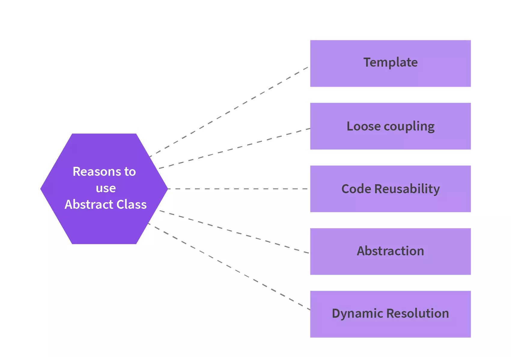
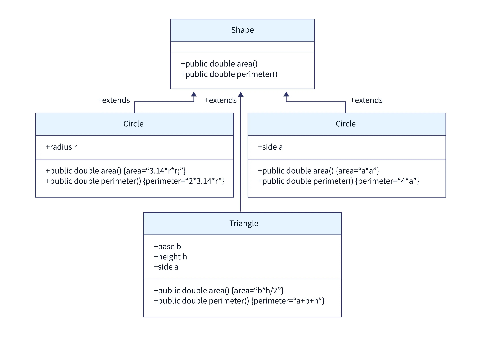

= Abstract class
:toc:
:icons: font
:url-quickref: https://docs.asciidoctor.org/asciidoc/latest/syntax-quick-reference/

An *abstract class* is a class that cannot be initiated by itself, it needs to be sub-classed by another class to use its properties.

* Abstract class in java is a class that is declared using the _abstract_ keyword.
* It contains abstract methods which means it has incomplete or unimplemented methods.
* Abstract classes can have abstract as well as non-abstract methods.
* Abstract classes can have constructors and static methods also.
* Abstract classes can have final methods which will force the subclass not to change the body of the method.
* We cannot create objects of an abstract class to use abstract class methods abstract class needs to be inherited.

=== Abstract class content:

* Data member
* Abstract method
* Method body (non-static method)
* Constructor

=== Syntax

`abstract class ClassName {
}`

=== Why Do We Need an Abstract Class in Java?

Template Programming:: Abstract classes provide a blueprint to be followed by the classes that extend the Abstract class.
Abstract Class because it gives a predefined template for any future specific class that you might need.
* Suppose you want to develop a calculator app for both Computers and Mobiles.
The calculator app will perform similar functions on both devices, with some differences in their implementations.
* We can have two classes - _ComputerCalc_ and _MobileCalc_ to represent the calculator interface in both devices.
* Using abstract class, you can enforce a set of methods that must be implemented by both the classes - _ComputerCalc_ and _MobileCalc_.
Hence, the abstract class provides a blueprint to be followed by these child classes.

Loose Coupling::
A method or class is almost independent in loose coupling, and they are less dependent on each other. In other words, the more one class or method knows about another class or method, the more tightly coupled the structure becomes. The more loosely connected the structure, the less the classes or methods know about each other.
To create a loosely coupled structure, abstract classes can be used. There are various benefits of Loose Coupling:
* Easy maintenance of the code. Changes can be made to one class without affecting other classes.
* Testing of loosely coupled structures is easier as we can divide the project into small modules and perform unit testing.

Code Reusability::
Using an abstract class in an application saves time. We can declare an abstract method in the abstract class and call it from anywhere required.
Abstract classes eliminate the need to repeatedly write the same code.

Abstraction::
Data abstraction in Java helps the developers hide the actual method implementation from the end user and display only the method names (APIs).
Abstract classes in Java help implement the concept of Abstraction as discussed before.

Dynamic Method Resolution::
Last but not least is Dynamic Method Resolution. The Abstract Classes enable us with dynamic method resolution or the dynamic method dispatch process.
The dynamic Method Resolution is a procedure where, at runtime, the calling of an overridden method is resolved.

=== Rules for Using Abstract Class in Java

* You have to use the keyword '_abstract_'.
* You cannot instantiate an abstract class.
* An abstract class can contain both abstract and non-abstract methods.
* You can include non-abstract final methods (a method that cannot be overridden) as well in your abstract class.
* Final methods in abstract classes can not be abstract. They must be implemented in the abstract class itself.
* You can also include constructors and non-abstract static methods in your abstract class.

==== Example
The image below shows 4 classes _Shape, Circle, Triangle, and Square_. The shape is an abstract class with two unimplemented methods _area(), perimeter()_.

The other three classes extend class Shape and implement both the methods area() and perimeter() of the abstract class. Hence, the classes Circle, Triangle, and Square are concrete classes.

