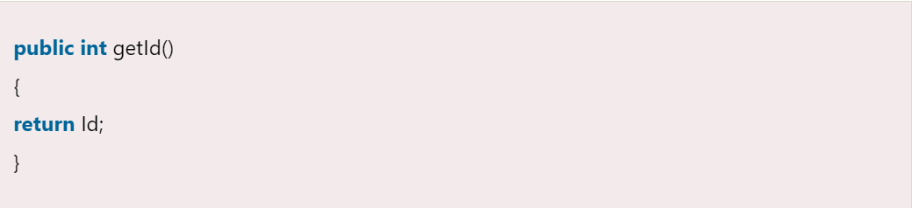
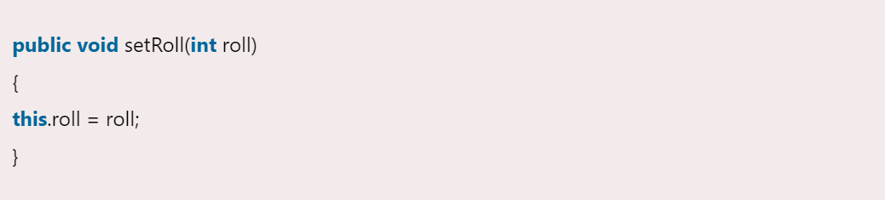

= Instance method
:icons: font
:url-quickref: https://docs.asciidoctor.org/asciidoc/latest/syntax-quick-reference/

The method of the class is known as an *instance method*.

It is a non-static method defined in the class.

TIP: Before calling or invoking the instance method, it is necessary to create an object of its class.

=== Types of instance method

Accessor method::
The method(s) that reads the instance variable(s) is known as the accessor method.

We can easily identify it because the method is prefixed with the word *get*.
It is also known as *getters*. It returns the value of the private field.
It is used to get the value of the private field.

Mutator Method::
The method(s) read the instance variable(s) and also modify the values.

We can easily identify it because the method is prefixed with the word *set*.
It is also known as *setters* or *modifiers*. It does not return anything. It accepts a parameter of the same data type that depends on the field.
It is used to set the value of the private field.

