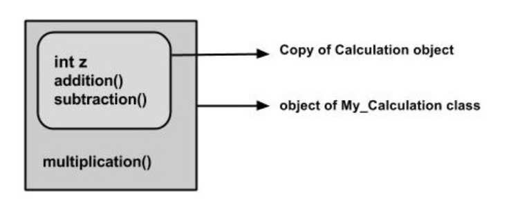
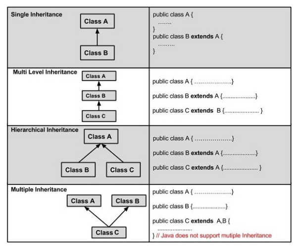

# Inheritance
***

## Contents
- [Basic idea](#basic-idea)
- [extends keyword](#extends-keyword)
- [super keyword](#super-keyword)
- [IS-A relationship](#is-a-relationship)
- [implements keyword](#implements-keyword)
- [HAS-A relationship](#has-a-relationship)
- [Types of Inheritance](#types-of-Inheritance)
- [Resources](#resources)

## Basic idea
***
**Inheritance** can be defined as the process where one class acquires the properties (methods and fields) of another. With the use of inheritance the information is made manageable 
in a hierarchical order.

The class which inherits the properties of other is known as subclass (derived class, child class) and the class whose properties are inherited is known as superclass (base class, 
parent class).

## extends keyword

To express the inheritance we use the **extends** keyword with the prupose to inherit the properties of a class. Following is the syntax of extends keyword.
        class Super {  
        .....  
        .....       
        }
        class Sub extends Super {  
        .....  
        .....  
        }

_Sample Code_ 
**My_Calculation.java**: is an example demonstrating Java inheritance. In this example, you can observe two classes namely Calculation and My_Calculation.

Using extends keyword, the My_Calculation inherits the methods addition() and Subtraction() of Calculation class.

A subclass inherits all the members (_fields, methods, and nested classes_) from its superclass. _Constructors are not members, so they are not inherited by subclasses, but the constructor of the
superclass can be invoked from the subclass_.

## super keyword

The **super** keyword is similar to **this** keyword. Following are the scenarios where the super keyword is used.
    - It is used to **differentiate the members** of superclass from the members of subclass, if they have same names.
    - It is used to **invoke the superclass** constructor from subclass.

_**Differentiating the Members**_
If a class is inheriting the properties of another class. And if the members of the superclass have the names same as the sub class, to differentiate these variables we use super keyword as shown
below.
        **super**.variable;
        **super**.method();

_Sample Code_
**Sub_class.java**: provides you a program that demonstrates the usage of the **super** keyword.

_**Invoking Superclass Constructor**_
If a class is inheriting the properties of another class, the subclass automatically acquires the default constructor of the superclass. But if you want to call a parameterized constructor of the
superclass, you need to use the super keyword as shown below.
        **super**(values);

_Sample Code_
_**Subclass.java**_: demonstrates how to use the super keyword to invoke the parametrized constructor of the superclass.

## IS-A relationship

_**IS-A**_ is a way of saying: This object is a type of that object. Let us see how the extends keyword is used to achieve inheritance.
                public class Animal {
                }
                public class Mammal extends Animal {
                }
                public class Reptile extends Animal {
                }
                public class Dog extends Mammal {
                }

Now, based on the above example, in _Object-Oriented terms_, the following are true:
                - Animal is the superclass of Mammal class.
                - Animal is the superclass of Reptile class.
                - Mammal and Reptile are subclasses of Animal class.
                - Dog is the subclass of both Mammal and Animal classes.

Now, if we consider the _IS-A relationship_, we can say −
                - Mammal IS-A Animal
                - Reptile IS-A Animal
                - Dog IS-A Mammal
                - Hence: Dog IS-A Animal as well

With the use of the extends keyword, the subclasses will be able to inherit all the properties of the superclass except for the private properties of the superclass.
_Sample Code_
_**Is_A_relationship.java**_: is a good example of IS-A Relationship

## implements keyword

Generally, the _**implements**_ keyword is used with classes _to inherit the properties of an interface_. Interfaces can never be extended by a class.
                public interface Animal {
                }
                public class Mammal implements Animal {
                }
                public class Dog extends Mammal {
                }
_Sample Code_
_**Implements_Example.java**_: is a good example of using _implements_ keyword to show the inheritance.

## HAS-A relationship

These relationships are mainly based on the usage. This determines whether a certain class HAS-A certain thing. This relationship helps to reduce duplication of code as well as bugs.
                public class Vehicle{}
                public class Speed{}
                public class Van extends Vehicle {
                    private Speed sp;
                }
This shows that class Van HAS-A Speed. By having a separate class for Speed, we do not have to put the entire code that belongs to speed inside the Van class, which makes it possible to reuse the
Speed class in multiple applications.

In Object-Oriented feature, the users do not need to bother about which object is doing the real work. To achieve this, the Van class hides the implementation details from the users of the Van
class. So, basically what happens is the users would ask the Van class to do a certain action and the Van class will either do the work by itself or ask another class to perform the action.

## Types of Inheritance

There are various types of inheritance as demonstrated figure below.

A very important fact to remember is that Java does not support multiple inheritance. This means that a class cannot extend more than one class. Therefore following is illegal:
                ~~public class extends Animal, Mammal{}~~
However, a class can implement one or more interfaces, which has helped Java get rid of the impossibility of multiple inheritance.

## Resources
***
- [Java - Inheritance](https://www.tutorialspoint.com/java/java_inheritance.htm)
- [Guide to Inheritance in Java](https://www.baeldung.com/java-inheritance)