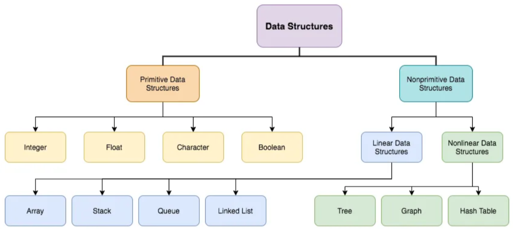

= Data Structure
:revnumber: 1.1
:revdate: 2024-08-16
:doctype: book
:toc: left
:sectnums:
:icons: font
:highlightjs-languages: java

== Introduction to Data Structures

*_What is Data Structure?_* +
A data structure is a way to store data.

We structure data in different ways depending on what data we have, and what we want to do with it.
It defines how information can be stored, accessed, and manipulated within a programming language.
Understanding correlations among data elements allows developers to process information more efficiently.

TIP: The data structures and data types are often used interchangeably.
But data structures are used to store the various data types.

*_What is needs of Data Structure?_* :::
The structure of the data and the synthesis of the algorithm are relative to each other.
Data presentation must be easy to understand so the developer, as well as the user, can make an efficient implementation of the operation.
. Data structure modification is easy
. It requires less time
. Save storage memory space
. Data representation is easy
. Easy access to the large database

image::resources/DS_memes.png[align="center"]

== Advantages and disadvantages of Data Structure

|===
|Advantages |Disadvantages

|*Efficiency:* If the choice of a data structure for implementing is proper, it makes the program very efficient in terms of time and space.
|*Implementation complexity:* Some data structures require complex algorithms and implementation methods, which can be difficult to understand and maintain.

|*Reusability:* The data structure provides reusability means that multiple client programs can use the data structure.
|*Limitations:* Some data structures have limitations on operations or require special conditions for efficient operation, which can complicate usage in certain scenarios.

|*Abstraction:* The data structure also provides the level of abstraction. The client cannot see the internal working of the data structure, so it does not have to worry about the implementation part. The client can only see the interface.
|*Need for selection:* Choosing the appropriate data structure depends on the specific task, and selecting the wrong one can lead to inefficient program operation.
|===

== Types of Data Structures

.In Java, data types are divided into *two large groups*
* Primitive
* Non-Primitive / reference

=== Primitive Data Structures

A primitive data structure can store the value of only one data type.
For example, a char data structure (a primitive data structure) can store only characters.

Key features of a primitive data structure:

* The size of a primitive data structure is known as it can store can only one data type.
* The primitive data structure will always store some data.
It cannot contain the *NULL* value.
* Examples of the primitive data type are integer, character, boolean, float, double, long, etc.

=== Non-Primitive Data Structures

Non-primitive data structures are created with primitive data structures as their building blocks to efficiently organize and manage a collection of data.
They can handle different data types and complex operations like searching, sorting, insertion, deletion, and more.

.The non-primitive data structure is divided into *two types:*
* Linear data structure (Array, Stack, Queue, Linked list) +
In linear data structures, the *elements are arranged in sequence* one after the other.
Since elements are arranged in particular order, they are easy to implement. +
However, when the complexity of the program increases, the linear data structures might not be the best choice because of operational complexities.

[NOTE]
====
More info about link:linear_types/linear_types.adoc[Linear types]
====

* Non-linear data structure (Tree, Graph, Hash Table) +
Unlike linear data structures, elements in non-linear data structures are not in any sequence.
Instead, *they are arranged in a hierarchical manner* where one element will be connected to one or more elements.

[NOTE]
====
More info about link:non-linear_types/non_linear_types.adoc[Non - linear types]
====
