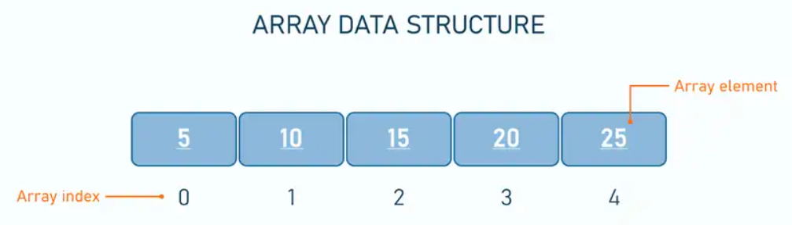
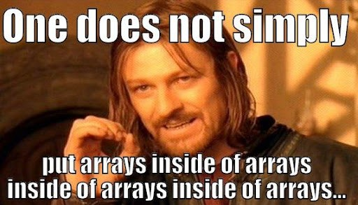
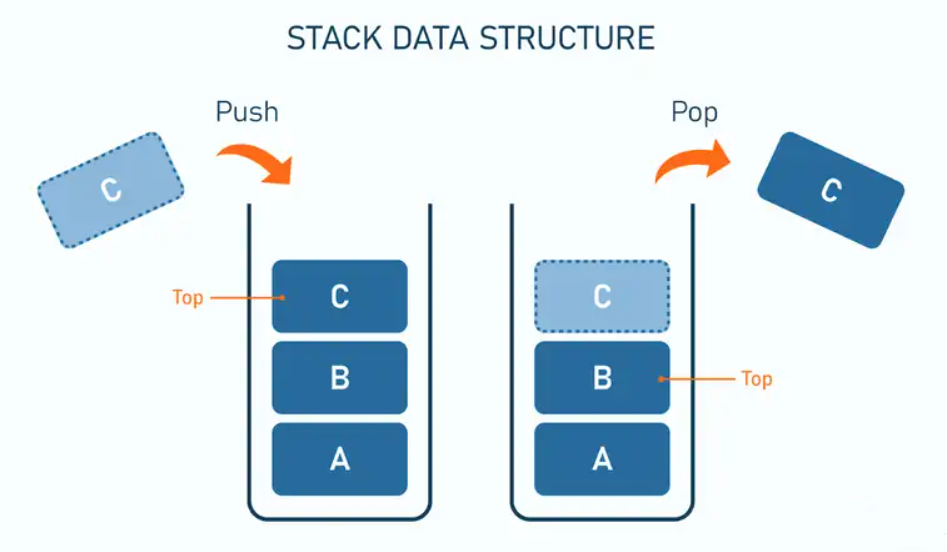
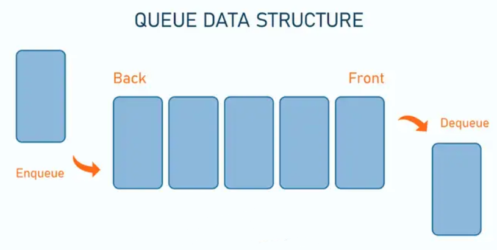
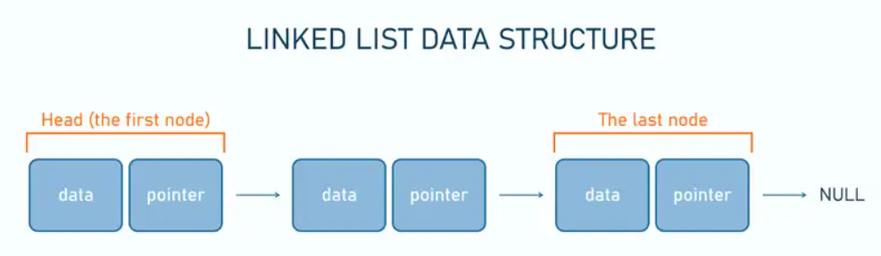

:icons: font
== Array

An Array is a data structure used to collect multiple data elements of the same data type into one variable. +

*Arrays can be classified into different types:*

* *One-Dimensional Array:* An Array with only one row of data elements is known as a One-Dimensional Array.
It is stored in ascending storage location.
* *Multidimensional Array:* We can define Multidimensional Array as an Array of Arrays.
Multidimensional Arrays are not bounded to two indices or two dimensions as they can include as many indices are per the need. +

The number of square brackets indicates the dimension of the array, and each array is initialized within curly braces. +

.*How to Create the Array?*
[source, java]
----
// One-Dimensional Array
dataType[] arrayName;
double[] data;

//Multidimensional  Array
int[][] array = new int[][];
----

.*How many elements can array this hold?*
To define the number of elements that an array can hold, we have to allocate memory for the array in Java.
In Java, we can declare and allocate the memory of an array in one single statement.
For example,
[source, java]
----
// One-Dimensional Array
double[] data = new double[10];

//Multidimensional  Array
int[][] array = new int[3][3];

----

.*How to Initialize Array?*
Here, we have created an array named age and initialized it with the values inside the curly brackets.

Note that we have not provided the size of the array.
In this case, the Java compiler automatically specifies the size by counting the number of elements in the array.
[source, java]
----
//declare and initialize one-dimensional array
int[] age = {12, 4, 5, 2, 5};

//declare and initialize multidimensional  array
int[][] myNumbers = { {1, 2, 3, 4}, {5, 6, 7} };
----

[NOTE]
====
* Array indices always start from 0. That is, the first element of an array is at index 0.
* If the size of an array is n, then the last element of the array will be at index n-1.
====

.*How to Access Elements of an Array?*
We can access the element of an array using the index number.
[source, java]
----
// One-Dimensional Array
array[index];
arr[0] = 10

//Multidimensional  Array
array[row_index][column_index]
arr[0][0] = 1
----

=== Useful links

[NOTE]
====
* Some example of usage and exercises you can find link:exercises/Array.java[here]
* https://www.geeksforgeeks.org/arrays-in-java/[Arrays in Java] and https://www.programiz.com/java-programming/arrays[Array tutorial]
* If you want to learn more about Multidimensional Arrays, visit the https://www.programiz.com/java-programming/multidimensional-array[Java multidimensional array]
====

== Stack

A stack is a linear structure.
Insertion or removal of any elements happens at the top of the stack.
It follows the
*Last In First Out* (LIFO) pattern. +
Stacks are particularly useful for managing data when the order of operations is important and when you need to access the most recently added elements first.

.*How to Create the Stack?*
[source, java]
----
Stack<type> stk = new Stack<>();
Stack<Integer> intStack = new Stack<>();
----

There are basically two operations that you can perform on stacks.
You can *add (push)* an element to a stack and *remove (pop)* an item from the stack

.*How to add Elements into The Stack?*
The push() method pushes an element, that is passed as the parameter, on the top of the stack.
[source, java]
----
intStack.push(0);
----

.*How to Retrieve Elements from The Stack?*
The pop() method removes and returns the top element of the stack
[source, java]
----
intStack.pop();
----

=== Useful links

[NOTE]
====
* Some example of usage and exercises you can find link:exercises/Stack.java[here]
* https://www.educative.io/answers/how-to-use-the-stack-class-in-java/[How to use the Stack in Java]
====

== Queue

Queues are sequential, linear structures.
However, queues process elements in the order that they were entered.
A queue follows the *First In, First Out* (FIFO) rule.

.*How to Create the Queue?*
You can use any class that implements the Queue interface, like LinkedList or PriorityQueue.
[source, java]
----
Queue q = new LinkedList<>();

Queue<String> q = new PriorityQueue<>();
----

.*How to add Elements into The Queue?*
Use the *add()* method or *offer()* method to append elements to the end of the Queue.
Remember, the add() method throws an exception if the element cannot be inserted, while the offer() method simply returns false.
[source, java]
----
q.add(1);

q.offer(2);
----

.*How to Remove Elements from The Queue?*
The *remove()* or *poll()* method can be then employed to delete elements from the queue
[source, java]
----
q.remove();

q.poll();
----

.*How to Access Elements of The Queue?*
The *remove()* or *poll()* method can be then employed to delete elements from the queue
[source, java]
----
q.peek();

q.element();
----

=== Useful links

[NOTE]
====
* Some example of usage and exercises you can find link:exercises/Queue.java[here]
* Learn more about Queues https://www.digitalocean.com/community/tutorials/java-queue[here] and
https://www.studysmarter.co.uk/explanations/computer-science/computer-programming/java-queue-interface/[here]
and https://www.softwaretestinghelp.com/java-queue-interface/[here]
====

== Linked list

A linked list consists of elements called nodes, each containing both data and a pointer (reference) to the next node in the sequence.
The first node is called the head, and the last one has a null reference, indicating the end of the list.
Each node can be placed at any available memory location, with the references between nodes enabling the traversal of the list.

.*How to Create the Linked List?*
You can use any class that implements the Queue interface, like LinkedList or PriorityQueue.
[source, java]
----
LinkedList<Type> list_name = new LinkedList<>();
LinkedList<String> list = new LinkedList<>();
----

.*How to add Elements into the Linked List?*
Use the *add()* method to add an element (node) at the end of the LinkedList.
[source, java]
----
list.add(str);
list.addLast("C");
list.addFirst("D");
----

.*How to Remove Elements from The Linked List?*
The *remove()* method of the LinkedList class is used to remove an element from the LinkedList.
[source, java]
----
list.remove(str);
list.removeFirst("C");
list.removeLast("D");
----

.*How to Access Elements of The Linked List?*
The *get()* method of the LinkedList class is used to access an element from the LinkedList.
In the below example, the get() method is used with parameter 1. Here, the method returns the element at index 1.
[source, java]
----
list.get(1);
----

.*How to Change Elements of The Linked List?*
The set() method of LinkedList class is used to change elements of the LinkedList.
Here, the set() method changes the element at index 3 to "str2".
[source, java]
----
list.set(3, "str2");
----

=== Useful links

[NOTE]
====
* Some example of usage and exercises you can find link:exercises/Linked_list.java[here]
* Learn more about Linked List https://www.geeksforgeeks.org/linked-list-in-java/[here] and
https://www.programiz.com/java-programming/linkedlist[here]
====
xref:../data_structure.adoc[Go back to Data Structure main page]
