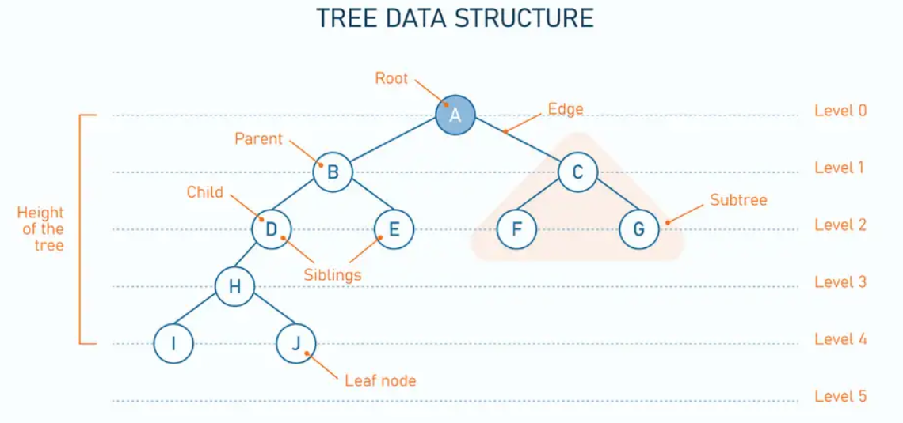
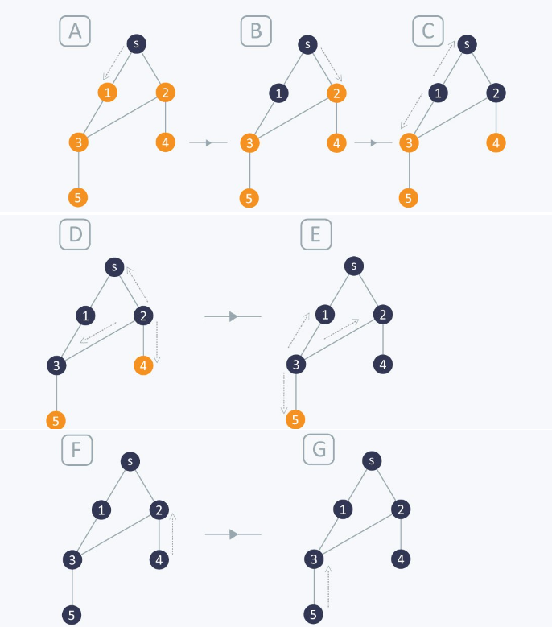
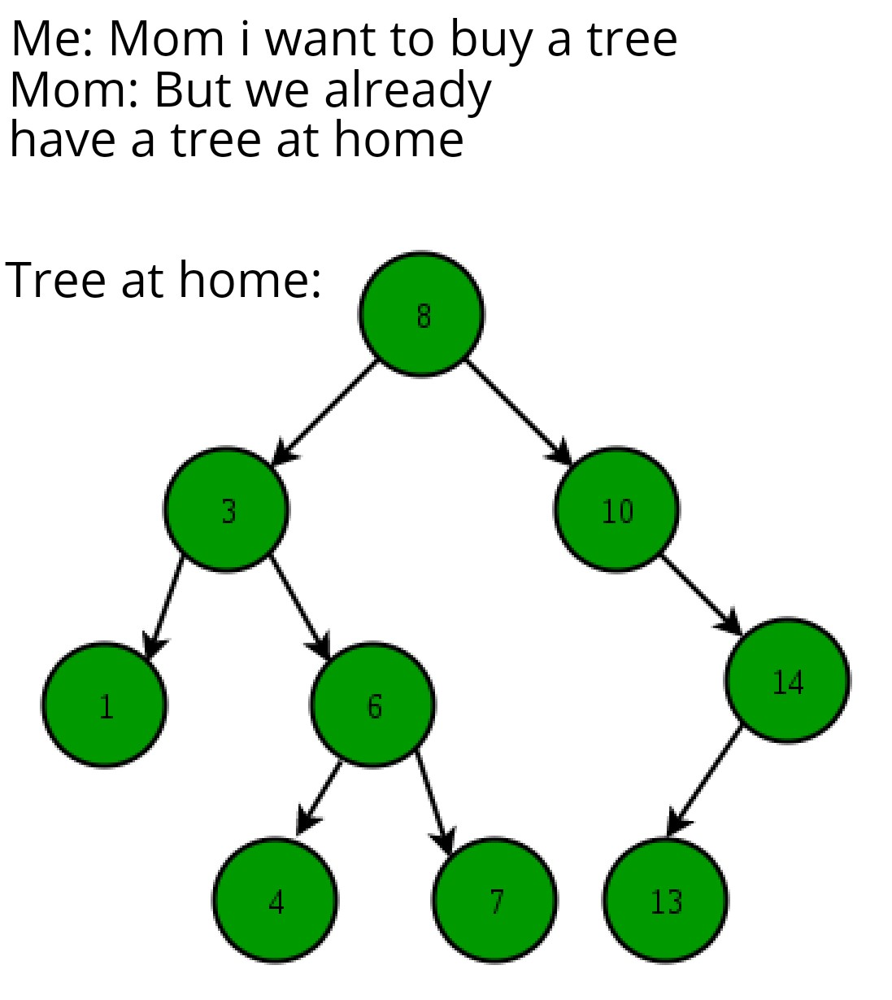
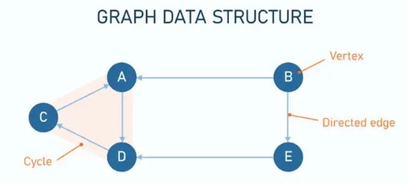
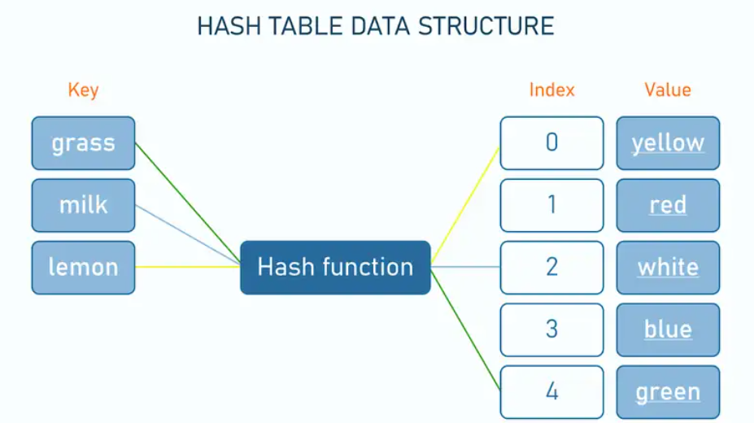
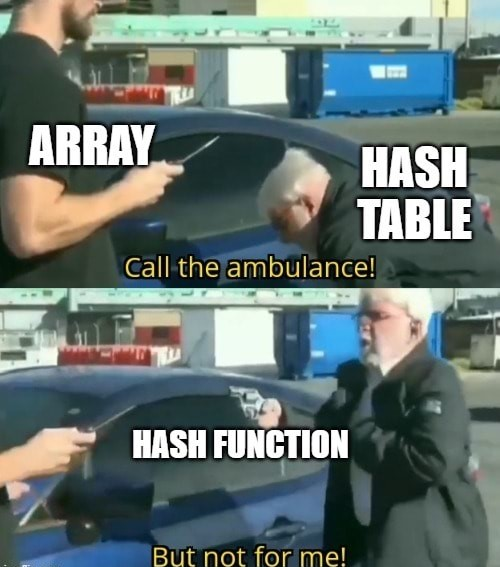

:revnumber: 1.1
:revdate: 2024-08-16
:doctype: book
:toc: left
:sectnums:
:icons: font
:highlightjs-languages: java

== Tree

A *tree* is a collection of elements (nodes) connected with edges that reflect parent-child relationships.
Each node (except the root—the topmost node) has a single parent.
Nodes without children are known as leaves.

*Types of Trees*::
There are many types of trees that we can use to organize data differently within a hierarchical structure.
The tree we use depends on the problem we are trying to solve.

|===
|Tree type |Description |Example

|N-ary trees
|In N-ary tree, a node can have child nodes from 0-N
a|image::../resources/n_ary_tree.png[]

|Balanced trees
|A balanced tree is a tree with almost all leaf nodes at the same level
a|image::../resources/balanced_tree.png[]

|Binary trees
|All interior nodes should have two children, and all leaves must have the same depth.
Look at this diagram to understand how a perfect binary tree looks.
a|image::../resources/perfect_binary_tree.png[]

|Red-Black Trees
a|

* The root is always black
* Two red nodes cannot be adjacent (i.e. a red parent cannot have a red child)
* A path from the root to a leaf should contain the same number of black nodes
* A null node is black
a|image::../resources/red_black_tree.png[]
|===

.*How to Create the Tree?*
You can use any class that implements the Queue interface, like LinkedList or PriorityQueue.

[source,java]
----
public class TreeNode {

  private int value;
  private List<TreeNode> childNodes;

  public TreeNode(int value) {
    this.value = value;
    this.childNodes = new ArrayList<>();
  }
TreeNode root = new TreeNode(1);
----

Also, the tree can be created using Map or Set:

[source,java]
----
TreeSet <String> tree1 = new TreeSet <String>();

TreeMap<Integer,String> tree2 = new TreeMap<Integer,String>();
----

.*How to add Elements into the Tree?*
Use the *add()* method to add an element (node) at the end of the LinkedList.

[source,java]
----
//method in TreeNode class
public void addChild(TreeNode child) {
    children.add(child);
  }

TreeNode root = new TreeNode(1);
root.addChild(new TreeNode(2));
root.addChild(new TreeNode(3));
root.addChild(new TreeNode(4));
----

|===
|Depth-First Search (DFS) |Breadth-First Search (BFS)

a| *Overview:* We follow a path from the starting node to the ending node and then start another
path until all nodes are visited. This is commonly implemented using stacks, and it requires
less memory than BFS. It is best for topographical sorting, such as graph backtracking or cycle detection.

*The steps for the DFS algorithm are as follows:*

. Pick a node. Push all adjacent nodes into a stack.
. Pop a node from that stack and push adjacent nodes into another stack.
. Repeat until the stack is empty, or you have reached your goal. As you visit nodes, you must mark them
as visited before proceeding, or you will be stuck in an infinite loop.

image::../resources/dfs.jpg[width=700]

a|*Overview:* We proceed level-by-level to visit all nodes at one level before going to the next.
The BFS algorithm is commonly implemented using queues, and it requires more memory than the DFS algorithm.
It is best for finding the shortest path between two nodes.

*The steps for the BFS algorithm are as follows:*

. Pick a node. Enqueue all adjacent nodes into a queue. Dequeue a node, and mark it as visited. Enqueue
all adjacent nodes into another queue.
. Repeat until the queue is empty of you have met your goal.
. As you visit nodes, you must mark them as visited before proceeding, or you will be stuck in an infinite loop.

|===

=== Useful links

[NOTE]
====
* Some example of usage and exercises you can find link:exercises/Tree.java[here]
* https://www.educative.io/blog/data-structures-trees-java#intro[A deep dive into trees with Java]
* Learn more about https://www.baeldung.com/java-binary-tree/[Implementing a Binary Tree in Java]
====

== Graph

*Types of Graph*::

|===
|Graph type |Description |Example

|Weighted Graph
|In a weighted graph, each edge contains some data (weight) such as distance, weight, height, etc.
It denoted as w(e). It is used to calculate the cost of traversing from one vertex to another.
a|image::../resources/weighted_graph.png[]

|Directed Graph
|In a directed graph, we use arrows instead of lines (edges). Direction denotes the way to reach
from one node to another node. Note that in a directed graph, we can move either in one direction
or in both directions.
a|image::../resources/directed_graph.png[]

|Multi Graph
|A graph that has multiple edges connecting the same pair of nodes.
a|image::../resources/multi_graph.png[]
|===

A *graph* is a data structure used to represent relationships between entities.
It consists of a set of nodes as vertices, and each vertex connects to others through edges. +
One of the fundamental distinctions between graphs and trees is that graphs can contain cycles, while trees cannot.
A cycle is a path in the graph that starts and ends at the same vertex, traversing edges without repeating any vertex.

.*How to Create the Graph?*
Java doesn’t have a default implementation of the graph data structure.
However, it can be implemented using Java Collections.

[source,java]
----
// Defining a vertex:
class Vertex {
    String label;
    Vertex(String label) {
        this.label = label;
    }
}

class Graph {
    private Map<Vertex, List<Vertex>> adjVertices;
    // standard constructor, getters, setters
}

//After adding all the vertices and edges, the graph can be created completely
Graph createGraph() {
    Graph graph = new Graph();
    graph.addVertex("Bob");
    graph.addVertex("Alice");
    graph.addVertex("Mark");
    graph.addEdge("Bob", "Alice");
    graph.addEdge("Alice", "Mark");
    return graph;
}
----

.*How to add Elements into the Graph?*
[source,java]
----
// A method to add a vertice
void addVertex(String label) {
    adjVertices.putIfAbsent(new Vertex(label), new ArrayList<>());
}

// A method to add an edge
void addEdge(String label1, String label2) {
    Vertex v1 = new Vertex(label1);
    Vertex v2 = new Vertex(label2);
    adjVertices.get(v1).add(v2);
    adjVertices.get(v2).add(v1);
}
----

.*How to Remove Elements from the Graph?*
[source,java]
----
// A method to remove a vertice
void removeVertex(String label) {
    Vertex v = new Vertex(label);
    adjVertices.values().stream().forEach(e -> e.remove(v));
    adjVertices.remove(new Vertex(label));
}

// A method to remove an edge
void removeEdge(String label1, String label2) {
    Vertex v1 = new Vertex(label1);
    Vertex v2 = new Vertex(label2);
    List<Vertex> eV1 = adjVertices.get(v1);
    List<Vertex> eV2 = adjVertices.get(v2);
    if (eV1 != null)
        eV1.remove(v2);
    if (eV2 != null)
        eV2.remove(v1);
}
----

.*How to Traverse Elements the Graph?*
To traverse a Graph means to start in one vertex, and go along the edges to visit other vertices until all vertices, or as many as possible, have been visited. +
The two most common ways a Graph can be traversed are:

. Depth First Search (DFS)
. Breadth First Search (BFS)

DFS is usually implemented using a Stack or by the use of recursion (which utilizes the call stack), while BFS is usually implemented using a Queue.
More details on these algorithms we covered in the section about trees.

=== Useful links

[NOTE]
====
* Some exercises you can find link:exercises/Graph.java[here]
* https://www.baeldung.com/cs/graphs[Graph Data Structures]
* Learn more about https://www.javatpoint.com/java-graph/[graph types] and https://www.baeldung.com/java-graphs[implementation]
====

== Hash Table

A *hash table* or hash map stores key-value pairs in an array.
The key is a unique identifier to access or retrieve the value, which is the associated data or information.

.*How to Create the Hash Table?*
[source,java]
----
Hashtable<Integer, String> hash1 = new Hashtable<Integer, String>();
----

.*How to add Elements into the Hash Table?*
[source,java]
----
hash1.put(1, "Free");
hash1.put(2, "Courses");
hash1.put(3, "on");
----

.*How to Remove Elements from the Hash Table?*
[source,java]
----
hashtable.remove(4);
----

.*How to Get Elements from the Hash Table?*
This example shows how to use the `getOrDefault()` function which returns the value to which a specified key is mapped, or a defaultValue if the hashtable contains no mapping for that key.

It takes two parameters: a key and a default value to be printed as a message if the key is not present in the hashtable.

[source,java]
----
hashtable.getOrDefault(2, "Not Found in the Hashtable");
----

.*How to Get Keys from the Hash Table?*
The `keys()` method is used to get an enumeration of the keys in this hashtable.

[source,java]
----
 // create enumeration for keys
      Enumeration en = hash1.keys();
// display search result
      while (en.hasMoreElements()) {
         System.out.println(en.nextElement());
----

.*How to get Size of the Hash Table?*
[source,java]
----
hash1.size();
----

=== Useful links

[NOTE]
====
* Some example of usage and exercises you can find link:exercises/Hash_Table.java[here]
* https://www.scaler.com/topics/hashtable-in-java/[Hashtable in Java tutorial]
* Learn more about https://www.javatpoint.com/java-hashtable/[methods of Java Hashtable]
====

xref:../data_structure.adoc[Go back to Data Structure main page]