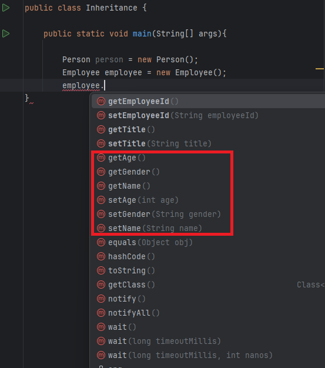

= Applied OOP
:toc:
:sectnums:

Author Name: Igor Chele 28.03.2024

=== Encapsulation

Encapsulation is (one of) the fundamental principle of object-oriented programming (OOP).

It refers to the bundling of data (attributes or properties) and methods (functions or procedures) that operate on the data into a single unit called a class.
Encapsulation hides the internal state of an object from the outside world and only exposes the necessary functionalities through well-defined interfaces.
This helps in ensuring data integrity, promoting code modularity, and reducing system complexity.

To achieve this, you must:

* declare class variables/attributes as *private*
* provide public *get* and *set* methods to access and update the value of a private variable

[source%linenums,java]
----
public class Person {
    private String name;
    private int age;
    private String gender;

    public String getName() {
        return name;
    }

    public void setName(String name) {
        this.name = name;
    }

    public int getAge() {
        return age;
    }

    public void setAge(int age) {
        this.age = age;
    }

    public String getGender() {
        return gender;
    }

    public void setGender(String gender) {
        this.gender = gender;
    }
}

----

****
See a full example attached in the link:Examples/Encapsulation/[Encapsulation] package.
****

Also , strongly recomended to watch these bedtime stories useful not only for encapsulation.

https://www.youtube.com/watch?v=Mb1TJprZb1c[Encapsulation]

video::Mb1TJprZb1c[youtube]

and https://www.youtube.com/watch?v=WZEPT77pB0g[Encapsulation aplication]

video::WZEPT77pB0g[youtube]

Conclusions:

==== Why should we use it?

* Better control of class attributes and methods
* Class attributes can be made *read-only* (if you only use the get method), or *write-only* (if you only use the set method)
* Flexible: the programmer can change one part of the code without affecting other parts
* Increased security of data

---

=== Inheritance

Inheritance is a key feature of OOP, where classes can inherit attributes and methods from other classes.

It is the mechanism in Java by which one class is allowed to inherit the features (fields and methods) of another class.
We are achieving inheritance by using extends keyword.
Inheritance is also known as “is-a” relationship.

Let us discuss some frequently used important terminologies:

    Superclass: The class whose features are inherited is known as superclass (also known as base or parent class).

    Subclass: The class that inherits the other class is known as subclass (also known as derived or extended or child class). The subclass can add its own fields and methods in addition to the superclass fields and methods.

    Reusability: Inheritance supports the concept of “reusability”, i.e. when we want to create a new class and there is already a class that includes some of the code that we want, we can derive our new class from the existing class. By doing this, we are reusing the fields and methods of the existing class.

An example of Inheritance area applications are UI tests , where some elements (page header/footer or a sidebar) are common for all pages, this way these elements are part of a BasePage/HomePage class as a Superclass and are available in all subclasses (other pages: LoginPage, RegisterPage, CartPage, ...)

In the example below Employee object gets access to getter and setter methods inherited from Person class additional to those from Employee class.

****
See the full example attached in the link:Examples/Inheritance/[Inheritance] package.

****

Also, this topic is detailed in a separate chapter, see link:../10_inheritance_and_access_modifiers/Example/Access_Modifiers/README_ACCESS_MODIFIERS.adoc[Inheritance & Access modifiers]

If you have some tea and cookies :

https://www.youtube.com/watch?v=GgxMRbWzleI[Inheritance]

video::GgxMRbWzleI[youtube]

and https://www.youtube.com/watch?v=WlQacYskOu4[Constructors in Inheritance]

video::WlQacYskOu4[youtube]

---

=== Polymorphism

Polymorphism allows objects of different classes to be treated as objects of a common superclass.
This enables a single interface to represent different types of objects and allows for code reuse and flexibility in software design.

There are two main types of polymorphism: compile-time (static) polymorphism and runtime (dynamic) polymorphism.

* Compile-Time Polymorphism: Also known as static polymorphism, compile-time polymorphism occurs when the decision about which method to execute is made at compile time.
This is typically achieved through method overloading and operator overloading.

** Method Overloading: Method overloading allows a class to have multiple methods with the same name but with different parameters.
The compiler determines which method to call based on the number and types of arguments passed to the method at compile time.

** Operator Overloading: Some languages allow operators such as +, -, *, etc., to be overloaded so that they can operate differently depending on the types of operands involved.
However, not all programming languages support operator overloading.

* Runtime Polymorphism: Also known as dynamic polymorphism, runtime polymorphism occurs when the decision about which method to execute is made at runtime.
This is typically achieved through method overriding and interface implementation.

** Method Overriding: Method overriding allows a subclass to provide a specific implementation of a method that is already defined in its superclass.
The decision about which method to call is made at runtime based on the type of object.

** Interface Polymorphism: Interface polymorphism occurs when multiple classes implement the same interface, and objects of these classes are treated as objects of the interface type.
This allows for more flexibility and loose coupling in the design. (present in link:Examples/Abstraction/viaInterface/Book.java[Book class] )

****
See an example attached in the link:Examples/Polymorphism/[Polymorphism] package.
****

Check also link:../11_overloading_overriding/overloading_vs_overriding.adoc[Overriding vs. Overloading].

And watch this with morning coffee: https://www.youtube.com/watch?v=o6HEb-DBtAc&t=3s[Polymorphism]

video::o6HEb-DBtAc&t=3s[youtube]

----
Exercise: Create a class called Fruit.
This class should contain a field called calories and a method called makeJuice(), which prints a statement — something like “juice is made” - just something generic.

Then create two subclasses of the Fruit class. For example, you can do Apple and Banana, or Orange and Lemon, whatever you would like to do.

And then create methods within these classes that are specific to them.

So, if you're going to do the Apple class, then do something like removeSeeds().
If you're going to do the Banana class, then do something like peel().
And then set the calories within the constructors of these subclasses.

Override the makeJuice() method to print the specific type of juice that's going to be made. And then finally create a Market class which tests polymorphism by creating several variations of these objects.
----

---

=== Abstraction

Abstraction involves hiding the complex implementation details and showing only the necessary features of an object.
Applied OOP utilizes abstraction to create clear and understandable interfaces for interacting with objects, without exposing the underlying complexities.

Abstraction promotes code reusability by defining common interfaces or abstract classes that can be implemented or extended by multiple concrete classes.
This reduces code duplication and makes it easier to maintain and extend the codebase.

As example, we can have an abstract class with many methods and other classes that extends the abstract class will implement only the ones that are needed (In this case the class will also be an abstract one)

Other example is when we have multiple classes that implements inherited abstract methods by overriding them (See more details about this in link:../11_overloading_overriding/overloading_vs_overriding.adoc[Overriding vs. Overloading])

Bedtime story for this topic: https://www.youtube.com/watch?v=7Yz_m2XjVCg[Abstraction]

video::7Yz_m2XjVCg[youtube]

****
See an example attached in the link:Examples/Abstraction/viaClass/[Abstraction/viaClass] package.
****

Abstraction can be also implemented through Interfaces.
The main difference is that while Java does not support "multiple inheritance" (a class can inherit only from one Superclass) a class can *implement* multiple interfaces.

Bedtime story: https://www.youtube.com/watch?v=gweKCKVkfp0&t=1s[Interfaces]

video::gweKCKVkfp0&t=1s[youtube]

****
See an example attached in the link:Examples/Abstraction/viaInterface[Abstraction/viaInterface] package.
****

----

Exercise:
create an abstract class called Animal, which declares an abstract method called makeSound(), and implements a non-abstract method called eat().

Then create a Pig class and a Duck class that both extend the Animal class.
Finally, create a Farm class to test these implementations.

