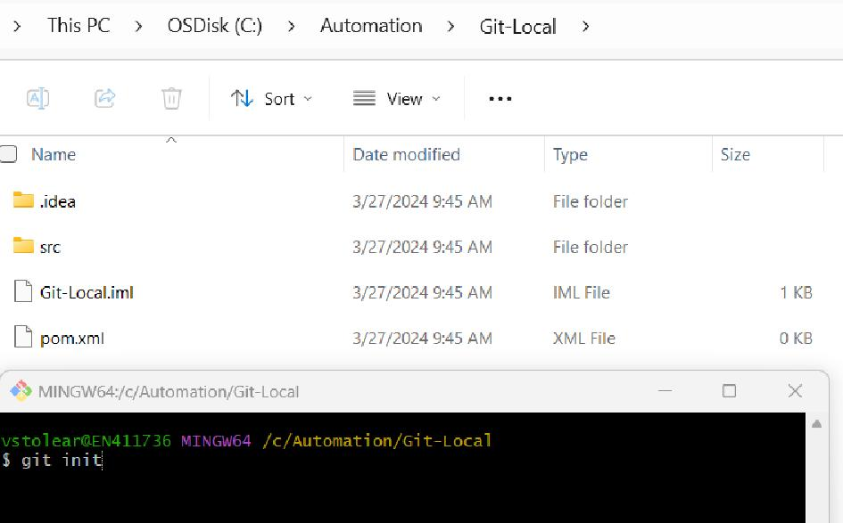

= Version Control
---

== Table of Contents ==
:toc:
<<introduction, 1. Introduction to VC and Hosting services>> +
<<start, 2. Start working with GIT>> +
<<conflicts, 3. Resolving Conflicts>> +
<<gitignore, 4. .gitignore file>> +
<<best, 5. Best Practices>> +
<<exercises, 6. GIT Exercises>> +
<<quiz, 7. GIT Quiz>> +
<<resources, 8. Resources>> +

[[introduction]]
== 1. Introduction to VC and Hosting services ==

Version control is a system that tracks the progress of code across the software development lifecycle and its multiple iterations – which maintains a record of every change complete with authorship, timestamp, and other details – and also aids in managing change.

=== 1.1. Types of Version Control Systems ===

 * Local Version Control Systems +
 * Centralized Version Control Systems +
 * Distributed Version Control Systems +

*Local Version Control Systems:* It is one of the simplest forms and has a database that kept all the changes to files under revision control. RCS is one of the most common VCS tools. It keeps patch sets (differences between files) in a special format on disk. By adding up all the patches it can then re-create what any file looked like at any point in time.

*Centralized Version Control Systems (CVCS):* Centralized version control systems contain just one repository globally and every user need to commit for reflecting one’s changes in the repository. It is possible for others to see your changes by updating.

Two things are required to make your changes visible to others which are:

 * You commit +
 * They update +

*Distributed Version Control Systems:* Distributed version control systems contain multiple repositories. Each user has their own repository and working copy. Just committing your changes will not give others access to your changes. This is because commit will reflect those changes in your local repository, and you need to push them in order to make them visible on the central repository. Similarly, When you update, you do not get others’ changes unless you have first pulled those changes into your repository.

To make your changes visible to others, 4 things are required:

 * You commit
 * You push
 * They pull
 * They update

The most popular distributed version control systems are *Git*, and Mercurial. They help us overcome the problem of single point of failure.

=== 1.2. The benefits of version control ===
Using a version control system, one can obtain the following benefits:

 * Streamline merging and branching. +
 * Examine and experiment with code, the ability to develop several sections of the code concurrently, this could save time. +
 * Keep track of every change made to the code. +
 * Access every file’s entire long-term modification history. +
 * Create regular, automated backups. +
 * Generate management summaries. +
 * Stay compliant with regulations. +
 * Reduce error and duplication, you always have the latest current version in front of you. +
 * Time saving: no more searching for the correct version of a document. +
 * No more accidentally working in an old or wrong version; you no longer need to compare documents to spot differences. +
 * The right information is easier to share. +
 * You need less storage space because there are no locally stored copies of documents. +
 * You can easily view older versions of the document. +
 * Informs us about Who, What, When, Why changes have been made. +
 * Version numbers are updated automatically, no need to do this manually. +
 * And of course, all this makes working together easier, more efficient and less prone to errors.

=== 1.3. Industry jargon ===

 * *Repository (repo)* – Location where the project files are stored. +
 * *Server* – The system storing the repository. +
 * *Client* – The computer connecting to the repository. +
 * *Working copy* – Your local directory of files. +
 * *HEAD* – The latest revision of the repository. +

=== 1.4. The main version control systems ===

There are numerous VCSs available in the market, based on their features and popularity. While working on any project, the team prefer to choose the one which offers the best features. Examples: +

 * *Git*, +
 * Apache Subversion (SVN), +
 * Concurrent Version Systems (CVS), +
 * Mercurial, +
 * AWS CodeCommit, +
 * TFS and others. +

=== 1.5. Hosting Services ===

Version control hosting solutions are cloud-based technologies that host numerous code repositories and connect with and frequently provide online capabilities to make version control systems easier to use.  +
Version control hosting solutions enable developers to create a master repository that is hosted online, allowing them to avoid confusion by treating it as the source of truth for integrating their code. Hosting solutions for version control integrate with at least one version control system, but they frequently integrate with numerous. +
Provide a web-based repository for developers to commit their code and download fresh changes from other developers. Allow for the existence of many repositories at the same time. Make it possible to browse the source code and the changes made to it.

The most popular hosting service providers that have gained popularity due to their robust features, extensive integrations, and developer-friendly interfaces: +
*1. GitHub* +
2. GitLab +
3. Bitbucket +
4. Azure DevOps +
5. AWS CodeCommit +

[[start]]
== 2. Start working with GIT ==

=== 2.1.  What is GIT ===

* Git is distributed version control software; +
* Cross-platform; +
* Amazing command line utility, known as git bash; +
* Compatible with HTTP, FTP, and SSH; +
* Free and open source; +
* Instant Backup; +
* Efficient and Low requirements; +
* Every copy of Git repository can serve either as the server or as a client and has [red]#complete# history; +
* Git tracks [red]#changes#, not versions.

IMPORTANT: [red]*There are a few things you should know before getting started with Git:*

* Branches are lightweight and cheap, so it's OK to have many of them; +
* Git stores changes in SHA hashes, which work by compressing text files; +
* Git is a very good VCS for software programming, but not so good for binary files like images or videos; +
* Git repositories can be connected, so you can work on one locally on your own machine, and connect it to a shared repository. This way, you can push and pull changes to a repository and easily collaborate with others.

=== 2.2.  Why use GIT ===

Version control is very important - without it, you *risk losing your work*. With Git, you can make a "commit", or a save point, as often as you'd like.
There are many version control systems out there - but Git has some major advantages: +

*1. Speed* - Git uses SHA compression, which makes it very fast. +
*2. Merge conflicts* - Can handle merge conflicts, which mean that it's OK for multiple people to work on the same file at the same time. +
*3. Cheap branches* - It is possible to make changes in a safe sandbox for commit, push, get fast feedback and peer review. +
*4. Ease of roll back* - You can easily revert that change, or roll back the branch pointer to the commit where everything was fine. +
*5. Automatic Garbage Collection* - in some cases can be called explicitly *_git gc -prune_*

=== 2.3. Working with GIT  ===
==== 2.3.1.  Installing GIT  ====

*1.* You can access the following link to install https://git-scm.com/download/win[GIT for Windows] or for other operating systems you can click on the link https://git-scm.com/downloads[Downloads] and download the latest version. +
*2.* Open the windows command prompt (or *Git Bash* if you selected not to use the standard Git Windows Command Prompt during the Git installation). +
*3.* Type *_git --version_* to verify Git was installed.

As a result you will see the version of the GIT installed as was indicated in the image below:

==== 2.3.2. GIT configuration ====
After installing the git, you can customize its environment accordingly. The customization shall be done on any given computer. Git comes with a tool called *git config* that helps to set configuration variables, that look after the operation of git.

IMPORTANT: [red]*The configuration is done _only once_ after installing git on your local device if you pass the _--global_ option.*
----
git config [--global] user.name “John Doe” -> set up your name.
git config [--global] user.email "john.doe@mail.com" –> set up your email.
git config –l –> check your current configurations.
----

The [--global] parameter is required if you want to set these configurations for all your local repositories. Remove the [] if you want to use the –global parameter or completely delete it if you want to configure only your current repository.

==== 2.3.3. Start working with a repository ====

You typically obtain a Git repository in one of two ways:

*Option 1.* You can take a local directory that is currently not under version control, and turn it into a Git repository, or +
*Option 2.* You can *clone* an existing Git repository from elsewhere.

In either case, you end up with a Git repository on your local machine, ready for work.

*Option 1: Create a local repository with examples for each step.* +
*1.* Create a new project in Intellij/Visual Studio. +

*2.* Open bash/terminal in the project directory and write the following command: *_git init_*. to initialize a local git repo in current directory+

As a result you will see that the .git repository was added that you can see below:

*3.* In the project add a new file, open the Terminal and write *_git status_* command to show status of current HEAD:

*4.* The next step write in terminal the command *_git add ._* that add all untracked changes to commit, followed by *_git commit -m "commit message"_* that perform commit on local with message.

*5.* Use the *_git log_* to review and read a history of everything that happened to a repository.

*6.* Create a new repository on GitHub. +
IMPORTANT: [red]*Create a new account on GitHub using your personal email.* +

As a result in case you add some files on repo you will see the "Initial commit"

*7.* In order to connect remote repository with local repository it is necessary to use *_git remote add origin_* command as follows:

*a.* Copy the git url from remote repository

*b.* In the project open the terminal and write *git remote add origin copied url*.

*8.* Next step you will pull the changes from the remote using *_git pull origin main_*. Take care on the names of the _main/master_ branches that you have on the remote and local repo.

*9.* In order to synchronize the remote files with local files it is necessary to use *_git rebase origin/main_*

Also, the local project was synchronized

*10.* Let's take a look at git commit history after our changes.

*11.* The next step is to use *_git push origin main_* command to upload local repository content to a remote repository.

image::resources/gitPushOrigin1.jpg[]

Also, we need to see the changes on remote repo.

For other cases how to use the _git remote add origin_ option please go to the
https://www.youtube.com/watch?v=jq1ROBgmEzw&ab_channel=CameronMcKenzie[link].

*Option 2: Clone an existing external repo* +

*1.* Navigate to the repo location on the server. +
*2.* Copy the repo link (ending with .git). +
*3.* In IntelliJ use Git -> Clone... +
*4.* Paste the copied link, select the Directory and press Clone button.

==== 2.3.4. GIT Repository Structure ====
A working tree in a Git Repository is the collection of files which are originated from a certain version of the repository. It helps in tracking the changes done by a specific user on one version of the repository. Whenever an operation is committed by the user, Git will look only for the files which are present in the working area, and not all the modified files. +
Only the files which are present in the working area are considered for commit operation.
There are a few stages of a file in the working tree of a repository:

* *Untracked:* In this stage, the Git repository is unable to track the file, which means that the file is never staged, nor it is committed. The file is present in the working directory but Git is unaware of its existence.
* *Tracked:* When the Git repository tracks a file, which means the file is committed but is not staged in the working directory. In this the file changes have been committed at some point in the repository’s history.
* *Modified/Dirty:* When the changes are made to the file i.e. the file is modified but the change is not yet staged.
* *Staged:* In this stage, the file is ready to be committed and is placed in the staging area waiting for the next commit. The changes in the file have been marked and to be included in the next commit.

After the changes are done in the working area, the user can either update these changes in the GIT repository or revert the changes.

*GIT Repository Areas*

After performing various modifications on a file in the Working Area, GIT needs to follow more steps to save these changes in the local repository.

It consists of 4 parts:

*1. Working directory:* This is your local directory where you make the project (write code) and make changes to it. +
Moving From Working directory to Staging Area is done by the use of *_git add_* command. +
*2.Staging Area (or index):* This is an area where you first need to put your project before committing. This is used for code review by other team members. That stores information about what will go into your next commit. Its technical name in Git parlance is the “index”, but the phrase “staging area” works just as well. +
Moving from Staging Area to Local Repo is done by the use of *_git commit_ or _git commit -m ""_*. +
 This commit command is used to add any of the tracked files to staging area and commit them by providing a message to remember. +
*3.Local Repository:* this is your local repository where you commit changes to the project before pushing them to the central repository on GitHub. This is what is provided by the distributed version control system. This corresponds to the .git folder in our directory. +
Moving from Local Repository to Remote Repo is done by the use of *_git push_*. +
This command is used to push all the commits of the current repository to the tracked remote repository. +
*4.Central Repository or Remote repo:* This is the main project on the central server, a copy of which is with every team member as a local repository.
All the repository structure is internal to Git and is transparent to the whole team.

==== 2.3.5. GIT Main Workflow ====

IMPORTANT: [red]*For beginners who use _git_, as a suggestion it would be good for the first months to use the git commands from the terminal to understand what each command does and then to use the commands from the IDE.*

Below you can find the necessary commands to synchronize the local repo with remote one and the following steps to open a Pull Request:

1. *git stash* -> Use git stash to temporarily save uncommitted changes. This is handy when you need to switch branches but aren't ready to commit.
2. Before we create a new branch and push to it, we need to make sure we're on the master or main branch, and it's up-to-date with the cloud version: +
2.1. *git checkout master* -> switch to "master" branch +
2.2. *git fetch* -> downloads commits, files from a remote repository into your local repo. Fetching is what you do when you want to see what everybody else has been working on. +
2.3. *git pull* ->fetch from and integrate with another repository.
3. For each task it would be good to create a separate branch, identical to the main branch - master. +
3.1. *git checkout -b name_Task* or +
3.2. *git branch name_Task* and *git checkout name_Task*

The use of branches lets you manage the workflow more quickly and easily. For more information related git Branch Naming convention please access the https://acompiler.com/git-best-practices/#tve-jump-177388ab463[link]. +
4. When you finish with your changes use *git status* command -> displays the state of the working directory and the staging area. +
5. *git add .* -> adds a change in the working directory to the staging area. +
6. *git commit -m ""* -> When calling git commit , it is required to include a message. The message should be a short description of the changes being committed. The message should be at the end of the command and it must be wrapped in quotations " " . +
7. *git push origin <branch name>* -> pushes a local branch(es) to a remote repository (origin). Origin is the conventional shorthand name of the url for the remote repository (usually in GitHub or another cloud git repository provider) for your project. +
8. Go to the GitHub an open your repository. *Pull Requests* are vital as they help ensure that quality code. Short pull requests allow teammates to review and quickly merge code into the main branch efficiently. +
More details about git Pull Request Best Practices you can find on the https://acompiler.com/git-best-practices/#tve-jump-17738897abf[link]. +
9. If comments appear on the Pull Request, the *git commit amend* command can be used. A convenient way to modify the most recent commit. It lets you combine staged changes with the previous commit instead of creating an entirely new commit. It can also be used to simply edit the previous commit message without changing its snapshot. +
10. After the git commit amend please use *git push --force or git push -f* to overwrite the remote repository and match exactly what your local repo looked like when you ran the command. This means you need to make sure your local repository is entirely up-to-date with the latest changes from the remote before running Git push force, or you risk losing commits. +
11. After the PR Review when you receive the *Approval* from the reviewers you can proceed with the *merge*. Thus, the latest changes will be pushed to the origin/master branch.

[[conflicts]]
== 3. Resolving Conflicts ==

Git conflicts are inevitable.

How to solve conflicts? +
*1.* Identify the problem +
*2.* Choose the right resolution for each conflict (discuss with the author of the conflicting code) +
*3.* Merge the resolved conflicts +

There are a few steps that could reduce the steps needed to resolve merge conflicts in Git. +
*Step 1:* The easiest way to resolve a conflicted file is to open it and make any necessary changes. +
*Step 2:* After editing the file, we can use the git add command to stage the new merged content. +
*Step 3:* The final step is to create a new commit with the help of the git commit command. +
*Step 4:* Git will create a new merge commit to finalize the merge. +

Git commands that may play a significant role in resolving conflicts. +
*_Git Commands to Resolve Conflicts_* +
*1. git log --merge*
The git log --merge command helps to produce the list of commits that are causing the conflict. +
*2. git diff*
The git diff command helps to identify the differences between the states repositories or files. +
*3. git checkout*
The git checkout command is used to undo the changes made to the file, or for changing branches. +
*4. git reset --mixed*
The git reset --mixed command is used to undo changes to the working directory and staging area. +
*5. git merge --abort*
The git merge --abort command helps in exiting the merge process and returning back to the state before the merging began. +
*6. git reset*
The git reset command is used at the time of merge conflict to reset the conflicted files to their original state.

[[gitignore]]
== 4. .gitignore file ==

Gitignore is a text file that tells Git which files or directories in a project should be ignored. This avoids cluttering your repository with unnecessary files.
You should use a .gitignore file in each repository. It helps to ignore predefined files and directories. It may be config files, user settings, and other unwanted files.

To avoid committing unnecessary files in a repository, follow these steps:

1. Create a .gitignore file in the root directory of your repository. +
2. Open the .gitignore file in a text editor. +
3. List the filenames, directories, or file patterns that you want to exclude from version control, each on a new line. +
4. Save the .gitignore file.

Common patterns to include in .gitignore are: +
* Directory names (for example, node_modules/, dist/, build/) +
* File extensions (for example, *.log, *.tmp, .env) +
* Specific files (for example, secrets.txt, config.ini) +

Ensure that the .gitignore file is committed and pushed to the repository. Git will then automatically exclude the listed files and directories from being staged or committed.

Regularly review and update the .gitignore file as new files or directories become unnecessary to include in the repository. This practice helps maintain a clean and focused version control history.

[[best]]
== 5. Best Practices ==

* Commit *as soon as* you have a working piece of code.
* Do *think* what you commit and double-check the committed code.
* Do make *meaningful* commit messages (tell what it does, single line main description then after a full blank line describe in detail what the commit does, keep the lines short, include ticket/issue ID if possible).
* Do *1 commit per PR*.
* PR should contain *all changes* description.
* PR header should be *short, but meaningful*.
* Do *keep the project up to date*.
* Do *use branches*.
* Do think about *workflow and branching strategy*.
* Do read about git.
* Do use git stash with message for uncommitted changes.
* Do set up *.gitignore* file.
* Do keep *personal* and *work* repositories separate.

[[exercises]]
== 6. GIT Exercises ==
For Exercises please go to the following link: https://www.w3schools.com/git/git_exercises.asp?remote=github

[[quiz]]
== 7. GIT Quiz ==
For Quiz please go to the following links: +
1. https://www.w3schools.com/git/git_quiz.asp?remote=github +
2. https://www.w3resource.com/quizzes/git/index.php

[[resources]]
== 8. Resources ==

1. https://www.w3schools.com/git/default.asp?remote=github
2. https://www.geeksforgeeks.org/centralized-vs-distributed-version-control-which-one-should-we-choose/
3. https://www.geeksforgeeks.org/version-control-systems/
4. https://git-scm.com/book/en/v2/Getting-Started-About-Version-Control
5. https://documentaal.nl/en/versiebeheer-wat-is-het-en-wat-heb-je-eraan/
6. https://www.spiceworks.com/tech/devops/articles/what-is-version-control/
7. https://about.gitlab.com/topics/version-control/
8. https://www.geeksforgeeks.org/which-version-control-system-should-i-choose/?ref=next_article
9. https://webinarcare.com/best-version-control-hosting-software/
10. https://medium.com/@wandersonchavesbr14/repo-hosting-services-67e0608368d8
11. https://github.com/git-guides
12. https://www.geeksforgeeks.org/introduction-to-github/
13. https://github.com/git-guides/install-git
14. https://www.geeksforgeeks.org/introduction-and-installation-of-git/
15. https://www.geeksforgeeks.org/ultimate-guide-git-github/
16. https://www.youtube.com/watch?v=jq1ROBgmEzw&ab_channel=CameronMcKenzie
17. https://www.geeksforgeeks.org/what-is-a-git-repository/
18. https://www.geeksforgeeks.org/ultimate-guide-git-github/
19. https://git-scm.com/book/en/v2/Getting-Started-What-is-Git%3F
20. https://acompiler.com/git-best-practices/
21. https://acompiler.com/git-best-practices/#tve-jump-17738897abf
22. https://www.simplilearn.com/tutorials/git-tutorial/merge-conflicts-in-git
23. https://www.freecodecamp.org/news/how-to-use-git-best-practices-for-beginners/#basic-commands-to-create-and-commit-changes
24. https://www.freecodecamp.org/news/how-to-use-git-best-practices-for-beginners/#basic-commands-to-create-and-commit-changes
25. https://www.linkedin.com/pulse/git-best-practices-mastering-version-control-efficient/

Copyright (C) 2024 by Verginia Stolear