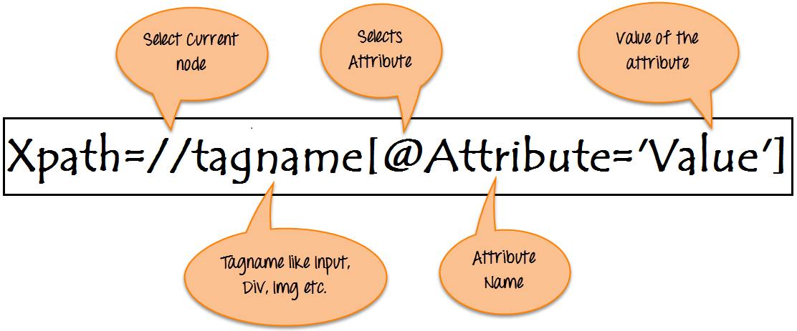
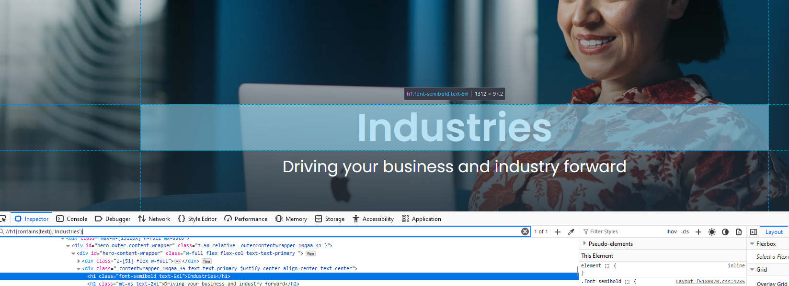
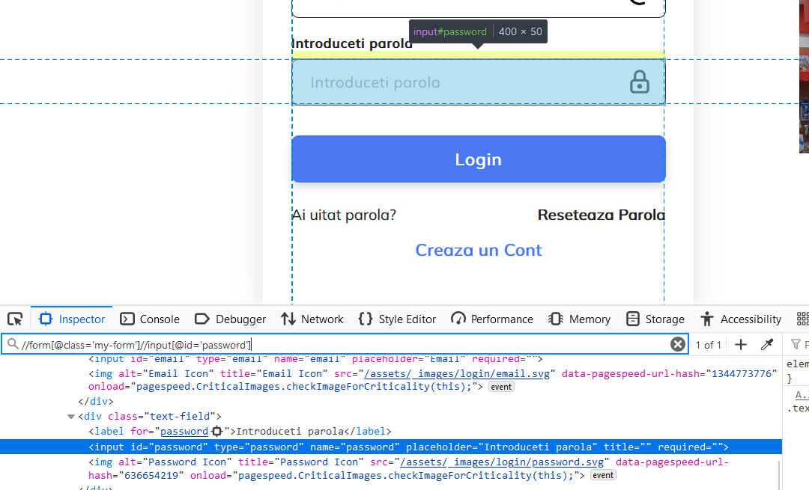
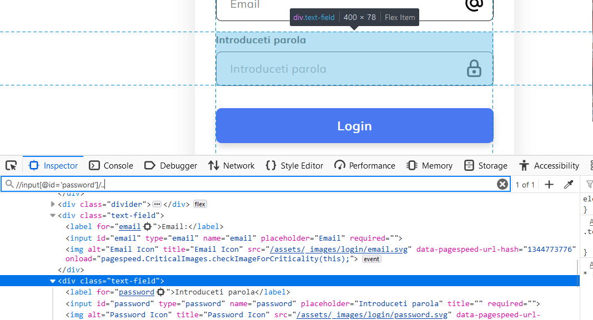
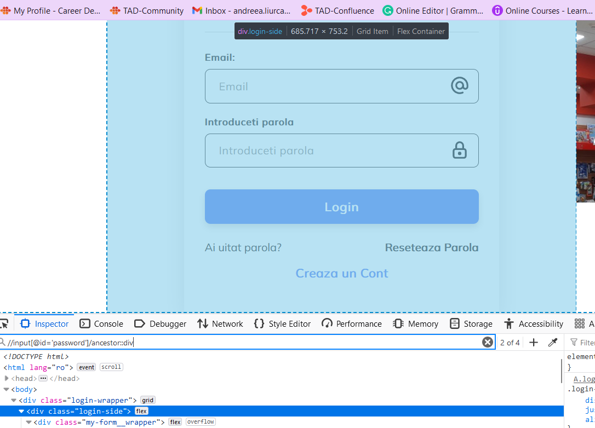
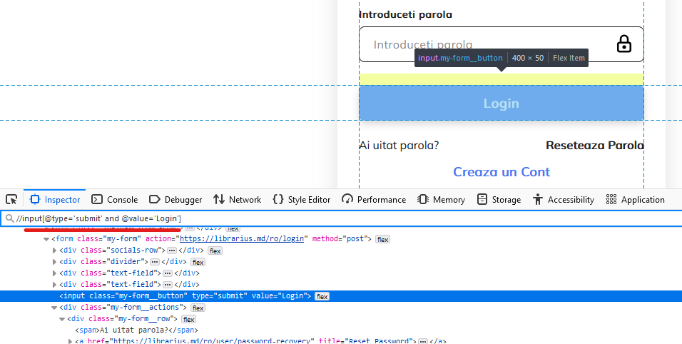
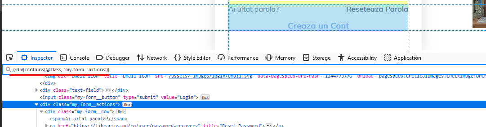
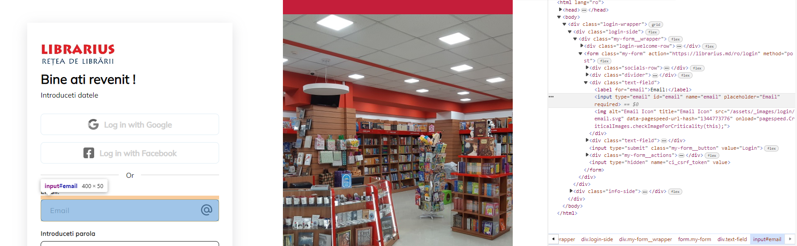

= How to identify XPaths. Tools for XPaths. Cheat sheet
Scurtu Stanislav, Liurca Andreea
<stanislav.scurtu@gmail.com>
:revnumber: 2.0
:revdate: 2024-04-17
:toc: left
:sectnums:
:icons: font

== Introduction to XPath: Navigating the Web Landscape

`XPath (XML Path Language)` is a query language used for navigating XML documents.
Is a crucial component in automating interactions with web pages through tools like Selenium WebDriver.
It's primarily employed for locating and manipulating elements on a webpage, offering a versatile and powerful approach for automation scripting.



'''

=== XPath Syntax Demystified: Absolute vs. Relative Paths

XPath's expressions can be categorized into absolute and relative paths.
Absolute paths begin from the root node, while relative paths initiate from the current node.
This flexibility enables developers to tailor their element identification strategies based on the structure of the HTML document.

📚Absolute XPath:

* Starts with a single forward slash `/` and follows the hierarchy of the HTML structure.

```xpath
/html/body/div[1]/input
```

📚Relative XPath:

* Doesn't start from the root element.
It starts from anywhere within the document.

```xpath
//input[@id='username']
```

'''

=== Strategies for Element Identification: Using Attributes and Hierarchy

* Using Attributes:

Identify elements based on their attributes (e.g., `id`, `class`, `name`).

```xpath
//*[@id='username']
```

* Using Element Hierarchy:

Traverse the HTML hierarchy to locate the desired element.

```xpath
//div[@class='container']//input[@name='password']
```

Text-based XPath: Beyond Attributes for Element Recognition Locate elements based on their visible text.

```xpath
//*[text()='Login']
```

XPath Axes: Navigating the HTML Universe Use axes like following, preceding, parent, etc., to navigate to different parts of the HTML structure.

```xpath
//div[@class='container']/following-sibling::div
```

== Tools for XPath Identification and Testing

.🌐Browser Developer Tools
[%collapsible]
====
[cols="1,1"]
|===
|Tool |Description

|Google Chrome DevTools
|The Elements panel allows you to inspect HTML elements. Right-click on an element to copy its XPath.
|Mozilla Firefox Developer Tool
|Similar to Chrome, Firefox DevTools offer the option to copy XPath expressions for selected elements.
|===
====

.🌐XPath Checker Extensions
[%collapsible]
====
There are browser extensions available that assist in generating and testing XPath expression:

[cols="1,1"]
|===
|Extension |Description

|https://chromewebstore.google.com/detail/xpath-helper/hgimnogjllphhhkhlmebbmlgjoejdpjl[XPath Helper (Chrome)]
|Chrome extension for generating and testing XPath expressions on a webpage.
|https://addons.mozilla.org/en-US/firefox/addon/xpath_finder/[XPath Finder (Firefox)]
|A Firefox extension allowing you to find and test XPath expressions.
|===
====

.🌐Online XPath Tester
[%collapsible]
====
Various online tools provide an environment to test and validate XPath expressions.

[cols="1,1"]
|===
|Extension |Description

|https://www.freeformatter.com/xpath-tester.html[FreeFormatter XPath Tester]
|An online tool where you can enter an XPath expression and see matching results on provided XML/HTML.
|===
====

.🌐Selenium IDE
[%collapsible]
====
https://chromewebstore.google.com/detail/selenium-ide/mooikfkahbdckldjjndioackbalphokd[Selenium IDE] is a browser automation tool, and it also includes features to generate and test XPath expressions.

* You can record interactions and then export them to see the generated XPath expressions.
====

.🌐Browser Extensions
[%collapsible]
====
[cols="1,1"]
|===
|Extension |Description

|https://chromewebstore.google.com/detail/chropath/ljngjbnaijcbncmcnjfhigebomdlkcjo[ChroPath (Chrome)]
|A Chrome extension enhancing XPath capabilities with an editor and auto-suggestion features.
|===
====

.🌐Integrated Development Environments
[%collapsible]
====
If you are working with Selenium WebDriver in a programming environment, many IDEs have plugins or features to assist in XPath creation.

* IntelliJ IDEA, Eclipse, Visual Studio Code, etc.: IDEs often have plugins/extensions that can assist in XPath creation and validation.
====

== Common XPath Patterns: A Cheat Sheet for Element Identification

XPath cheat sheet with examples that you can use as a quick reference for identifying and locating elements on a webpage.

=== Basic XPath Expressions:

- Select any element

```xpath
//*
```

- Select element by tag name:

```xpath
//div
```

- Select element by ID attribute:

```xpath
//*[@id='exampleId']
```

- Select element by class attribute:

```xpath
//*[contains(@class, 'exampleClass')]
```

In XPath, the `/` and `//` operators are used to navigate through elements in XML/HTML documents.
They have different meanings and behaviours:

* Forward-slash `/`:

- The forward-slash operator selects the immediate childrent of the current node.
- It specifies the direct path to the desired element.
- It starts the selection from the root node or the context node.

```xpath
/html/body/div/p
```

select all `*p*` elements that are direct children of `*div*` elements, which are in turn direct children of the ``*body*`` element, which is a direct child of the `*html*` element.

* Double-slash `//`:

- The double-slash operator selects all elements in the document that match the following selection criteria, regardless of their position in the document hierarchy.
- It specifies a more flexible path to the desired element.
- It starts the selection from the current node, but it can traverse down multiple levels in the document hierarchy to find matching elements.

```xpath
//div//p
```

select all `*p*` elements that are descendants of `*div*` elements, regardless of their level of nesting in the document.

==== Attribute-based Xpath Expressions:

- Select input element with a specific attribute:

```xpath
//input[@type='text']
```

- Select element with a specific value in an attribute:

```xpath
//button[@name='submit']
```

Text-based XPath Expressions:

- Select element containing specific text:

```xpath
//h1[contains(text(),'Industries')]
```



==== Hierarchy and Position-based XPath Expressions:

- Select the first child element:

```xpath
//div/*[1]
```

- Select element based on its position in the hierarchy:

```xpath
//div[@class='parent']/child::p
```

```xpath
//form[@class='my-form']/child::input[@id='email']
```

- Select element based on descendant axis `//`

```xpath
//form[@class='my-form']//input[@id='password']
```



- Select element based on parent axis `/..`:

```xpath
//input[@id='password']/..
```



- Select element based on ancestor axis `ancestor::`

```xpath
//input[@id='password']/ancestor::div
```



==== Logical conditions in XPath:

- Select element based on multiple conditions `AND`:

```xpath
//input[@type='submit' and @value='Login']
```



Wildcards and Functions:

- Select element with an atribute starting with a specific value:

```xpath
//input[starts-with(@id, 'prefix')]
```

- Select element with an attribute containing a specific value:

```xpath
//div[contains(@class, 'my-form__actions')]
```



[quote]
How to parse a table in Selenium using XPath?

For example, we have the following HTML table structure:

```html

<table class="SpecTable">
    <col width="40%"/>
    <col width="60%"/>
    <tr>
        <td class="LightRowHead">Optical Zoom:</td>
        <td class="LightRow">15x</td>
    </tr>
    <tr>
        <td class="DarkRowHead">Digital Zoom:</td>
        <td class="DarkRow">6x</td>
    </tr>
    <tr>
        <td class="LightRowHead">Battery Type:</td>
        <td class="LightRow">Alkaline</td>
    </tr>
    <tr>
        <td class="DarkRowHead">Resolution Megapixels:</td>
        <td class="DarkRow">14 MP</td>
    </tr>
</table>
```

We can parse this table in Selenium using the following Java code:

```java
import org.openqa.selenium.By;
import org.openqa.selenium.WebDriver;
import org.openqa.selenium.WebElement;
import org.openqa.selenium.chrome.ChromeDriver;

import java.util.List;

public class TableParserExample {
    public static void main(String[] args) {
        // Set the path to the ChromeDriver executable
        System.setProperty("webdriver.chrome.driver", "path/to/chromedriver");

        // Instantiate ChromeDriver
        WebDriver driver = new ChromeDriver();

        // Navigate to the webpage with the table
        driver.get("URL_OF_YOUR_WEBPAGE");

        // gets all rows
        List<WebElement> rows = driver.findElements(By.xpath("//table[@class='SpecTable']//tr"));

        // for every row, store both columns
        for (WebElement row : rows) {
            // Select the first td element within the current row
            WebElement key = row.findElement(By.xpath("./td[1]"));
            // Select the second td element within the current row
            WebElement val = row.findElement(By.xpath("./td[2]"));

            // Perform actions with the extracted text
            System.out.println("Key: " + key.getText());
            System.out.println("Value: " + val.getText());
        }

        // Close the browser
        driver.quit();
    }
}
```

[NOTE]
For more information: https://www.browserstack.com/guide/handle-web-tables-in-selenium

[quote]
How to parse a list in Selenium using XPath and JavascriptExecutor ?

```java
import java.util.concurrent.TimeUnit;

import org.openqa.selenium.By;
import org.openqa.selenium.JavascriptExecutor;
import org.openqa.selenium.WebDriver;
import org.openqa.selenium.WebElement;
import org.openqa.selenium.chrome.ChromeDriver;
import org.testng.annotations.Test;

public class Librarius {

    @Test
    public void stepsToReproduce() throws InterruptedException {

        // Set ChromeDriver path
        System.setProperty("webdriver.chrome.driver", "path/to/chromedriver");

        // Instantiate ChromeDriver
        WebDriver driver = new ChromeDriver();

        // Set implicit wait and page load timeout
        driver.manage().timeouts().implicitlyWait(10, TimeUnit.SECONDS);
        driver.manage().timeouts().pageLoadTimeout(10, TimeUnit.SECONDS);

        // Maximize window
        driver.manage().window().maximize();

        // Navigate to the website
        driver.get("https://librarius.md/ro/");

        // Click on My Account link
        WebElement myAccount = driver.findElement(By.xpath("//a[@href='/ro/login']"));
        myAccount.click();

        // Enter email
        WebElement inputEmail = driver.findElement(By.xpath("//input[@id='inputEmail']"));
        inputEmail.sendKeys("your_email");

        // Enter password
        WebElement inputPassword = driver.findElement(By.xpath("//input[@id='inputPassword']"));
        inputPassword.sendKeys("your_password");

        // Click on Login button
        WebElement buttonLogin = driver.findElement(By.xpath("//button[@class='btn btn-success']"));
        buttonLogin.click();

        // Click on TOP 100 Cărți
        WebElement buttonBooks = driver.findElement(By.xpath("//span[contains(text(),'TOP 100 Cărți')]"));
        buttonBooks.click();

        // Select ascending price
        WebElement sortBook = driver.findElement(By.xpath("//select[@id='sortByFilter']"));
        sortBook.click();
        WebElement ascendingPrice = driver.findElement(By.xpath("//option[@value='pret_asc']"));
        ascendingPrice.click();

        // Select items per page
        WebElement perPage = driver.findElement(By.xpath("//select[@id='perPageFilter']"));
        perPage.click();
        WebElement perPageValue = driver.findElement(By.xpath("//option[@value='48']"));
        perPageValue.click();

        // Click on the first book
        WebElement firstBook = driver.findElement(By.xpath("//a[@href='/ro/book/un-baiat-pe-lista-lui-schindler-505854']"));
        firstBook.click();

        // Add the book to the cart
        WebElement addButton = driver.findElement(By.xpath("//button[@id='addToCartButton']"));
        ((JavascriptExecutor) driver).executeScript("arguments[0].click();", addButton);

        // Go back to the previous page
        driver.navigate().back();

        // Click on the second book
        WebElement secondBook = driver.findElement(By.xpath("(//img[@class='book-card-image'])[1]"));
        secondBook.click();

        // Add the second book to the cart
        WebElement addButton2 = driver.findElement(By.xpath("//button[@id='addToCartButton']"));
        ((JavascriptExecutor) driver).executeScript("arguments[0].click();", addButton2);

        // Click on My Shop
        WebElement myShop = driver.findElement(By.xpath("//li[@class='cart-icon']"));
        myShop.click();

        // Close the shopping basket
        WebElement closeCommand = driver.findElement(By.xpath("//span[@class='close-basket __close_basket']"));
        closeCommand.click();

        // Click on My Account
        WebElement myAccountMenu = driver.findElement(By.xpath("//div[contains(text(),'Contul meu')]"));
        myAccountMenu.click();

        // Click on Logout
        WebElement logOut = driver.findElement(By.xpath("//a[contains(text(),'Ieșire')]"));
        logOut.click();

        // Quit the browser
        driver.quit();
    }
}

```

[quote]
How to use `@FindBy` annotation?

For example let`s locate the `Email` field.



In the screen for the `Email` field we can use the `id` locator - `email` as a selector to locate the field.
So, to use it in the code with ``@FindBy`` annotation, we can write it as follows:

```java
@FindBy(id="email")
private WebElement emailField;
```

Similarly, we can use other locator strategies like name, CSS, XPath, etc.

Once we have defined the WebElement, we can directly use it in the methods to act on the element.
The following lines of code show how to interact with the WebElement defined using `@FindBy` annotation:

```java
public void enterEmail() {
    this.emailField.sendKeys("your-email");
        }
```

Fore more information: https://www.lambdatest.com/blog/findby-annotation-selenium-java/

[IMPORTANT]
XPath's expressions may vary based on the specific HTML structure of the webpage. +
It is recommended to prioritize the use of stable attributes, such as IDs, for more reliable element identification.

== XPath Challenges and Solutions: Troubleshooting in Automation

XPath is a powerful tool for locating elements on web pages, but like any technology, it comes with its set of challenges.
Troubleshooting XPath expressions is a common aspect of web automation, and understanding the challenges and their solutions is crucial for effective and maintainable automation scripts.

[sidebar]
🚧 Challenges:

1. Brittleness of XPath:

- XPath expressions based solely on the structure of the HTML can be brittle and prone to break when the page layout changes.

2. Dynamic Content:

- Dynamic content or elements generated by JavaScript can be challenging to locate using traditional XPath expressions.

3. Complex HTML Structures:

- Web pages with complex or nested HTML structures may require intricate XPath expressions, making them harder to read and maintain.

4. Performance Issues:

- XPath expressions that traverse large portions of the HTML document may impact performance, leading to slower test execution.

[sidebar]
🚀 Solutions:

1. Use Stable Attributes:

- Whenever possible, use stable attributes like IDs or unique classes in your XPath expressions.

2. Dynamic Content Handling:

- For dynamically generated content, consider using partial attribute values or attributes that remain consistent.

3. Simplify XPath with Functions:

- XPath provides functions that can simplify expressions.
For example, using 'text()' to locate elements based on their visible text content.

4. Regular Expressions:

- When dealing with changing attribute values, regular expressions can be employed for partial matches.

5. Page Object Model (POM):

- Implement the Page Object Model to encapsulate the XPath expressions within dedicated classes.
This promotes code reusability and easier maintenance.

```java
public class LoginPage {
    public static final String USERNAME_INPUT = "//input[@id='username']";
}
```

== Future Trends: Evolving Role of XPath in Automation Technologies

[sidebar]
🔑 Enhanced Browser Support for Selectors:

- Future versions of browsers and browser automation tools may introduce enhanced support for advanced selectors, reducing reliance on complex XPath expressions.
This could include improved CSS selector capabilities and native support for more efficient element identification

[sidebar]
🔑 Machine Learning for Element Recognition:

- Integration of machine learning techniques to automatically generate and optimize XPath expressions based on historical data.
Tools may leverage AI algorithms to adapt and evolve XPath expressions for improved accuracy and resilience against web page changes.

[sidebar]
🔑 Visual Testing and AI-Driven Automation:

- The rise of visual testing tools that use artificial intelligence for element recognition.
Instead of relying solely on XPath expressions, these tools may employ image and visual recognition algorithms to identify and interact with elements on web pages.

[sidebar]
🔑 Integration with Natural Language Processing (NLP):

- Integration of natural language processing capabilities in automation tools, allowing testers to express element identification criteria in a more human-readable format.
This could lead to the generation of XPath expressions based on plain language instructions.

[sidebar]
🔑 Collaboration with Page Object Model (POM):

- Improved integration between XPath-based automation and the Page Object Model.
Automation frameworks may provide more streamlined mechanisms for creating and managing page objects with XPath expressions.

== XPath Mastery Across Automation Tools

=== Best Practice for XPath Usage in  Selenium WebDriver

📚 Description: +
Selenium WebDriver is a widely used open-source automation framework for web applications.
It supports multiple programming languages such as Java, Python, and C#, allowing developers to write scripts to automate browser actions.

👩‍💻 XPath Usage: +
Selenium WebDriver extensively uses XPath to locate and interact with elements on web pages.
Developers can use XPath expressions to find elements by their attributes, text content, or position in the HTML hierarchy.

```java
WebElement usernameInput = driver.findElement(By.xpath("//input[@id='username']"));
```

[TIP]
Check the link:example/selenium/loginPage.java[example] in examples folder.

=== Beyond Selenium: XPath in Mobile Automation with image:images/appium-icon.png[align="left",width="30"] Appium

📚 Description: +
Appium is an open-source automation tool for mobile applications on Android and iOS platforms.
It enables cross-platform mobile app testing using standard WebDriver protocols.

👩‍💻 XPath Usage: +
Similar to Selenium, Appium relies on XPath for locating mobile app elements.
Test scripts can use XPath expressions to identify UI elements for interaction.

```java
MobileElement loginButton = driver.findElement(MobileBy.xpath("//button[@text='Login']"));
```

[TIP]
Check the link:example/appium/loginPage.java[example] in examples folder.

=== Modern Web Testing with image:images/cypress-icon.png[align="left",width="30"] Cypress: Leveraging XPath in JavaScript

📚 Description: +
Cypress is a JavaScript-based end-to-end testing framework designed for modern web applications.
It operates directly in the browser and provides a real-time preview of the application under test.

👩‍💻 XPath Usage: +
While Cypress emphasizes using JavaScript selectors, it does support XPath for element identification.
Developers can use XPath expressions to locate and interact with DOM elements.

```javascript
cy.xpath('//input[@id="username"]').type('yourusername');
```

[TIP]
Check the link:example/js_cypress/loginPage.js[example] in examples folder.

=== image:images/playwright-icon.png[align="left",width="30"] Playwright's Perspective: XPath in a Multi-Browser World

📚 Description: +
Playwright is a modern automation library for browsers that supports multiple programming languages.
It allows users to automate actions in Chromium, Firefox, and WebKit browsers.

👩‍💻 XPath Usage: +
Playwright supports both CSS selectors and XPath for element identification.
Developers can choose between these strategies based on their preferences and project requirements.

```pw
const usernameInput = await page.$('xpath=//input[@id="username"]');
```

[TIP]
Check the link:example/js_playwright/loginPage.js[example] in examples folder.

=== image:images/katalon-icon.png[align="left",width="30"] Katalon Studio and XPath: Streamlining Object Identification

📚 Description: +
Katalon Studio is a comprehensive automation solution for both web and mobile applications.
It provides a graphical user interface for test case design and supports scripting languages like Groovy.

👩‍💻 XPath Usage: +
Katalon Studio allows users to use XPath expressions for object identification in their test scripts.
It provides a user-friendly interface for creating and managing XPath-based test objects.

```katalon
WebUI.click(findTestObject('Page/Login/input_Username'))
```

[TIP]
Check the link:example/katalon/loginPage.java[example] in examples folder.

== Exercises

**XPath Homework Assignment**

Objective:

The objective of this assignment is to practice XPath selection techniques on a real-world web application.

* Navigate to the following URL: https://online.hl.co.uk/apply/account-application/account/70/personal-details

* Find the all elements representing the `Your Details` form.

[NOTE]
Practice good XPath writing habits such as using unique attributes, avoiding hard-coded indexes, or/and using axes when necessary.

**XPath and JavaScriptExecutor Homework Assignment**

The objective of this assignment is to practice XPath selection techniques and utilize JavaScriptExecutor for scrolling on a web page.

* Navigate to the following URL: http://demo.guru99.com/test/guru99home/scrolling.html
* Perform the following tasks using *XPath* expressions:

** Find the element representing the "MOBILE TESTING" section.
** Find the element representing the "Ethical Hacking" section.
** Find the element representing the "VBScript" section.

* Utilize *JavaScriptExecutor* to scroll to specific elements on the page:

** Scroll to the "MOBILE TESTING" section.
** Scroll to the "Ethical Hacking" section.
** Scroll to the "VBScript" section.

[NOTE]
Practice good XPath writing habits such as using unique attributes, avoiding hard-coded indexes, or/and using axes when necessary.

Ensure your *JavaScriptExecutor* code scrolls smoothly to the specified elements on the page.

== Resources

- https://www.thetestingsquad.in/2023/01/dynamic-xpath.html
- https://www.thetestingsquad.in/2023/01/selenium-locators.html
- https://www.lambdatest.com/blog/xpath-in-selenium/
- https://www.browserstack.com/guide/xpath-in-selenium
- https://www.simplilearn.com/tutorials/selenium-tutorial/xpath-in-seleniumtool
- https://www.browserstack.com/guide/chrome-extensions-to-find-xpath-in-selenium
- https://www.w3schools.com/xml/xpath_axes.asp
- https://www.softwaretestinghelp.com/xpath-axes-tutorial/
- https://www.browserstack.com/guide/xpath-in-appium
- https://www.playwright.dev/docs/locators
- https://www.thetestingsquad.in/2023/01/selenium-tutorial-free-selenium.html
- https://www.npmjs.com/package/cypress-xpath

XPath Tutorials:

- https://www.w3schools.com/xml/xpath_intro.asp
- https://www.w3schools.com/xml/xpath_examples.asp
