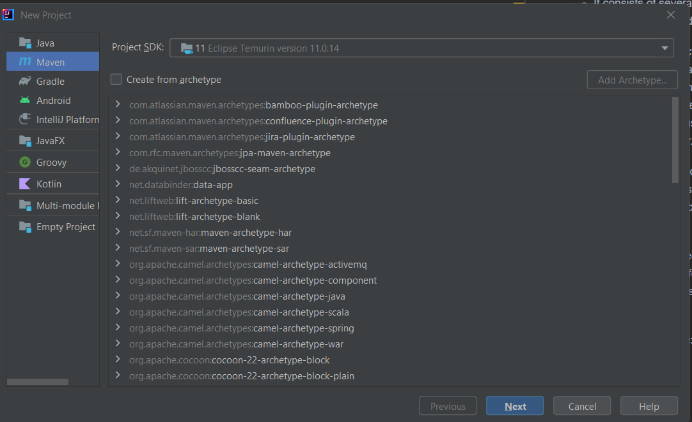
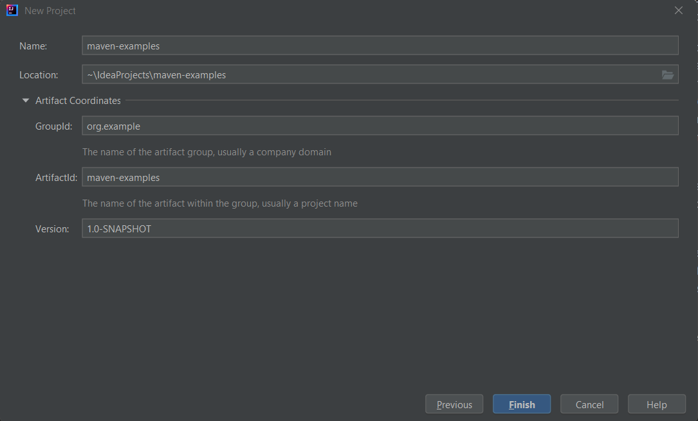
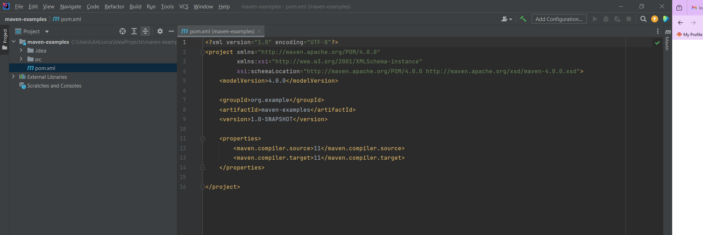
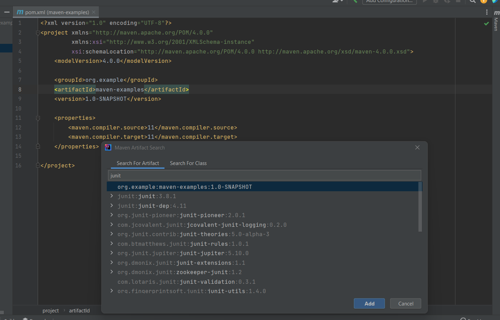
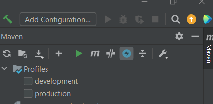
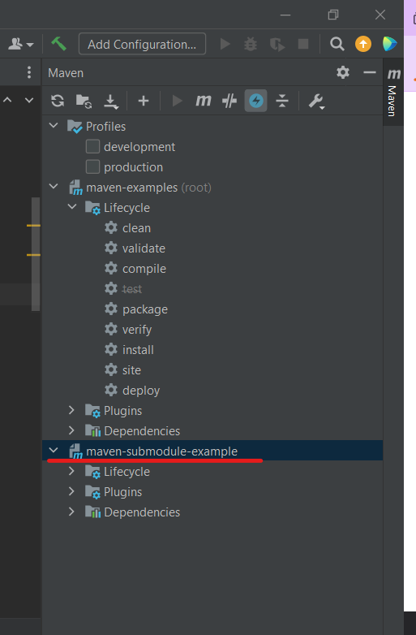
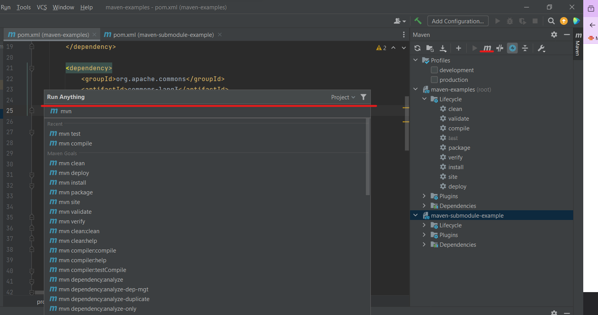

<p style="font-size: 45px; text-align: center;">
<strong> Exploring Build Tool: Maven </strong>
</p>

<div style="text-align: center;">
    
</div>

<h2 style="text-align: center;"> Creating a Maven project </h2>

- Let's create a new Maven project. From the Welcome Screen select New Project, or if you already have an IntelliJ IDEA project open, select <strong>File -> New -> Project...</strong>



We can optionally choose a maven archetype to use to create the project. If you're creating a simple project, you don't need to select an archetype. Press <strong>Next.</strong>

- You need to give the project a name, and you can optionally set the location. If you click on <strong>Artifact Coordinates</strong> you'll see more Maven settings.



Press <strong>Finish</strong>, and IntelliJ IDEA will generate the Maven <strong> pom.xml </strong> for you.



<h2 style="text-align: center;"> Understanding dependencies </h2>

In <strong>pom.xml</strong> we can add manually new dependencies or generate this (clicking on <strong>Generate</strong> option from the Code menu).



You can see all your declared dependencies in the <strong>Maven</strong> window. Nested under those we've declared, you can see the dependencies they themselves rely on.


To add new profiles in Maven, you can define them within the <strong>'profiles'</strong> section of your pom.xml file

```xml
 <profiles>
    <!-- Development Profile -->
    <profile>
        <id>development</id>
        <properties>
            <environment>development</environment>
            <database.url>jdbc:mysql://localhost:3306/dev_db</database.url>
        </properties>
    </profile>

    <!-- Production Profile -->
    <profile>
        <id>production</id>
        <properties>
            <environment>production</environment>
            <database.url>jdbc:mysql://prod.example.com:3306/prod_db</database.url>
        </properties>
    </profile>
</profiles>   
```
In this example, we have two profiles: 
- development 
- production. 

Each profile sets different properties, such as the database URL, based on the environment.

<p style="color:AliceBlue">Activate profiles: Profiles can be activated in several ways:</p>

- <strong>Explicit Activation:</strong> You can explicitly activate a profile using the -P command-line option followed by the profile ID. For example, to activate the development profile, you can run Maven with -Pdevelopment.

- <strong>Automatic Activation:</strong> Profiles can also be automatically activated based on certain conditions such as the presence or absence of a file, a JDK version, an operating system, or an environment variable. You can use the <activation> element within a profile to specify these conditions.



<h2 style="text-align: center;"> Add a new module: </h2>

```xml
  <modules>
        <module>maven-submodule-example</module>
    </modules>
```
In Maven tab it looks like:



<h2 style="text-align: center;"> Examples of adding specific plugins to a pom.xml: </h2>

<p style="color:AliceBlue"> Maven Compiler Plugin - This plugin is used to compile the source code of your project.</p>

```xml

<plugins>
    <plugin>
        <groupId>org.apache.maven.plugins</groupId>
        <artifactId>maven-compiler-plugin</artifactId>
        <version>3.8.1</version>
        <configuration>
            <source>1.8</source>
            <target>1.8</target>
        </configuration>
    </plugin>
</plugins>
```
<p style="color:AliceBlue"> Maven Failsafe Plugin - This plugin is used to run integration tests of your project.</p>

```xml
<plugins>
   <plugin>
    <groupId>org.apache.maven.plugins</groupId>
    <artifactId>maven-dependency-plugin</artifactId>
    <version>3.2.0</version>
   </plugin>
</plugins>
```

<p style="color:AliceBlue"> Maven Release Plugin - This plugin is used to automate releases of your project. </p>

```xml
  <plugins>
    <plugin>
        <groupId>org.apache.maven.plugins</groupId>
        <artifactId>maven-release-plugin</artifactId>
        <version>3.0.0-M1</version>
    </plugin>
</plugins>
```


<p style="color:AliceBlue"> Let's consider an example where you want to include the spring-core dependency but exclude its transitive dependency on commons-logging. Here's how you would declare this dependency with exclusion in your pom.xml: </p>

```xml
<dependency>
    <groupId>org.springframework</groupId>
    <artifactId>spring-core</artifactId>
    <version>5.3.15</version>
    <exclusions>
        <exclusion>
            <groupId>commons-logging</groupId>
            <artifactId>commons-logging</artifactId>
        </exclusion>
    </exclusions>
</dependency>
```

Maven allows you to manage versions of dependencies using various version control mechanisms. For example, you can specify a version range or use the latest.version placeholder to automatically use the latest available version. Here's an example of using version ranges:

```xml
<dependency>
    <groupId>org.apache.commons</groupId>
    <artifactId>commons-lang3</artifactId>
    <version>[3.0,)</version>
</dependency>
```
This declaration ensures that Maven will use any version of Apache Commons Lang 3.x, where x is equal to or greater than 3.0.


<h2 style="text-align: center;"> Maven Commands:</h2>



- <p style="color:AliceBlue"> mvn clean:</p> This command cleans the build directories, removing all built files and directories. 
- <p style="color:AliceBlue">mvn compile:</p> This command compiles the source code of the project. 
- <p style="color:AliceBlue">mvn test:</p> This command runs the tests for the project. It compiles the test classes and executes them. 
- <p style="color:AliceBlue">mvn package:</p> This command packages the compiled code and resources into a distributable format, such as a JAR, WAR, or EAR file. 
- <p style="color:AliceBlue">mvn install:</p> This command installs the packaged artifact into the local Maven repository, making it available for other projects on the same machine. 
- <p style="color:AliceBlue">mvn deploy:</p> This command deploys the packaged artifact to a remote Maven repository, making it available for other developers or projects. 
- <p style="color:AliceBlue">mvn clean install:</p> This command cleans the project, compiles the source code, runs tests, packages the artifact, and installs it into the local Maven repository. 
- <p style="color:AliceBlue">mvn dependency:tree:</p> This command generates a dependency tree for the project, showing all dependencies and their transitive dependencies. 
- <p style="color:AliceBlue">mvn help:effective-pom:</p> This command generates the effective POM (Project Object Model) for the project, showing the final configuration after inheritance and interpolation. 
- <p style="color:AliceBlue">mvn archetype:generate:</p> This command generates a new Maven project from an archetype (a project template). 
- <p style="color:AliceBlue">mvn site:</p> This command generates project documentation and reports, such as project reports, test coverage reports, and Javadoc. 
- <p style="color:AliceBlue">mvn release:prepare:</p> This command prepares for a release by creating a release branch, updating version numbers, and running tests.


Resources: 

1. https://www.jetbrains.com/guide/java/tutorials/working-with-maven/creating-a-project/
2. https://maven.apache.org/guides/getting-started/index.html#how-do-i-setup-maven