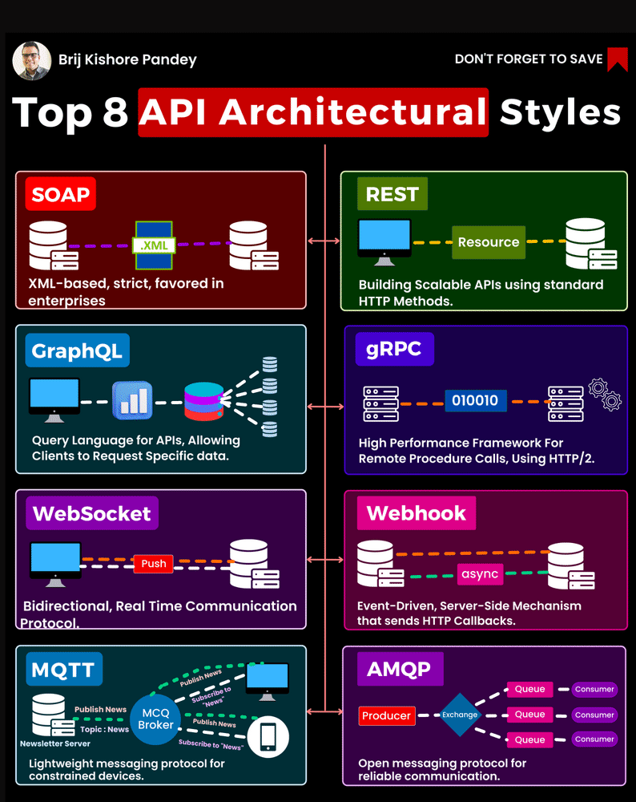
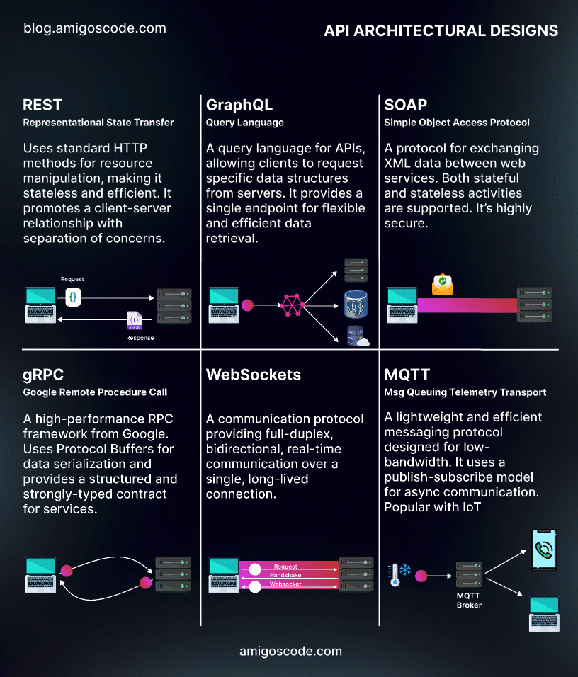

= API Model and Rest Basics
:toc: left
:sectnums:

== Brief Overview of API Testing and Importance of Automated API Testing

API (Application Programming Interface)is a set of rules and tools that
allows different software applications to communicate with each other. APIs define the methods and data formats that
applications can use to request and exchange information. They enable developers to access the functionality of a
particular software component or service without exposing its internal details.

Simply said, an API is a collection of guidelines and procedures which enable communication between various software
applications. The significance of API is that it serves as a middleman, allowing developers to create software that
makes use of the functionality and data offered by another application or service.

Let's take the scenario where you use a travel booking app to look for the best hotel offers in San Francisco. To
receive information about hotel rates from different hotel booking websites, this app may use an API. You may compare
prices and easily reserve the best offer thanks to the API's smooth data processing and return to the app.

____

*Why is API Testing Essential?*

'''
* Improved Functionality.

[.columnA]

[.columnB]
API testing enables programmers to check the APIs' performance and make sure they are operating as intended. This is
particularly crucial to ensure that the software works seamlessly with other programs and systems. Developers may find
and correct any faults or errors early on in the development process by testing the APIs, which can ultimately save time
and money.

'''
* Increased Security.

[.columnA]

[.columnB]
The significance of API also revolves around increased security. APIs are frequently used to communicate sensitive data, including financial transactions and personal information. API testing identifies and fixes any potential security flaws, which helps to safeguard data and thwart breaches. In the modern digital environment, when security breaches can have serious repercussions for both enterprises and people, this is especially crucial.

'''
* Better Performance.

[.columnA]

[.columnB]
API testing can be performed to test API performance and find any bottlenecks that might be influencing the system's overall performance. The user experience can be enhanced and the APIs can be improved as a result. It's crucial to make sure APIs are performant across various systems given the rising number of devices and platforms on the market. Importance of API

'''
* Fostering Innovation.

[.columnA]

[.columnB]
The importance of API also lies in how it drives innovation in the digital world. By providing accessibility to data and functionality, APIs enable developers to build new products and services that cater to the ever-changing needs of users. Additionally, APIs create new business opportunities, as they allow companies to monetize their data and services by providing access to other businesses that may find value in utilizing the

'''
* Compatibility.

[.columnA]

[.columnB]
It's critical to make sure that APIs work with a variety of systems given the market's constantly expanding range of devices and platforms. So that the APIs may be utilized effortlessly across many devices and platforms, API testing helps to find and fix any compatibility issues. This is crucial for companies who wish to guarantee that a broad spectrum of clients can use their software.

'''
* Enhancing User Experience.

[.columnA]

[.columnB]
The significance of API is also based on how it improves user experience. By allowing different applications to communicate and share data, APIs help create more personalized and user-friendly experiences. For example, a fitness tracking app may use APIs to access and integrate data from various sources like your smartwatch, nutrition apps, and social media platforms. This integration provides you with a holistic, personalized overview of your health and fitness progress, bolstered by the capabilities of several applications working together.

'''
* Gain Efficiency.

[.columnA]

[.columnB]
Since automated API testing enables developers to swiftly and easily test several APIs at once, it can make the development process more effective. When compared to manual testing, this can save time and resources. As it may be used to examine a variety of input and output scenarios, automated testing also enables more thorough testing.

____

== Understanding the concept of API modeling
#API modeling# is the process of designing the structure, behavior, and interactions of an Application Programming Interface (API). It involves defining the endpoints, data formats, request-response patterns, authentication mechanisms, and other aspects that govern how software components or services communicate with each other programmatically.

Here's a breakdown of the key components and considerations involved in API modeling:

🔑 *Resource Modeling:*
APIs typically revolve around resources, which represent the entities or objects that the API interacts with. Resource modeling involves identifying the core entities of the system and defining their attributes, relationships, and actions.

🔑 *Endpoint Design:*
Endpoints are the URLs through which clients can access different functionalities of the API. API modeling includes defining the endpoints for each resource, specifying the HTTP methods (GET, POST, PUT, DELETE) they support, and mapping them to corresponding operations.

🔑 *Data Formats:*
APIs often exchange data in structured formats such as JSON (JavaScript Object Notation) or XML (eXtensible Markup Language). API modeling involves specifying the data formats for request payloads, response bodies, and error messages to ensure consistency and interoperability.

🔑 *Request-Response Patterns:*
API modeling defines the patterns and conventions for requesting data or performing actions through the API. This includes specifying the structure of API requests, parameters, headers, and the corresponding responses returned by the server.

🔑 *Authentication and Authorization:*
APIs may require authentication and authorization mechanisms to control access to protected resources and enforce security policies. API modeling includes defining the authentication methods (e.g., API keys, OAuth tokens) and access control rules required to secure the API endpoints.

🔑 *Error Handling:*
API modeling involves defining error codes, status messages, and error payloads that the API can return in case of invalid requests, server errors, or other exceptional conditions. Clear and consistent error handling is crucial for facilitating troubleshooting and debugging.

🔑 *Versioning and Compatibility:*
APIs may evolve over time, introducing changes to the endpoint structure, data formats, or behavior. API modeling includes considerations for versioning strategies, backward compatibility, and deprecation policies to ensure smooth transitions and minimize disruptions for API consumers.

🔑 *Documentation:*
Comprehensive documentation is essential for guiding developers on how to use the API effectively. API modeling involves documenting the API endpoints, parameters, request-response formats, authentication requirements, error codes, and usage examples to provide clear and accessible guidance for API consumers.

'''
=== Types of API models

.🧩RPC
[%collapsible]
====
[cols="1,1,1"]
|===
^|Description 📝 ^|How it works 🛠️ ^|Protocols 📑

|RPC is a model that allows one program to execute procedures or functions in another address space (commonly on another machine) as if they were local functions or procedures.
|In RPC, the client sends a request to the server to execute a specific function, passing parameters if necessary. The server executes the function and sends back the result to the client.
|RPC can use various protocols for communication, such as XML-RPC (using XML for encoding data) or JSON-RPC (using JSON for encoding data).

|===
====
.🧩SOAP (Simple Object Access Protocol)
[%collapsible]
====
[cols="1,1,1"]
|===
^|Description 📝 ^|Features 🕹️️ ^|Complexity 🧠

|SOAP is a protocol for exchanging structured information in the implementation of web services. It uses XML for message format and relies on other application layer protocols, such as HTTP, for message negotiation and transmission.
|SOAP provides a standardized messaging framework that supports security, reliability, and other advanced features through extensions like WS-Security and WS-ReliableMessaging.
|SOAP messages tend to be more verbose and complex compared to other formats like JSON, which can affect performance and readability.

|===
====
.🧩RESTful APIs (Representational State Transfer)
[%collapsible]
====
[cols="1,1,1"]
|===
^|Description 📝 ^|Key Principles 🗝️️ ^|Advantages ✅

|REST is an architectural style for designing networked applications. RESTful APIs use standard HTTP methods (GET, POST, PUT, DELETE) and resource identifiers (URIs) to represent and manipulate resources.
|RESTful APIs are designed based on several principles, including statelessness, cache-ability, a uniform interface, and a client-server architecture.
|RESTful APIs are lightweight, scalable, and easy to understand. They promote loose coupling between clients and servers and are widely used for building web APIs due to their simplicity and flexibility.

|===
====

Each of these API models has its own advantages, use cases, and considerations. The choice of API model depends on factors such as the requirements of the application, the complexity of the system, the level of interoperability needed, and the preferences of the development team.

*For more information about API Architectural Styles:*

*For more information about API Testing:*

image::images/types_of_api_testing.gif[Types of API Testing,width="40%",align="center"]

== Understanding Rest and its Importance in Modern Web Development

REST (Representational State Transfer) is an architectural style for designing networked applications. It is based on a set of principles that define how web standards such as HTTP and URIs should be used to create scalable and interoperable web services.

REST APIs play a crucial role in modern web development for several reasons:

* *📄Scalability:* REST APIs are highly scalable. They can handle thousands, millions, and billions of data simultaneously without affecting performance.
 In other words, they can process huge blocks of information while the two websites, connected through the REST API work seamlessly.
* *🌐Interoperability:* REST APIs are based on the same standards used for the web. Same language, same code and architecture. They are highly interoperable and can easily interact, synchronize and integrate with other applications.
 As a result, APIs are part of the entire web environment, from blogs and social networks to CMSs and development platforms
* *📊Flexibility:* REST APIs can communicate using any data format. In other words, they can be adapted to almost any application on the web regardless of its format, language or architecture.
* *🛡️Security:* REST APIs typically use authentication via access tokens, Tokens are much more difficult to crack as they are unique. In addition, they can be supplemented with other authentication methods to double the security standards.
 In this way, both security and data privacy are almost impassable to hackers and information gatherers.
* *🎨Ease of use:* REST APIs are simpler and easier to use than other APIs. You can become familiar with the REST API fairly quickly regardless of your level of web development and programming.
 In fact, you’ll find it intuitive and easy to use even if you don’t have any web development experience, as long as you learn languages like HTML, Python, or JavaScript.

_What are the *disadvantages of a REST API*?_

1. _Increased design complexity._ +
Although they are easier to use, the design of a REST API can be more complex than other APIs, especially if you are not familiar with web architecture.
The REST API uses architectural principles that you need to be familiar with in order to develop your API.
2. _Web connection._ +
All changes to your REST API must be executed on the web and only on the web. It’s impossible to edit the API from your desktop without an internet connection, unlike HTML web files, for example. You must always connect to make the slightest change. A REST API requires an Internet connection to function, which means it may be less useful in offline environments.
3. _Variable performance and flexibility._ +
On the other hand, REST APIs can have slightly lower performance than other APIs, depending on the servers and their internet speed. And in some cases, a REST API may be less flexible than other APIs because of the architectural principles it must follow. In other words, although its architecture is quite versatile and can be synchronized with other applications, the development of this architecture is less flexible.

== Understanding the six constraints of REST architecture

.🚀*Client-server architecture*
[%collapsible]
====
[cols="1,1"]
|===
^|Description ^|Benefits

|The client-server constraint separates the user interface concerns from the data storage concerns. Clients send requests to servers, which process those requests and return responses.
|This separation promotes the scalability of the system by allowing the client and server components to evolve independently. It also improves portability across different platforms and simplifies the overall architecture.

|===
====

.🚀*Statelessness*
[%collapsible]
====
[cols="1,1"]
|===
^|Description ^|Benefits

|In a stateless system, each request from a client to the server must contain all the information necessary to understand and process that request. The server does not maintain any client state between requests.
|Statelessness improves scalability by allowing servers to handle a large number of requests without needing to store and manage client session data. It also enhances reliability and fault tolerance, as there are no dependencies on previous interactions.

|===
====

.🚀*Cacheability*
[%collapsible]
====
[cols="1,1"]
|===
^|Description ^|Benefits

|Responses from the server can be explicitly or implicitly marked as cacheable. Caching allows clients to reuse previously obtained responses, reducing latency and network traffic.
|Cacheability improves performance and scalability by reducing the need for repeated requests to the server. It also promotes efficiency by minimizing data transfer and network congestion.

|===
====

.🚀*Layered System*
[%collapsible]
====
[cols="1,1"]
|===
^|Description ^|Benefits

|The layered system constraint allows for the use of intermediaries, such as proxies, gateways, and firewalls, between clients and servers. Each layer hides the complexity of the system from the layers above it.
|Layering enhances scalability, as it allows for the deployment of additional intermediaries to handle load balancing, caching, security, and other concerns without affecting the overall architecture. It also improves security and encapsulation by enforcing separation of concerns.

|===
====

.🚀*Uniform Interface*
[%collapsible]
====
[cols="1,1"]
|===
^|Description ^|Benefits

|The uniform interface constraint defines a standardized way for clients and servers to interact.
|A uniform interface simplifies the architecture, promotes loose coupling between clients and servers, and allows components to evolve independently. It also enables the development of generic clients and servers that can interact with any RESTful service.

|===
====

.🚀*Code on Demand (Optional)*
[%collapsible]
====
[cols="1,1"]
|===
^|Description ^|Benefits

|The code on demand constraint allows servers to transfer executable code to clients, such as JavaScript or Java applets, which the client can execute within its runtime environment.
|This constraint enables the server to extend the functionality of the client dynamically, enhancing flexibility and scalability. However, it is optional and not commonly used in practice due to security concerns and the complexity it introduces.

|===
====

[TIP]
These six constraints collectively define the principles of REST architecture, guiding the design and implementation of RESTful systems to achieve desirable properties such as scalability, reliability, and simplicity.

== RESTful API Design Best Practices

An overview of RESTful API design best practices covering resource naming conventions, HTTP methods and their appropriate usage, handling authentication and authorization, and response formats:

____
🤝Resource Naming Conventions:
____

* *Use Nouns for Resources:* Resources should be named using nouns that represent the entities being manipulated or accessed by the API. For example, '/users', '/products', '/orders'.
* *Use Plural Nouns:* Resource names should generally be plural nouns to represent collections of resources. For example, /users instead of /user.
* *Be Consistent:* Maintain consistency in resource naming throughout the API to make it intuitive and easy to understand for developers.
* *Avoid Verbs:* Avoid using verbs in resource names. Instead, use HTTP methods to perform actions on resources.

____
🤝HTTP Methods and Their Appropriate Usage:
____

* *GET:* Used for retrieving resource representations. It should be idempotent, meaning multiple identical requests should produce the same result.
* *POST:* Used for creating new resources. It is not idempotent, as multiple identical requests may result in different resources being created.
* *PUT:* Used for updating existing resources or creating resources with a specific identifier. It should be idempotent.
* *DELETE:* Used for deleting resources. It should be idempotent.
* *PATCH:* Used for making partial updates to resources. It should be idempotent when possible.

____
🤝Handling Authentication and Authorization:
____

* *Authentication:* Use standard authentication mechanisms such as OAuth 2.0, JWT (JSON Web Tokens), or API keys to authenticate clients.
* *Authorization:* Implement role-based access control (RBAC) or other authorization mechanisms to control access to different resources and actions based on user roles and permissions.
* *Protect Sensitive Data:* Use HTTPS to encrypt data transmitted between clients and servers to ensure confidentiality and prevent unauthorized access.

____

🤝Response Formats (JSON, XML) and Content Negotiation:
____

* *JSON:* JSON (JavaScript Object Notation) is the most commonly used format for data exchange in RESTful APIs due to its simplicity, readability, and widespread support.
* *XML:* XML (eXtensible Markup Language) can be used as an alternative to JSON for data exchange, especially in scenarios where XML is preferred or required by existing systems or standards.
* *Content Negotiation:* Implement content negotiation mechanisms to allow clients to specify their preferred response format (e.g., JSON or XML) using Accept headers in the request. The server should then respond with the requested format if available.

[TIP]
Adhering to these best practices ensures that RESTful APIs are well-designed, intuitive, secure, and interoperable, promoting a positive developer experience and facilitating seamless integration with client applications and systems.

== Exploring Tools for API Development and Management

.*🏆API Development:*

* *Postman:*
** Postman is one of the most popular tools for API development, testing, and collaboration. It allows you to create, test, and debug APIs quickly and efficiently.
** Postman supports various request types, authentication methods, and automated testing workflows.

* *Swagger (OpenAPI):*
** Swagger is a set of tools for designing, documenting, and testing RESTful APIs using the OpenAPI Specification.
** It provides a visual editor for designing API schemas, generating interactive documentation, and generating client SDKs for different programming languages.

* *Insomnia:*
** Insomnia is a powerful API client that supports REST, GraphQL, and WebSocket APIs. It offers features such as code snippet generation, environment variables, and API request chaining.

.*🏆API Testing:*

* *Postman:*
** In addition to API development, Postman is widely used for API testing. It allows you to create and run automated tests, perform load testing, and monitor API performance.
** Postman's testing capabilities include assertions, scripts, and test collections.

* *SoapUI:*
** SoapUI is a popular tool for testing SOAP and RESTful APIs.
** It offers features such as functional testing, security testing, and mocking of API responses. SoapUI supports both manual and automated testing workflows and integrates with CI/CD pipelines.

* *JMeter:*
** Apache JMeter is an open-source tool for performance testing of web applications, including RESTful APIs.
** It allows you to simulate high loads on APIs, measure response times, and identify performance bottlenecks.

.*📚API Documentation:*

* *Swagger (OpenAPI):*
** Swagger provides tools for generating interactive API documentation from OpenAPI Specification files.
** The generated documentation includes details about API endpoints, request parameters, response schemas, and example requests.

* *Apiary:*
** Apiary is a platform for designing, documenting, and mocking APIs. It offers a simple markdown-based syntax for defining API blueprints, which can be used to generate interactive API documentation and mock servers.

.*🧪Mocking and Virtualization:*

* *Mockoon:*
** Mockoon is an open-source tool for mocking APIs locally during development
** It allows you to define mock endpoints, responses, and behaviors, making it easy to simulate API interactions without relying on external services.

* *WireMock:*
** WireMock is a flexible tool for stubbing and mocking HTTP APIs. It can be used to create mock servers that respond to API requests with predefined responses, headers, and status codes.

.*📋Monitoring and Debugging:*

* *Charles Proxy:*
** Charles Proxy is a web debugging proxy tool that allows you to monitor HTTP/HTTPS traffic between your computer and the internet.
** It can be used to inspect API requests and responses, analyze performance, and debug

* *Fiddler:*
** Fiddler is another web debugging proxy tool that provides similar features to Charles Proxy.
** It allows you to capture, modify, and analyze HTTP/HTTPS traffic, including API requests and responses.

== Resources

*General:*

. https://aws.amazon.com/ru/what-is/restful-api/
. https://www.redhat.com/en/topics/api/what-is-a-rest-api
. https://radixweb.com/blog/rest-vs-restful-api
. https://www.thepowermba.com/en/blog/rest-api-what-it-is

*Exercises:*

. https://api-ninjas.com/api/exercises

*10 Popular API Examples using Katalon:*

. https://katalon.com/resources-center/blog/api-examples

*API Examples JavaScript:*

. https://developer.mozilla.org/en-US/docs/Learn/JavaScript/Client-side_web_APIs/Introduction
. https://www.w3schools.com/js/js_api_intro.asp

*API Development in Java:*

. https://www.javatpoint.com/api-development-in-java
. https://medium.com/javarevisited/building-restful-apis-in-java-a-step-by-step-tutorial-e1b9b2d3e6ab
. https://happycoding.io/tutorials/java-server/rest-api

Copyright © 2024 by Liurca Andreea and Igor Gorea