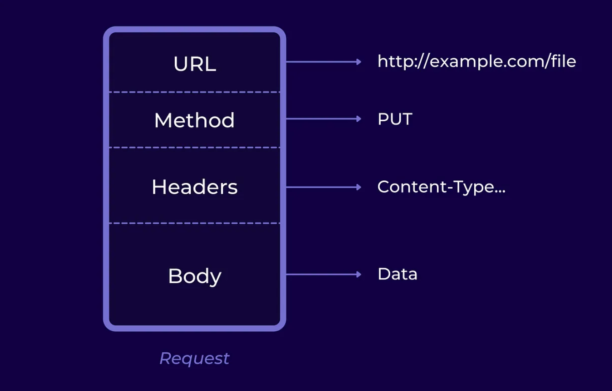

# Sending and Validating API Requests. Configuration of API Clients
<p align="center">
     
</p>


## Table of Contents  
1. [API Requests and HTTP Methods](#api-requests-and-http-methods)
2. [API Responses](#api-responses)
3. [Validation of API Responses in Tests](#validation-of-api-responses-in-tests)
4. [Tool and Library Selection](#tool-and-library-selection)
5. [Best Practices and Additional Considerations](#best-practices-and-additional-considerations)
6. [API client configuration](#api-client-configuration)  
[References](#references)  

## 1. API Requests and HTTP Methods

<p align="center">
     
</p>

### HTTP Methods
- **GET:** Fetches/Requests Resource
- **POST:** Creates/Inserts Resource
- **PUT:** Update/Modifies Resource
- **PATCH:** Updates/Modifies Partial Resource
- **DELETE:** Deletes/Removes Resource
- **OPTIONS:** Determine Server Capabilities, Cross-Origin Resource Sharing (CORS), Resource Discovery

### HTTP Request Structure


- **URL:** Unique address for a resource on the server.
- **Method:** Specifies the HTTP method (e.g., GET, POST, PUT, DELETE).
- **Headers:**
    - Host: Domain name of the server (mandatory in HTTP/1.1).
    - User-Agent: Identifies the software or device.
    - Accept: Informs the server about client-supported media.
    - Content-Type: Indicates the media type of the request payload.
    - Authorization: Provides credentials for accessing protected resources.
    - Many other headers for various purposes.

- **Body (Optional):**
    - In certain HTTP methods like POST or PUT, a request may include a message body carrying data.
    - The Content-Type header specifies the format of the data (e.g., JSON, form data, XML).  

```json
{
  "data": {
    "user": "John Doe",
    "age": 30,
    "status": "active"
  }
}
```
  


## 2. Validation of API Responses  
 
<p align="center">
     
</p>


- **Status Code:**
    - 100–199: Informational responses
    - 200–299: Successful responses
        - 200 - OK
        - 201 - Created
        - 204 - No Content
    - 300–399: Redirects
    - 400–499: Client errors
        - 400 - Bad Request
        - 404 - Not Found
        - 409 - Conflict
    - 500–599: Server errors
        - 500 - Internal Server Error
- **Headers:**
    - Content Type: Content's format
    - Content Length: Size of the Content
    - Expires: When is this invalid
    - More headers...
- **Body:**
    - The HTTP response body contains data or information about the success/failure of the request.

```json
HTTP/1.1 200 OK
Content-Type: application/json

{
  "message": "Request successful",
  "data": {
    "user": "John Doe",
    "age": 30,
    "status": "active"
  }
}
```
# 3. Validation of API Responses in Tests

>To ensure the correctness of API responses, it's crucial to compare the received data with expectations. Verify that the returned data matches the anticipated format, contains the right fields, and aligns with the documented API specifications. This step helps catch discrepancies that might affect application functionality.

## Checking HTTP Status Code

Verify the response's status code to ensure that the request has been processed successfully.

## Validating Response Structure
Check if the response structure aligns with expectations, including the correct presence and format of data. This is particularly important for JSON responses.

## Comparing Received Data with Expectations

Compare the data received in the response with the expected values. Ensure that key information is present and has the correct values.

## Handling Errors Appropriately

Implement error-handling logic in tests. Check how the API responds to invalid requests or specific error situations.

## Integrating Tests into the Build Pipeline

Ensure that automated API tests are integrated into your build pipeline to execute them automatically during development.

# 4. Tool and Library Selection
>Effective API testing is crucial for ensuring software reliability, and the choice of tools and libraries is paramount in achieving this goal. Just as a well-selected set of instruments enhances a musical composition, the right testing tools streamline processes, improve coverage, and ensure optimal API performance. The judicious selection of tools accelerates testing cycles, identifies vulnerabilities, and supports timely software delivery in our dynamic digital landscape. In essence, the importance of tool and library selection for API testing cannot be overstated.

- **Postman:**
  - *Type:* GUI-based
  - *Description:* A comprehensive API testing tool with support for various HTTP methods and a user-friendly interface.

- **Insomnia:**
  - *Type:* GUI-based
  - *Description:* User-friendly API testing tool with a sleek interface.

- **Newman (from Postman):**
  - *Type:* Command-line
  - *Description:* Command-line collection runner for Postman, suitable for CI/CD pipelines.

- **REST Assured:**
  - *Type:* Library (Java, Groovy)
  - *Description:* A Java library for testing RESTful APIs, supporting a DSL for writing tests.

- **RestSharp:**
  - *Type:* Library (.NET, C#)
  - *Description:* An open-source library for .NET and C# developers, simplifying RESTful API consumption.

- **Karate DSL:**
  - *Type:* Library (Java, JavaScript)
  - *Description:* A testing framework based on Cucumber syntax, designed for API testing.

- **Supertest (for JavaScript/Node.js):**
  - *Type:* Library (JavaScript/Node.js)
  - *Description:* A testing library specifically designed for HTTP assertions in Node.js.

# 5. Best Practices and Additional Considerations

1. **Consistency in Test Data:**
<details>
   - Maintaining consistency in test data is crucial for reliable and repeatable API testing. Use consistent and well-defined datasets for your tests to ensure that results remain predictable. Avoid using live or production data in test environments, as it may introduce variability and impact the accuracy of your tests. Regularly update and review test data to reflect changes in the application's requirements.
</details>

2. **Adapting Tests to API Changes:**
<details>
   - APIs are dynamic and subject to changes over time. To ensure the longevity of your tests, establish a strategy for handling API changes. Design tests with flexibility in mind, and use versioning for APIs when possible. Implement a systematic approach to update tests when API changes occur, ensuring that they remain accurate and effective. Regularly review and update test scripts to align with the evolving API specifications.
</details>

3. **Monitoring and Reporting Results:**
<details>
   - Effective monitoring and reporting are essential for maintaining a healthy API testing process. Establish a comprehensive reporting mechanism to track test results, including successful runs, failures, and any issues encountered. Utilize logging and alerting systems to promptly identify and address test failures. Implement periodic reviews of test results to identify trends, patterns, or areas for improvement. Regularly update stakeholders on the status of API tests and collaborate on addressing any issues that may arise. Continuous monitoring ensures the reliability and effectiveness of your API testing efforts.
</details>

## 6. API client configuration

Step 1: Create a new .NET project
Start by creating a new .NET project in your preferred IDE, such as Visual Studio.  

Step 2: Install Required Packages  
Make sure you have RestSharp and your chosen testing framework installed in your test project.  
```bash
# Install RestSharp
Install-Package RestSharp

# Install NUnit (you can use another testing framework if you prefer)
Install-Package NUnit

```
Step 3: Create API client class  
Create a class that will act as your API client. This class will encapsulate the logic for making API requests. Here's a simple example:
```csharp
using RestSharp;

public class ApiClient
{
    private readonly RestClient _restClient;

    public ApiClient(string baseUrl)
    {
        _restClient = new RestClient(baseUrl);
    }

    public IRestResponse Get(string resource)
    {
        var request = new RestRequest(resource, Method.GET);
        return _restClient.Execute(request);
    }

    // Add methods for other HTTP methods (POST, PUT, DELETE) as needed
}
```  
Step 4: Create test class
Create a test class where you'll write your test cases. You can use a testing framework like NUnit or MSTest. Here's an example using NUnit:

```csharp
using NUnit.Framework;

[TestFixture]
public class ApiTests
{
    private ApiClient _apiClient;

    [SetUp]
    public void SetUp()
    {
        // Initialize the API client with the base URL of your API
        _apiClient = new ApiClient("https://api.example.com");
    }

    [Test]
    public void TestGetRequest()
    {
        // Specify the resource you want to test
        var resource = "/endpoint";

        // Make the API request
        var response = _apiClient.Get(resource);

        // Add assertions based on the response
        Assert.That(response.StatusCode, Is.EqualTo(System.Net.HttpStatusCode.OK));
        // Add more assertions as needed
    }

    // Add more test methods for other scenarios
}
}
```    
Step 5: Run the tests
Run your test class to execute the test cases. Ensure that the API responses meet your expectations.


An example of an API client configuration with tests and some practice exercises you could find:
[GitHub](https://github.com/valea26/APIDemo.git)  
For access, please reach out via email or Teams to: valentina.turcanu@email.com Valentina Turcanu
<p align="center" width="100%">
     
</p>

## Resources
1. [API Architecture](https://medium.com/api-world/api-architecture-the-http-protocol-and-its-importance-aeba0fe46f91)
2. [API Testing | What It is, How to Test & Best Practices](https://testsigma.com/guides/api-testing/)
3. [API Testing – Software testing](https://www.geeksforgeeks.org/api-testing-software-testing/)
4. [RESTful API testing in C# with RestSharp](https://www.ontestautomation.com/restful-api-testing-in-csharp-with-restsharp/)
5. [ChatGPT](https://chat.openai.com/)


Created by:  
Valentina Țurcanu  
Email: valentina.turcanu@endava.com

