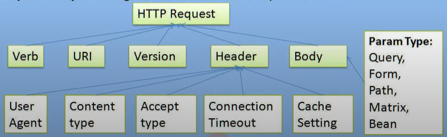

# Cucumber

Cucumber can be used to implement automated tests based on scenarios described in your Gherkin feature files.

## Step Arguments

Cucumber extracts the text `48` from the step, converts it to an `int`
and passes it as an argument to the step definition body.

The number of parameters in the  step definition body has to match the number of expression-parameter s in the expression. (If there is a mismatch, Cucumber will throw an error).

## Data Tables

Data tables from Gherkin can be accessed by using the DataTable object as the last parameter in a step definition.
This conversion can be done either by Cucumber or manually.
Depending on the table shape as one of the following collections:

```java
List<List<String>> table;
List<Map<String, String>> table;
Map<String, String> table;
Map<String, List<String>> table;
Map<String, Map<String, String>> table;
```
The simplest way to pass a `List<String>`
`java.util.List[String]`list of strings to a step definition is to use a data table:

```gherkin
Scenario: Verify login with multiple users
Given I am an authorized user
When I post the following credentials
| username  | password |
| user1     | pass1    |
| user2     | pass2    |
Then I should be logged in
```
Declare the argument as a `List<String>`list of strings, but don't define any  expression-parameter s in the expression:
Annotated method style:

## Step Definition
```java 
@Given("retrive the following items:")
public void the_following_items(List<String> items) {
}

@When("response has status {int}")
public void responseHasStatus(int statusCode) {
}
```
 


##   Conditional hooks
As for conditional hooks, you can use tagged hooks to execute hooks only for scenarios with matching tags. 
For example, you can define a Before hook with specific tags, and the hook will be executed only for scenarios with those tags. Here's an example of how to use tagged hooks:
```java
@Before("@login")
public void beforeLoginScenario() {
// Perform setup actions specific to login scenarios
}

@Before("@api")
public void beforeApiScenario() {
// Perform setup actions specific to API scenarios
}
```
When you run the feature file, Cucumber will execute the appropriate hooks based on the tags specified in the feature file
.