= Commonly used data structures in network communication
:doctype: book
:toc: left
:sectnums:

'''

== Introduction

In the realm of network communication, data structures and formats play
a crucial role in facilitating the exchange of information between
systems. From simple text-based formats to binary serialization
protocols, each structure has its own history, purpose, strengths, and
weaknesses. With the objective of facilitating data transfer among two
or more entities, whether they reside on the same machine or within the
same application, or are situated in disparate locations, employing
diverse software and developed using various programming languages, the
network data structures, along with their mutually agreed upon methods
of reading and writing data, serve to accomplish this objective. In this
article, however, we'll NOT expand on the methods of transforming the
data structures to and from programming language related structures
(Serialization and Deserialization), we'll explore the commonly used
data structures and formats like: JSON, XML, CSV, YAML, Protobuf and
Byte Array. Reviewing their purpose, syntax, strong and weak points.

[NOTE]
For the first for you will be able to find concrete examples in the
'*examples*' package, structured as the representation of
'Employee.java' in the respective format.

== JSON - JavaScript Object Notation

is a lightweight data-interchange format. It is easy for humans to read
and write. It is easy for machines to parse and generate. It is based on
a subset of the JavaScript Programming Language Standard ECMA-262 3rd
Edition - December 1999. JSON is a text format that is completely
language independent but uses conventions that are familiar to
programmers of the C-family of languages, including C, C++, C#, Java,
JavaScript, Perl, Python, and many others. These properties make JSON an
ideal data-interchange language.

JSON is widely used for transmitting structured data between a server
and a client in web applications. It's commonly used in RESTful APIs,
AJAX requests, and configuration files.

[TIP]
====
JSON is built on two structures:

. A collection of name/value pairs. In various languages, this is
realized as an object, record, struct, dictionary, hash table, keyed
list, or associative array.
. An ordered list of values. In most languages, this is realized as an
array, vector, list, or sequence.
====

These are universal data structures. Virtually all modern programming
languages support them in one form or another. It makes sense that a
data format that is interchangeable with programming languages also be
based on these structures.

In JSON, *structures take on these forms*:

'''

* An object is an unordered set of name/value pairs. An object begins
with '\{' (left brace) and ends with '}' (right brace). Each name is
followed by ':' (colon) and the name/value pairs are separated by
',' (comma).

.json-object-schema
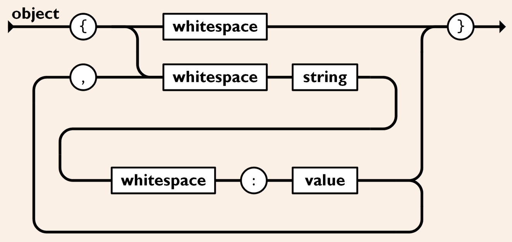

[source,json]
----
{
  "fruit": {
    "name": "apple",
    "taste": "sweet",
    "weight": 150,
    "color": "red",
    "isSeedless": false
  }
}
----

'''

* An array is an ordered collection of values. An array begins with '['
(left bracket) and ends with ']' (right bracket). Values are separated
by ',' (comma).

.json-array-schema
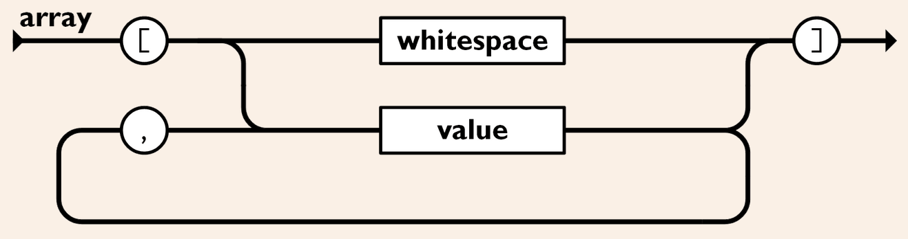

[source,json]
----
{
  "fruits": ["apple", "banana", "orange", "grape"]
}
----

'''

* A value can be a string in double quotes, or a number, or true or
false or null, or an object or an array. These structures can be nested.

.json-value-schema
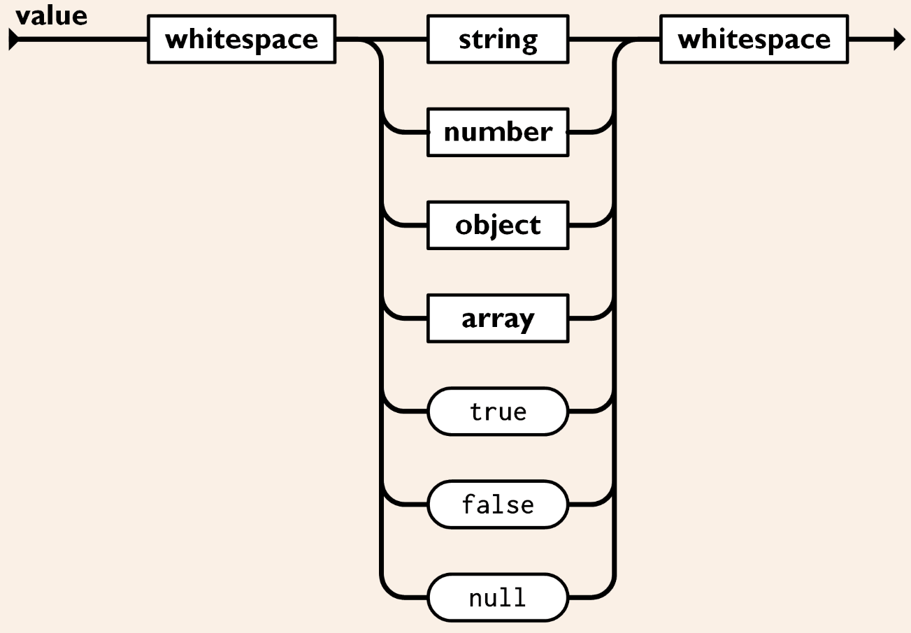

'''

* A string is a sequence of zero or more Unicode characters, wrapped in
double quotes, using backslash escapes. A character is represented as a
single character string. A string is very much like a C or Java string.

.json-string-schema
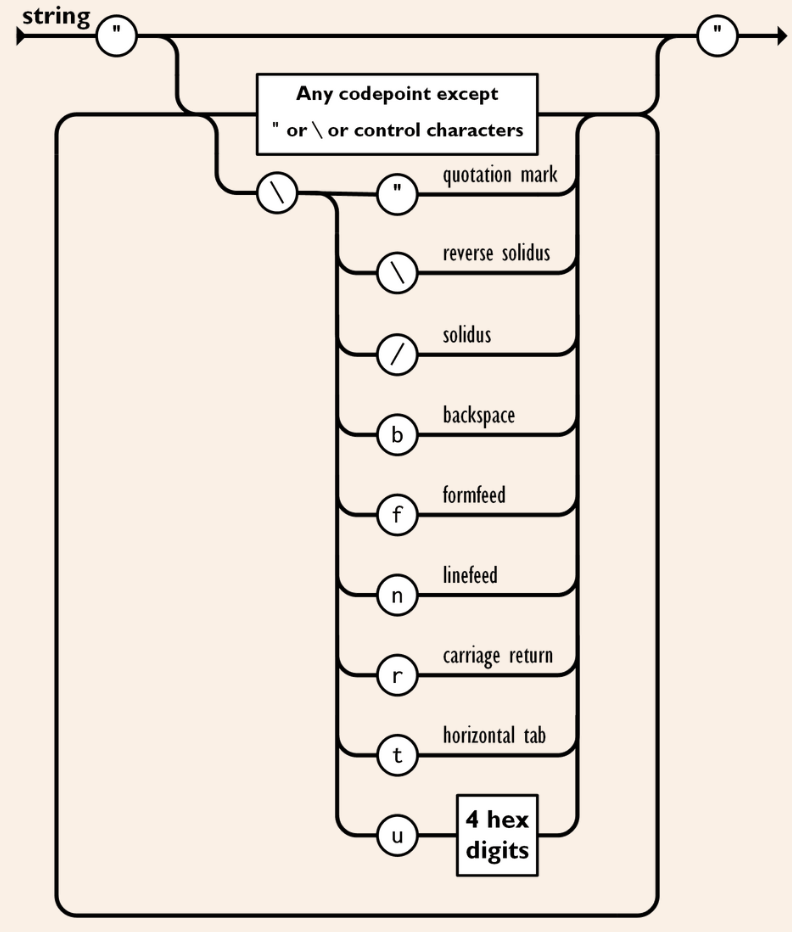

'''

* A number is very much like a C or Java number, except that the octal
and hexadecimal formats are not used.

.json-number-schema
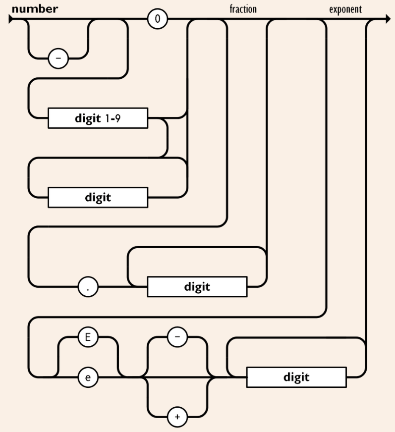

'''

* Whitespace can be inserted between any pair of tokens. Excepting a few
encoding details, that completely describes the language.

.json-whitespace-schema
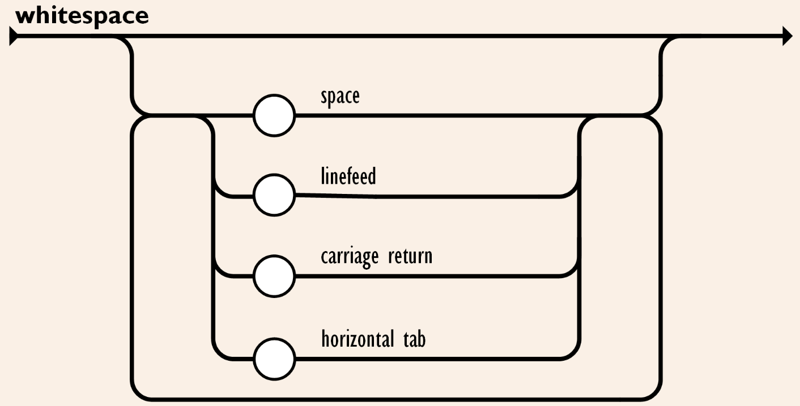

'''

====
*Pros*:

* Human-readable and easy to write.
* Supports a wide range of data types, including objects, arrays,
strings, numbers, booleans, and null values.
* Widely supported across programming languages and platforms.
* Lightweight and efficient for data transmission over the network.

*Cons*:

* Lacks support for comments.
* Limited support for binary data.
* Not as compact as binary formats for large datasets.
====

== XML - eXtensible Markup Language

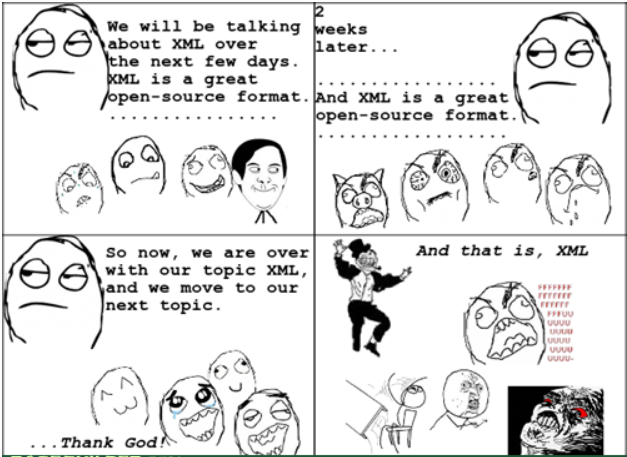

XML was developed in the late 1990s as a successor to SGML (Standard
Generalized Markup Language). It was designed to be a flexible and
extensible markup language for representing structured data and to be
both human- and machine-readable.

[TIP]
====
XML is commonly used for data exchange and configuration in web
services, document formats (e.g., XHTML, RSS, SOAP), and database
systems.
====

*The main purpose of XML is serialization*, i.e.storing, transmitting,
and reconstructing arbitrary data. For two disparate systems to exchange
information, they need to agree upon a file format. XML standardizes
this process. It is therefore analogous to a lingua franca for
representing information.

As a markup language, XML labels, categorizes, and structurally
organizes information. XML tags represent the data structure and contain
metadata. What's within the tags is data, encoded in the way the XML
standard specifies. An additional XML schema (XSD) defines the necessary
metadata for interpreting and validating XML. (This is also referred to
as the canonical schema.) An XML document that adheres to basic XML
rules is "well-formed"; one that adheres to its schema is "valid."

*XML documents form a tree structure* that starts at "the root" and
branches to "the leaves".

.The XML Tree Structure
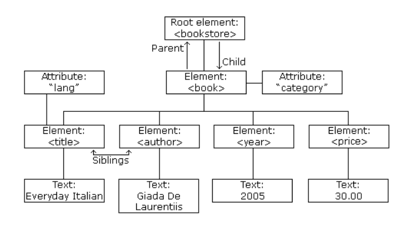

The syntax rules of XML are very simple and logical. The rules are easy
to learn, and easy to use. Here are the Key Syntax rules:

* XML Documents Must Have a Root Element, an element that is the parent
of all other elements:

[source,xml]
----
<root>
    <child>
        <subchild>.....</subchild>
    </child>
</root>
----

In the following example 'note' is the root element:

[source,xml]
----
<?xml version="1.0" encoding="UTF-8" ?>

<note>
    <to>Tove</to>
    <from>Jani</from>
    <heading>Reminder</heading>
    <body>Don't forget me this weekend!</body>
</note>
----

* Prolog, The XML prolog is optional. If it exists, it must come first
in the document. XML documents can contain international characters,
like Norwegian øæå or French êèé. To avoid errors, you should specify
the encoding used, or save your XML files as UTF-8, which is the default
character encoding for XML documents.

[source,xml]
----
<?xml version="1.0" encoding="UTF-8" ?>
----

* Closing Tag, All XML Elements Must Have one. Note: The XML prolog does
not have a closing tag! This is not an error. The prolog is not a part
of the XML document. Here is an example of an opening and closing tag
'p':

[source,xml]
----

This is a paragraph

----

* XML Tags are Case Sensitive, The tag 'Letter' is different from the
tag 'letter'. Opening and closing tags must be written with the same
case:

[source,xml]
----
<message>This is correct</message>
----

* XML Elements Must be Properly Nested, unlike in HTML where it can be
otherwise. "Properly nested" simply means that since the 'i' element
is opened inside the 'b' element, it must be closed inside the 'b'
element.

[source,xml]
----
<b><i>This text is bold and italic</i></b>
----

* XML Attribute Values Must Always be Quoted, like 'date' value from
the example bellow:

[source,xml]
----
<note date="12/11/2007">
    <to>Tove</to>
    <from>Jani</from>
</note>
----

* Entity References, some characters have a special meaning in XML. If
you place a character like "<" inside an XML element, it will generate
an error because the parser interprets it as the start of a new element:

[source,xml]
----
<message>salary < 1000</message>
----

To avoid this error, replace the '<' character with an entity
reference '&lt ;':

[source,xml]
----
<message>salary < 1000</message>
----

Here are the 5 pre-defined entity references in XML:

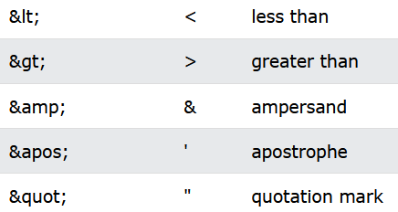

* Comments in XML, the syntax for writing comments in XML is similar to
that of HTML, however two dashes in the middle of a comment are not
allowed:

[source,xml]
----
<!-- This is a comment -->
----

====
*Pros*:

* Hierarchical structure with support for nested elements.
* Self-descriptive and human-readable.
* Supports schema validation for data integrity.
* Well-established and widely adopted in enterprise systems.

*Cons*:

* Verbosity leads to larger file sizes compared to JSON.
* Complex parsing and processing compared to simpler formats.
* Limited support for binary data.
====

== CSV - Comma-Separated Values

CSV dates back to the early days of computing and has been widely used
for storing and exchanging tabular data since the advent of spreadsheet
applications.

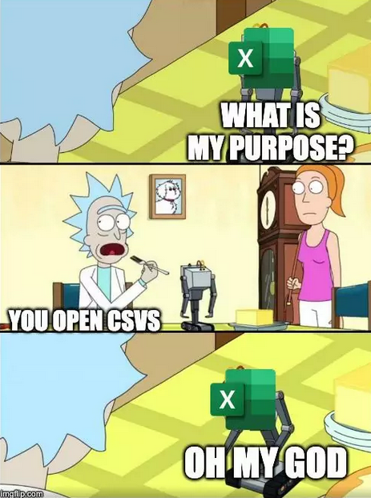

CSV is commonly used for importing/exporting data from spreadsheets,
databases, and other tabular datasets, that are characterized by simple
structures. Once you've opened a CSV file, you will see lines containing
the same sequence of data. Usually, commas separate the data, but a
semicolon, space, or a different character might separate the pieces of
information. However, the most common character is the comma.

[IMPORTANT]
====
_**CSV is a flat format**, so if your objects
have nested structures or complex relationships, you may need to flatten
or denormalize the data before writing it to CSV. Conversely, when
reading CSV data back into objects, you'll need to reconstruct the
original hierarchical structure based on the flattened data._
====

Let's see CSV in action of solving the next task - send data of an
object that has variable properties represented as variables, lists of
variables and another object. For our example our object will have the
following data (represented in java code)

[source,java]
----
public class employee {
    private long id;
    String name;
    String department;
    List<String> skills;
    Employee manager;
}
----

To represent a more complex structure with nested data like a list of
properties and/or an object within the CSV format, you typically have
two options:

* _Flatten the Data_: Flatten the structure by representing each skill and
manager property as separate columns. This approach may lead to a wide
CSV file with many columns if the nested structures are complex or have
a variable number of elements.

[source,csv]
----
id,name,age,department,skill1,skill2,skill3,manager_id,manager_name,manager_age,manager_department
1,John,30,Engineering,Coding,Design,Teamwork,2,Alice,25,Marketing
2,Alice,25,Marketing,Social Media,Marketing Strategy,Leadership,,,
3,Bob,40,Finance,Accounting,Financial Analysis,Communication,2,Alice,25,Marketing
----

* _Use Separate CSV Files_: Split the data into multiple CSV files, with
one file for each entity (e.g., employees, skills, managers). Each CSV
file represents a flat view of its corresponding entity, and
relationships between entities are established through identifiers or
keys.

[source,csv]
----
id,name,age,department,skill_ids,manager_id
1,John,30,Engineering,1,2
2,Alice,25,Marketing,2,
3,Bob,40,Finance,3,2
----

[NOTE]
====
While CSV is not as expressive as JSON or XML for representing complex
data structures, it can still be a convenient and widely supported
format for simple tabular data, such as lists of objects with flat
properties. For one more example you may check examples/employees.csv
====

====
*Pros*:

* Simple and easy to understand.
* Compact and efficient for storing tabular data.
* Widely supported by spreadsheet software, databases, and programming
languages.
* Human-readable and editable with a text editor.

*Cons*:

* Lacks support for hierarchical or nested data structures.
* Limited support for data types (everything is treated as a string).
* No standard schema for defining data structure.
====

== YAML - YAML Ain't Markup Language

The YAML acronym was shorthand for Yet Another Markup Language. But the
maintainers renamed it to YAML Ain't Markup Language to place more
emphasis on its data-oriented features. YAML was introduced in the early
2000s as a human-readable data serialization format inspired by other
markup languages like XML and JSON. YAML is a data serialization
language that is consistently listed as one of the most popular
programming languages. It's often used as a format for configuration
files, but its object serialization abilities make it a viable
replacement for languages like JSON.

[TIP]
====
YAML is commonly used for configuration files, data serialization, and
human-readable data representation.
====

A YAML file starts with three dashes '—'. These dashes indicate the
start of a new YAML document. YAML supports multiple documents, and
compliant parsers will recognize each set of dashes as the beginning of
a new one. Bellow will be listed *YAML basic 'syntax' components and
rules set*:

* *Maps/Dictionaries* (called mapping in YAML), the content of a mapping
node is an unordered set of key/value node pairs, with the restriction
that each of the keys is unique. YAML places no further restrictions on
the nodes.

[source,yaml]
----
name: "YAML Ain't Markup Language" #mapping
type: awesome
born: 2001
----

* *Arrays/Lists* (called sequences in YAML), the content of a sequence
node is an ordered series of zero or more nodes. In particular, a
sequence may contain the same node more than once. It could even contain
itself.

[source,yaml]
----
languages:
#Sequence 
  - YAML
  - JAVA
  - XML
  - Python
  - C
----

* *Literals* (Strings, numbers, boolean, etc.), the content of a scalar
node is an opaque datum that can be presented as a series of zero or
more Unicode characters.
** *Literals Strings*, the string literals do not require to be quoted.
It is only important to quote them when they contain a value that can be
mistaken as a special character. Here is an example where the string has
to be quoted as & is a special character.
+
[source,yaml]
----
message1: YAML & JSON # breaks as a & is a special character

message2: "YAML & JSON" # Works as the string is quoted
----
** *Folding Strings*, strings can also be written in blocks and be
interpreted without the new line characters using the fold operator
(greater than).
+
[source,yaml]
----
message: >
 even though
 it looks like
 this is a multiline message,
 it is actually not
----
+
The above YAML snippet is interpreted as below.
+
[source,yaml]
----
message: "even though it looks like this is a multiline message,it is actually not"
----
** *Block strings*, strings can be interpreted as blocks using the block
(pipe) character.
+
[source,yaml]
----
message: |
 this is
 a real multiline
 message
----
+
This is interpreted with the new lines () as below.
+
[source,yaml]
----
message: this is
 a real multiline
 message
----
** *Chomp characters*, multiline strings may end with whitespaces.
Preserve chomp(+) and strip chomp operators can be used either to
preserve or strip the whitespaces. They can be used with block and pipe
characters.
*** Preserving new line character
+
[source,yaml]
----
message: >+
 This block line
 Will be interpreted as a single
 line with a newline character at the
 end
----
+
The above snippet is interpreted as below in JSON
+
[source,json]
----
{
"message": "This block line Will be interpreted as a single line with a newline character at the  end\n"
}
----
*** Stripping new line character
+
[source,yaml]
----
message: >-
 This block line
 Will be interpreted as a single
 line without the newline character at the
 end
----
+
The above snippet is interpreted as below in JSON.
+
[source,json]
----
{
 "message": "This block line Will be interpreted as a single line without the newline character at the end"
}
----
* *Comments*, YAML file also supports comments, unlike JSON. A comment
starts with #.

[source,yaml]
----
---
# Comments inside a YAML file can be added followed by the '#' character
company: spacelift
----

* *Indentation* - A YAML file relies on whitespace and indentation to
indicate nesting. Notice the hierarchy and nesting is visible through a
Python-like indentation style. It is critical to note that tab
characters cannot be used for indentation in YAML files; only spaces can
be used. The number of spaces used for indentation doesn't matter as
long as they are consistent.

[source,yaml]
----
example:  #nesting level 1
 - yaml:  #nesting level 2 (1 space used for indentation)

    name: "YAML Ain't Markup Language" #string [literal] #nesting level 3 (4 spaces used for indentation)
    type: awesome #string [literal]
    born: 2001 #number [literal]
----

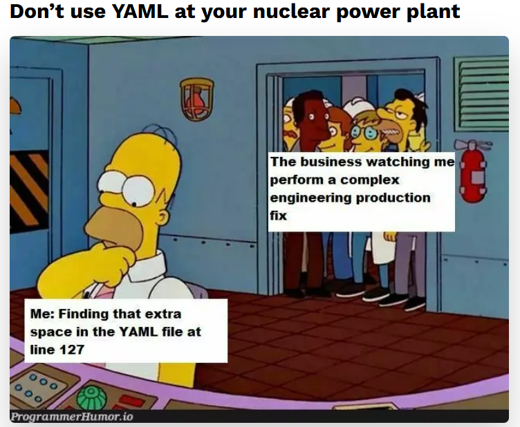

====
*Pros*:

* Human-readable and intuitive syntax.
* Supports complex data structures like lists, dictionaries, and nested
objects.
* Comments are allowed for documentation.
* Compact and expressive compared to XML.

*Cons*:

* Less widely supported compared to JSON and XML.
* More whitespace-sensitive, leading to potential parsing issues.
* Limited support for schema validation.
====

== Protobuf - Protocol Buffers

Protocol Buffers, also known as Protobuf, is a method developed by
Google for serializing structured data. It's designed to be a
language-agnostic, platform-neutral, extensible, and efficient mechanism
for serializing structured data. Protobuf is widely used in
communication protocols, data storage, and RPC (Remote Procedure Call)
systems.

[TIP]
====
Protocol Buffers were developed by Google in 2008 and were initially
used internally for various projects, including Google's internal
services and open-source projects like Protocol Buffers itself.
====

*The primary purpose of Protobuf* is to provide a compact, efficient, and
easy-to-use method for serializing structured data, making it ideal for
communication between systems and storing data in a structured format.

*Syntax and Examples*

Protocol Buffers use a schema to define the structure of the data being
serialized. This schema is written in a language-independent format,
which can then be compiled into code for various programming languages.
Here's a breakdown of the syntax using an example:

* *Define the message structure:*
+
[source,protobuf]
----
syntax = "proto3";

message Person {
  string name = 1;
  int32 id = 2;
  repeated string email = 3;
}
----
+
This example defines a message type called Person with three fields:
name, id, and email. name is a string, id is a 32-bit integer, and email
is a repeated field (an array) of strings.

* *Compile the schema:*
+
To compile the schema .proto file into Java code, you'll need to use the
Protocol Buffer compiler (protoc) along with the Java plugin. Here's how
you can do it:
+
Assuming you have a .proto file named your_proto_file.proto containing
the schema definition, you can compile it to generate Java code using
the following command:
+
[source,protoc]
----
protoc --java_out=. your_proto_file.proto
----
+
This command tells protoc to generate Java code in the current directory
(–java_out=.) based on the schema defined in your_proto_file.proto.
+
After running this command, you'll find Java files generated based on
your schema. Typically, these files will be in a package structure
matching the namespace specified in your .proto file.

* *Using the generated code:*
+
Once you've compiled the schema and generated the Java code, you can use
it in your Java project. Here's how you can create and use Protocol
Buffer messages in Java:
+
[source,java]
----
import com.example.protos.YourProtoFile.*;

public class Main {
  public static void main(String[] args) {
    // Create a new instance of your generated message class
    Person.Builder personBuilder = Person.newBuilder();

    // Set values for fields
    personBuilder.setName("John");
    personBuilder.setId(1234);
    personBuilder.addEmail("john@example.com");
    personBuilder.addEmail("john.doe@example.com");

    // Build the message
    Person person = personBuilder.build();

    // Serialize the message to bytes
    byte[] serializedPerson = person.toByteArray();

    // Deserialize the bytes back to a message
    try {
      Person newPerson = Person.parseFrom(serializedPerson);
      System.out.println(newPerson);
    } catch (InvalidProtocolBufferException e) {
      e.printStackTrace();
    }
  }
}
----
+
In this Java example, we import the generated Java code for the Person
message type (assuming it's in the package
com.example.protos.YourProtoFile). Then, we create a new Person.Builder,
set values for its fields, build the message, and serialize it to bytes.
Later, we deserialize the bytes back into a Person object using the
parseFrom method provided by Protocol Buffers.

[IMPORTANT]
====
Ensure that you have the Protocol Buffers runtime library for Java
included in your project's dependencies to use the generated code
effectively.
====

And yes, we touched the Serialization/Deserialization topic a bit, but
it is difficult not to, when speaking about Binary Data or formats
operating with it. The same will happen in the following chapter - the
'raw' Byte Array.

====
*Pros*:

* Efficient binary encoding for compact data transmission.
* Language-neutral with support for multiple programming languages.
* Schema evolution support for backward and forward compatibility.
* Generated code provides type safety and efficient
serialization/deserialization.

*Cons*:

* Less human-readable compared to text-based formats like JSON and XML.
* Requires a schema definition for data serialization.
* Not as widely adopted as JSON or XML in certain domains.
====

== Byte Array

Byte arrays are used to represent binary data in memory or during
transmission over the network. In network communication, data is often
transmitted as a stream of bytes. A byte array is a data structure that
stores a sequence of bytes contiguously in memory. It provides a
convenient way to represent data in a format that can be easily sent
over a network.

*Syntax and Examples*

* _Sending Data:_
+
[source,java]
----
import java.io.IOException;
import java.io.OutputStream;
import java.net.Socket;

public class Client {
    public static void main(String[] args) {
        try {
            Socket socket = new Socket("localhost", 8080);
            OutputStream outputStream = socket.getOutputStream();

            // Example data to send
            byte[] data = "Hello, Server!".getBytes();

            // Send the data over the network
            outputStream.write(data);

            outputStream.close();
            socket.close();
        } catch (IOException e) {
            e.printStackTrace();
        }
    }
}
----
+
In this Java example, we establish a connection to a server running on
localhost at port 8080. We then get the output stream of the socket and
write a byte array containing the data we want to send to the server.

* _Receiving Data:_
+
[source,java]
----
import java.io.IOException;
import java.io.InputStream;
import java.net.ServerSocket;
import java.net.Socket;

public class Server {
    public static void main(String[] args) {
        try {
            ServerSocket serverSocket = new ServerSocket(8080);
            Socket socket = serverSocket.accept();
            InputStream inputStream = socket.getInputStream();

            // Read data from the client
            byte[] buffer = new byte[1024];
            int bytesRead = inputStream.read(buffer);

            // Convert bytes to string
            String receivedData = new String(buffer, 0, bytesRead);
            System.out.println("Received data from client: " + receivedData);

            inputStream.close();
            socket.close();
            serverSocket.close();
        } catch (IOException e) {
            e.printStackTrace();
        }
    }
}
----
+
In this Java example, we create a server socket and accept incoming
connections. Once a connection is established, we get the input stream
of the socket and read data into a byte array buffer. We then convert
the byte array to a string to interpret the received data.

====
*Pros*:

* Efficient representation of binary data.
* Can represent any type of data, including images, audio, video, and
serialized objects.
* Suitable for low-level network protocols and file formats.

*Cons*:

* Not human-readable or editable.
* Platform-dependent byte ordering and encoding may cause compatibility
issues.
* Lack of structure makes it harder to parse and process compared to
text-based formats.
====

== Resources

*JSON*

* https://www.youtube.com/watch?v=iiADhChRriM
* https://www.youtube.com/watch?v=jSx84DYwymo
* https://www.jsonschemavalidator.net/
* https://www.json.org/json-en.html
* https://www.crockford.com/mckeeman.html

*XML*

* https://www.w3schools.com/xml/default.asp

*CSV*

* https://www.youtube.com/watch?v=UofTplCVkYI

*YAML*

* https://www.youtube.com/watch?v=BEki_rsWu4E
* https://yamlchecker.com/
* https://www.cloudbees.com/blog/yaml-tutorial-everything-you-need-get-started
* https://spacelift.io/blog/yaml

*Protobuf*

* https://www.youtube.com/watch?v=FR754e5xIwg

*Byte Array*

* https://www.youtube.com/watch?v=Ji4geHitwuA
* https://www.youtube.com/watch?v=nfXp0yZdP94
* https://www.youtube.com/watch?v=7Y18VRH-RGg

*And others…*

* https://bsonspec.org/spec.html

== Keep digging!

'''

Created by: Mihail Trifonov +
Edited by: Igor Gorea

Email: mihail.trifonov@endava.com
