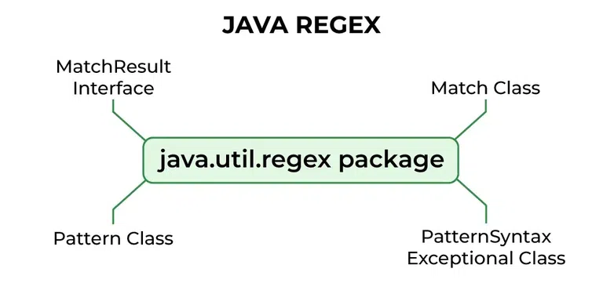

=  Regular Expression & pattern in programming
author: Andrei Diogoti <andrei.diogoti@gmail.com>
:toc: macro

toc::[]
:sectnums:

== Introduction

=== What are Regular Expressions and pattern?

** *_Regular Expressions_* (shortened as regex) is a sequence of characters that specifies a match pattern in text.
One line of regex can easily replace several dozen lines of programming codes.
Regular expressions are used in search engines, in search and replace dialogs of word processors and text editors, in text processing utilities, and in lexical analysis.
Usually such patterns are used by string-searching algorithms for "find" or "find and replace" operations on strings, or for input validation.
Regex is supported in all the scripting languages (such as Perl, Python, PHP, Java and JavaScript).

** *_A regex pattern_* consists of a sequence of characters that define a search criterion.
For example,`\\d+` represents one or more digits.
Each character in a regular expression (that is, each character in the string describing its pattern) is either a metacharacter, having a special meaning, or a regular character that has a literal meaning.

_For example_, in the regex `b.`, 'b' is a literal character that matches just 'b', while `'.'` is a metacharacter that matches every character except a newline.
Therefore, this regex matches, for example, 'b%', or 'bx', or 'b5'.

Together, metacharacters and literal characters can be used to identify text of a given pattern or process a number of instances of it.
Pattern matches may vary from a precise equality to a very general similarity, as controlled by the metacharacters.

_For example_, `.` is a very general pattern, [a-z] (match all lower case letters from 'a' to 'z') is less general and b is a precise pattern (matches just 'b').

** *_Strings and Regular Expressions_*: Both the patterns (used for matching) and the strings to be searched can be either Unicode strings (usually represented as str) or 8-bit strings (often represented as bytes).
However, there are some important considerations when working with Unicode and 8-bit strings in the context of regular expressions: Unicode Strings (str): Unicode strings can represent characters from various scripts and languages.
When using a Unicode string as the search target, you cannot directly match it with a bytes pattern (and vice versa).
They must be of the same type.

_For example_, if you have a Unicode string containing Japanese text, you should use a Unicode-aware regex pattern to match it. 8-Bit Strings (bytes): 8-bit strings (bytes) are typically used for binary data or when working with legacy systems.
When using an 8-bit string as the search target, you should use an 8-bit regex pattern.
Be cautious when mixing Unicode escapes (e.g., \\u20AC) with 8-bit patterns; some engines may not handle them correctly.

 The metacharacter syntax is designed specifically to represent prescribed targets in a concise and flexible way to direct the automation of text processing of a variety of input data

=== What Are Regex Used For?

Regex have numerous uses; sampling of the types of problems that you can solve with regex.

* Check whether the pattern ss appears in the string Mississippi.
* Check whether the letter p occurs three or more times in Mississippi.
* Find and replace all instances of Mrs with Ms in a document.
* Does a file name begin with Bob and end with .txt or .md?
* Does a string have any non-alphanumeric characters in it?
* Did the user enter a valid integer?
* Are there any whitespace characters in the string?
* Find and replace all non-alphanumeric characters in a string with -.
* Locate all email addresses in a document.
* Split a line of text into fields assuming that each whitespace character delimits two values.

== Regex Syntax Summary

* _Character_: All characters, except those having special meaning in regex, matches themselves.
E.g., the regex x matches substring "x"; regex 9 matches "9"; regex = matches "="; and regex @ matches "@".
* _Special Regex Characters_ (quantifiers): These characters have special meaning in regex : ., +, *, ?, ^, $, (, ), [, ], {, }, |, \.
A quantifier after an element (such as a token, character, or group) specifies how many times the preceding element is allowed to repeat.
The most common quantifiers are the question mark ?, the asterisk * (derived from the Kleene star), and the plus sign + (Kleene plus).

[%autowidth.stretch]
|===
|Quantifier|Description
|?
|The question mark indicates zero or one occurrences of the preceding element. For example, colou?r matches both "color" and "colour".
|*
|The asterisk indicates zero or more occurrences of the preceding element. For example, ab*c matches "ac", "abc", "abbc", "abbbc", and so on.
|+
|The plus sign indicates one or more occurrences of the preceding element. For example, ab+c matches "abc", "abbc", "abbbc", and so on, but not "ac".
|{n}
|The preceding item is matched exactly n times.
|{min,}|    The preceding item is matched min or more times.
|{,max}|    The preceding item is matched up to max times.
|{min,max}|    The preceding item is matched at least min times, but not more than max times.
|*?
|? after a quantifier makes it a reluctant quantifier. It tries to find the smallest match. This makes the regular expression stop at the first match
|() | Parentheses are used to define the scope and precedence of the operators (among other uses). For example, gray\|grey and gr(a\|e)y are equivalent patterns which both describe the set of "gray" or "grey".
|===

* _Escape Sequences (\char)_:
** To match a character having special meaning in regex, you need to use a escape sequence prefix with a backslash (\).
E.g., \. matches "."; regex \+ matches "+"; and regex \( matches "(".
** You also need to use regex \\ to match "\" (back-slash).
** Regex recognizes common escape sequences such as \n for newline, \t for tab, \r for carriage-return, \nnn for a up to 3-digit octal number, \xhh for a two-digit hex code, \uhhhh for a 4-digit Unicode, \uhhhhhhhh for a 8-digit Unicode

* _A Sequence of Characters (or String)_: Strings can be matched via combining a sequence of characters (called sub-expressions).
E.g., the regex Saturday matches "Saturday".
The matching, by default, is case-sensitive, but can be set to case-insensitive via modifier.

* _OR Operator (|)_: E.g., the regex four|4 accepts strings "four" or "4".
Most formalisms provide the following operations to construct regular expressions.
For example, gray|grey can match "gray" or "grey".

* _Character class (or Bracket List)_:
** [...]: Accept ANY ONE of the character within the square bracket, e.g., [aeiou] matches "a", "e", "i", "o" or "u".
** [.-.] (Range Expression): Accept ANY ONE of the character in the range, e.g., [0-9] matches any digit; [A-Za-z] matches any uppercase or lowercase letters.
** [^...]: NOT ONE of the character, e.g., [^0-9] matches any non-digit.
** Only these four characters require escape sequence inside the bracket list: ^, -, ], \.

* _Occurrence Indicators (or Repetition Operators)_:
** \+: one or more (1+), e.g., [0-9]+ matches one or more digits such as '123', '000'.
** \*: zero or more (0+), e.g., [0-9]* matches zero or more digits.
It accepts all those in [0-9]+ plus the empty string.
** ?: zero or one (optional), e.g., [+-]? matches an optional "+", "-", or an empty string.
** {m,n}: m to n (both inclusive)
** {m}: exactly m times
** {m,}: m or more (m+)

* _Position Anchors_: does not match character, but position such as start-of-line, end-of-line, start-of-word and end-of-word.
** ^, $: start-of-line and end-of-line respectively.
E.g., ^[0-9]$ matches a numeric string.
** *\b*: boundary of word, i.e., start-of-word or end-of-word.
E.g., \bcat\b matches the word "cat" in the input string.
** \B: Inverse of \b, i.e., non-start-of-word or non-end-of-word.
** \<, \>: start-of-word and end-of-word respectively, similar to \b. E.g.,`\<cat\>` matches the word "cat" in the input string.
** \A, \Z: start-of-input and end-of-input respectively.

* _Metacharacters_: matches a character
** *.* (dot): Any one character except newline.
Same as [^\n]
For example, +
`a.b` matches any string that contains an "a", and then any character and then "b". +
`a.*b` matches any string that contains an "a", and then the character "b" at some later point.
** *\d*, *\D*: Any one digit/non-digit character.
Digits are [0-9]
** *\w, \W*: Any one word/non-word character.
For ASCII, word characters are [a-zA-Z0-9_]
** *\s, \S*: Any one space/non-space character.
For ASCII, whitespace characters are [ \n\r\t\f]

* _Greediness, Laziness and Backtracking for Repetition Operators_

** *_Greediness of Repetition Operators_* *, +, ?, {m,n}`: The repetition operators are greedy operators, and by default grasp as many characters as possible for a match.
For example, the regex xy{2,4} try to match for "xyyyy", then "xyyy", and then "xyy".

** *_Lazy Quantifiers_* \*?, +?, ??, {m,n}?, {m,}?, : You can put an extra ? after the repetition operators to curb its greediness (i.e., stop at the shortest match).

** *_Backtracking_*: If a regex reaches a state where a match cannot be completed, it backtracks by unwinding one character from the greedy match.
For example, if the regex z*zzz is matched against the string "zzzz", the z* first matches "zzzz"; unwinds to match "zzz"; unwinds to match "zz"; and finally unwinds to match "z", such that the rest of the patterns can find a match.

** *_Possessive Quantifiers_* *+, ++, ?+, {m,n}+, {m,}+ : You can put an extra + to the repetition operators to disable backtracking, even it may result in match failure. e.g, z++z will not match "zzzz".
This feature might not be supported in some languages.
These constructions can be combined to form arbitrarily complex expressions, much like one can construct arithmetical expressions from numbers and the operations +, −, ×, and ÷.

*Book* https://www.octawian.ro/fisiere/situri/asor/build/html/_downloads/23959de8d6104244fc49cc08032586b2/Fitzgerald_Regex.pdf["Regular Expression O'Really]

:sectnums:

== How to write regular expressions with hands-on examples
:sectnumlevels: 2
===  Numbers `[0-9]+ or \d+`

* A regex (regular expression) consists of a sequence of sub-expressions.
In this example, [0-9] and +.
*  The [...], known as character class (or bracket list), encloses a list of characters. It matches any SINGLE character in the list. In this example, [0-9] matches any SINGLE character between 0 and 9 (i.e., a digit), where dash (-) denotes the range.
*  The \+, known as occurrence indicator (or repetition operator), indicates one or more occurrences (1+) of the previous sub-expression.
In this case, [0-9]+ matches one or more digits.
* A regex may match a portion of the input (i.e., substring) or the entire input.
In fact, it could match zero or more substrings of the input (with global modifier).
* This regex matches any numeric substring (of digits 0 to 9) of the input.
For examples,
** If the input is "abc123xyz", it matches substring "123".
** If the input is "abcxyz", it matches nothing.
** If the input is "abc00123xyz456_0", it matches substrings "00123", "456" and "0" (three matches).
* Take note that this regex matches number with leading zeros, such as "000", "0123" and "0001", which may not be desirable.
* You can also write \d+, where \d is known as a metacharacter that matches any digit (same as [0-9]).
There are more than one way to write a regex!
Take note that many programming languages (C, Java, JavaScript, Python) use backslash \ as the prefix for escape sequences (e.g., \n for newline), and you need to write "\\d+" instead.

=== Full Numeric Strings  `^[0-9]+$ or ^\d+$`

* The leading ^ and the trailing $ are known as position anchors, which match the start and end positions of the line, respectively.
As the result, the entire input string shall be matched fully, instead of a portion of the input string (substring).
* This regex matches any non-empty numeric strings (comprising digits 0 to 9), e.g., "0" and "12345".
It does not match with "" (empty string), "abc", "a123", "abc123xyz", etc.
However, it also matches "000", "0123" and "0001" with leading zeros.

=== Positive Integer Literals `[1-9][0-9]*|0 or [1-9]\d*|0`

* [1-9] matches any character between 1 to the 9; [0-9]* matches zero or more digits.
The * is an occurrence indicator representing zero or more occurrences.
Together, [1-9][0-9]* matches any numbers without a leading zero.
* | represents the OR operator; which is used to include the number 0.
* This expression matches "0" and "123"; but does not match "000" and "0123" (but see below).
* You can replace [0-9] by metacharacter \d, but not [1-9].
* We did not use position anchors ^ and $ in this regex.
Hence, it can match any parts of the input string.
For examples,
** If the input string is "abc123xyz", it matches the substring "123".
** If the input string is "abcxyz", it matches nothing.
** If the input string is "abc123xyz456_0", it matches substrings "123", "456" and "0" (three matches).
** If the input string is "0012300", it matches substrings: "0", "0" and "12300" (three matches)!!!

=== Full Integer Literals `^[+-]?[1-9][0-9]*|0$ or ^[+-]?[1-9]\d*|0$`

* This regex match an Integer literal (for entire string with the position anchors), both positive, negative and zero.
* [+-] matches either + or - sign. ? is an occurrence indicator denoting 0 or 1 occurrence, i.e. optional. Hence, [+-]? matches an optional leading + or - sign.
* We have covered three occurrence indicators: + for one or more, * for zero or more, and ? for zero or one.

=== Identifiers (or Names) `[a-zA-Z_][0-9a-zA-Z_]* or [a-zA-Z_]\w*`

* Begin with one letters or underscore, followed by zero or more digits, letters and underscore.
* You can use metacharacter \w for a word character [a-zA-Z0-9_].
Recall that metacharacter \d can be used for a digit [0-9].

=== Image Filenames `^\w+\.(gif|png|jpg|jpeg)$`

* The position anchors ^ and $ match the beginning and the ending of the input string, respectively.
That is, this regex shall match the entire input string, instead of a part of the input string (substring).
* \w+ matches one or more word characters (same as [a-zA-Z0-9_]+).
* \. matches the dot (.) character.
We need to use \. to represent . as . has special meaning in regex.
The \ is known as the escape code, which restore the original literal meaning of the following character.
Similarly, *, +, ? (occurrence indicators), ^, $ (position anchors) have special meaning in regex.
You need to use an escape code to match with these characters.
* (gif|png|jpg|jpeg) matches either "gif", "png", "jpg" or "jpeg".
The | denotes "OR" operator.
The parentheses are used for grouping the selections.
* The modifier i after the regex specifies case-insensitive matching (applicable to some languages like Perl and JavaScript only).
That is, it accepts "test.GIF" and "TesT.Gif".

=== Email Addresses `^\w+([.-]?\w+)*@\w+([.-]?\w+)*(\.\w{2,3})+$`

* The position anchors ^ and $ match the beginning and the ending of the input string, respectively.
That is, this regex shall match the entire input string, instead of a part of the input string (substring).
* \w+ matches 1 or more word characters (same as [a-zA-Z0-9_]+).
* [.-]? matches an optional character . or -. Although dot (.) has special meaning in regex, in a character class (square brackets) any characters except ^, -, ] or \ is a literal, and do not require escape sequence.
* ([.-]?\w+)* matches 0 or more occurrences of [.-]?\w+.
* The sub-expression \w+([.-]?\w+)* is used to match the username in the email, before the @ sign.
It begins with at least one word character [a-zA-Z0-9_], followed by more word characters or . or -.
However, a . or - must follow by a word character [a-zA-Z0-9_].
That is, the input string cannot begin with . or -; and cannot contain "..", "--", ".-" or "-.".
Example of valid string are "a.1-2-3".
* The @ matches itself.
In regex, all characters other than those having special meanings matches itself, e.g., a matches a, b matches b, and etc.
* Again, the sub-expression \w+([.-]?\w+)* is used to match the email domain name, with the same pattern as the username described above.
* The sub-expression \.\w{2,3} matches a . followed by two or three word characters, e.g., ".com", ".edu", ".us", ".uk", ".co".
* (\.\w{2,3})+ specifies that the above sub-expression could occur one or more times, e.g., ".com", ".co.uk", ".edu.sg" etc.

=== Swapping Words using Parenthesized Back-References `^(\S+)\s+(\S+)$ and $2 $1`

* The ^ and $ match the beginning and ending of the input string, respectively.
* The \s (lowercase s) matches a whitespace (blank, tab \t, and newline \r or \n).
On the other hand, the \S+ (uppercase S) matches anything that is NOT matched by \s, i.e., non-whitespace.
In regex, the uppercase metacharacter denotes the inverse of the lowercase counterpart, for example, \w for word character and \W for non-word character; \d for digit and \D or non-digit.
* The above regex matches two words (without white spaces) separated by one or more whitespaces.
* Parentheses () have two meanings in regex:
** to group sub-expressions, e.g., (abc)*
** to provide a so-called back-reference for capturing and extracting matches.
* The parentheses in (\S+), called parenthesized back-reference, is used to extract the matched substring from the input string.
In this regex, there are two (\S+), match the first two words, separated by one or more whitespaces \s+.
The two matched words are extracted from the input string and typically kept in special variables $1 and $2 (or \1 and \2 in Python), respectively.
* To swap the two words, you can access the special variables, and print "$2 $1" (via a programming language);

===  HTTP Addresses `^http:\/\/\S+(\/\S+)*(\/)?$`

* Begin with http://.
Take note that you may need to write / as \/ with an escape code in some languages (JavaScript, Perl).
* Followed by \S+, one or more non-whitespaces, for the domain name.
* Followed by (\/\S+)*, zero or more "/...", for the sub-directories.
* Followed by (\/)?, an optional (0 or 1) trailing /, for directory request.

:sectnumlevels!: 2

==  Regex in Programming Languages

=== *Regular Expressions in Java*
Java does not have a built-in Regular Expression class, but we can import the *java.util.regex* package to work with regular expressions. The package includes the following classes:

** Pattern Class - Defines a pattern (to be used in a search)
** Matcher Class - Used to search for the pattern
** MatchResult (interface) - It is result of a match operation. It contains query methods used to determine the results of a match against a regular expression.
** PatternSyntaxException Class - Indicates syntax error in a regular expression pattern

:sectnumlevels: 3

==== Pattern class

It represents the compiled representation of a regular expression. To use Java regex API, we must compile the regular expression to this class.

After compilation, it’s instance can be used to create a Matcher object that can match lines/strings against the regular expression.

Note that many matchers can share the same pattern. State information during processing is kept inside Matcher instance.

Instances of this class are immutable and are safe for use by multiple concurrent threads.

** Predicate asPredicate() – Creates a Java 8 predicate which can be used to match a string.
** static Pattern compile(String regex) – It is used to compile the given regular expression into a pattern.
** static Pattern compile(String regex, int flags) – It is used to compile the given regular expression into a pattern with the given flags.
** int flags() – It is used to return this pattern’s match flags.
** Matcher matcher(CharSequence input) – It is used to create a matcher that will match the given input against this pattern.
** static boolean matches(String regex, CharSequence input) – It is used to compile the given regular expression and attempts to match the given input against it.
** String pattern() – It is used to return the regular expression from which this pattern was compiled.
** static String quote(String s) – It is used to return a literal pattern String for the specified String.
** String[] split(CharSequence input) – It is used to split the given input sequence around matches of this pattern.
** String[] split(CharSequence input, int limit) – It is used to split the given input sequence around matches of this pattern.
** Stream splitAsStream(CharSequence input) – Creates a stream from the given input sequence around matches of this pattern.

==== Matcher class
It is the main class that performs match operations on a string/line by interpreting a Pattern. Once created, a matcher can be used to perform the different kinds of match operations.

This class also defines methods for replacing matched sub-sequences with new strings whose contents can, if desired, be computed from the match result.

Instances of  this class are not thread safe.

** boolean find() – It is mainly used for searching multiple occurrences of the regular expressions in the text.
** boolean find(int start) – It is used for searching occurrences of the regular expressions in the text starting from the given index.
** int start() – It is used for getting the start index of a match that is being found using find() method.
** int end() – It is used for getting the end index of a match that is being found using find() method. It returns index of character next to last matching character.
** int groupCount() – It is used to find the total number of the matched subsequence.
** String group() – It is used to find the matched subsequence.
** boolean matches() – It is used to test whether the regular expression matches the pattern.
** boolean lookingAt() – Attempts to match the input sequence, starting at the beginning of the region, against the pattern.
** String quoteReplacement(String s) – Returns a literal replacement String for the specified String.
** Matcher reset() – Resets this matcher.
** MatchResult toMatchResult() – Returns the match state of this matcher as a MatchResult.

:sectnumlevels!: 3

*_Java Regex Examples:_*

You first create a Pattern object which defines the regular expression. This Pattern object allows you to create a Matcher object for a given string. This Matcher object then allows you to do regex operations on a String.
[source,java]
----
import java.util.regex.Matcher;
import java.util.regex.Pattern;

public class RegexExamples {

	public static void main(String[] args) {
		// using pattern with flags
		Pattern pattern = Pattern.compile("ab", Pattern.CASE_INSENSITIVE);
		Matcher matcher = pattern.matcher("ABcabdAb");
		// using Matcher find(), group(), start() and end() methods
		while (matcher.find()) {
			System.out.println("Found the text \"" + matcher.group()
					+ "\" starting at " + matcher.start()
					+ " index and ending at index " + matcher.end());
		}

		// using Pattern split() method
		pattern = Pattern.compile("\\W");
		String[] words = pattern.split("one@two#three:four$five");
		for (String s : words) {
			System.out.println("Split using Pattern.split(): " + s);
		}

		// using Matcher.replaceFirst() and replaceAll() methods
		pattern = Pattern.compile("1*2");
		matcher = pattern.matcher("11234512678");
		System.out.println("Using replaceAll: " + matcher.replaceAll("_"));
		System.out.println("Using replaceFirst: " + matcher.replaceFirst("_"));
	}
}
----

link:exemples/Java/ValidateNumbers.java[ValidateRegexNumber]

link:exemples/Java/ValidateEmail.java[ValidateEmail]

link:exemples/Java/ValidateIpAddress.java[ValidateIpAddress]

link:exemples/Java/ValidatePhone.java[ValidatePhone]

*To learn more, visit:*

* https://docs.oracle.com/javase/tutorial/essential/regex/index.html[Java Framework Documentation for Regular Expressions]
* https://docs.oracle.com/javase/8/docs/api/java/util/regex/Pattern.html[Pattern Class Java Documentation]
* https://docs.oracle.com/javase/8/docs/api/java/util/regex/Matcher.html[Matcher Class Java Documentation]
* https://www.javatpoint.com/java-regex[Java regex]

=== *Regular Expression in Phyton*

Python has a built-in package called *re* (RegEx Module), which can be used to work with Regular Expressions.
Import the re module:

`import #re#`

When you have imported the re module, you can start using regular expressions:

[source,pyhton]
----
import re

txt = "The rain in Spain"
x = re.search("^The.*Spain$", txt)
----

Popular Python re Module Functions

[%autowidth.stretch]
|===
|Function|Description

|re.findall(A, B) | Matches all instances of an expression A in a string B and returns them in a list.

|re.search(A, B) | Matches the first instance of an expression A in a string B, and returns it as a re match object.

|re.split(A, B) | Split a string B into a list using the delimiter A.

|re.sub(A, B, C) | Replace A with B in the string C.
|===

*Python Regex Examples:*

link:exemples/Python/ValidateNumbers.py[ValidateNumber]

link:exemples/Python/ValidateEmail.py[ValidateEmail]

link:exemples/Python/ValidateIpAddress.py[ValidateIpAddress]

link:exemples/Python/ValidatePhone.py[ValidatePhone]

*To learn more, visit:*

* https://docs.python.org/3/howto/regex.html[Regular Expression HOWTO]
* https://realpython.com/regex-python/[Regexes in Python]

=== *Regular Expression in JavaScript*

There are two ways you can create a regular expression in JavaScript.

** Using a regular expression literal:

The regular expression consists of a pattern enclosed between slashes /.
For example,
[source,javascript]
----
const regularExp = /abc/;
----
Here, /abc/ is a regular expression.

** Using the RegExp() constructor function:
You can also create a regular expression by calling the RegExp() constructor function.
For example,

[source,javascript]
----
const reguarExp = new RegExp('abc');
----

RegExp Object Methods

[%autowidth.stretch]
|===
|Method|Description

|compile()|    Deprecated in version 1.5. Compiles a regular expression
|exec()    |Tests for a match in a string. Returns the first match
|test()|Tests for a match in a string. Returns true or false
|toString()|    Returns the string value of the regular expression
|matchAll()|	Returns an iterator containing to all the matches.
|search()|	Tests for a match in a string and returns the index of the match. It returns -1 if the search fails.
|replace()|	Searches for a match in a string and replaces the matched substring with a replacement substring.
|split()|	Break a string into an array of substrings.
|===

*JavaScript Regex Examples:*

link:exemples/JavaScript/ValidateNumbers.js[ValidateNumber]

link:exemples/JavaScript/ValidateEmail.js[ValidateEmail]

link:exemples/JavaScript/ValidateIpAddress.js[ValidateIpAddress]

link:exemples/JavaScript/ValidatePhone.js[ValidatePhone]

*To learn more, visit*:

* https://www.freecodecamp.org/news/regular-expressions-for-beginners/[How to Use Regular Expressions  in JavaScript]
* https://www.programiz.com/javascript/regex[JavaScript Regex]

== Useful tools for regex validation and creation

Online tools to learn, build & test Regular Expression (RegEx/RegExp)

https://regex101.com/[regex101.com]

https://regexr.com/[regexr.com]

https://www.regextester.com/[regextester.com]

:sectnums!:
