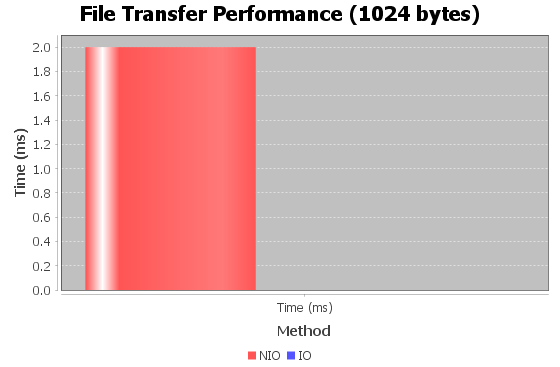
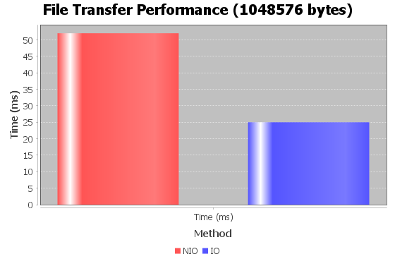
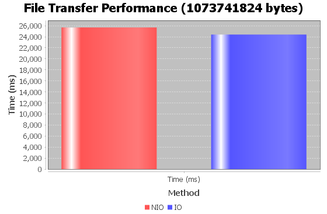

# File Transfer Performance Analysis

- [File Transfer Performance Analysis](#file-transfer-performance-analysis)
   - [How It Works](#how-it-works)
   - [Running the Code](#running-the-code)
      - [Running the Code in IntelliJ IDEA](#running-the-code-in-intellij-idea)
      - [Customizing the File Size](#customizing-the-file-size)
      - [Running the Code in CLI](#running-the-code-in-cli)
         - [Locally](#locally)
         - [Client-Server Setup in a Local Network](#client-server-setup-in-a-local-network)
   - [Resultsin the chars](#results)
   - [Project Structure](#project-structure)


This project is designed to investigate the performance of IO and NIO methods for file transfer in Java. It consists of a server (`FileReceiver`) and a client (`FileSender`) that can transfer files using both IO and NIO techniques.

## How It Works

- The `FileReceiver` server listens on two ports (8080 and 8081 by default) and accepts files sent by the client. One port is dedicated to NIO-based file transfer, and the other is for IO-based transfer.
- The `FileSender` client sends a large file (1 GB by default) to the server using both IO and NIO methods. The file is sent twice: once to each port.
- After receiving the files, the server calculates the time taken for each transfer method and generates a bar chart comparing the performance of IO and NIO.

## Running the Code

### Running the Code in IntelliJ IDEA

1. **Import the Project:**
   - Copy this project to your local machine.
   - Open IntelliJ IDEA and select "Open or Import."
   - Navigate to the project directory and select the `pom.xml` file. Click "Open" to import the Maven project.

2. **Run the SendReceiveRunner:**
   - Right-click on the `SendReceiveRunner` class in the Project Explorer and select "Run 'SendReceiveRunner.main()'." This will start both the server and client locally.

3. **Run the Client and Server Separately (Client-Server Setup):**
   - **Server:** Right-click on the `FileReceiver` class and select "Run 'FileReceiver.main()'." Make sure the server's firewall allows incoming connections on the ports used (8080 and 8081 by default).
   - **Client:** Modify the `server.address` property in the `filesender.properties` file to the IP address of the server machine. Right-click on the `FileSender` class and select "Run 'FileSender.main()'."

### Customizing the File Size

The size of the file to be transferred can be changed in the `FileSender.java` file. Look for the following line:

```java
long size = 1024 * 1024 * 1024; // 1 GB
```

### Running the Code in CLI
#### Locally

1. **Start the Server:**
    - Open a terminal and navigate to the project directory.
    - Compile and run the `FileReceiver` class:
      ```java
      javac src/main/java/com/example/FileReceiver.java
      java -cp src/main/java com.example.FileReceiver
      ```

2. **Start the Client:**
    - Open another terminal and navigate to the project directory.
    - Compile and run the `FileSender` class:
      ```java
      javac src/main/java/com/example/FileSender.java
      java -cp src/main/java com.example.FileSender
      ```

#### Client-Server Setup in a Local Network

1. **On the Server Machine:**
    - Follow the same steps as in the local setup to start the server.
    - Make sure the server's firewall allows incoming connections on the ports used (8080 and 8081 by default).

2. **On the Client Machine:**
    - Modify the `server.address` property in the `filesender.properties` file to the IP address of the server machine.
    - Follow the same steps as in the local setup to start the client.

## Results

After both transfers are complete, the server will display the time takenThe chart illustrates the time required for IO and NIO file transfers for a 1 GB file. As the data transfer volume increases, the time differences between the NIO and IO methods become more aligned. for each method and save a bar chart comparing the performance. The chart will be saved as `chart_<file_size>.png` in the project directory.


The chart shows the time taken for IO and NIO file transfers for a 1 KB file. The NIO method is significantly faster than the IO method, especially for larger files.




The chart shows the time taken for IO and NIO file transfers for a 1 MB file. The NIO method is significantly faster than the IO method, especially for larger files.




The chart illustrates the time required for IO and NIO file transfers for a 1 GB file. As the data transfer volume increases, the time differences between the NIO and IO methods become more aligned.
## Project Structure
      
```bash
.
├── src
│   └── main
│       └── java
│           └── com
│               └── example
│                   ├── FileReceiver.java
│                   ├── FileSender.java
│                   └── SendReceiveRunner.java
│       └── resources
│           ├── filereceiver.properties
│           └── filesender.properties
├── chart_1024.png
├── chart_1048576.png
├── chart_1073741824.png
├── pom.xml
└── README_WSL.md
```


