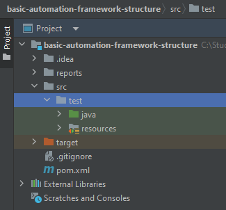
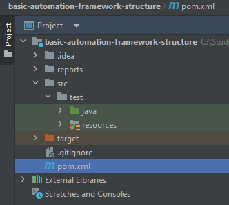
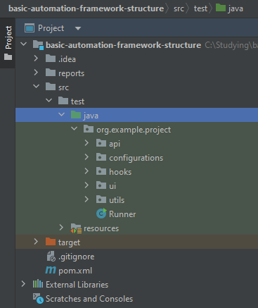
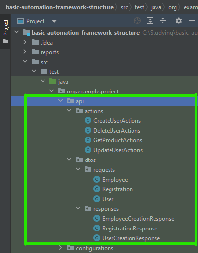
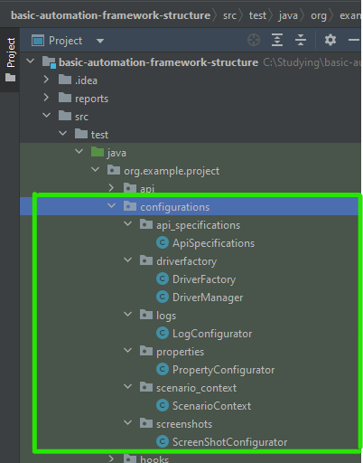
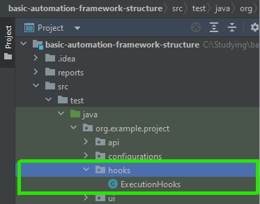
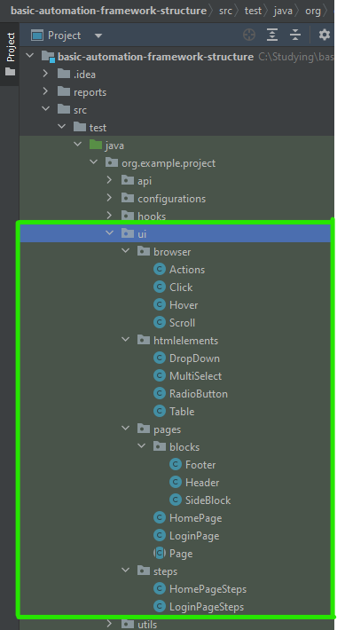
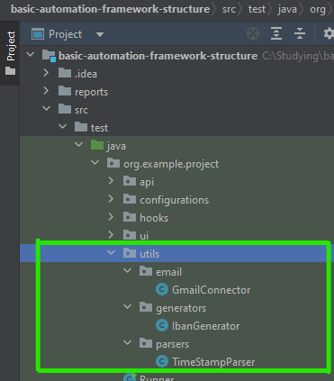
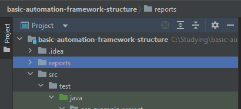

:doctype: book
:revdate: June 2024
:toc: left
:toc-title: Contents
:sectnums:
:icons: font

= Basic Automation Framework Structure

== Introduction: framework for test automation - what? when? why? how?

- *What is a Test Automation Framework?*

A testing framework is a structured set of guidelines, tools, and practices that provides a foundation for designing, organizing, and executing software tests.
It encompasses a systematic approach to automate the testing process, enhancing efficiency and enabling the creation of maintainable and scalable test suites.

- *When to Use an Automation Testing Framework?*

A testing framework is employed throughout the software development lifecycle, with its primary application in the testing phase.
It is particularly beneficial when a project requires repetitive testing, as it allows for the automation of test cases, ensuring consistent and thorough testing across multiple iterations.
Implementing a testing framework early in the development cycle helps identify and address issues promptly, contributing to the overall quality of the software.

- *Why Use an Automated Testing Framework?*

The adoption of a testing framework is essential for several reasons.
It streamlines the testing process, saving time and resources by automating repetitive tasks.
It enhances maintainability, scalability, and collaboration within development teams, ensuring a standardized approach to testing.
Ultimately, a testing framework contributes to the delivery of high-quality software by providing a structured and efficient means of validating code functionality.

- *How a Framework For Automation of Tests work?*

A Framework For Automation of Tests usually uses a programming language, more commonly an OOP one like: Java, C#, JavaScript, Python.
Having in mind the particularities of the chosen language, the Framework also makes use of existing libraries and tools to achieve the automation of the given test scenarios.
For this particular guide we will be focussing on Java programming language together with Maven as building and dependency managing tool.

You may have noticed the variety of names given to the 'thing' we are discussing here, all of them refer to the same concept and for the purpose of avoiding any confusion further the term 'Automated Testing Framework' or 'ATF' for short will be used from now on.

== Common capabilities: What an Automated Testing Framework should be able to do?

The capabilities of an ATF should be driven by the testing necessities of the concrete project/application under test, taking into considerations all the existing constraints on the resources like time, budget, people, knowledge, etc.

But here are some common ones that most of the ATFs posses:

- *Test Runner:*

A test runner is a fundamental component responsible for executing test scripts in a defined order.
It manages the flow of test execution, handles dependencies between test cases, and provides a consolidated view of test results.
A robust test runner simplifies the automation process and facilitates the creation and execution of test suites.

- *BDD Framework:*

Behavior-Driven Development (BDD) frameworks, like Cucumber or SpecFlow for more atomic tests or Gauge for some E2E tests, enable collaboration between technical and non-technical team members.
They use a natural language syntax to define test scenarios, fostering communication and ensuring that tests align with business requirements.
BDD frameworks enhance clarity and maintainability in automated tests.

- *UI Interaction Tools and Configuration:*

UI interaction tools, such as Selenium or Appium, allow automated testing of user interfaces.
These tools simulate user interactions with the application, enabling the testing of functionalities like button clicks, form submissions, and navigation.
Configuration settings help adapt the automation framework to different UI technologies and environments.

- *API Interaction Tools and Configuration:*

For testing APIs, tools like Postman or RestAssured are essential.
They provide the means to send HTTP requests, validate responses, and ensure the correct functioning of backend services.
Configuration options allow the framework to adapt to different API specifications and authentication mechanisms.

- *Assertions Libraries:*

Assertions libraries, like JUnit or TestNG in Java, help validate expected outcomes in test scripts.
These libraries provide a set of predefined checks and conditions, allowing testers to assert that certain conditions are met during test execution.
Assertions ensure the correctness of the application behavior.

- *Properties Manager:*

A properties manager centralizes the management of configuration settings and test data.
It allows for the dynamic configuration of test environments and the separation of test data from test scripts.
This enhances maintainability and facilitates the reuse of test scripts in different scenarios.

- *Logging:*

Logging is crucial for tracking the execution flow and identifying issues during test runs.
Frameworks incorporate logging mechanisms to record detailed information about test execution, including any errors or unexpected behaviors.
Logs aid in troubleshooting and debugging, contributing to the reliability of automated tests.

- *Recording (Screenshots/Videos):*

Recording capabilities capture visual evidence of test execution.
Screenshots and videos taken during test runs serve as documentation and help in diagnosing issues.
This feature is particularly useful in identifying the state of the application at specific points during test execution.

- *Reporting:*

Reporting tools generate comprehensive reports summarizing test results.
They provide insights into test coverage, pass/fail status, and overall test execution statistics.
Well-structured reports enhance visibility and communication, allowing stakeholders to assess the quality of the application under test.

- *Test Data Generation:*

If the testing process requires a heavy focus on test data, otherwise this capability can be achieved through 'properties manager' and directly from 'BDD' test scripts.
Test data generation tools can produce a variety of data types, such as strings, numbers, dates, and more, ensuring thorough validation of application functionality.
Dynamic and varied test data allows for testing edge cases, boundary conditions, and scenarios that mimic real-world usage.
By incorporating this capability, automated testing frameworks ensure that applications are thoroughly tested with a wide range of inputs, contributing to the reliability and effectiveness of the testing process.

== Common approaches to structure the ATF

Having the information of what our ATF should be able to do and what capabilities we want it to have now the biggest question is how to structure and where to place all the code that should be written to achieve our goal.
This question actually has a number of answers, again depending on the testing necessities and the particularities of the application under test.

The aim of structuring the code consists of assuring ATFs maintainability, making the code, and it's location as intuitive as possible so that every team member working on the project will be able to find the right package and class where the maintenance work should be done when needed.

There are essentially 3 main parts of the code that make an ATF, the test executing code, the environment setup code and the 'utility' code.
Usually it is up to the team to decide on how to structure the code but for the 'test execution' part at least there are some common approaches universally used, here are some of them:

- *Page Object Model(POM):*
+
This concept of code structure focuses on separation of elements and interactions with them in different classes following the 'page' structure of the application under test, for example if we have a 'Login Page' in our application then the following packages should be created:

* 'pages' containing classes like 'LoginPage' containing all the elements for the respective page, like input fields, buttons etc., as well as the interaction methods that are unique to this page.

* 'blocks', usually under the 'pages' package, containing classes representing blocks of elements that are common for a number of pages to avoid duplicating them.

* 'steps' containing classes like 'LoginSteps' which holds all the step implementations for a given page.

A good approach for a more UI based framework, not so good for an API one, but still a viable option if we have both types of interactions in our ATF.
It is also the easiest to understand and implement approach.

- *Screenplay pattern:*
+
The Screenplay focuses on 'actors' and their 'abilities' to interact with the system under test.
An actor could be either a 'user' interacting with the application or an API or an external system, the interaction in this case is an 'ability'.
The code according to this 'pattern' guidelines should be split into:

* 'Actor' grouping classes that represent the entity performing an action, for example 'AdminUser', 'CustomerUser' or an API name, etc.
* 'Abilities' that groups classes defining the ways in which an actor can interact with the system, for instance 'BrowseTheWeb', 'InteractWithUI', or 'UseApi'.
* 'Tasks' groups classes that are responsible for orchestrating the interactions with the system under test: 'Login', 'PlaceOrder'.
* 'Questions' grouping classes that are used to verify the state of the application: 'TheDisplayedText', 'TheSelectedOption'.

A good approach for both UI and API interactions based framework, however it is more complicated to understand and implement correctly.

- *Model-View-Controller (MVC):*
+

MVC is a software architectural pattern where code is organized into three interconnected components: Model (data and business logic), View (user interface), and Controller (handles user input and updates the model and view).
This model can also be applied in the context of an ATF splitting the code in the following way:

* The 'model' package will contain classes that represent data model of web pages, users etc.
Also, can be applied in case of DataBase interactions and API calls.
* 'view' groups classes representing the interactable elements of application's pages (similar to 'pages' package in the POM)
* 'controller' package groups classes representing actions on concrete pages or views of the application (similar to 'steps' from POM)

This approach comes from development world, probably a viable option for small teams where developers also do testing.

The above models on code structuring focus on managing the 'test' related part of the ATFs code, and as already mentioned, the 'utility' and 'setup' code must also be structured, usually this means addition of the packages that hold classes related to configurations of the 'interacting' tools, of the properties, of the additional utilities like logging, recording or reporting.

Bellow we will analyse a concrete example of an ATFs structure that will follow the POM pattern (for the UI part) and will have the abilities of both UI and API interactions with the application under test.

== Structure example

In our case ATF being a Maven project has a structure from the start comprised of the 'src' and 'target' packages as well as the 'pom.xml' file.
Normally the 'src' package contains 'main' and 'test' packages, for our current example we will get rid of the 'main' one, all the code will be under 'src/test' package (except the files that need to be in the root folder).

[.text-center]
basic maven project structure

*Dependencies*

The given example of ATFs structure is based on the following basic tools:

* Test Runner: JUnit 5
* BDD Framework, Recording, Reporting: Cucumber
* UI Interaction Tool: Selenium
* API Interaction Tool: Rest Assured
* Assertions Library: Hamcrest
* Properties Manager: No dependency, will be using Java's built-in utility
* Logging: Log4J core

*Structure*

As you already know, our dependencies should be placed in the 'pom.xml' file

[.text-center]
pom.xml file location

Now let's proceed with the required packages and explain their purpose:

'''

.*java package*
[%collapsible]
=====
We are starting with 'java' and it's packages:

[.text-center]
java package location

As you may see, under 'java' package we have the 'org.example.project', it is a good practice to have the name of the exact project/stream here as you may have several projects that are using the same resource base.

Analyzing the packages under the 'org.example.project' we find the following:

- *'api'* - holds all API interactions with the Application Under Test as well as the data transfer objects.
- *'configurations'* - holds the packages and classes responsible for the initialization of things like: UI and API interacting tools, scenario set-up, logging, screenshot and properties configuration.
- *'hooks'* - as it's name suggest, it contains the 'execution hooks', the main point of entry into test execution.
- *'ui'* - like with 'api' here we can find everything related to interacting with our application via user interface.
- *'utils'* - some helper classes that provide additional resources for the test execution
- *'Runner' (class)* - the point of entry for our ATF, we can treat it like the 'Main' method, basically every execution starts here.
By the way you can have multiple runners if your project needs that.
The 'Runner' class is the place where you configure your test suite run, here you give indications to JUnit that you want your tests run by Cucumber providing options like:
+
* Location of the .feature files (test cases and scenarios)
* Location of step definitions
* Specific 'test tags' to run tests annotated with them
* Additional settings related to reporting, logging, etc.

*Detailed description of the packages inside the 'java' package*

.*'api' package*
[%collapsible]
====

[.text-center]
api package location

The 'api' package contains:

* *'actions'* package - here you will store all the api requests specific to a given functionality, the existing classes in this package are just for reference to show how to group the functionalities tested.
* *'dtos'* package - named after an acronym that stands for 'Data Transfer Objects' and is self-explanatory, it should be the storage place for the 'POJO' (Plain Old Java Objects) that are used to store data that comes from a response in a json format (for example), as well as be used to build a 'json' to be used as 'body' for a request.
This 'POJO' classes could be grouped in 2 categories:

* *'requests'* - serve as 'build material' for request bodies
* *'responses'* - serve a storage for data returned in responses
====
.*'configurations' package*
[%collapsible]
====

[.text-center]
configurations package location

The 'configurations' package contains a number of packages lets walk through them one by one:

* *'api_configurations'* - holds a class with the same name which has the aim to set the specifications for 'Rest Assured' using its 'build' method, for example you can have here 'RequestSpecBuilder' that sets the 'Base url' and the content type of the body and 'ResponseSpecification' that will build a response with a given 'response code'.
* *'driverfactory'* - should hold classes for the 'Webdriver' initialization and retrieval, the 'DriverManager' class takes care to give and have a single instance of the driver while the 'DriverFactory' allows you to select the type of your browser and additional settings regarding that.
* *'logs'* - a place to make some custom configurations to your 'Logging' framework.
* *'properties'* - in case you do not use some external libraries to manage your test properties, you can configure your .properties file here using standard java tools.
* *'scenario_context'* - place for initialisation for the 'Cucumber' scenario object.
* *'screenshots'* - here you can write some additional logic to your 'takeScreenshot()' method, like setting its metadata, format and the path to where you want to keep them.
====

.*'hooks' package*
[%collapsible]
====

[.text-center]
hooks package location

In the 'hooks' package you should place the steps that must be executed as preconditions and environment set-ups.
To achieve this you should use the 'Cucumber's' annotations like 'Before', 'After', 'BeforeStep', 'AfterStep', etc. the steps can be parameterized in case of different preconditions for different test suites (for example you don't need Webdriver initialization if you only run API tests at the moment)

In the 'ExecutionHooks' you would normally call all the 'configurations' classes and initialise them to be ready for the given test run.
====

.*'ui' package*
[%collapsible]
====

[.text-center]
ui package location

In the ui package we can see a number of packages:

* *'browser'* - it is a good practice to rewrite 'Selenium's' browser interaction methods with your custom implementation adding the necessary conditions for an action, like for instance - a wait method with some conditions.
The given classes are just as an example, you can and should have your own way of organising browser actions depending on the testing necessities and the application under test.
* *'html elements'* (optional) - sometimes it makes sense to have your own implementation of the interaction with a given element, again derived from the application's behavior, in this case you could have specific elements with their custom methods that could be called from the 'step' implementation method in a 'clean' way.
* *'pages'* - according to POM here you should store all the classes that reflect the real pages of the application under test, this classes should contain locators and page specific interaction methods.
Additionally, if there is a situation when some parts of pages, let's call them 'blocks', are the same for a number of pages, like page header, footer, side blocks, etc. - you can create a 'blocks' package and store them there, just don't forget to handle the initialisation of the locators inside the blocks.
Also, you may have a 'base page' that should be abstract which can hold the elements occurring on a number of pages, like title or some 'continue'/'next' buttons, as well as some common interaction methods.
This class should act as parent for the other 'page objects'.
* *'steps'* - again following POM - you should group the steps occurring on a given page in a separate class with the name of the page where the action is being performed in the name of the step definitions class.
There also could be a class like 'CommonSteps', containing steps that are repeated on different pages, just don't forget to pass the current pages name as a parameter to the step.
Related to steps with API interactions only, they may be placed either in POM pages or in a separate class - the decision here should come from testing necessities.
====
.*'utils' package*
[%collapsible]
====

[.text-center]
utils package location

And finally the last package from 'java' package - the 'utils' package, now if for the previous packages I said that the structure and classes serve as an 'example' here I really mean it, therefore, we'll not go through the packages here, only the core purpose of the package will be explained.

If in the process of testing some additional necessities arise for some data generation, data parsing, etc. all the implementation for this 'helper' classes should be placed in this package and named accordingly.
====
=====
.*resources folder*
[%collapsible]
====

image::resources/resources_package.png[width=371,align="center"]
[.text-center]
resources folder location

The 'resources' folder is the place for all the 'static' test data, here you should keep the following packages:

* *'features'* - stores all the .feature files (tests) that comprise your test suite, optionally, they may also be grouped in packages by functionalities tested.
* *'input-data'* - in case some of your test cases use a lot of input data, it is a good practice to have that data in a separate file rather than cluttering the .feature file
* *properties* - should hold the properties for test execution, what is kept there is dependent on the test necessities but the most widespread ones are the browser type, the url of the application, endpoints, credentials, etc.

Additionally, also here is placed the 'log4j.xml' configuration file for the 'log4j core' logging framework setup, this part depends on the logging framework used in your given project.

====

'''
*Reports*

Also, a good practice is to have a separate folder to keep the execution reports, in the given case it is besides the 'src':

[.text-center]
reports folder location

== Conclusions

In conclusion, establishing a well-organized and efficient Automated Testing Framework (ATF) is crucial for successful software testing endeavors.
The choice of framework structure, whether following the Page Object Model (POM), Screenplay pattern, or Model-View-Controller (MVC), depends on the nature of the application, testing requirements and resources.
Common capabilities, such as test runners, BDD frameworks, UI and API interaction tools, and robust reporting, enhance the ATFs effectiveness.
The presented structural example, implementing POM layout, highlights the importance of clear code structure in achieving maintainability and scalability in automated testing efforts.

Note that given template does not follow exact test requirements of a concrete application, therefore modifications to the structure, if motivated, are welcomed.
The end goal being creating a simple, easy to understand and maintain framework that aligns with your given test requirements and resources.

The *answer* to what the ATF should be able to do with the Application Under Test results form the *testing strategy approved on the project* and so on, but here's a basic answer:

And always remember to adhere to basic programming 'rules of thumb':

* Keep the system as simple as possible.
* Don't repeat yourself, find ways to group all similarities.
* Promote code clarity over code efficiency.
* Always use a good naming strategy for all the things in the ATF.

.*the basic answer*
[%collapsible]
====

[.text-center]
ATF vs Application under test
====

== Resources

Additional information on topics mentioned above you might be interested in:

*ATF* - Who?

* https://smartbear.com/learn/automated-testing/test-automation-frameworks/
* https://www.browserstack.com/guide/best-test-automation-frameworks

*POM* - Page Object Model and Page Factory in Selenium:

* https://www.browserstack.com/guide/page-object-model-in-selenium

*Serenity BDD* - Screenplay pattern implementation:

* https://serenity-js.org/handbook/design/screenplay-pattern/
* https://serenity-bdd.github.io/docs/screenplay/screenplay_fundamentals

*MVC pattern* - Decide for your self whether it has its place in ATF:

* https://huddle.eurostarsoftwaretesting.com/adapting-mvc-to-test-automation/

*Programming rules* - To stick or not to stick:

* https://wou.edu/las/cs/csclasses/cs161/Lectures/rulesofthumb.html

*ATF* - Another approach to create one:

* https://www.linkedin.com/pulse/webdriver-cucumber-maven-archetype-testsmith/

*YouTube* - some good channels with well-structured general information:

* @Telusko
* @Java.Brains
* @TraversyMedia
* @CodeWithChris
* @CodingWithJohn
* @freecodecamp

* https://www.youtube.com/watch?v=Gg8vBJvMQkQ

'''
*Created by:*
Mihail Trifonov

*Email:* mihail.trifonov@endava.com

*Updated by:*
Chiril Colesnicenco

[.text-center]
author awaiting feedback