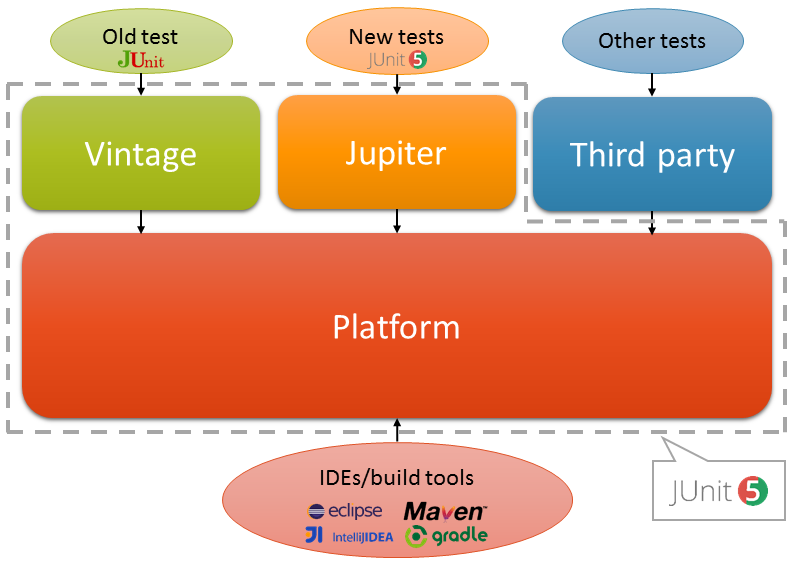
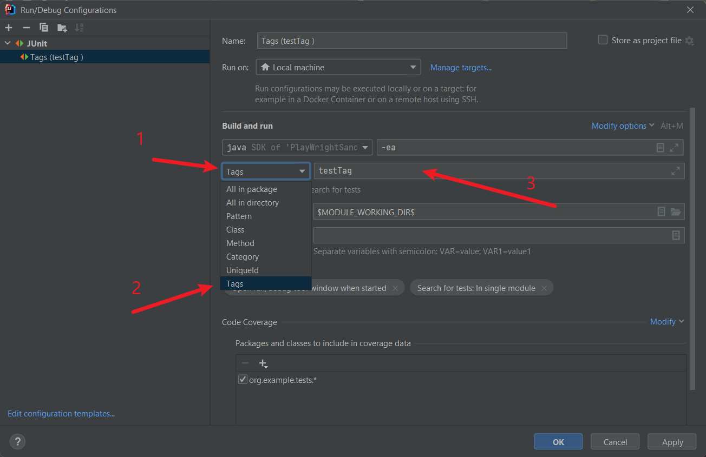

= JUnit 5 Overview and Automation Test Execution

- Author name: Litvinov Natalia

[.text-center]

<<Overview,Overview>>

<<Key_Features,Key Features>>

<<Add,Adding JUnit 5 with Maven>>

<<annotations, Basic Annotations>>

<<tag,Running Tagged Tests>>

<<parallel_execution,Parallel Execution>>

[[Overview]]
== Overview

JUnit 5 is a powerful and flexible testing framework for Java. It provides a rich set of features for writing and executing tests, making it a popular choice for developers and testers alike.

JUnit 5 is composed of several different modules from three different sub-projects.

_JUnit 5 = JUnit Platform + JUnit Jupiter + JUnit Vintage_

[.text-center]

* _JUnit Platform:_ serves as a foundation for launching testing frameworks on the JVM. It defines the TestEngine API for developing a testing framework that runs on the platform. Additionally, the platform provides:

- Console Launcher: Launches the platform from the command line.
- JUnit Platform Suite Engine: Runs a custom test suite using one or more test engines on the platform.

* _JUnit Jupiter:_ combines the programming model and extension model for writing tests and extensions in JUnit 5. The Jupiter sub-project provides a TestEngine for running Jupiter-based tests on the platform.

* _JUnit Vintage:_ provides a TestEngine for running JUnit 3 and JUnit 4 based tests on the platform. It requires JUnit 4.12 or later to be present on the classpath or module path.

[[Key_Features]]
=== Key Features

* **Annotations:** JUnit 5 uses annotations to define and organize test methods. Annotations such as `@Test`, `@BeforeAll`, `@BeforeEach`, `@AfterEach`, and `@AfterAll` help in specifying test methods and lifecycle methods.

* **Extensions:** JUnit 5 introduces the concept of extensions, allowing developers to extend the behavior of the testing framework. Extensions can be used for parameter resolution, test instance post-processing, and more.

* **Assertions:** JUnit 5 provides a variety of assertion methods for validating expected outcomes. Common assertions include `assertEquals`, `assertTrue`, `assertFalse`, and more.

* **Parameterized Tests:** JUnit 5 supports parameterized tests, enabling the same test logic to be executed with different sets of parameters.

* **Test Interfaces:** In addition to test classes, JUnit 5 allows tests to be defined in interfaces, enabling the composition of test suites from multiple sources.

[[Add]]
== Adding JUnit 5 with Maven

JUnit5 can be easily integrated into your Maven projects by adding the appropriate dependencies to your project's `pom.xml` file.

Example:

[source,xml]
----
<dependencies>
    <dependency>
          <groupId>org.junit.jupiter</groupId>
            <artifactId>junit-jupiter</artifactId>
            <version>5.10.2</version>
        <scope>test</scope>
    </dependency>
</dependencies>
----

Ensure that your _Maven Surefire Plugin_ version is compatible with JUnit5. In your `pom.xml`, you might have a configuration like this:

[source,xml]
----
<build>
    <plugins>
        <plugin>
            <groupId>org.apache.maven.plugins</groupId>
            <artifactId>maven-surefire-plugin</artifactId>
            <version>3.1.2</version>
        </plugin>
    </plugins>
</build>
----

With the dependencies added, you can run your JUnit5 tests using the following Maven command: `_mvn test_`

You have to name your test classes with the following naming conventions, otherwise, it won’t get picked up by maven.
The _Maven Surefire Plugin_ will scan for test classes whose fully qualified names match the following patterns:

- ../Test*.java
- ../*Test.java
- ../*Tests.java
- ../*TestCase.java

[source,xml]
----
[INFO]
[INFO] -------------------------------------------------------
[INFO]  T E S T S
[INFO] -------------------------------------------------------
[INFO] Running org.example.tests.LoginTests
[INFO] Tests run: 3, Failures: 0, Errors: 0, Skipped: 0, Time elapsed: 15.13 s -- in org.example.tests.LoginTests
[INFO]
[INFO] Results:
[INFO]
[INFO] Tests run: 3, Failures: 0, Errors: 0, Skipped: 0
[INFO]
[INFO] ------------------------------------------------------------------------
[INFO] BUILD SUCCESS
[INFO] ------------------------------------------------------------------------
[INFO] Total time:  17.952 s
[INFO] Finished at: 2024-02-20T17:32:21+02:00
[INFO] ------------------------------------------------------------------------
----

[[annotations]]
== Basic Annotations

JUnit 5 provides various annotations that help in configuring and customizing the test run. These annotations are used to define the behavior of test methods, control the test lifecycle, and more.

=== 1. `@Test`

The @Test annotation is used to mark a method as a test method. JUnit will run the methods annotated with @Test during test execution.

[source,java]
----
import org.junit.jupiter.api.Test;

@Test
void myTestMethod() {
    // Test logic
}
----

=== 2. `@BeforeAll` and `@AfterAll`

The @BeforeAll and @AfterAll annotations are used to indicate methods that should be run before and after all test methods in a test class, respectively.

[source,java]
----
import org.junit.jupiter.api.BeforeAll;
import org.junit.jupiter.api.AfterAll;

@BeforeAll
static void setUpClass() {
    // Initialization code before all tests
}

@AfterAll
static void tearDownClass() {
    // Cleanup after all tests
}
----

=== 3. `@BeforeEach` and `@AfterEach`

The @BeforeEach and @AfterEach annotations are used to mark methods that should be run before and after each test method in a test class, providing a setup and teardown for each individual test.

[source,java]
----
import org.junit.jupiter.api.BeforeEach;
import org.junit.jupiter.api.AfterEach;

@BeforeEach
void setUp() {
    // Initialization code before each test
}

@AfterEach
void tearDown() {
    // Cleanup after each test
}
----

=== 4. `@DisplayName`

The @DisplayName annotation allows you to provide a custom name for a test class or method, improving the readability of test reports.

[source,java]
----
import org.junit.jupiter.api.DisplayName;

@DisplayName("My Test Class")
class MyTestClass {

    @Test
    @DisplayName("My Test Method")
    void myTestMethod() {
        // Test logic
    }
}
----

=== 5. `@Disabled`

The @Disabled annotation is used to temporarily disable a test class or method. It can be applied to individual test methods or entire test classes.

[source,java]
----
import org.junit.jupiter.api.Disabled;

@Disabled("This test is currently disabled")
class MyDisabledTestClass {

    @Test
    void myDisabledTestMethod() {
        // Test logic
    }
}
----

These annotations, along with others provided by JUnit 5, offer flexibility and customization options to tailor the test run according to specific requirements.

=== 6. `@RepeatedTest`

This annotation provides the ability to repeat a test a specified number of times.
Since JUnit Jupiter 5.10, @RepeatedTest can be configured with a failure threshold which signifies the number of failures after which remaining repetitions will be automatically skipped. Set the failureThreshold attribute to a positive number less than the total number of repetitions in order to skip the invocations of remaining repetitions after the specified number of failures has been encountered
[source,java]
----
@RepeatedTest(value = 8, failureThreshold = 2)
void repeatedTest(RepetitionInfo repetitionInfo) {
// Simulate unexpected failure every second repetition
    if (repetitionInfo.getCurrentRepetition() % 2 == 0) {
            fail("Boom!");
        }
    }
----
=== 6. `@ParameterizedTest`

Parameterized tests make it possible to run a test multiple times with different arguments. They are declared just like regular @Test methods but use the @ParameterizedTest annotation instead. In addition, you must declare at least one source that will provide the arguments for each invocation and then consume the arguments in the test method.

[source,java]
----
@ParameterizedTest
@ValueSource(strings = { "nothing", "what does it mean", "What a day!" })
void parametrized(String candidate) {
        Assertions.assertTrue(candidate.contains("what"));
    }
----
Console output in this case will be:
[source,console]
----
parametrized(String) ✘
├─ ✘ [1] nothing
├─ ✔ [2] what does it mean
└─ ✘ [3] What a day!
----

__More information about these and other annotations you can read from sources like:__ https://junit.org/junit5/docs/current/user-guide/#writing-tests-annotations

[[tag]]
== Running Tagged Tests

JUnit 5 `@Tag` annotation is used to tag or label the tests into a test suite. It helps organize and filter the tests based on different criteria or attributes, such as their purpose, the features they test, or their characteristics. This particularly helps in selectively running a subset of tests based on their tags, making test suite management more flexible.

We can apply the @Tag annotation on a test class, test method, or both. We can use any string as a tag value, but it’s common to use descriptive tags like “smoke,” “regression,” “integration,” “security,” and so on.
[source,java]
----
@Tag("development")
public class ClassATest
{
    @Test
    @Tag("userManagement")
    void testCaseA(TestInfo testInfo) {
    }
}
----
We can apply **multiple** tags on a single test case as well so that you can include the test in multiple test suites.
[source,java]
----
public class ClassBTest
{
    @Test
    @Tag("testTag")
    @Tag("production")
    void testCaseB(TestInfo testInfo) {
    }
}
----

* **In Maven**

To run tests with specific tags we can use the -groups and -excludeGroups options when executing tests with a build tool (e.g., Maven or Gradle) or an IDE.

To run the tests with specific tags using Maven, use the following command:

[source,shell]
----
mvn test -Dgroups="localhost,testTag"
----

To exclude the tagged tests, we run the following command:

[source,shell]
----
mvn test -DexcludeGroups="production"
----

* **In IDE (IntelliJ)**

Several IDEs support running the tagged test cases through custom run configuration. For example, in IntelliJ, we can create a custom run configuration and select Tags in type of resources to search.

[.text-center]

[[parallel_execution]]
== Parallel Execution

By default, JUnit Jupiter tests are run sequentially in a single thread. Running tests in parallel — for example, to speed up execution — is available as an opt-in feature since version 5.3

To enable parallel execution we need to create a file called `junit-platform.properties` inside the __src/test/resources folder__. Inside the file, you need to add the following line:
[source,shell]
----
junit.jupiter.execution.parallel.enabled=true
----
The line above will enable the basic functionality and allow you to run tests in parallel. However, there a more settings to customize the parallel execution.

If you want **all your tests to run in parallel by default**, you must add the following line:
[source,shell]
----
junit.jupiter.execution.parallel.mode.default=concurrent
----

JUnit includes two strategies that allow you to change how many threads will be used to run tests in parallel.

* **dynamic**: Computes the number of threads it can use. The default is 1. The default will use all the threads available. When you set it to .5, only half the amount of threads will be used.
* **fixed**: the value will equal the number of threads used for running tests in parallel.

For a dynamic strategy, add the following lines:

[source,shell]
----
junit.jupiter.execution.parallel.config.strategy=dynamic
junit.jupiter.execution.parallel.config.dynamic.factor=1
----

For a fixed strategy, add the following lines:

[source,shell]
----
junit.jupiter.execution.parallel.config.strategy=fixed
junit.jupiter.execution.parallel.config.fixed.parallelism=6
----

If you only added __junit.jupiter.execution.parallel.enabled=true__ to the junit-platform properties file and didn't change the default parallel mode, then you need to add the `@Execution(ExecutionMode.CONCURRENT)` annotation to the test class containing the tests you want to run in parallel.

The total runtime of this class should be 3 seconds instead of 6.
[source,java]
----
import org.junit.jupiter.api.parallel.Execution;
import static org.junit.jupiter.api.parallel.ExecutionMode.CONCURRENT;

@Execution(CONCURRENT)
public class parallelTests {

    @Test
    void oneSecondTest() throws InterruptedException {
        Thread.sleep(1000);
    }

    @Test
    void twoSecondTest() throws InterruptedException {
        Thread.sleep(2000);
    }

    @Test
    void threeSecondTest() throws InterruptedException {
        Thread.sleep(3000);
    }
}
----
__For more detailed information about parallel running:__

https://davidvlijmincx.com/posts/run-junit5-tests-in-parallel

https://junit.org/junit5/docs/snapshot/user-guide/#writing-tests-parallel-execution

`JUnit 5 documentation:`
https://junit.org/junit5/docs/snapshot/user-guide/#overview

`Home repository for JUnit 5:`
https://github.com/junit-team/junit5

`Useful repository:`
https://github.com/bonigarcia/mastering-junit5

[.text-center]
image::images/ReadDocumentationMzf.png[,width=50%]