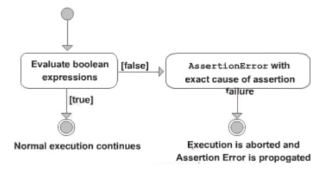
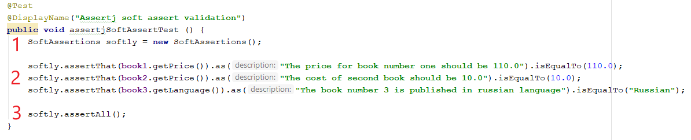
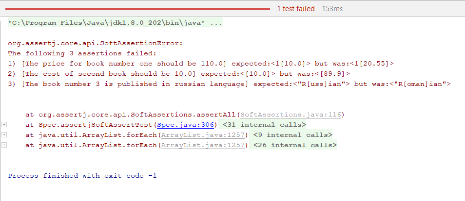
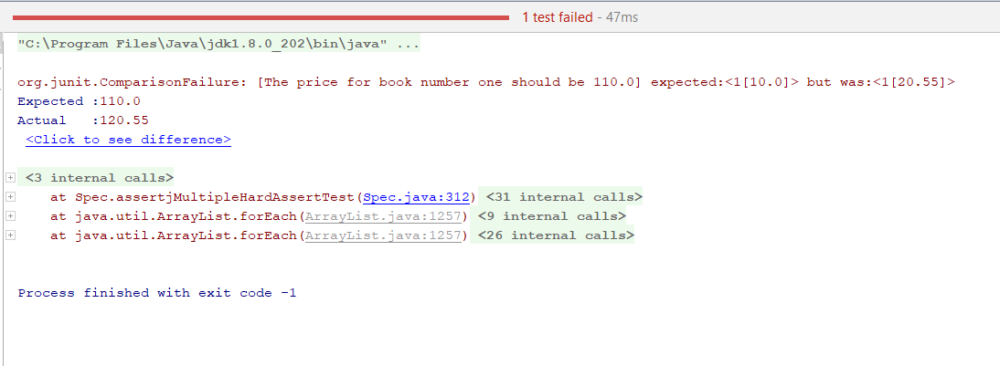
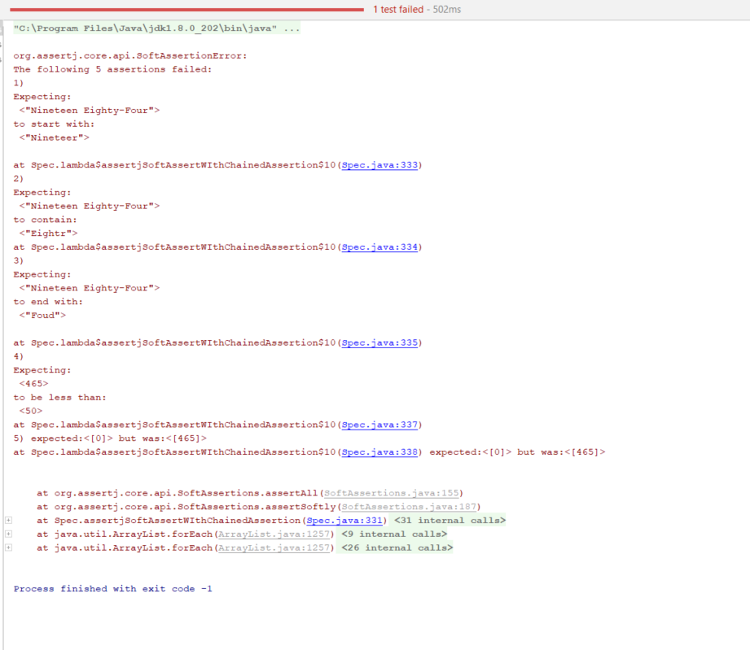

# Assertions. Matchers. Custom assertions

Author: Ilie Grecu
---

## Contents
1. [Assertions. General overview](#1-assertions-general-overview)
2. [Hard assertions - Junit](#2-hard-assertions---junit)
3. [Matchers - Hamcrest](#3-matchers---hamcrest)
4. [Soft assertions - assertj](#4-soft-assertions---assertj)
5. [Custom assertions](#5-custom-assertions)

## 1. Assertions. General overview

An assertion is a statement in the Java programming language that enables to test assumptions about a specific functionality 
of an application. When we develop a test case, we have one expected output and one actual output. Assertion helps us 
compare these outputs and evaluate whether a given test case is passed or failed.
Each assertion contains a boolean expression that is believed to be true when the assertion executes. If it is not true, 
the system will throw an error.



Assertions are ideal for writing test cases because they provide a quick way to check if a given condition is met or not, 
which defines if the test passes or not. From testing perspective, assertions are usualy used in functional testing in 
order to validate behaviors like: the presence of an element on a web page, the presence of a text message and its content, 
response code returned by an HTTP request, etc.

There are multiple libraries available in the Java ecosystem. In the below table are compared the most popular Java assertion 
libraries based on their usage, type of assertions available, customization support, etc.

| Comparison          | Junit      | TestNG     | Hamcrest     | AssertJ           | Truth      |
|---------------------|------------|------------|--------------|-------------------|------------|
| Available           | since 2000 | since 2006 | since 2006   | since 2010        | since 2011 |
| Website             | junit.org  | testng.org | hamcrest.org | assertj.github.io | truth.dev  |
| Soft Assertions     | No         | Yes        | No           | Yes               | Yes        |
| Boolean checks      | Yes        | Yes        | Yes          | Yes               | Yes        |
| Number checks       | Yes        | Yes        | Yes          | Yes               | Yes        |
| String checks       | Yes        | Yes        | Yes          | Yes               | Yes        |
| Null checks         | Yes        | Yes        | Yes          | Yes               | Yes        |
| Array checks        | Yes        | Yes        | Yes          | Yes               | Yes        |
| Map checks          | No         | No         | Yes          | Yes               | Yes        |
| Date checks         | No         | No         | Yes          | Yes               | No         |
| Exception checks    | Yes        | Yes        | No           | Yes               | Yes        |
| Custom Message      | No         | Yes        | Yes          | Yes               | Yes        |
| Create Own Assertion| No         | No         | Yes          | Yes               | Yes        |

For more information about java test assertion libraries you can find on the [link](https://codingnconcepts.com/java/java-test-assertion-libraries/)

There are 2 types of assertions:

***Hard Assertions*** - test execution will be aborted if the assert condition is not met. Hard assertions are perfect 
when something must absolutely, positively be true for the code to work. They’re like the red flags that signal something’s 
critically wrong.

***Soft Assertions*** - test execution will continue till the end of the test case even if the assert condition is not met.
Soft assertions are great when you want to gather more information about potential issues without stopping the entire test 
suite. They let collecting more errors rather than halting at the first sign of trouble.

## 2. Hard assertions - Junit

Hard Assertions are ones in which test execution is aborted if the test does not meet the assertion condition. The test 
case is marked as failed. In case of an assertion error, it will throw the “java.lang.AssertionError” exception.
Junit provides a class named Assert, which provides a bunch of assertion methods useful in writing test cases and to 
detect test failure.

In order to use Junit assertions it is required to add junit dependency to pom.xml file.

```xml
        <dependency>
            <groupId>org.junit.jupiter</groupId>
            <artifactId>junit-jupiter-engine</artifactId>
            <version>5.9.1</version>
            <scope>test</scope>
        </dependency>
```

**JUnit Assert methods:**

**Boolean**

For testing the boolean conditions (true or false), there are the following assert methods

- assertTrue(condition)
- assertFalse(condition)

Here the condition is a boolean value.

**Null object**

If it is needed to check the initial value of an object/variable, junit has the following methods:

- assertNull(object)
- assertNotNull(object)

Here object is Java object e.g. assertNull(actual);

**Identical**

It is used to check whether two objects are identical (i.e. comparing two references to the same java object), or different.

- assertSame(expected, actual)
- assertNotSame(expected, actual)

It will return true if expected == actual

**Assert Equals**

For testing the equality of two objects, there are the following methods

- assertEquals(expected, actual)

It will return true if: expected.equals(actual).

**Floating point assertions**

In case of floating point types comparison (e.g. double or float), it is required an additional parameter delta to 
avoid problems with round-off errors while doing floating point comparisons. The assertion evaluates as given below:

- Math.abs(expected – actual) <= delta

For example:

assertEquals(aDoubleValue, anotherDoubleValue, 0.001)

**Assert Array Equals**

For testing the equality of arrays, junit has the following method:

- assertArrayEquals(expected, actual)

Above method must be used if arrays have the same length, for each valid value for i, as given below:

- assertEquals(expected[i],actual[i])
- assertArrayEquals(expected[i],actual[i])

**Grouped assertions**

JUnit provides the posibility to run grouped assertions. We can therefore use lambdas to provide each of our assertions. 
The lambda will be called to run the assertion within the grouping provided by assertAll().

```code
assertAll(
  "Grouped Assertions",
  () -> assertEquals(expected, actual, "message"),
  // more assertions
  ...
 );
```

Here, in the first parameter to assertAll(), is provided a description to explain the meaning of the whole group.
It always checks all of the assertions that are passed to it, no matter how many fail. If all pass, all is fine - if at 
least one fails JUnit shows a detailed result of all that went wrong.

**Expected exception**
In case it is needed to validate that a scenario throws an exception, JUnit 5 provides assertThrows().
The assertThrows() method asserts that execution of the supplied executable block or lambda expression throws an exception 
of the expectedType. It is an overloaded method and takes the following parameters.

```code
static <T extends Throwable>T assertThrows(Class<T> expectedType, Executable executable)
static <T extends Throwable>T assertThrows(Class<T> expectedType, Executable executable, String message)
static <T extends Throwable>T assertThrows(Class<T> expectedType, Executable executable, Supplier<String> messageSupplier)
```

- expectedType – test code is expected to throw an exception of this type.
- message – if the executable code does not throw any exception, this message will be printed along with the FAIL result.
- messageSupplier – the message will be retrieved from it in case the test fails.

The assertThrows() will FAIL:

- If no exception is thrown from the executable block
- If an exception of a different type is thrown

The assertThrows() will PASS:
- If the code block throws an exception of the specified type or a subtype. For example, if we are expecting IllegalArgumentException 
and the test throws NumberFormatException then also the test will PASS because NumberFormatException extends IllegalArgumentException 
class.

JUnit assertions can be executed with or without explicit message. Assertion messages are used to provide more information 
about the failed test and help in debugging. Message will be displayed only if assert fails.

## 3. Matchers - Hamcrest

JUnit methods described above can assert various types like boolean and null. However, it is hard to use assertion 
methods of Junit because we may confuse expected with actual. It is needed better assertion matchers to write more readable 
and useful test scenarios. Hamcrest framework offers nice matcher classes to do this.
Actually, hamcrest matchers are the equivalent of junit assertions.

Features of Hamcrest:
1. Matcher Objects - Hamcrest uses matcher objects to create expressive and readable assertions.
2. Composability - Hamcrest allows to compose multiple matcher objects together to create more complex assertions.
3. Wide Range of Matchers - Hamcrest provides a wide range of predefined matcher objects that can be used to validate 
different types of data.
4. Custom Assertions - With Hamcrest, we have the ability to craft custom assertions that are precisely aligned with 
unique requirements.
5. Allows for custom error messages - enables developers to create personalized error messages that are specific to each 
test case.

In order to use hamcrest matchers, it is required to add hamcrest dependency to pom.xml file.

```xml
        <dependency>
            <groupId>org.hamcrest</groupId>
            <artifactId>hamcrest-all</artifactId>
            <version>1.3</version>
        </dependency>
```

**Hamcrest common matchers**

Hamcrest comes with a library of useful matchers. Here are some of the most important ones.

**Core**

- describedAs - decorator to adding custom failure description. Provides a custom description to another matcher.

- is - decorator to improve readability. Decorates another Matcher, retaining the behaviour but allowing tests to be 
slightly more expressive.

**Logical**

- allOf - matches if all matchers match, short circuits (like Java &&).

- anyOf - matches if any matchers match, short circuits (like Java ||).

- not - matches if the wrapped matcher doesn’t match and vice versa.

**Object**

- equalTo - test object equality using Object.equals.

- hasToString - test Object.toString. Creates a matcher that matches any examined object whose toString method returns a 
value that satisfies the specified matcher.

- instanceOf - creates a matcher that matches when the examined object is an instance of the specified type.

- notNullValue, nullValue - creates a matcher that matches if examined object is null.

- sameInstance - test object identity. Creates a matcher that matches only when the examined object is the same instance 
as the specified target object.

**Collections**

- array - creates a matcher that matches arrays whose elements are satisfied by the specified matchers. Matches positively 
only if the number of matchers specified is equal to the length of the examined array and each matcher[i] is satisfied by array[i].

- hasEntry, hasKey, hasValue - test a map whether it contains an entry, key or value.

- hasItem - creates a matcher for Iterables that only matches when a single pass over the examined Iterable yields at least 
one item that is equal to the specified item. Whilst matching, the traversal of the examined Iterable will stop as soon 
as a matching item is found.

**Number**

- closeTo - test floating point values are close to a given value.

- greaterThan, greaterThanOrEqualTo, lessThan, lessThanOrEqualTo - test ordering.

**Text**

- equalToIgnoringCase - test string equality ignoring case.

- equalToIgnoringWhiteSpace - test string equality ignoring differences in runs of whitespace.

- containsString, endsWith, startsWith - matches if object is a string containing a given string.

 Altough Hamcrest comes bundled with lots of useful matchers, it does not provide soft assertions.
 
 ## 4. Soft assertions - assertj
 
When writing test scenarios, it's important to be able to check the code against multiple conditions. However, when use hard 
asserts, a single failed assertion will cause the test to fail, even if the other conditions pass. This can make it difficult 
to track down the source of the error.

Soft asserts are a type of assertion that allows checking of multiple conditions in the code without halting execution 
if a single condition fails. This means that we can still see the results of all the other assertions, even if one of them fails.
There are several reasons why it is worth using soft asserts in test cases:

- Improved readability: Soft asserts make tests more readable by allowing to group multiple assertions together. 
This makes it easier to see what each test is checking for.
- Improved maintainability: Soft asserts make tests easier to maintain by allowing us to add or remove assertions 
without having to worry about breaking other tests.
- Better error reporting: Soft asserts provide better error reporting than traditional asserts. If a soft assert fails, 
we will still be able to see the results of all the other assertions, which can help us to track down the source of the error.

AssertJ is a Java library that provides a rich set of assertions. It provides assertions for most of the data types in 
Java e.g. Text (String), Number (Integer, Double, BigDecimal), Collection (List, Array, Set, Map), File, etc. 
AssertJ assertions are hard assertions by default, which means when we have multiple assertions in the test case and if 
one of them fails, it throws an exception and stops the execution there. Validations after the failed assertion will not be executed.
AssertJ also supports soft assertions and writing custom messages in assertions.

In order to use assertj assertions, it is required to add the dependency to pom.xml file.

```xml
        <dependency>
            <groupId>org.assertj</groupId>
            <artifactId>assertj-core</artifactId>
            <version>3.9.1</version>
        </dependency>
```

Let's take a look on how we can run multiple validations with soft assert.
1. Create a new SoftAssertions object.
2. Declare all test scenarios with required assertions
3. Run all assertions by invoking the assertAll() method of the SoftAssertions class. This method runs all specified 
assertions and reports assertion failures after these assertions have been run.

```code
@Test
    @DisplayName("Assertj soft assert validation")
    public void assertjSoftAssertTest () {
        SoftAssertions softly = new SoftAssertions();

        softly.assertThat(book1.getPrice()).as("The price for book number one should be 110.0").isEqualTo(110.0);
        softly.assertThat(book2.getPrice()).as("The cost of second book should be 10.0").isEqualTo(10.0);
        softly.assertThat(book3.getLanguage()).as("The book number 3 is published in russian language").isEqualTo("Russian");

        softly.assertAll();
    }
```



In case all scenarios are passed the result is green, similar behavior like for Hamcrest and JUnit.
In case at least one scenarios is failed, execution result will show the number of failed ones, reason of failure in the 
order they were declared in test case.

Another way to execute soft scenarios is calling the static method SoftAssertions.assertSoftly. The softly.assertAll() 
method will be called automatically after the lambda function completes.

```code
@Test
    @DisplayName("Assertj soft assert validation with assertSoftly")
    public void assertjSoftAssertionWithAssertSoftly() {
        SoftAssertions.assertSoftly(softly -> {
            softly.assertThat(book1.getPrice()).as("The price for book number one should be 110.0").isEqualTo(110.0);  
            softly.assertThat(book2.getPrice()).as("The cost of second book should be 10.0").isEqualTo(10.0);
            softly.assertThat(book3.getLanguage()).as("The book number 3 is published in russian language").isEqualTo("Russian");
        });
    }
```

Following will be done a comparison on execution result for soft assert and hard assert with 3 assertions and all of them failed. 
In the first 2 scenarios price for 2 different books is wrong, and in the third one - language for a book is wrong.

In the soft assert case, all 3 scenarios have been executed. All 3 failed and the reason of failure is displayed for each one.



In the multiple hard assert case only the first one has been executed and it failed. The last 2 haven't been executed 
and their state is unknown. 



AssertJ allows writing fluent test cases by chaining the assertions that target the same object instead of invoking 
assertThat multiple times. This rule replaces consecutive AssertJ assertThat invocations targeting the same object with 
an assertion chain. Thus, eliminating some redundant code and increasing the readability of test cases.
Chained assertions can be combined with soft assertions, like in the following example:

```code
@Test
    @DisplayName("Assertj soft assert with chained assertions")
    public void assertjSoftAssertWIthChainedAssertion () {
        SoftAssertions.assertSoftly(softly -> {
            softly.assertThat(book1.getTitle())
                    .startsWith("Nineteer")
                    .contains("Eightr")
                    .endsWith("Foud");
            softly.assertThat(book1.getNumberOfPages())
                    .isLessThan(50)
                    .isZero();
        });
    }
```

In this test scenario all 5 assertions have been failed and the reason of failure for each of them is displayed in console.



## 5. Custom assertions

One way to improve the readability of our assertions is by refactoring them into custom assertions.
Writing a custom AssertJ assertion class is pretty simple. All we need to do is to declare a class that extends AbstractAssert, 
add a required constructor, and provide custom assertion methods.
The assertion class must extend the *AbstractAssert* class in order to have access to essential assertion methods of the API.

```code
public class BookAssert extends AbstractAssert<BookAssert, Book> {

    public BookAssert(Book actual) {
            super(actual, BookAssert.class);
        }

    // assertion methods
}
```

We must specify two type arguments when extending the AbstractAssert class: the first is the custom assertion class itself, 
which is required for method chaining, and the second is the class under test.
To provide an entry point to our assertion class, we can define a static method that can be used to start an assertion chain.

```code
public static BookAssert assertThat(Book actual) {
        return new BookAssert(actual);
    }
```

And next we add custom assertions methods to the assertion class. 

Test cases for described above assertions and matchers can be found in **TestAssertions** class.