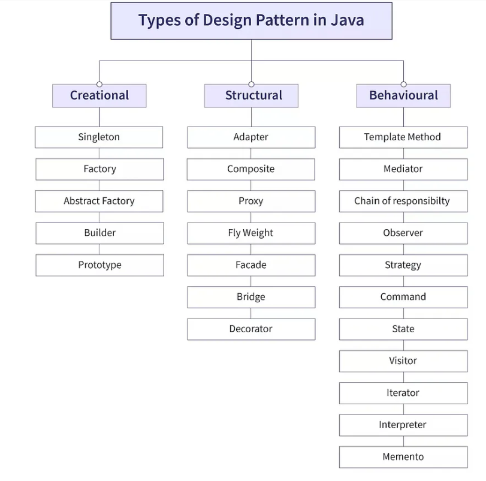
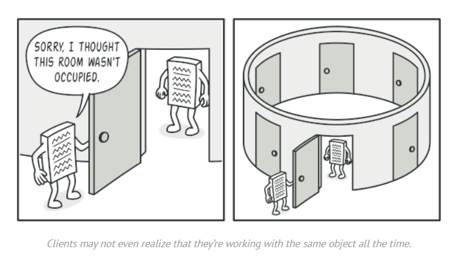
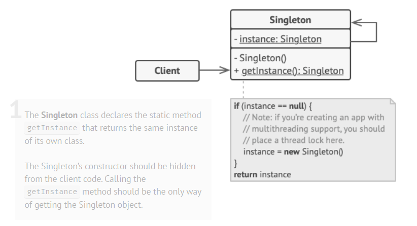
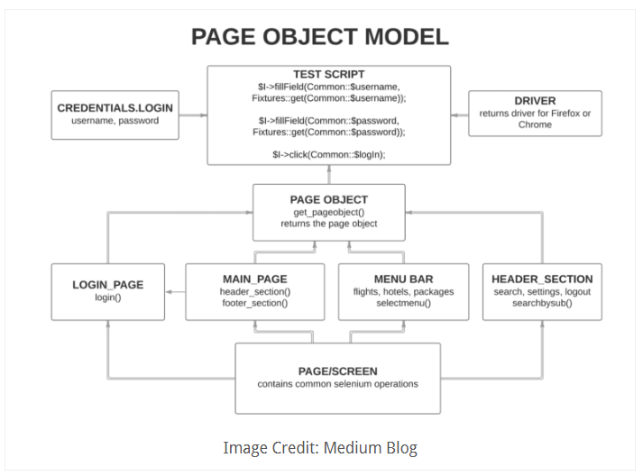
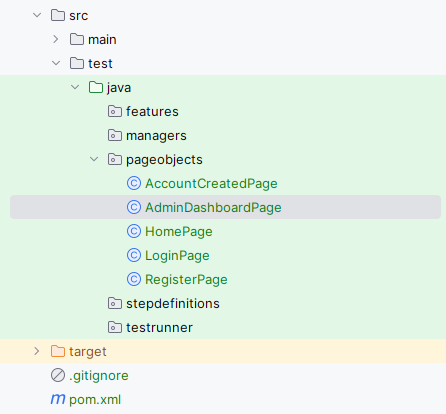

= Design Patterns
:doctype: book
:icons: font
:toc: left
:sectnums:

== About Design Patterns.

Design patterns represent the best practices used by experienced object-oriented software developers.
The design pattern is a reusable solution to a common problem that occurs in software design and
helps to create more maintainable, flexible, and understandable code.

There are many different types of design patterns, each addressing a specific problem or set of problems.
As shown in the image below, some common types of design patterns include:

- creational patterns -> which deal with object creation;
- structural patterns -> which focus on object composition and organization;
- behavioral patterns -> which deal with the communication between objects.

[NOTE]
For more details about Design Patterns check https://refactoring.guru/design-patterns/java[here]

== Singleton

This pattern is a creational design pattern that ensures that a class has only one instance,
while providing a global access point to that instance.

=== Real-World Analogy

A real-world analogy of the singleton is, to think of it as having a single key to your house.
No matter how many family members you have, there’s only one key that grants access to your home.
Similarly, the Singleton pattern ensures only one class instance (key) exists, and everyone accesses it through a common point.

=== Structure

.This pattern consists of 3 main components:

. *Private or Protected Constructor:* _The Singleton class has a private constructor,
preventing direct instantiation of the object from outside the class.
Protected if you want to allow inheritance._
. *Private Static Instance:* The Singleton class holds a private static instance of itself,
usually stored in a static variable.
. *Public Static Method:* It provides a public static method (often named getInstance)
that allows the client code to access a single instance.
If an instance does not exist, this method creates one; otherwise, it returns the existing instance.

=== How to Implement

. Add a private static field to the class for storing the singleton instance.

. Declare a public static creation method for getting the singleton instance.

. Implement the code inside the static method. It should create a new object on its first call and put it into the
 static field. The method should always return that instance on all subsequent calls.

. Make the constructor of the class private. The static method of the class will still be able to call the constructor,
 but not the other objects.

=== Example

Step 1: Create a Singleton Class: SingleObject.java

[source,java]
----
public class SingleObject {

    //create an object of SingleObject
    private static SingleObject instance = new SingleObject();

    //make the constructor private so that this class cannot be
    //instantiated
    private SingleObject(){}

    //Get the only object available
    public static SingleObject getInstance(){
        return instance;
    }

    public void showMessage(){
        System.out.println("Hello World!");
    }
}
----

Step 2: Get the only object from the singleton class.

[source,java]
----
public class SingletonPattern {
    public static void main(String[] args) {

        //illegal construct
        //Compile Time Error: The constructor SingleObject() is not visible
        //SingleObject object = new SingleObject();

        //Get the only object available
        SingleObject object = SingleObject.getInstance();

        //show the message
        object.showMessage();
    }
}
----

Step 3: Verify the output.

----
Hello World!
----

== Page Object

The Page Object Model (POM) is a design pattern used in web automation testing to create an object repository for
web elements on a web page. It is created a separate java class file for each individual web page. This class file
contains web elements as well as methods to perform testing operations and these methods are named on the actions
which a user want to perform, example, navigateToTheLoginPage().

=== Advantages of Page Object Model

The advantages of using Page Object Model in Selenium are:

* *Improved code reusability:* The same Page Object class can be used across multiple test cases, reducing the need
 for code duplication and improving code reusability. This saves time and effort in creating new tests, as the same
 Page Object class can be used again and again.

* *Easy maintenance:* POM separates the web elements from the test code, making it easier to maintain the code.
 Any changes made to the web page can be easily updated in the Page Object class without affecting the test code.
 This makes maintenance of the test code more efficient and less time-consuming.

* *Enhance collaboration:* POM can enhance collaboration between the development and testing teams.
 Developers can create the Page Object class while testers can use it to create test cases. This promotes better
 communication and collaboration between the teams.

* *Increases test coverage:* POM enables testers to create more tests with less effort. This improves test coverage
 and helps identify more defects, resulting in higher-quality software.

* *Better code readability:* POM makes the test code more readable and easier to understand. By separating the web
 elements from the test code, it is easier to see the intent of the code and how it interacts with the web page.

=== Sample Project Structure for POM

Below is a sample project structure of the page object model. Here, each web page is represented as a Java class file.

=== Page Object Example

[source,java]
----
package pages;

import org.openqa.selenium.WebDriver;
import org.openqa.selenium.WebElement;
import org.openqa.selenium.support.FindBy;
import org.openqa.selenium.support.PageFactory;

public class LoginPage {

    WebDriver driver;

    //Constructor that will be automatically called as soon as the object of the class is created
    public LoginPage(WebDriver driver) {
        PageFactory.initElements(driver, this);
    }

    //Locator for username field
    @FindBy(id = "userName")
    public WebElement uName;

    //Locator for password field
    @FindBy(id = "password")
    public WebElement pswd;

    //Locator for login button
    @FindBy(id = "login")
    public WebElement loginBtn;

    //Method to enter username
    public void enterUsername(String user) {
        uName.sendKeys(user);
    }

    //Method to enter password
    public void enterPassword(String pass) {
        pswd.sendKeys(pass);
    }

    //Method to click on Login button
    public void clickLogin() {
        loginBtn.click();
    }
}
----

[NOTE]
More examples of page objects and detailed explanation you can find at
https://toolsqa.com/selenium-webdriver/page-object-model/[toolsqa.com/...] and at
https://www.selenium.dev/documentation/test_practices/encouraged/page_object_models/[selenium.dev/...]