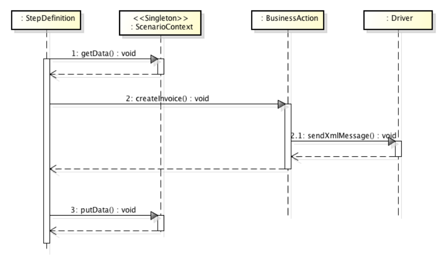
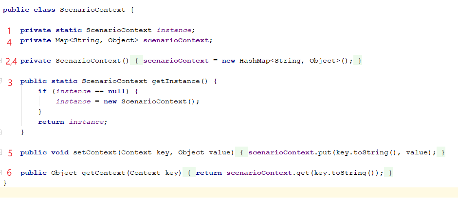
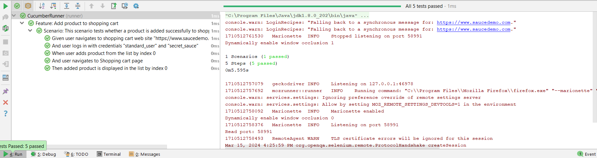

= Scenario context
:doctype: book
:revdate: June 2024
:toc: left
:sectnums:

'''

== What is Scenario Context

Scenario Context is a singleton class that has a shared state during the execution of a scenario. It can share data between
step definitions, hooks etc. for the lifetime that a scenario is executing. It can be freely used as a dictionary by storing
the test data information explicitly in a key-value pair between the steps. Moreover, it helps in organizing step definitions
better rather than using private variables in step definition classes. Within Scenario Context class, we can create any
number of fields to store any form of data. It can store String, Boolean, Integer or maybe a Class. Also, the important
point is that the information which we store in the Scenario Context is generated at run time. 

[NOTE]
_One thing to take into consideration regarding the Scenario Context is that we have to make sure our dictionary keys are
correct in all the steps where we set or retrieve data._

== Structure of Scenario Context

Scenario Context is a singleton class. This means that it can have only one instance at any time. This is achieved by following
the steps below:

- The instance is stored as a private static variable (1);
- Declaring all constructors of the class to be private (2);
- Providing a static method that returns a reference to the instance (3).

Next step we need to create a HashMap object which stores the information in the Key-Value pair. Key type is String
and Value can be of any Object Type (4).

Scenario Context should also declare 2 methods:

- setContext(): This method takes two parameters, key as String and value as object. Key is nothing but a Context enum (5);
- getContext(): This method takes the key as a parameter and returned the object which matches the key (6).

[NOTE]
_One challenge related to Scenario Context is the return type Object - before using the value, it has to cast it in the
type it is meant to be used. Or it is possible to make the getter of generic type, which will adapt the type to saved one._

Class object Type

- ScenarioContext.Current["key"] = object;
- var value = (objectType)ScenarioContext.Current["objectName"]

== Use case of Scenario Context with Cucumber and Selenium

Let's analyze the need of Scenario Context in a specific test case.

[source,gherkin]
----
    Scenario: This scenario tests whether a product is added successfully to shopping cart
    	Given user navigates to shopping cart website
    	And user logs in with credentials
    	When user adds product from the list
    	And user navigates to Shopping cart page
    	Then added product is displayed in the list
----

*Prerequisites*

The following dependencies are added to pom.xml file:

- cucumber-java
- cucumber-junit
- selenium-java

The following files and classes are created:

- Feature file with BDD steps.
- Step definitions with AddProductToShoppingCart.java class.
- Context.java enum which stores all the scenario context key names.
- ScenarioContext.java class according to structure described above.
- Hooks.java class with 2 methods - for launching and closing browser.
- Page objects with locators for each page to be accessed.
- Cucumber runner class.

Test case is executed on the test website https://www.saucedemo.com/.
Scenario starts execution from Hooks class. The method *startBrowser()* annotated with *@Before* launches the browser and
saves its instance in ScenarioContext class by calling *setContext()* and passing as parameters WEB_DRIVER key and driver
instance value. 

[source,java]
----
@Before
    public void startBrowser() {
        System.setProperty("webdriver.gecko.driver", "C:\\Drivers\\geckodriver\\geckodriver.exe");
        WebDriver driver = new FirefoxDriver();
        driver.manage().window().maximize();
        scenarioContext.setContext(Context.WEB_DRIVER, driver);
    }
----

In step definitions class Scenario Context is instantiated via *getInstance()* method. Also, here is declared WebDriver variable
and is instantiated with driver instance created in Hooks class via *getContext()*, passing as parameter WEB_DRIVER.
Value retrieved from ScenarioContext is cast to (WebDriver) type.

[source,java]
----
    ScenarioContext scenarioContext = ScenarioContext.getInstance();
    WebDriver driver = (WebDriver) scenarioContext.getContext(Context.WEB_DRIVER);
----

Scenario continues with navigating to testing website, types in valid credentials and logs in. From the Products page it
adds a product to wish list and stores the product title in Scenario Context. From the Products page it navigates to wish
list (ShoppingCartPage). Here it validates that the product title added in the Products page coresponds to the product
title displayed on the Shopping Cart page. This is done via *assertEquals()*.
The last action is closing the browser implemented in *closeBrowser()* method, annotated with *@After* from Hooks class.
Before closing the browser, driver instance is retrieved from Scenario Context in order to close the same instance passed
through all steps.

[source,java]
----
@After
    public void closeBrowser() {
        driver = (WebDriver) scenarioContext.getContext(Context.WEB_DRIVER);
        driver.close();
    }
----

Test case passed and the execution result can be seen below:

In this test case driver value from Scenario Context is passed through different steps and also through different classes
(hooks, step definitions and page object classes via constructors).
The product title value is passed only through different steps.

Another example of Scenario Context implementation can be found https://toolsqa.com/rest-assured/share-scenario-context/[here].

Copyright © 2024 by Ilie Grecu
