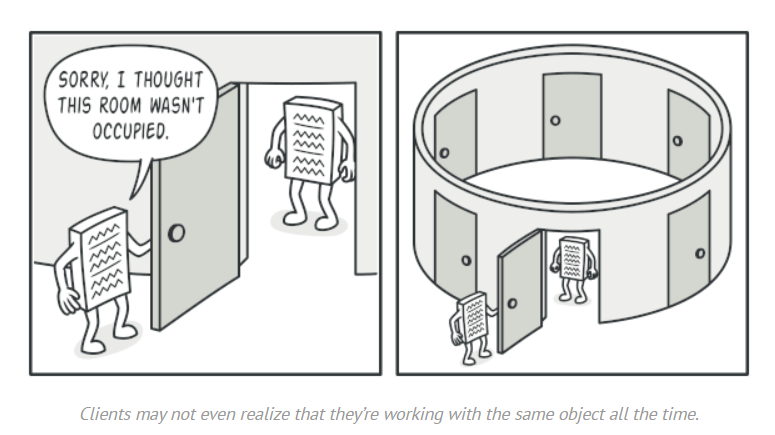
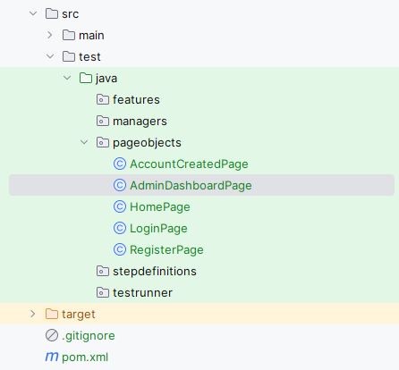

# Design Patterns
***

## Contents
1. [About Design Patterns.](#about-design-patterns)
2. [Singleton](#singleton)
3. [Page Object](#page-object)


## 1. About Design Patterns.

Design patterns represent the best practices used by experienced object-oriented software developers.
The design pattern is a reusable solution to a common problem that occurs in software design and
helps to create more maintainable, flexible, and understandable code.

There are many different types of design patterns, each addressing a specific problem or set of problems.
As shown in the image below, some common types of design patterns include:
- creational patterns -> which deal with object creation;
- structural patterns -> which focus on object composition and organization;
- behavioral patterns -> which deal with the communication between objects.


For more information about Design Patterns you can find on the [link](https://refactoring.guru/design-patterns/java)

## 2. Singleton

It is a creational design pattern that lets you ensure that a class has only one instance, while providing a global access
point to this instance.



### 2.1. Real-World Analogy

The government is an excellent example of the Singleton pattern. A country can have only one official government.
Regardless of the personal identities of the individuals who form governments, the title, “The Government of X”,
is a global point of access that identifies the group of people in charge.

### 2.2. Structure


### 2.3. How to Implement

1. Add a private static field to the class for storing the singleton instance.

2. Declare a public static creation method for getting the singleton instance.

3. Implement the code inside the static method. It should create a new object on its first call and put it into the
   static field. The method should always return that instance on all subsequent calls.

4. Make the constructor of the class private. The static method of the class will still be able to call the constructor,
   but not the other objects.

### 2.4. Example

Step 1: Create a Sigleton Class: SingleObject.java

```java
public class SingleObject {

    //create an object of SingleObject
    private static SingleObject instance = new SingleObject();

    //make the constructor private so that this class cannot be
    //instantiated
    private SingleObject(){}

    //Get the only object available
    public static SingleObject getInstance(){
        return instance;
    }

    public void showMessage(){
        System.out.println("Hello World!");
    }
}
```
Step 2: Get the only object from the singleton class.

```java
public class SingletonPattern {
    public static void main(String[] args) {

        //illegal construct
        //Compile Time Error: The constructor SingleObject() is not visible
        //SingleObject object = new SingleObject();

        //Get the only object available
        SingleObject object = SingleObject.getInstance();

        //show the message
        object.showMessage();
    }
}
```
Step 3: Verify the output.

```
Hello World!
```

## 3. Page Object

The Page Object Model (POM) is a design pattern used in web automation testing to create an object repository for
web elements on a web page. It is created a separate java class file for each individual web page. This class file 
contains web elements as well as methods to perform testing operations and these methods are named on the actions 
which a user want to perform, example, navigateToTheLoginPage().


### 3.1. Advantages of Page Object Model
The advantages of using Page Object Model in Selenium are:

- ***Improved code reusability:*** The same Page Object class can be used across multiple test cases, reducing the need
  for code duplication and improving code reusability. This saves time and effort in creating new tests, as the same
  Page Object class can be used again and again.

- ***Easy maintenance:*** POM separates the web elements from the test code, making it easier to maintain the code.
  Any changes made to the web page can be easily updated in the Page Object class without affecting the test code.
  This makes maintenance of the test code more efficient and less time-consuming.

- ***Enhance collaboration:*** POM can enhance collaboration between the development and testing teams.
  Developers can create the Page Object class while testers can use it to create test cases. This promotes better
  communication and collaboration between the teams.

- ***Increases test coverage:*** POM enables testers to create more tests with less effort. This improves test coverage
  and helps identify more defects, resulting in higher-quality software.

- ***Better code readability:*** POM makes the test code more readable and easier to understand. By separating the web
  elements from the test code, it is easier to see the intent of the code and how it interacts with the web page.

### 3.2. Sample Project Structure for POM

Below is a sample project structure of the page object model. Here, each web page is represented as a Java class file.



### 3.3. Page Object Example

```java
package pages;

import org.openqa.selenium.By;
import org.openqa.selenium.WebDriver;

public class LoginPage {

    WebDriver driver;

    //Constructor that will be automatically called as soon as the object of the class is created
    public LoginPage(WebDriver driver) {
        this.driver = driver;
    }

    //Locator for username field
    By uName = By.id("userName");

    //Locator for password field
    By pswd = By.id("password");

    //Locator for login button
    By loginBtn = By.id("login");


    //Method to enter username
    public void enterUsername(String user) {
        driver.findElement(uName).sendKeys(user);
    }

    //Method to enter password
    public void enterPassword(String pass) {
        driver.findElement(pswd).sendKeys(pass);
    }

    //Method to click on Login button
    public void clickLogin() {
        driver.findElement(loginBtn).click();
    }
}
```

More examples of page objects and detailed explanation you can find on the [link](https://toolsqa.com/selenium-webdriver/page-object-model/)