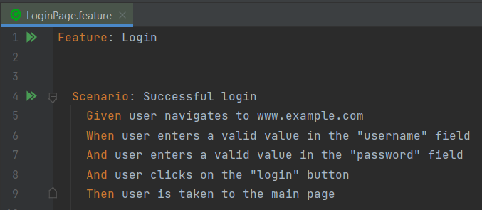
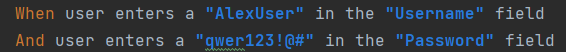
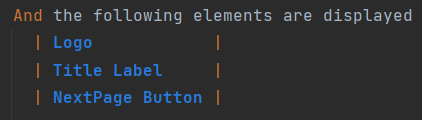
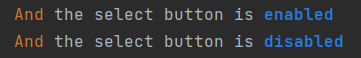
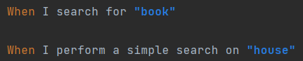
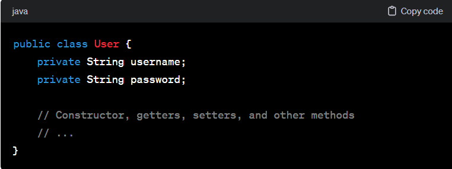
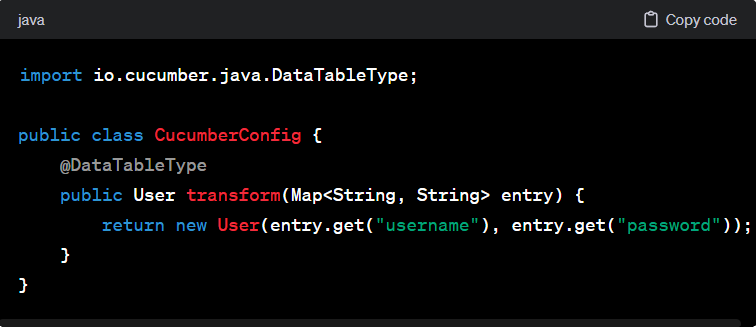
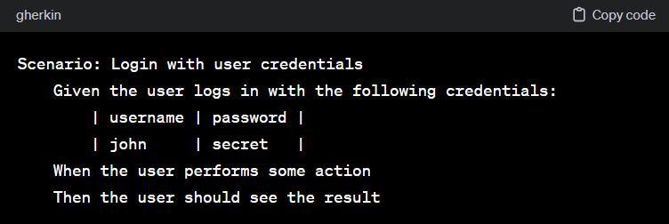
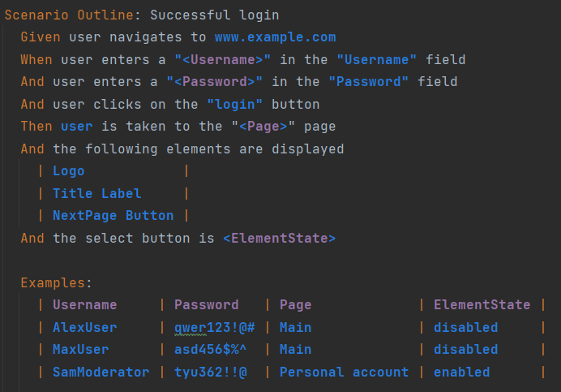

= BDD (Behavior Driven Development)
:toc:
:toc-title: Table of Adventures
:sectnums:

== Breaking Down Barriers: Understanding BDD

image::resources/tree.png[]

Probably everyone has seen this picture.
It clearly shows how important it is, during the development of a product, to speak one language that everyone understands.

This is how this Behavior Driven Development (BDD) emerged.

The main idea of BDD is to use “ordinary” human language that is understandable to all project participants, be it developers, testers or customers.

We create "scenarios" or "stories" about how the program should behave in different settings.
This helps everyone understand what exactly we expect from the program and how it can be tested.

== Navigating the BDD Jungle: Advantages and Pitfalls

[cols="1,1"]
|===
^|Advantages ✔ ^|Disadvantages ✘

^|Easy to understand
^|Maintainability

^|Promotes reusability
^|Implementation quality can fluctuate

^|Promotes flexibility and parametrization
^|Technical limitations

^|Tags enable targeted testing
^|

^|Lots of helper libraries and integrations
^|
|===

Here you can see more information about https://andreidobra.com/blog/cucumber-advantages-disadvantages#advantages-[Advantages and Pitfalls] of Cucucmber BDD.

== Cracking the Cucumber BDD Code: Demystifying the Process

Let's look at an example of how we can describe the behavior of a program.

[example]
*User navigates to www.example.com +
User enters a valid value in the "username" field +
User enters a valid value in the "password" field +
User clicks on the "login" button +
User is taken to the main page*

The behavior is understandable, but a couple of questions arise.

. Who am I?
* If I am a guest (not registered in the system), then I will not be able to access the site, even if I enter valid values.
* If I am a user, I will go to the main page of the site.
* If I am a moderator or admin, perhaps I will not get to the main page, but to my personal account, where I can manage the site

. We have only five steps and the example is easy. +
What if there are many more steps? +
Can the steps be made more clear?
So that you can immediately see where the action is and where the result of this action is? And there is an answer to all these questions - the Gerkin language in Given-When-Then format.

image::resources/given_when_then_2.webp[align="center"]
Let's write our scenario using the Gerkin language.

[example]
**Feature:** Login +
As a user +
I want to be able to log in to the application +
*Scenario:* Successful login +
*Given* user navigates to www.example.com +
*When* user enters a valid value in the "username" field +
*And* user enters a valid value in the "password" field +
*And* user clicks on the "login" button +
*Then* user is taken to the main page +

So.. +
We have a ready-made scenario and to automate it we can use *Cucumber*.

=== Cucumber

Cucumber is a test automation tool based on Behavior-Driven Development (BDD) principles and associates Gherkin steps with a step definition. +
A step definition is a method marked with one of the step keywords: ( `Given`, `When`, `Then`, `But` or `And`). +
It contains either a Regular Expression or a Cucumber Expression that associates a method with Gherkin steps. Let's look at an example. We wrote the steps in a file with the extension `.feature`

And implemented these steps in the ".java" file

[source,java]
----
import io.cucumber.java.en.Given;
import io.cucumber.java.en.Then;
import io.cucumber.java.en.When;

public class LoginSteps {

    @Given("user navigates to www.example.com")
    public void navigateToMainPage() {
        //implementation
    }

    @When("user enters a valid value in the \"username\" field")
    public void userEnterUsernameValue() {
        //implementation
    }
    @When("user enters a valid value in the \"password\" field")
    public void userEnterPasswordValue() {
        //implementation
    }
    @When("user clicks on the \"login\" button")
    public void userClickOnLoginButton() {
        //implementation
    }
    @Then("user is taken to the main page")
    public void userIsTakenToTheMainPage() {
        //implementation
    }
----

*How can we improve our code?* +
If you look at our steps, you will see that some steps will be repeated on other pages: “entering values into fields”, “clicking buttons” and so on. +
Therefore, we will move these steps into a separate file CommonSteps.java +
Also let's make our steps more functional.

We made one implementation for two steps and passed a String to the method.

[source,java]
----
@When("user enters a {string} in the {string} filed")
public void enterValueInInputField(String value, String fieldName){
    //implementation
}
----

:icons: font
[NOTE]
.Cucumber Expressions support basic parameter types such as:
====

- int
- float
- string
- word
- biginteger
- bigdecimal
- byte
- short
- long
- double
====

We can also pass a list to the method

[source,java]
----
@Then("the following elements are displayed")
public void theFollowingElementsAreDisplayed(List<String> listOfElements){
    //implementation
}
----
Let's look at a couple more cases. +
For example, we have two steps that differ in state. (false&true, are&are not, and so on)

[source,java]
----
@Then("^the select button is (enabled|disabled)$")
public void theSelectButtonIsEnabled(String elementState){
    //implementation
}
----

We can also combine multiple descriptions for one method

[source,java]
----
@When("I search for {string}")
@When("I perform a simple search on {string}")
public void iPerformASimpleSearchOn(String searchTerm){
    //implementation
}
----

We can pass tables to the method

image::resources/table.png[]
[source,java]
----
@Given("the following books")
public void theFollowingBooks(DataTable table){
    //implementation
}
----

In Cucumber, you can also pass objects to method as steps parameters.

. Define an object:
+

. Define the transformation:
+

. Use the object in a scenario step:
+

. Define the scenario steps:
+
image::resources/Define-the_scenario_steps.png[width=577]

Taking into account everything we talked about above, we did the following test.

image::resources/test1.png[]

The test is written. +
But for a specific user with a specific login and specific password. What if we want to check the second user?
Is it really necessary to write another test? +
No. +
We will use *scenario outline*. +
The scenario outline allows us to add examples and run the test a couple of times with different data.

== Source of Enlightenment: Useful Resources for BDD and Cucumber
* https://mobilelive.medium.com/tdd-vs-bdd-vs-ddd-which-one-should-you-choose-e562e313f955[Everything you want to know about Driven Development]
* Create, execute and refactor tests following https://support.smartbear.com/cucumberstudio/docs/tests/best-practices.html#scenario-content-reuse-step-definitions,-when-pos[advice]
* https://cucumber.io/docs/guides/10-minute-tutorial/?lang=java[First Cucumber test in 10 minutes] +

[.text-center]
*And just remember*

image::resources/test_reminder.png[align="center"]
